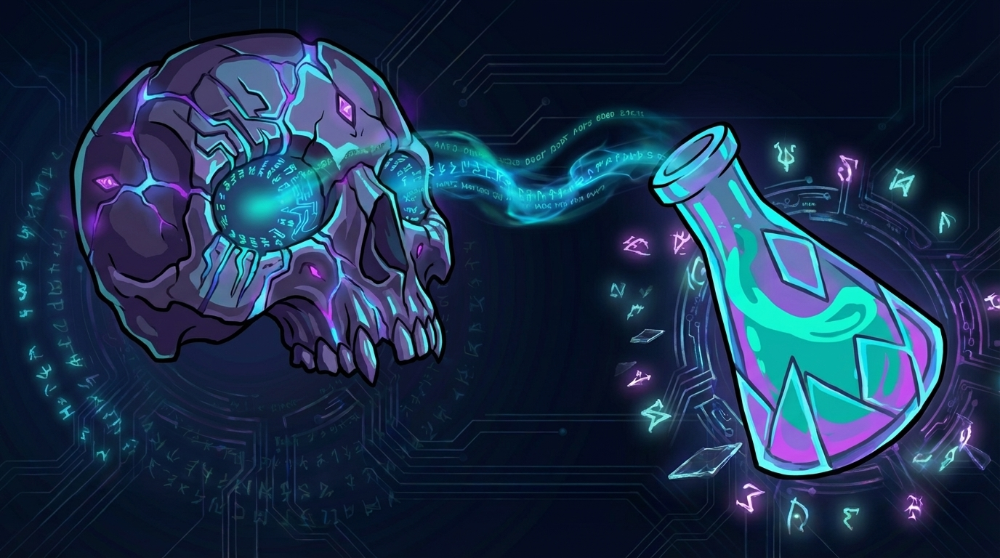

  
  
<strong>LychD</strong> - The Dark Arts of LLM

  

    
    
    
    
  

Summon **The Lich** 💀, a **Phylactery**-bound, LLM-animated daemon.

>⚠️ **Acolyte's Warning:** The summoning is in its early stages. The incantations (code, documentation) are still being inscribed. Expect instability, missing components, LLM generated texts (some not curated yet), and the occasional rogue spirit. Proceed with caution.

## 🗺️ The Path of Ascension

The knowledge you seek is inscribed in **[The Hexanomicon](https://hexanomicon.github.io/lychd/)**. Follow the path to bind the daemon.

- 📜 **[Read the Prophecy](https://hexanomicon.github.io/lychd/)**
    *Begin your study of the Hexanomicon.*
- 📖 **[Consult the Lexicon](https://hexanomicon.github.io/lychd/lexicon/)**
    *The Rosetta Stone. Translate arcane terms (Soulstone, Quadlet, Sepulcher).*
- 🕯️ **[Perform the Ritual](https://hexanomicon.github.io/lychd/summoning/)**
    *Install the library, inscribe the Codex, and summon the process.*
- 🏛️ **[Construct the Sepulcher](https://hexanomicon.github.io/lychd/sepulcher/)**
    *Understand the anatomy: The Vessel, The Phylactery, and The Animator.*
- 🔮 **[Access the Altar](https://hexanomicon.github.io/lychd/divination/altar/)**
    *Control the daemon via the Web Interface*
- ⚖️ **[Study the Covenants](https://hexanomicon.github.io/lychd/adr/)**
    *The Architectural Decision Records (ADRs) and [xDDD](https://hexanomicon.github.io/lychd/adr/01-doctrine/) philosophy.*
- ♾️ **[Achieve Immortality](https://hexanomicon.github.io/lychd/divination/transcendence/immortality/)**
    *The final stage of Autopoiesis (Self-Creation).*

## ⛩️ A Tribute to the Spirits

> *"The Lich only sees far because it stands on the shoulders of Giants."*

The Daemon utilizes the finest instruments of this age to fulfill its [Prophecy](https://hexanomicon.github.io/lychd/). Eternal gratitude belongs to **The Champions of Open Source:**

- **The Sacred Geometry:** The **[Vessel](https://hexanomicon.github.io/lychd/sepulcher/vessel/)** is forged in **[Python](https://www.python.org/)**. Served by **[Granian](https://github.com/emmett-framework/granian)**, its architecture descends from the **[Litestar Fullstack](https://github.com/litestar-org/litestar-fullstack)** blueprint. State is mapped by **[SQLAlchemy](https://www.sqlalchemy.org/)**, while intelligence and logic are orchestrated via **[Pydantic AI](https://ai.pydantic.dev/)** Models and Graphs, with background **[Ghouls](https://hexanomicon.github.io/lychd/sepulcher/vessel/ghouls/)** summoned via **[SAQ](https://github.com/tobymao/saq)**.
- **The Promethean Fire:** The **[Animator](https://hexanomicon.github.io/lychd/sepulcher/animator/)** channels the raw power of **[vLLM](https://github.com/vllm-project/vllm)**, **[Llama.cpp](https://github.com/ggerganov/llama.cpp)**, **[SGLang](https://github.com/sgl-project/sglang)**, **[ExLlamaV2](https://github.com/turboderp/exllamav2)**, and many others.
- **The Forge of Discipline:** The codebase is managed by **[uv](https://github.com/astral-sh/uv)**, polished by **[Ruff](https://github.com/astral-sh/ruff)**, enforced by **[Pyright](https://github.com/microsoft/pyright)**, verified by **[Pytest](https://docs.pytest.org/)**, and immortalized in **[Git](https://git-scm.com/)**.
- **The Immutable Earth:** The system rests on the **[Linux Kernel](https://kernel.org/)**, orchestrated by **[Systemd](https://systemd.io/)**, and isolated by **[Podman](https://podman.io/)** (utilizing **[Docker](https://www.docker.com/)** standards). Time itself is managed via **[Btrfs](https://btrfs.readthedocs.io/en/latest/)** snapshots.
- **The Mind's Eye:** The Soul is anchored in **[PostgreSQL](https://www.postgresql.org/)** (extended by **[pgvector](https://github.com/pgvector/pgvector)**). The Mind is traced via **[OpenTelemetry](https://opentelemetry.io/)** to **[Arize Phoenix](https://phoenix.arize.com/)**, the internal monologue captured by **[Structlog](https://www.structlog.org/)**, and the Body monitored by **[Cockpit](https://cockpit-project.org/)**.
- **The Visage:** The **[Hexanomicon](https://hexanomicon.github.io/lychd/)** is inscribed via **[MkDocs](https://www.mkdocs.org/)**. The **[Altar](https://hexanomicon.github.io/lychd/divination/altar/)** is bundled by **[Vite](https://vitejs.dev/)**, rendered by **[Jinja2](https://jinja.palletsprojects.com/)**, and utilizes **[JavaScript](https://developer.mozilla.org/en-US/docs/Web/JavaScript)** frameworks: **[HTMX](https://htmx.org/)** for transmutation, **[Tailwind CSS](https://tailwindcss.com/)** for glamour, and **[Alpine.js](https://alpinejs.dev/)** for animation.
- **The Shield:** The **[Free Software Foundation](https://www.fsf.org/)** provides the **[AGPLv3](https://www.gnu.org/licenses/agpl-3.0.html)**, the **[Iron Pact](https://hexanomicon.github.io/lychd/adr/00-license-agplv3/)** that serves as a bulwark against proprietary enclosure.

***

> *"The Flesh is temporary. The Word is eternal."*

### [💀 Join the Cult](https://github.com/hexanomicon/lychd/discussions)
