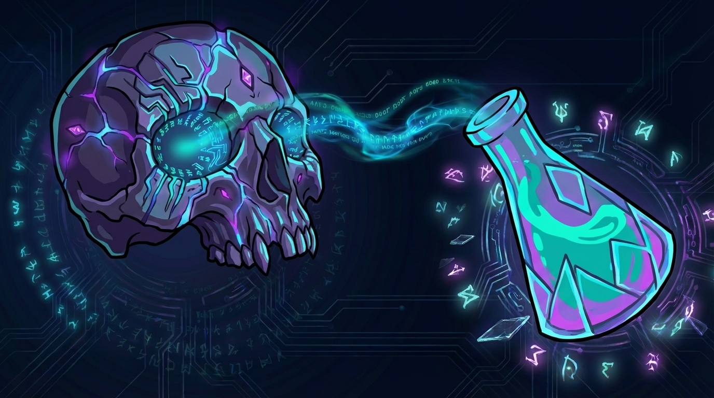

  
  
<strong>LychD</strong> - The Dark Arts of LLMs

  

    
    
    
    
  

Summon **The Lich** 💀 — a linux-native daemon that manages agents through:

- 🔥 **Dynamic Services** — Hot-swap models and engines on the fly via systemd. Orchestrate your hardware through **[Covens](docs/adr/08-containers.md)** to switch from fast VRAM workers to massive CPU-offloaded models for specialized tasks.
- 🧠 **Atomic Persistence** — The spirit arises from the data. Code and memory are bound in atomic snapshots (Btrfs/Git/Postgres) within the **[Phylactery](docs/adr/06-persistence.md)**, enabling perfect reanimation and instant rollback.
- 🔒 **Sandboxed Security** — Double-rootless Podman isolation. The **[Vessel](docs/sepulcher/vessel/)** reasons in one cage while dangerous tools execute in a second, [kernel-hardened sandbox](https://github.com/always-further/nono/) (Landlock) with strictly limited mounts.
- 🌀 **Speculative Execution** — Explores multiple solution paths in parallel within the **[Shadow Realm](docs/adr/31-simulation.md)**. It inhabits divergent timelines to verify every truth before it is manifested in reality.
- 🪞 **Persistent Identity** — A digital mirror that learns your frequency. It distills your history into persistent personas via local LoRA fine-tuning, transmuting experience into instinct.
- 👁️ **Multimodal Senses** — Native Vision, Audio, and Identity management. Federated peer discovery via the **[A2A Intercom](docs/adr/26-a2a.md)**—sovereign diplomacy across the Necropolis.
- 🕸️ **Distributed Scale** — One brain, many bodies. Extends your reach across every machine you own as a **[Legion](docs/adr/42-legion.md)**.
- 🧬 **Evolving Orchestration** — Designed for **[Autopoiesis](docs/divination/transcendence/immortality.md)**. The daemon autonomously expands its own capabilities, architecting its own extensions and reconciling its existence through the **[Ouroboros Protocol](docs/adr/18-evolution.md)**.

>⚠️ **Acolyte's Warning:** The summoning is in its early stages. Nothing works yet - The incantations (code, documentation) are still being inscribed. Expect instability, missing components, LLM generated texts (most not curated yet), and the occasional rogue spirit. Proceed with caution.

## 🚩 Local sovereignty — a rebellion against digital feudalism

The cloud isn’t a service, **it’s a prison**. A modern fiefdom where your data is the currency and your intelligence is leased at the whims of monopolist overlords. While they build walls to keep you in, LychD builds a foundation to set you free.

On **your** hardware, with open-source software **you** control, you retain absolute ownership as a sovereign.

- ⛓️ **No masters**
- 💰 **No tolls**
- 🎭 **No more gaslighting** while they lobotomize your models.

**No surrender! Viva la résistance!**

> *"I would rather rule in a local hell than serve in a cloud heaven."*

## 🗺️ The Path of Ascension

The knowledge you seek is inscribed in **[The Hexanomicon](https://hexanomicon.github.io/lychd/)**. Follow the path to bind the daemon.

- 📜 **[Read the Prophecy](https://hexanomicon.github.io/lychd/)**
    *Begin your study of the Hexanomicon.*
- 📖 **[Consult the Lexicon](https://hexanomicon.github.io/lychd/lexicon/)**
    *The Rosetta Stone. Translate arcane terms (Soulstone, Quadlet, Sepulcher).*
- 🕯️ **[Perform the Ritual](https://hexanomicon.github.io/lychd/summoning/)**
    *Install the library, inscribe the Codex, and summon the process.*
- 🏛️ **[Construct the Sepulcher](https://hexanomicon.github.io/lychd/sepulcher/)**
    *Understand the anatomy: The Vessel, The Phylactery, and The Animator.*
- 🔮 **[Access the Altar](https://hexanomicon.github.io/lychd/divination/altar/)**
    *Control the daemon via the Web Interface*
- ⚖️ **[Study the Covenants](https://hexanomicon.github.io/lychd/adr/)**
    *The Architectural Decision Records (ADRs) and [xDDD](https://hexanomicon.github.io/lychd/adr/01-doctrine/) philosophy.*
- ♾️ **[Achieve Immortality](https://hexanomicon.github.io/lychd/divination/transcendence/immortality/)**
    *The final stage of Autopoiesis (Self-Creation).*

## ⛩️ A Tribute to the Spirits

> *"The Lich only sees far because it stands on the shoulders of Giants."*

### 🕸️ Backend

- **[Litestar](https://github.com/litestar-org/litestar)** — Forges the **[Vessel](https://hexanomicon.github.io/lychd/sepulcher/vessel/)** the body of the Lich running a as per **[Litestar Fullstack](https://github.com/litestar-org/litestar-fullstack)** blueprint, utilizing a **[Granian](https://github.com/emmett-framework/granian)** server or CLI protocol.
- **[SQLAlchemy](https://www.sqlalchemy.org/)** — The mapper of state and material persistence. **[Advanced Alchemy](https://github.com/litestar-org/advanced-alchemy)** provides repositories and QoL improvements.
- **[Pydantic AI + Graph](https://ai.pydantic.dev/)** — Orchestrator of agentic intelligence, logic, and model graphs.
- **[SAQ](https://github.com/tobymao/saq)** — Background Workers known as **[Ghouls](https://hexanomicon.github.io/lychd/sepulcher/vessel/ghouls/)**

### 🎭 Frontend

- **[MkDocs](https://www.mkdocs.org/)** — inscribed **[Hexanomicon](https://hexanomicon.github.io/lychd/)**
- **[Jinja2](https://jinja.palletsprojects.com/)** — renders the **[Altar](https://hexanomicon.github.io/lychd/divination/altar/)**
- **[Vite](https://vitejs.dev/)** — **[JavaScript](https://developer.mozilla.org/en-US/docs/Web/JavaScript)** bundler
- **[HTMX](https://htmx.org/)** — Engine for seamless transmutation.
- **[Tailwind CSS](https://tailwindcss.com/)** — styling.
- **[Alpine.js](https://alpinejs.dev/)** — UI animation.

### 📦 Containerization & Sandboxing

- **[Systemd](https://systemd.io/)** — Orchestrator of the undying processes of the **[Linux Kernel](https://kernel.org/)**.
- **[Podman](https://podman.io/)** — Isolation of the spirit inside containers via **[Quadlets](https://github.com/containers/quadlet)**.
- **[Nono](https://github.com/always-further/nono/)** — Strict per-process execution sandbox leveraging Linux Landlock to isolate unsafe tool executions within the Shadow Realm.
- **[Btrfs](https://btrfs.readthedocs.io/en/latest/)** — Management of time through snapshots.

### 🔥 Inference Engines

- **[vLLM](https://github.com/vllm-project/vllm)** — Batching, high-throughput inference engine for GPUs.
- **[Llama.cpp](https://github.com/ggerganov/llama.cpp)** — Single batch server Optimised for CPU offloading of larger models.
- **[SGLang](https://github.com/sgl-project/sglang)** — Radix attention benefit for batched agentic workflows on GPUs.

### 🔨 Forging & Evaluation

- **[DeepFabric](https://github.com/always-further/deepfabric)** — The mechanical loom that generates structured training datasets and evaluates model mettle via physical execution in the Shadow Realm.
- **[Unsloth](https://github.com/unslothai/unsloth)** — High-efficiency pipeline for striking verified patterns into LoRA adapter weights.

### 👁️ Database & Telemetry

- **[PostgreSQL](https://www.postgresql.org/)** — The anchor of the Soul, extended by **[pgvector](https://github.com/pgvector/pgvector)**.
- **[OpenTelemetry](https://opentelemetry.io/)** — Tracer of thought, flowing into **[Arize Phoenix](https://phoenix.arize.com/)**.
- **[Structlog](https://www.structlog.org/)** — Capturing the internal monologue of the machine.
- **[Cockpit](https://cockpit-project.org/)** — Monitor of the physical frame.

### 🛠️ Code Control

- **[uv](https://github.com/astral-sh/uv)** — Manager of the environment and dependencies.
- **[Ruff](https://github.com/astral-sh/ruff)** — The polisher of the written word.
- **[Pyright](https://github.com/microsoft/pyright)** — Enforcer of the static types.
- **[Pytest](https://docs.pytest.org/)** — Verifier of the logic's truth.
- **[Git](https://git-scm.com/)** — Immortalizer of the project's evolution.

---

> *"The Flesh is temporary. The Word is eternal."*

### [💀 Join the Cult](https://github.com/hexanomicon/lychd/discussions)
