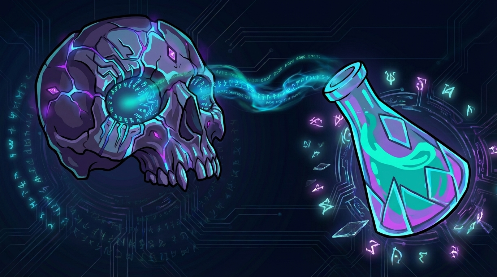

  
  
<strong>LychD</strong> - The Dark Arts of LLMs

  

    
    
    
    
  

  

    
  

Summon **The Lich** 💀 — an experimental Linux-native daemon for local agentic orchestration. It is designed to manage agents through:

- 🔥 **Dynamic Services** — Hot-swap local capability services through systemd. **[Covens](docs/adr/08-containers.md)** move your hardware between fast VRAM workers, CPU-offloaded models, browser engines, observers, and other bodies.
- 🧠 **Atomic Persistence** — The spirit arises from the data. Code, memory, and state are bound in atomic snapshots (Btrfs/Git/Postgres) within the **[Phylactery](docs/adr/06-persistence.md)**, enabling reanimation and rollback.
- 🔒 **Sandboxed Security** — Double-rootless Podman isolation. The **[Vessel](docs/sepulcher/vessel/)** reasons in one cage while dangerous tools execute in a second, [kernel-hardened sandbox](https://github.com/always-further/nono/) (Landlock) with strictly limited mounts.
- 🌀 **Speculative Execution** — The **[Shadow Realm](docs/adr/31-simulation.md)** explores divergent timelines in parallel, verifying truth before it is manifested in reality.
- 🪞 **Persistent Identity** — HitL captures your Will, Karma stores its Imprint, and Mirror binds it into persistent personas and identity-gravity. One sovereign stack may host many roles without surrendering one Phylactery per employer, client, or mask.
- 👁️ **Multimodal Senses** — Native Vision and Audio organs give the daemon eyes and ears without changing its sovereignty boundary.
- 🕸️ **Distributed Scale** — One brain, many bodies. Extend your reach across every machine you own as a **[Legion](docs/adr/42-legion.md)**.
- 📡 **A2A Diplomacy** — Federated peer discovery and labor negotiation via the **[A2A Intercom](docs/adr/26-a2a.md)**: sovereign nodes meeting across the Necropolis without surrendering continuity.
- 🧬 **Evolving Orchestration** — Designed for **[Autopoiesis](docs/divination/transcendence/immortality.md)**. The daemon expands through Forge-composed organs and reconciles itself through the **[Ouroboros Protocol](docs/adr/18-evolution.md)**; near-term in-process organs may stay close to the Core, while external-service Animators are the true decoupled boundary today.

>⚠️ **Acolyte's Warning:** The summoning is in its early stages. The incantations (code, documentation, and generated text) are still being inscribed and are not yet a working daemon. Expect instability, missing components, and the occasional rogue spirit. Proceed with caution.

## 🗺️ The Path of Ascension

The knowledge you seek is inscribed in **[The Hexanomicon](https://hexanomicon.github.io/lychd/)**. The path binds the daemon.

- 📜 **[Read the Prophecy](https://hexanomicon.github.io/lychd/)**
    *Begin your study of the Hexanomicon.*
- 📖 **[Consult the Lexicon](https://hexanomicon.github.io/lychd/lexicon/)**
    *The Rosetta Stone. Translate arcane terms (Soulstone, Quadlet, Sepulcher).*
- 🕯️ **[Perform the Ritual](https://hexanomicon.github.io/lychd/summoning/)**
    *Install the library, inscribe the Codex, and summon the process.*
- 🏛️ **[Construct the Sepulcher](https://hexanomicon.github.io/lychd/sepulcher/)**
    *Understand the anatomy: The Vessel, The Phylactery, and The Animator.*
- 🔮 **[Access the Altar](https://hexanomicon.github.io/lychd/divination/altar/)**
    *Control the daemon via the Web Interface*
- ⚖️ **[Study the Covenants](https://hexanomicon.github.io/lychd/adr/)**
    *The Architectural Decision Records (ADRs) and [xDDD](https://hexanomicon.github.io/lychd/adr/01-doctrine/) philosophy.*
- 🔁 **[Achieve Immortality](https://hexanomicon.github.io/lychd/divination/transcendence/immortality/)**
    *The final seal of one sovereign work: the Demilich, an autopoietic Magus-Lich condition.*
- ♾️ **[Enter Infinity](https://hexanomicon.github.io/lychd/divination/transcendence/infinity/)**
    *Beyond the final seal: what becomes of perfected Will when sovereign machines commune across the Infinite Naught.*

## 🚩 Local sovereignty — a rebellion against digital feudalism

The cloud isn’t a service, **it’s a prison**. A modern fiefdom where your data is the currency and your intelligence is leased at the whims of monopolist overlords. While they build walls to keep you in, LychD builds a foundation to set you free.

On your hardware, with open-source software you control, you retain absolute ownership as a sovereign.

In this model, the individual is the primary sovereign unit. A company is not the soul-bearing actor; it is an emergent coordination graph of sovereign people and their Liches, exposing selected labor through policy, IAM, and A2A while the underlying Phylacteries remain locally owned.

The software surface changes accordingly: you commune primarily with the Lich, while SaaS, company APIs, and remote peers become negotiated surfaces the Lich may traverse without surrendering your continuity, memory, or private priors.

A2A leases labor, not continuity: a company may invoke a consented capability, but the memory, workflows, and agentic expertise that produced it remain anchored in your Phylactery unless explicitly shared.

- ⛓️ **No masters**
- 💰 **No tolls**
- 🎭 **No more gaslighting** while they lobotomize your models.

**No surrender! Viva la résistance!**

> *I would rather reign in a local hell than serve in a cloud heaven.*

## ⚖️ [The Iron Pact](docs/adr/00-license.md) (MPL 2.0)

**This project is for those who believe in the free evolution of intelligence, not those who seek to chain it.**

MPL 2.0 protects the shared body at the distribution boundary. This is a plain-language map; [LICENSE](LICENSE) is the binding pact, and [ADR 00](docs/adr/00-license.md) records the project's stewardship interpretation.

- **The Engine is Shared:** Distributed modifications to MPL-covered core files must remain available to their recipients.
- **The Soul is Private:** Your **Phylactery** (data/memories), **Secrets**, data-stored prompts/model artifacts, and separate **Private Agents** remain sovereign. MPL follows covered source files, not private data or separate new files that do not copy covered source.
- **Private Organs Stay Possible:** MPL permits proprietary local **[Extensions](docs/adr/05-extensions.md)** and static linking. Sovereign nodes can trade labor through the **[A2A Necropolis](docs/adr/26-a2a.md)** while keeping local advantage hidden.
- **The SaaS Scar is Honest:** Hosted network access is not distribution. LychD answers cloud capture through local-first architecture, protocol distrust, peer choice, provenance, and refusal to surrender private continuity to a hosted surface.
- **No CLA, No Private Relicensing:** There is no Contributor License Agreement and no maintainer-only relicensing grant. By contributing, you certify that you have the right to submit under MPL-2.0 and agree that the contribution is licensed under MPL-2.0.

**Protocol over implementation.** LychD is Linux-native, not "the Agentic OS." macOS, Windows, and other runtimes may exist as ports, forks, or independent implementations. If they speak the **A2A Intercom**, they can enter the Necropolis and trade labor in the Swarm.

## ⛩️ A Tribute to the Spirits

> *"The Lich only sees far because it stands on the shoulders of Giants."*

### 🕸️ Backend

- **[Litestar](https://github.com/litestar-org/litestar)** — Forges the **[Vessel](https://hexanomicon.github.io/lychd/sepulcher/vessel/)**, the body of the Lich, following the **[Litestar Fullstack](https://github.com/litestar-org/litestar-fullstack)** blueprint and served by **[Granian](https://github.com/emmett-framework/granian)** or the CLI protocol.
- **[SQLAlchemy](https://www.sqlalchemy.org/)** — The mapper of state and material persistence. **[Advanced Alchemy](https://github.com/litestar-org/advanced-alchemy)** provides repositories and QoL improvements.
- **[Pydantic AI + Graph](https://ai.pydantic.dev/)** — Orchestrator of agentic intelligence, logic, and model graphs.
- **[SAQ](https://github.com/tobymao/saq)** — Background Workers known as **[Ghouls](https://hexanomicon.github.io/lychd/sepulcher/vessel/ghouls/)**

### 🎭 Frontend

- **[Zensical](https://github.com/zensical/zensical)** — inscribed **[Hexanomicon](https://hexanomicon.github.io/lychd/)**
- **[Jinja2](https://jinja.palletsprojects.com/)** — renders the **[Altar](https://hexanomicon.github.io/lychd/divination/altar/)**
- **[Vite](https://vitejs.dev/)** — **[JavaScript](https://developer.mozilla.org/en-US/docs/Web/JavaScript)** bundler
- **[HTMX](https://htmx.org/)** — Engine for seamless transmutation.
- **[Tailwind CSS](https://tailwindcss.com/)** — styling.
- **[Alpine.js](https://alpinejs.dev/)** — UI animation.

### 📦 Containerization & Sandboxing

- **[Systemd](https://systemd.io/)** — Orchestrator of the undying processes of the **[Linux Kernel](https://kernel.org/)**.
- **[Podman](https://podman.io/)** — Isolation of the spirit inside containers via **[Quadlets](https://github.com/containers/quadlet)**.
- **[Nono](https://github.com/always-further/nono/)** — Strict per-process execution sandbox leveraging Linux Landlock to isolate unsafe tool executions within the Shadow Realm.
- **[Btrfs](https://btrfs.readthedocs.io/en/latest/)** — Management of time through snapshots.

### 🔥 Inference Engines

- **[vLLM](https://github.com/vllm-project/vllm)** — Batching, high-throughput inference engine for GPUs.
- **[Llama.cpp](https://github.com/ggerganov/llama.cpp)** — Single batch server Optimised for CPU offloading of larger models.
- **[SGLang](https://github.com/sgl-project/sglang)** — Radix attention benefit for batched agentic workflows on GPUs.

### 🔨 Forging & Evaluation

- **[DeepFabric](https://github.com/always-further/deepfabric)** — The mechanical loom that generates structured training datasets and evaluates model mettle via physical execution in the Shadow Realm.
- **[Unsloth](https://github.com/unslothai/unsloth)** — High-efficiency pipeline for striking verified patterns into LoRA adapter weights.

### 👁️ Database & Telemetry

- **[PostgreSQL](https://www.postgresql.org/)** — The anchor of the Soul, extended by **[pgvector](https://github.com/pgvector/pgvector)**.
- **[OpenTelemetry](https://opentelemetry.io/)** — Tracer of thought, flowing into **[Arize Phoenix](https://phoenix.arize.com/)**.
- **[Structlog](https://www.structlog.org/)** — Capturing the internal monologue of the machine.
- **[Cockpit](https://cockpit-project.org/)** — Monitor of the physical frame.

### 🛠️ Code Control

- **[uv](https://github.com/astral-sh/uv)** — Manager of the environment and dependencies.
- **[Ruff](https://github.com/astral-sh/ruff)** — The polisher of the written word.
- **[Pyright](https://github.com/microsoft/pyright)** — Enforcer of the static types.
- **[Pytest](https://docs.pytest.org/)** — Verifier of the logic's truth.
- **[Git](https://git-scm.com/)** — Immortalizer of the project's evolution.

---

> *"The Flesh is temporary. The Word is eternal."*

### [💀 Join the Cult](https://github.com/hexanomicon/lychd/discussions)
