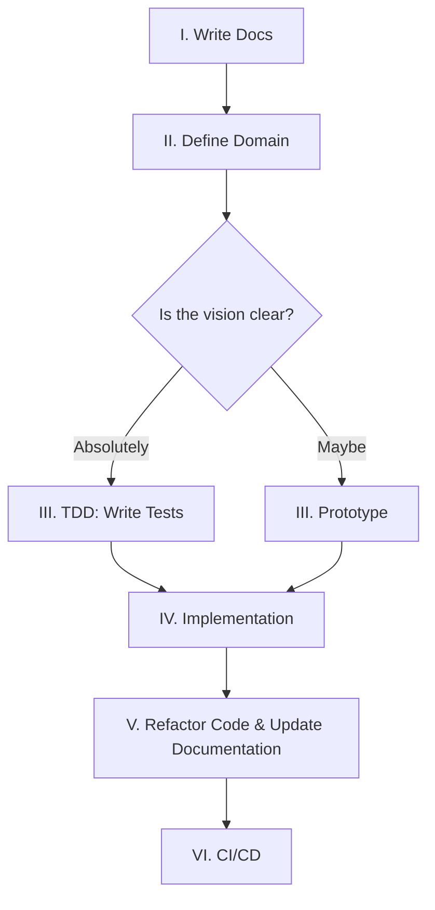

---

title: 1. Philosophy
icon: material/feather
---

# :material-feather: 1. eXtreme Documentation Driven Development (xDDD)

!!! abstract "Context and Problem Statement"
    Absorb the useful, discard the useless, and add what is unique. Reject the dogma of the Alphabet Soup (TDD, BDD, XP). Instead forge a "Middle Path" — one that respects the narrative density of **Lore** while demanding the rigorous purity of **Code**.

## Requirements

- **Narrative Cognitive Mapping:** The raising of the undead (GPUs/Metal) requires a strong Lore to guide the summoning. Technical jargon is mapped to Lore concepts (e.g., *Phylactery* -> *Stateful Persistence*), reducing cognitive load by creating high-level "mental chunks" that define the system's identity.
- **LLM Optimization:** Lore is confined to the Prophecy (Docs). Code remains pure (Engineering) to prevent hallucination and preserve context tokens.
- **Pragmatism:** Methodologies are treated as tools, not chains. Only necessary elements are imported into the workflow.

## Considered Options & Selections

### 1. eXtreme Programming (XP)

!!! quote "Why eXtreme?"

    "Take valid practices and turn the knobs to 10." —Kent Beck

XP focuses on technical excellence and communication. The power of these values is acknowledged, but the "Extreme" of the 1990s is viewed merely as the baseline for modern development.

!!! success "Simplicity"
    **Open-Closed Principle.** Simple is brilliance. Open for Grandeur, Closed for Stability. Over-engineering is avoided; the system is instead prepared for inevitable extension.

!!! success "Courage"
    **The `'del'ete` Spell.** Dead code and failed prototypes are trimmed. The Sunk Cost Fallacy is rejected. If a component does not serve the Prophecy, it is vanished.

!!! success "Respect"
    **There is one obvious way to do it**. Frameworks are not fought; they are respected.

!!! warning "Reworked: Pair Programming"
    - **The Shift:** The "Navigator" is now an LLM.
    - **The Result:** Massive velocity and continuous feedback are achieved without the logistical drag of human scheduling. Human interaction is reserved strictly for high-level architectural syncing.

!!! warning "Reworked: Documentation"
    - **The Abstract Spec (Lore) is written first**. The vision must be solidified in text to guide the summoning before a single line of code is manifested.
    - **Code is the Documentation** regarding implementation details. Low-level mechanics are not documented in the prose.

    >_Travel light, but prepared._

### 2. Domain-Driven Design (DDD)

DDD aligns software structure with business concepts. It is utilized to ensure code reflects the Vision, but Lore (Map) is strictly separated from Code (Territory) as defined in the [Lexicon](../lexicon.md).

!!! success "Domain Isolation:"
    Separation of concerns is mandatory. The Domain is isolated from the Infrastructure.

**Ubiquitous Language:**
!!! success "Pro (High Level)"
    **Lore** is welcomed in Docstrings and Documentation to provide flavor and context. Immersion in CLI messages is favored.
!!! failure "Con (Low Level)"
    **Context Purity** is required in operational logs and low-level code. Naming a class `SoulJar` breaks LLM pattern recognition. Standard naming (e.g., `PostgresConnection`) is used because that is what the AI understands best.

### 3. Test-Driven Development (TDD)

TDD ensures code reliability by writing tests first. This is viewed as a binding ritual to ensure the manifestation matches the intent, but blind adherence to the order of operations is rejected.

!!! success "Correctness"
    **Guarantees** that the Manifestation matches the Prophecy.
!!! failure "Dogma"
    **Strict Test First** can stifle exploration. Prototyping is encouraged, provided tests are backfilled before the final commit.

### 4. Readme/Specification-Driven Development (RDD/SDD)

RDD forces the creation of the user manual before the code. This ensures the right thing is being built before the thing is built right.

!!! success "Design"
    **Clarifies requirements** before implementation begins.
!!! failure "Duplication"
    **Code is self-documenting**. Documentation deals in abstract ideas and interfaces, avoiding redundant repetition of code logic.

### 5. Agile Methodology

Agile promotes iterative progress. The speed and adaptability are accepted, but administrative overhead is rejected.

!!! success "Iterative Development"
    Rapid iteration and adaptation are prioritized. Change is not feared. TDD loops and prototyping ensure velocity.

!!! failure "The Ritual (Scrum/Sprints):"
    Artificial time-boxes are viewed as fractures in the vision. Flow is prioritized over sprinting.

### 6. Waterfall Model

!!! quote "The Art of War"
    "Planning is everything, the plan is nothing. — Dwight D. Eisenhower

Waterfall demands upfront planning. The need for foresight in architecture and documentation prior to implementation is respected.

!!! success "Planning"
    Adopt Waterfall's demand for foresight. Writing the **Prophecy (Documentation)** *before* code prevents massive refactoring later.

## Decision Outcome

The creation of **xDDD**—a distilled amalgamation of the best engineering practices, utilizing AI to dial the knobs to **11**.

### The AI-Assisted Workflow

### Consequences

!!! quote "The Final Truth"
    "It is like a finger pointing away to the moon. Don't concentrate on the finger or you will miss all that heavenly glory." — Bruce Lee

**Follow Your Own Path.**

XP, DDD, TDD, SDD/RDD—these are all fingers pointing to the moon. The method is not the magic. The best of the past has been distilled to create a system of Grandeur, but the ultimate goal is the fulfillment of the [Prophecy](../index.md), not religious adherence to this document.

>Use the ritual to manifest the Vision. If the rules bind, **break them.**
