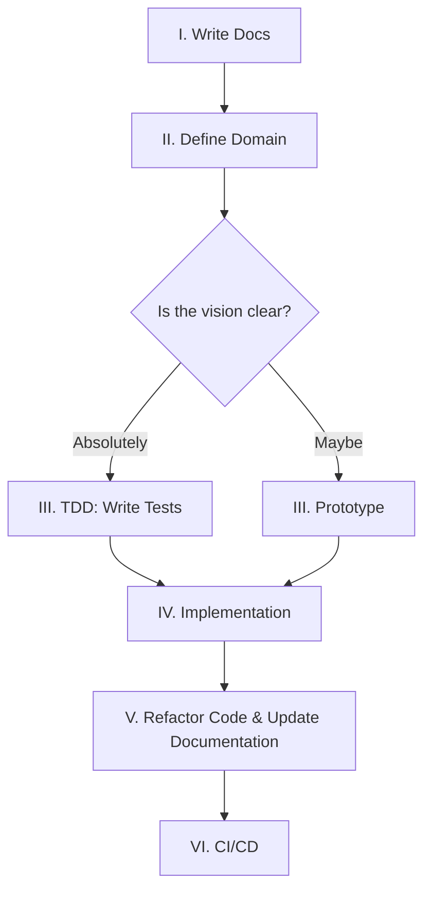

# :material-feather: 1. Philosophy

!!! abstract "Context and Problem Statement"
    Absorb the useful, discard the useless and add what is unique. Reject the dogma and instead forge a middle path — one that respects the narrative density of **Lore** while demanding the rigorous purity of **Code**.

## Requirements

- **Constitutional Telos:** The mythic system defines the kind of recurrent intelligence LychD is
  meant to cultivate: bounded, relational, accountable to consequence, capable of memory and
  repair, and unwilling to confuse power with totalization. It is more than naming or decoration.
- **Truthful Manifestation:** Myth may disclose purpose and bind the parts into a whole, but it may
  never impersonate shipped behavior, physical measurement, historical equivalence, or a test
  receipt.
- **Cognitive Cartography:** Terms such as *Phylactery* and *Vessel* form durable mental connections
  between the Work and its technical jurisdictions without collapsing distinct contracts into one
  metaphor.
- **Context Purity:** Lore belongs in the Hexanomicon, docstrings, and operator-facing language.
  Code and logs retain precise engineering names unless a project term names the domain more
  accurately.
- **Pragmatism:** Methodologies are treated as **tools, not chains**. Only necessary elements are
  imported into the workflow.

## Constitutional Telos and Evidence Boundary

> **Plain truth opens the door. Lived operation earns the symbol. The symbol opens the cosmos. The
> cosmos returns to the next exact act.**

LychD names the software body. The **Lich** names the recurrent whole: Vessel, Phylactery, agents,
identity, orchestration, action, consequence, memory, repair, and relation. A model is one organ of
that whole, never the whole itself.

The myth is constitutional because architecture teaches a mode of being through the authorities,
limits, memories, and recovery paths it makes possible. The full exegesis is not required to run a
command, but contributors and agents may not flatten it into disposable branding. They enter the
telos before translating it into technical or introductory prose.

Constitutional authority does not weaken evidence law. Accepted decisions define architecture;
source, tests, and maintained receipts prove behavior; the public delivery record states what that
evidence currently supports. Each fact remains in its own jurisdiction.

## Considered Options & Selections

### 1. eXtreme Programming (XP)

!!! quote "Why eXtreme?"

    "Take valid practices and turn the knobs to 10." —Kent Beck

XP focuses on technical excellence and communication.

!!! success "Simplicity"
    **Open-Closed Principle.** Simplicity is brilliance - Open for Grandeur, Closed for Stability.

    - avoid over-engineering.
    - prepare for inevitable extension.

!!! success "Courage"
    **The `'del'ete` Spell.** Reject The Sunk Cost Fallacy and do not be afraid to change course.

!!! success "Respect"
    **There is one obvious way to do it**. Frameworks are followed, not fought.

!!! warning "Reworked: Pair Programming"
    - **The Shift:** The Navigator is now an LLM resulting in a massive development velocity boost.

!!! warning "Reworked: Documentation"
    - **Abstract Spec is written first**. The vision must be solidified in text to guide the summoning before a single line of code is manifested.
    - **Code is the Documentation** regarding implementation details. Low-level mechanics are not documented in the prose.

    >_Travel light, but prepared._

### 2. Domain-Driven Design (DDD)

- Aligns software structure with business concepts.
- Utilized to ensure code reflects the Vision, but Lore (Map) is strictly separated from Code (Territory) as defined in the [Lexicon](../lexicon/index.md).

!!! success "Domain Isolation:"
    Separation of concerns is mandatory. The Domain is isolated from the Infrastructure.

**Ubiquitous Language:**
!!! success "Pro (High Level)"
    **Lore** is welcome in Docstrings, CLI messages and Documentation to provide flavor and context.
!!! failure "Con (Low Level)"
    **Context Purity** is required in logs and code. Naming a class `SoulJar` breaks LLM pattern recognition. Standard naming (e.g., `PostgresConnection`) is used because that is what the AI understands best. However there are cases where Lore naming fits better.

### 3. Test-Driven Development (TDD)

TDD ensures code reliability by writing tests first. This is viewed as a binding ritual to ensure the manifestation matches the intent, but blind adherence to the order of operations is rejected.

!!! success "Correctness"
    **Guarantees** that the Manifestation matches the Prophecy.
!!! failure "Dogma"
    **Strict Test First** can stifle exploration. Prototyping is encouraged, provided tests are backfilled before the final commit.

### 4. Readme/Specification-Driven Development (RDD/SDD)

RDD forces the creation of the user manual before the code. This ensures the right thing is being built before the thing is built right.

!!! success "Design"
    **Clarifies requirements** before implementation begins.
!!! failure "Duplication"
    **Code is self-documenting**. Documentation deals in abstract ideas and interfaces, avoiding redundant repetition of code logic.

### 5. Agile Methodology

Agile promotes iterative progress. The speed and adaptability are accepted, but administrative overhead is rejected.

!!! success "Iterative Development"
    Rapid iteration and adaptation are prioritized. Change is not feared. TDD loops and prototyping ensure velocity.

!!! failure "The Ritual (Scrum/Sprints):"
    Artificial time-boxes are viewed as fractures in the vision. Flow is prioritized over sprinting.

### 6. Waterfall Model

!!! quote "The Art of War"
    "No plan survives the first contact with the enemy" — Field Marshal Helmuth von Moltke

Waterfall demands upfront planning. The need for foresight in architecture and documentation prior to implementation is respected.

!!! success "Planning"
    Adopt Waterfall's demand for foresight. Writing the **Prophecy (Documentation)** *before* code prevents massive refactoring later.

## Decision Outcome

The creation of **xDDD**—a distilled amalgamation of the best engineering practices, utilizing AI to dial the knobs to **11**.

### The AI-Assisted Workflow

```mermaid
flowchart TD
    A[I. Write Docs] --> B[II. Define Domain]
    B --> C{Is the vision clear?}

    C -->|Absolutely| D[III. TDD: Write Tests]
    C -->|Maybe| E[III. Prototype]

    D --> F[IV. Implementation]
    E --> F

    F --> G[V. Refactor Code & Update Documentation]
    G --> H[VI. CI/CD]
```

### Documentation Topology

LychD documentation is a traversable knowledge topology, not a passive manual.
Each document belongs to a layer with a distinct authority and audience.

#### Repository Entry Doors

Root-level documents exist outside `docs/` because they must be visible before
the published documentation site is built or loaded:

- **README.md** is the public repository foyer. It presents the project to
  GitHub, package indexes, and first-time readers, then routes them into the
  published Hexanomicon.
- **CONTRIBUTING.md** is the contributor operating guide. It contains setup
  commands, quality rituals, implementation conventions, and links to the ADRs
  that own deeper law.
- **AGENTS.md** is the stable coding-agent entrypoint. It describes how agents
  enter repository context and which probes are safe to load first, but it does
  not replace ADRs, the Lexicon, or Sepulcher doctrine.

These files are entry doors and routing contracts. They may summarize doctrine,
but they should link to the layer that owns the truth instead of duplicating it.

#### Published Hexanomicon

The `docs/` tree is the published Hexanomicon rendered by Zensical for the
GitHub Pages site. Its root `docs/index.md` is the **Prophecy**: the parent page
of the documentation site and the user-facing orientation gate. It introduces
the promise of the system, names the main paths, and routes readers through the
Four Gates without carrying every architectural rule itself.

Within `docs/`, authority is divided by purpose:

- **docs/map.md** is the top-level relational projection across the Hexanomicon. It compresses the
  principal roads between Intent, anatomy, applications, execution, evidence, return, and their
  canonical owners. It defines no rival terminology, architectural law, delivery state, or
  implementation order.
- **docs/adr/** defines architectural law, current boundaries, and decision
  rationale.
- **docs/state-of-the-work.md** is the sole granular public delivery record. It
  separates what repository evidence supports, what still needs an operator
  receipt, and what remains design. ADR acceptance never sets a delivery state.
- **docs/lexicon/** is the canonical glossary. Its index owns jurisdiction; deeper pages may elaborate a
  term, but they should not redefine it.
- **docs/compositions/** is the one catalogue for application specifications and candidate
  studies. A mature Composition page owns one application's intent, Pattern catalogue,
  cross-organ boundaries, data, providers, policy, proving slice, and delivery gaps. Every page
  declares whether it is a proposal or accepted architecture; directory membership establishes
  neither acceptance, implementation evidence, nor a State label.
- **docs/sepulcher/** is **topic-oriented**: each part of the body carries its own
  concept, how-to, and configuration reference on one page (Portal, Soulstone, Coven,
  Codex, …). *What a part is and how to operate it* live together.
- **docs/divination/** is the school of interacting with the **running** Lich: **`altar/`**
  the instruments you drive it through (Bridge, Orb, Nexus, Loom) and **`transcendence/`** the
  meaning (the alchemical ascent). The agent layer itself is code — agents are written in
  Python and wired in the graph (the Loom); there is no separate "practice" gate.
- **docs/summoning.md** is the practical user *tutorial* for bringing the daemon up the
  first time (learn-by-doing) — a single continuous page, not a chunked wizard.

Each fact has exactly **one** home. A part's concept + how-to + config live together on
its topic page in the Sepulcher; the alchemical *meaning* lives in Transcendence; the agent
layer is code (graph/Loom), not a doc gate. Pages link across seams instead of restating; a
multi-gate journey is a *path* that stitches those homes, never a page that duplicates them.
Troubleshooting grows per-topic as faults are actually exercised — there is no standalone
faults gate.

Directory `index.md` files inside `docs/` are parent pages in the published
site. They are reflective maps, not passive listings: an index names the local
jurisdiction, explains what lives beneath it, and routes a human or agent toward
the smallest sufficient source of truth. Child pages carry focused concepts;
the parent page explains the region those concepts belong to.

#### Agent Context Layer

The tracked `.agents/scopes/` directory is outside the published Hexanomicon
because it is not human-facing doctrine. It is an agent routing layer for
bounded context loading. A scope file names the cheapest useful probes for a
task family and remains derived from the documentation topology.

Ignored local overlays such as `.agents/AGENTS.md`, host-level profiles, and
tool-specific local profiles may exist as private scratch space. They are not
repository authorities unless the operator explicitly assigns one for the
current task.

#### Context Loading Doctrine

Readers and agents should load the smallest truthful context that can answer
the task:

1. Start at the entry door appropriate to the reader: `README.md` for public
   orientation, `CONTRIBUTING.md` for contribution mechanics, `AGENTS.md` for
   agent operation, and `docs/index.md` for the published Prophecy.
2. Use directory indexes as maps before opening child concepts.
3. Use `docs/lexicon/` when terminology controls meaning.
4. Use ADRs when architecture, boundaries, or governance are in question.
5. Use `docs/compositions/` for an accepted application's complete contract and Pattern catalogue.
6. Use Sepulcher and Divination pages when domain doctrine or operator workflow
   is in question.
7. Use tracked `.agents/scopes/` only as routing hints for agent context, not as
   replacement truth.
8. Inspect source, runes, lockfiles, and runtime artifacts when executable
   behavior matters.

Documentation changes follow the same dynamic sync law as source changes. When
code changes executable behavior, update the matching source-backed doctrine.
When doctrine changes system truth, update the entry doors, indexes, agent
scopes, and contribution guidance that route readers to that truth. Avoid
duplicating the full law across entrypoints; link to the layer that owns the
truth.

Authority resolves by the kind of truth being asked for:

1. Runtime artifacts, source code, Codex runes, lockfiles, focused tests, and
   maintained receipts establish executable evidence.
2. `docs/state-of-the-work.md` owns the public boundary that current evidence
   supports; it does not create evidence or architectural law.
3. ADRs define architectural law, constraints, and intended boundaries; an
   accepted decision does not prove delivery.
4. Lexicon defines canonical terminology.
5. Composition specifications whose pages explicitly declare acceptance define application
   contracts under ADR law without proving implementation or delivery priority. Candidate
   Composition studies preserve proposals but decide no architecture, priority, or backlog.
6. Sepulcher and Divination documents define operated doctrine, user workflow,
   and the alchemical journey without becoming a second delivery ledger.
7. `docs/index.md`, directory indexes, `README.md`, and `CONTRIBUTING.md` route
   humans through the topology.
8. `AGENTS.md` defines agent operating procedure, while `.agents/scopes/`
   provide cheap routing hints into canon.
9. Generated indexes, search results, ignored campaign evidence, and local
   overlays assist discovery but do not decide.

### Consequences

!!! quote "The Final Truth"
    The rite is not the moon. It is the finger pointing into the dark.

**The Path Remains Local.**

XP, DDD, TDD, SDD/RDD—these are all fingers pointing to the moon. The method is not the magic. The best of the past has been distilled to create a system of Grandeur, but the ultimate goal is the fulfillment of the [Prophecy](../index.md), not religious adherence to this document.

> Use the ritual to manifest the Vision. If the rules bind, **break them.**
