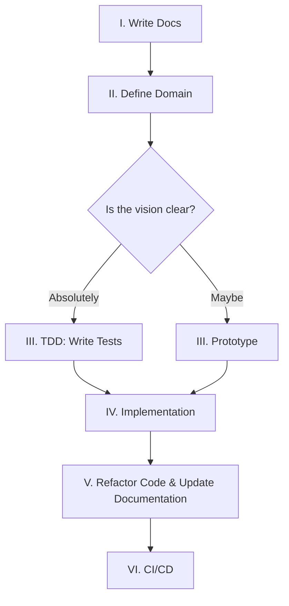

# :material-feather: 1. eXtreme Documentation Driven Development (xDDD)

!!! abstract "Context and Problem Statement"
    Absorb the useful, discard the useless, and add what is uniquely our own. Reject the dogma of the Alphabet Soup (TDD, BDD, XP). Instead forge a "Middle Path" — one that respects the narrative density of **Lore** while demanding the rigorous purity of **Code**.

## Decision Drivers

- **Narrative Cognitive Mapping:** We are raising the undead (GPUs/Metal), which requires a strong Lore to guide the summoning. This Lore maps perfectly to technical jargon (e.g., *Phylactery* -> *Stateful Persistence*), reducing cognitive load for the Architect by creating high-level "mental chunks" that define the system's identity.
- **LLM Optimization:** Lore stays in the Prophecy (Docs). Code stays pure (Engineering) to prevent hallucination and save context tokens.
- **Pragmatism:** Methodologies are tools, not chains. Import what you need.

## Considered Options & Selections

### 1. eXtreme Programming (XP)

!!! quote "Why eXtreme?"

    "Take valid practices and turn the knobs to 10." —Kent Beck

XP focuses on technical excellence and communication. We acknowledge the power of these values, but we recognize that the "Extreme" of the 1990s is merely the baseline of today.

!!! success "Simplicity"
    **Open-Closed Principle.** Simple is brilliance. Open for Grandeur, Closed for Stability. Do not over-engineer; just prepare for the inevitable extension.

!!! success "Courage"
    **The `'del'ete` Spell.** Trim dead code and failed prototypes. Avoid the Sunk Cost Fallacy. If it does not serve the Prophecy, it vanishes.

!!! success "Respect"
    **There is one obvious way to do it**. Do not fight the Frameworks. Respect them.

!!! warning "Reworked: Pair Programming"
    - **The Shift:** The "Navigator" is now an LLM.
    - **The Result:** We achieve massive velocity and continuous feedback without the logistical drag of human scheduling or the slowness of human syntax checking. We reserve human interaction strictly for high-level architectural syncing.

!!! warning "Reworked: Documentation"
    - **Write the abstract spec (Lore) first**. The vision must be solidified in text to guide the summoning before a single line of code is written.
    - **Code is the Documentation** regarding implementation details, so dont document low-level mechanics.

    >_Travel light, but prepared._

### 2. Domain-Driven Design (DDD)

DDD aligns software structure with business concepts. We use it to ensure our code reflects the Vision, but we strictly separate Lore (Map) from Code (Territory) as mapped in the [Lexicon](../lexicon.md)

!!! success "Domain Isolation:"
    Separation of concerns is mandatory. The Domain must be isolated from the Infrastructure.

**Ubiquitous Language:**
!!! success "Pro (High Level)"
    **Lore** is welcome in Docstrings and Documentation. It provides flavor and context for the human reader. Immersion in CLI messages is favored.
!!! failure "Con (Low Level)"
    **Context Purity** is required in operational logs and low-level code. Naming a class `SoulJar` breaks the LLM's pattern recognition. We use `PostgresConnection` because there is "one obvious way to do it" in Python, and that is what the AI understands best.

### 3. Test-Driven Development (TDD)

TDD ensures code reliability by writing tests first. We view this as a binding ritual to ensure the code matches the intent, but we do not blindly follow the order.

!!! success "Correctness"
    **Guarantees** that the Manifestation matches the Prophecy
!!! failure "Dogma"
    **Strict Test First** can stifle exploration. Prototyping first should be allowed, as long as tests are backfilled before the commit.

### 4. Readme/Specification-Driven Development (RDD/SDD)

RDD forces you to write the user manual before the code. This ensures we are building the right thing before we build the thing right.

!!! success "Design"
    **Clarifies requirements** before a single line of code is written.
!!! failure "Duplication"
    **Code is self-documenting**. The documentation should deal in abstract ideas and interfaces.

### 5. Agile Methodology

Agile promotes iterative progress. We accept the speed and adaptability but reject the administrative overhead.

!!! success "Iterative Development"
    iterate rapidly & adapt. Do not fear change. TDD loops and Prototyping ensure velocity.

!!! failure "The Ritual (Scrum/Sprints):"
    Artificial time-boxes fracture the vision. Don't sprint. Flow!

### 6. Waterfall Model

!!! quote "The Art of War"
    "Planning is everything, the plan is nothing. — Dwight D. Eisenhower

Waterfall demands upfront planning. While often rejected, we respect the need for foresight in architecture/documentation before implementation.

!!! success "Planning"
    Adopt Waterfall's demand for foresight. Writing the **Prophecy (Documentation)** *before* code prevents massive refactoring later.

## Decision Outcome

Creation of **xDDD**—a cherry-picked amalgamation of the best engineering practices, that uses AI to dial the knobs to **11**.

### The AI assisted Workflow

### Consequences

!!! quote "The Final Truth"
    "It is like a finger pointing away to the moon. Don't concentrate on the finger or you will miss all that heavenly glory." — Bruce Lee

**Follow Your Own Path.**

XP, DDD, TDD, SDD/RDD...—these are all fingers pointing to the moon. Do not mistake the method for the magic. We have taken the best of the past to create a system of Grandeur. But the ultimate goal is not to religiously follow this document; it is to fulfill the [Prophecy](../index.md).

>Use the ritual to manifest the Vision. If the rules bind you, **break them.**
