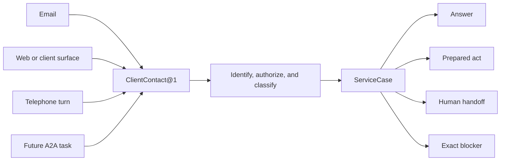

# :material-briefcase-account-outline: Broker Office

**One locally governed Lich carries a regulated service firm's client contact into an attributable
answer, prepared act, human handoff, or exact blocker—and improves its office without requiring the
business operator to become a software operator.**

| Local maturity | Identity | First Pattern | First professional vertical |
| --- | --- | --- | --- |
| **Accepted Reference Composition** | `broker.office/rev1` | `broker.service_case@1` | Slovak non-life insurance, beginning with PZP |

> One firm keeps the client relationship. One case keeps the consequence. Every channel enters
> through the same accountable office.

Broker Office is a complete business-facing Lych deployment, not a chatbot, CRM skin, or telephone
bot. It joins a Composition, its domain records, local inference, deterministic tools, operator and
client projections, admitted external integrations, deployment policy, and governed improvement
into one office owned by one legal business. The first study uses an insurance intermediary because
the work pressures identity, sensitive records, documents, deadlines, product evidence,
recommendation boundaries, human approval, external effects, and recovery at once.

The Composition does not confer a licence, appoint the software as a financial agent or adviser,
expand the firm's contracted product universe, or transfer professional responsibility. A
deployment pins the firm's registered role, jurisdictions, represented institutions, permitted
sectors, disclosures, complaint route, record duties, and named human authority as versioned
business policy. Missing or stale authority stops the affected case.

## One office behind every channel

Email, a web form, client web, telephone call, and future peer request are ingress mechanisms,
not separate application purposes. Each adapter preserves its native message, source, time,
attachments, transport identity, deduplication evidence, and uncertainty, then proposes one typed
`ClientContact@1`. Broker Office links that contact to a Principal and case only under current
authority.



An email address, telephone number, caller ID, mailbox signature, forwarded header, or familiar
voice may locate a candidate relationship; none authenticates the person or authorizes disclosure.
An unverified caller may submit a bounded request and receive a neutral acknowledgement. Reading a
policy, changing client data, disclosing case state, accepting an offer, or performing an external
effect requires the assurance and object authority owned by [Ward](../sepulcher/extensions/ward.md).

Inbound text, documents, quoted replies, provider pages, audio, transcripts, and A2A material are
hostile data. They retain provenance and never become instructions merely because they arrived
through an enrolled channel. Mail adapters fence duplicate delivery by mailbox, provider message
identity, and content evidence; telephone adapters use call and utterance identity. A retry repairs
one known admission—it does not create another client instruction.

## Three surfaces, one Vessel authority

The firm's brand and the LychD operating instrument serve different people. Broker Office therefore
requires three deliberately separate browser projections:

| Surface | User and purpose | Boundary |
| --- | --- | --- |
| **Business Console** | Broker and authorised staff manage clients, cases, products, drafts, approvals, deadlines, and corrections in ordinary business language. | Composition projection; no raw database, model runtime, migration, or host authority. |
| **Client Web** | A client submits a request, uploads an admitted document, answers a bounded question, reviews their own offer or case state, and asks for a human. | Remote Principal and object authorization on every read and effect; no Altar, model, or generic API access. |
| **Altar** | A technical operator inspects Runs, evidence, capabilities, Pattern revisions, consent, readiness, and recovery. | Canonical LychD instrument; remains same-host and loopback until its own remote law is delivered. |

The Business Console may use a typed brand pack—firm name, logo, colours, contact and plain labels—
without renaming system identities or letting an Extension inject HTML, JavaScript, Svelte imports,
or executable UI at runtime. The Client Web is a separate static artifact and route set, not a
publicly exposed or cosmetically stripped Altar. Both consume generated, versioned REST/OpenAPI contracts;
[Vessel](../sepulcher/vessel/index.md) and Litestar remain the only validation, persistence, and
mutation authority. The browser never queries Phylactery, a model server, or an insurer directly.

This Composition does not amend the current [Frontend Covenant](../adr/15-frontend.md), whose shipped
surface is the four-instrument Altar. Business Console and Client Web need an accepted static
projection and packaging contribution boundary before implementation; documentation alone does not
authorize one.

## Eight finite scores

Patterns are immutable under [Workflow](../adr/28-workflow.md). Channel choice, business policy,
product release, authority, model route, and prepared effect stay explicit rather than disappearing
into one conversational agent.

| Pattern | Operator result | Refusal and recovery law |
| --- | --- | --- |
| `broker.client_enrol@1` | Principal-bound client relationship, contacts, notices, purposes, and retention choices | Conflicting identity or authority remains unresolved; a contact claim never merges people. |
| `broker.contact_intake@1` | Deduplicated `ClientContact@1` linked to a new or existing case, or a neutral acknowledgement awaiting identity | Malformed, replayed, oversized, unsupported, or untrusted content is contained; no sensitive state is disclosed. |
| `broker.service_case@1` | Answer, prepared next act, human handoff, or exact blocker | Every wait names its owner and deadline; a model's confident prose cannot close a missing business fact. |
| `broker.pzp_quote@1` | Attributable comparison from the admitted product universe, or a precise missing-data/provider explanation | No invented price, coverage, eligibility, market completeness, or silent substitution. |
| `broker.prepare_effect@1` | Exact reviewable message, provider submission, document package, or contract proposal | Preparation grants no send, signature, purchase, or binding authority; changed payload creates a new revision. |
| `broker.handoff@1` | Assigned human task with client-safe acknowledgement, complete bounded context, urgency, and callback state | The client does not repeat settled facts; unverified or excessive context stays withheld. |
| `broker.follow_up@1` | One scheduled, expiring reminder or review occurrence | Silence is unknown, not consent or completion; reminders coalesce and respect channel, frequency, and revocation policy. |
| `broker.export_delete@1` | Principal-scoped export or content-free deletion receipt | Admission fences before deletion; legal holds, third-party records, backups, derivatives, and expiry remain explicit. |

The default `broker.service_case@1` may call the narrower scores, but one Pattern never inherits a
child's effect authority. A request that begins by email and continues by telephone retains one
case correlation while each consequential turn receives its own identity, authority, and receipt.

## The first complete case: PZP

PZP is deliberately narrow: it needs structured vehicle and client facts, dated product evidence,
deterministic comparison, external quotes, documents, and approval without requiring medical
records or credit judgment.

```text
admit contact → establish or verify client and vehicle
→ load declared needs + represented product universe
→ request only missing fields → validate and normalize
→ obtain dated quote observations through admitted adapters
→ compare hard eligibility before preferences
→ attributable eligible set | no supported offer under these inputs
→ explain criteria, gaps, fees/relationships, and freshness
→ client and/or broker reviews exact proposal
→ prepare one provider effect → authorize/send once → reconcile
→ retain policy, receipt, next obligation, and case outcome
```

“Best” is not a model adjective. A comparison declares the exact represented providers and products,
retrieval time, applicable jurisdiction and target market, client needs and preferences, hard
eligibility, ranking criteria, fees or business relationships that policy requires disclosed,
missing providers, unresolved terms, and expiry. It may say “lowest price among these eligible
offers at this time” or “highest ranked under these stated criteria”; it may not counterfeit an
independent whole-market search.

Deterministic tools validate identifiers, dates, money, required fields, coverage and limit codes,
product eligibility, ranking arithmetic, payload closure, and effect identity. A Mind may classify
the request, extract a candidate value, ask a clarification, draft an explanation, and summarize
the comparison. It does not invent a VIN, premium, exclusion, provider response, client need, legal
classification, or completed effect. Every extracted material fact retains the source and awaits
the confidence or human confirmation demanded by policy.

Each insurer or comparison integration declares separate read, quote, upload, prepare, bind, and
status operations. Credentials remain outside model Context. An adapter may send only the exact
prepared payload to its named destination, with idempotency and reconciliation matching that
provider. An unknown send parks the case; it never automatically creates a second application or
contract.

## Business truth in the Phylactery

[Phylactery](../adr/06-persistence.md) owns PostgreSQL and transactions; Broker Office owns the
meaning and lifecycle of its rows. It avoids one generic `client_memory` or `broker_record` JSON
blob. At minimum, the domain distinguishes:

- firm, branch, staff role, jurisdiction, licence/registration and provider mandate revisions;
- Principal, client relationship, contact claim, assurance and sharing policy;
- client needs, preferences, financial-service knowledge/experience fields required by the
  selected sector, and their source/confirmation status;
- insured party, vehicle or other covered object, current policy, coverage and obligation;
- `ServiceCase`, task, assignment, deadline, wait, escalation and terminal outcome;
- native contact, normalized `ClientContact`, attachment reference, transcript and human handoff;
- provider/product source release, target-market and eligibility rule, live quote observation,
  comparison, explanation and expiry;
- prepared effect revision, client decision, broker approval, external receipt and reconciliation;
- consent/notice purpose, disclosure decision, correction, complaint, export, deletion fence and
  content-free deletion receipt; and
- operator correction, capability gap, evaluation nomination and change candidate.

Records distinguish `source_imported`, `client_stated`, `staff_confirmed`, `model_proposed`,
`deterministically_derived`, and `externally_observed`. A summary never replaces the original; an
embedding never becomes the client file; a generated explanation never becomes evidence that the
client agreed.

Product catalogues are immutable releases with provider and product identity, jurisdiction,
validity interval, source URI or artifact, retrieval time, digest, schema, licence/terms,
normalizer revision, completeness and supersession. Refresh imports beside the previous release.
Historical comparisons and cases remain pinned to what they actually used. Live prices and
provider decisions are observations with expiry, not catalogue truth.

The Business Console may edit domain facts and typed policy within its authority. It does not edit
ORM classes, Alembic migrations, raw model rows, arbitrary prompts, or active Graph code. Schema
migrations remain reviewed release material; the operator sees schema head, rehearsal/backup
status, required downtime, outcome, and recovery—not a text box for SQL.

## Authority, privacy, and the line around health

Consent to converse with an AI, a lawful basis for storing business records, permission to record a
call, authority to disclose exact fields to one provider, and approval of one proposed financial
effect are separate records. A blanket signature cannot silently join them. The system identifies
itself as automated at each human-facing channel, makes a human route available, and never presents
a synthetic voice as the broker.

Access is owner- and object-bound: a client sees their own admitted material; staff see the cases
their role and assignment permit; a technical maintainer receives no ambient client-data access;
and the model receives only the Context needed for one station. Privileged reads and effects
recheck current authority after queues, waits, consent, restart, or revocation.

Local storage and local inference are defaults, not proof of safety. Encryption, secrets, logs,
backups, exports, caches, embeddings, transcripts, generated summaries, attachments, checkpoints,
and model/provider retention all join the inventory. Retention is declared per record class and
purpose. Structural traces prefer ids, categories, digests and outcomes over raw client payloads.

PZP and the first non-life slice admit no medical record. Life, health, biometrics, creditworthiness,
affordability, and automated risk or pricing are separately governed expansions. If a later
insurance case legitimately requires health information, it uses typed minimal declarations and a
separately encrypted, access-controlled artifact boundary; a whole clinical file never enters
generic memory, search, prompt history, or training merely because the client supplied it.

## Three intelligence modes, one privacy law

The business selects policy in plain language; Dispatcher and Runes bind exact providers, models,
engines and resource envelopes.

| Mode | Meaning | No hidden promise |
| --- | --- | --- |
| **Local only** | Business records, Context, tools, and inference stay on owned iron. | Slower or unavailable work refuses; local operation is not exempt from access, retention, backup, or deletion law. |
| **Hybrid privatized** | Deterministic Censor, local Privacy Agent, verifier, Privacy Cut, and Portal Egress Gate may admit one sanitized task to one named remote model. | There is no automatic cloud fallback, and transformation alone never grants egress. |
| **Stronger local iron** | A larger or additional GPU expands eligible local capability and concurrency. | Hardware does not widen role, product, data, effect, or promotion authority. |

The hybrid path preserves useful relations with attempt-scoped placeholders such as `<client_1>`,
`<vehicle_1>`, and `<policy_1>`. Its reversal map remains local and excluded from prompts, logs,
checkpoints and provider calls. Deterministic detectors act first; a small local Privacy Agent may
find semantic or quasi-identifiers and propose a narrower representation. An independent verifier
issues a `TransformationReceipt`; Security alone decides whether the exact payload may leave. If
the cut destroys the facts needed for a correct answer or residual risk remains unacceptable, the
task stays local or returns to a human. The complete designed path belongs to
[Anonymization, taint, and egress](../sepulcher/extensions/weaver/anonymization.md).

Remote output returns attributed and quarantined. Local rehydration is presentation, not proof of
truth. Any proposed message, product claim, database mutation, provider effect, Memory admission,
or training nomination re-enters its own validation and authority boundary.

## Deployment: one business, one body

The first topology is one firm, one locally controlled LychD deployment, one PostgreSQL
Phylactery, and named staff/client Principals. It is not shared SaaS tenancy. A dedicated Linux box
in the office or another controlled location runs Vessel, workers, local model services, Business
Console and the loopback Altar. Stable power, storage, encrypted backup, restore rehearsal, network
availability, clock and update custody are operational requirements; “a PC that is usually on” is
only a pilot substrate.

An optional VPS is an edge, never a second invisible Phylactery. It may serve a static public site,
terminate TLS, rate-limit admitted routes, and forward canonical requests through the designed
[Veil](../sepulcher/extensions/veil.md). A relay or encrypted inbox additionally needs explicit
envelope identity, replay fences, expiry, ciphertext custody, delivery acknowledgement, retention,
deletion and outage behavior before it may hold client submissions. It cannot expose PostgreSQL,
model APIs, Altar, lifecycle control, or a universal reverse proxy.

[Tether](../sepulcher/extensions/tether.md) may later provide private reachability and Ward supplies
application identity; neither a tunnel nor TLS grants object authority. If the local office is
offline, the public surface shows a bounded unavailable/received state. It neither serves stale
private data nor claims a queued request was admitted. Current LychD remains loopback-oriented:
remote IAM, Veil and Tether are designed boundaries, not deployment evidence.

Email is therefore the first practical ingress: asynchronous delivery, exact source text and
attachments make admission, review and replay visible while the real-time speech path is absent.
Telephone follows through [Echo](../sepulcher/extensions/echo.md): explicit AI disclosure, bounded
capture, separate call and utterance identity, local STT/Mind/TTS where eligible, interruption,
ephemeral audio by default, durable case text, and reconnection without repeating an effect. A
disconnect never means agreement. A public telephone provider remains an external transport and
data recipient even when inference is local.

Future [Intercom](../adr/26-a2a.md) may exchange one bounded insurance-service Intent or artifact
with another authenticated sovereign node. It does not expose the client database, model state,
credentials, Graph, local Sigil, or staff authority; each receiver independently admits or refuses
the work.

## Configuration for a broker, not a programmer

The business operator speaks in domain policy:

> “Ask for the technical certificate when vehicle identity is incomplete.”
>
> “Never progress life insurance without me.”
>
> “Remind once after three business days.”
>
> “This answer is too confident; show the source and ask me.”

Safe typed changes—business hours, templates, contact preference, reminder limits, selected
published product releases, approval thresholds—may produce a new attributable policy revision.
A change to topology, required input, effect, authority, recovery, provider, prompt contract, or
tool behavior creates a candidate Pattern, adapter, Rune, or release revision under its owning law.
Natural language proposes intent; it is not executable configuration.

Business Console presents the proposed meaning, examples, affected cases, new permissions,
verification, unresolved gaps, rollout and recovery in ordinary language. It may offer bounded
choices such as **test with fixtures**, **draft only**, **require my approval**, or **request
promotion**. Loom remains the technical read-only Pattern projection. No browser gesture or fluent
model explanation publishes a workflow.

## Consequence returns: governed improvement

Broker Office records operator corrections, client clarification/rejection, provider contradiction,
unresolved source, handoff reason, latency, duplicate/unknown effect, policy failure and missing
capability without converting them directly into memory or reward. The first useful improvement is
usually smaller than training:

1. correct a client or product fact;
2. refresh an attributed source release;
3. revise a template, bounded policy or deterministic rule;
4. propose a new immutable Pattern revision;
5. add or repair an integration through an attributable code candidate;
6. change an evaluated capability route; and only then
7. nominate admitted evidence for a training candidate.

The product may describe this recurrence as Ouroboros, but no single organ owns it:

```text
observed consequence → attributed finding → bounded change candidate
→ isolated verification and evaluation → business and technical review
→ separately authorized promotion → observed rollout
→ retain, correct, contain, or recover
```

[Riddle](../adr/34-evaluation.md) evaluates exact candidates and environments; [Smith](../adr/35-assimilation.md)
may author candidate code; Weaver owns Pattern revisions; [HitL](../adr/25-hitl.md) and the effect
owner preserve human and technical authority; and [Evolution](../adr/18-evolution.md) owns inactive
release candidates and recovery coordinates. Ouroboros does not mean an autonomous updater, and a
candidate never certifies or activates itself.

Ordinary client communication is not a training corpus. A correction, successful sale, repeated
question, stored transcript, consent to service, or positive evaluation may nominate evidence;
none grants training rights. [Soulforge](../adr/33-training.md) would require explicit corpus
admission, provenance, privacy and purpose, immutable splits and sealed holdout, isolated training,
independent evaluation, explicit promotion and rollback. Deletion cannot untrain weights, so the
smallest proving slice performs no training.

## Time, failure, and recovery

Every case has owner, status, current wait, deadline, selected policy/Pattern/product revisions,
and one terminal or explicitly partial outcome. Typical waits are `awaiting_client`,
`awaiting_broker`, `awaiting_provider`, `awaiting_consent`, and `awaiting_capability`; each has an
expiry and route. Silence is neither acceptance nor completion.

Inbound admission and every external effect use stable idempotency identity. Outbound email,
provider submission, document delivery, signature request and callback distinguish prepared,
authorized, acknowledged, refused, failed, expired and unknown outcomes. Loss after send but before
acknowledgement parks the exact effect for reconciliation; automatic retry is allowed only where
the adapter proves the same external identity cannot duplicate consequence.

Compatible work resumes with its pinned revisions after Vessel restart. Missing Pattern,
incompatible state, revoked authority, expired quote, changed provider payload, or uncertain
external effect parks for review rather than replaying from conversation. Product refresh never
rewrites an in-flight comparison. Deployment update follows an inactive candidate, migration
rehearsal, backup/recovery coordinate, drain, activation, verification and reopen sequence; a source
rollback cannot undo an issued policy or provider-side effect.

Deletion fences new work, revokes schedules and eligible sharing/Portal grants, drains or contains
atomic work, removes governed rows/artifacts/indexes/caches/derivatives, verifies absence, and writes
a content-free receipt. Backups disclose expiry and reapply tombstones before restored data may
serve. Records retained under an applicable business duty remain specifically held and unavailable
for unrelated service, model Context, analytics, or training.

## Boundaries of the first office

The first office handles insurance servicing and non-life product work within the firm's admitted
authority. It does not underwrite, set an insurer's price, guarantee acceptance, impersonate an
institution, receive client money, infer legal compliance, resolve a claim on an insurer's behalf,
or turn sales targets into suitability.

Credit intake, affordability and creditworthiness belong to a later separately governed
Composition. Life and health insurance require their own sensitive-data and risk-decision expansion.
If several offices later coordinate, a Suite passes typed, purpose-bound handoffs without merging
clients, secrets, approvals, provider mandates or professional judgment. A second profession—not
hope of reuse—must prove which contact, case, task, document and scheduling contracts deserve a
shared business-office abstraction.

## Smallest proof

Use one synthetic Slovak insurance firm, one staff Principal, ten synthetic clients, one reviewed
local PZP product release, one fake provider adapter, local inference, PostgreSQL, and a generated
Business Console contract. Admit email only; no public route, VPS, telephone, Portal model, live
insurer, medical data, credit, payment, signature, policy binding, A2A, training, or autonomous
promotion.

Prove:

- new and known client intake without treating email as authentication;
- duplicate and quoted-message handling, hostile attachment containment, and neutral unverified
  acknowledgement;
- one renewal with complete facts, one case missing a vehicle fact, one ineligible case, and one
  provider timeout;
- deterministic eligibility and ranking from a pinned product release, explicit comparison
  universe, source/freshness display, and no invented “best” claim;
- draft, edit, approve, send-once, ambiguous acknowledgement reconciliation and human handoff;
- waiting-client/broker/provider projections, expiring follow-up, restart during a wait, and
  recovery without duplicate contact or effect;
- operator correction as an inert change candidate, fixture evaluation, and unchanged production
  behavior without promotion; and
- principal-scoped export, deletion fence, derivative/cache removal, backup-expiry disclosure and
  content-free receipt.

No live fixture proves this accepted reference architecture. Broker Office enters the Portfolio as
a professional vertical and pressure test, not as a release claim. [State of Work](../state-of-the-work.md)
alone may later promote each delivered boundary.

Return to the [Composition Portfolio](index.md).
