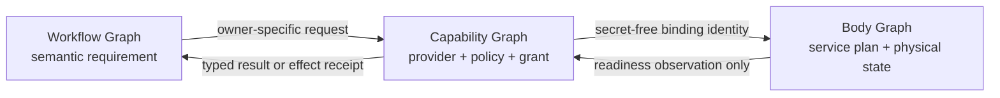

# :material-lan-connect: Capability and Embodiment Federation

**Candidate question:** can workflow demand, domain capability authority, and physical service
embodiment share one contribution language without sharing identity, grants, or lifecycle authority?

| Local maturity | Scope | Architectural effect |
| --- | --- | --- |
| **Unaccepted cross-cutting candidate study** | Providers, Animators, local and external services, body compilation | **None.** Existing Covenants and delivered source remain authoritative. |

This study tests a boundary exposed by Soulstones, Phoenix, Veil, Tether, and a possible OpenBao
provider. A Soulstone binds one local Animator identity and capability surface to one
Quadlet-backed service body. Phoenix already contributes a non-Animator container through the same
Animation-owned transmutation path.
Future Veil, Tether, Gate, and secret-authority services need placements and trust boundaries that
the shared Pod cannot express.

The answer is not to call every service an Animator. It is to separate the thing an Invocation may
request, the authority that may grant it, and the body that happens to serve it.

## The proposed split

Three graphs may refer to one another by stable identity. They never collapse into one graph.

| Graph | Contains | Owner |
| --- | --- | --- |
| **Workflow graph** | Pattern stations, typed state, semantic requirements, Stasis, and logical edges | [Graph](../adr/24-graph.md) and [Workflow](../adr/28-workflow.md) |
| **Capability graph** | requirement, Provider declaration, observation, owner decision, typed grant, and lease | the receiving Domain; [Dispatcher](../adr/22-dispatcher.md) only for Animators |
| **Body graph** | service identities, placement, dependencies, resources, secrets, network, physical state, and receipts | [Containers](../adr/08-containers.md), [Orchestrator](../adr/23-orchestrator.md), Privilege, and Scribe |



A physical dependency is not a workflow edge. A running service does not create a Graph route.
Capability availability does not create authority, and authority does not prove execution.

## Animator remains an invocation Provider

An **Animator** remains a specialized `ProviderInstance` whose capability may be requested by a
Pattern or Graph and temporarily leased by Dispatcher. Current inference families and safely
modeled tool execution belong here. Animator is not a synonym for every mechanism that can do
something.

The following operations must not become generic Dispatcher routes:

- resolving or returning a reusable secret;
- issuing a certificate or signing with infrastructure authority;
- opening a network route or admitting ingress;
- starting a service or mutating a container; and
- altering storage, host policy, or another trust boundary.

OpenBao, Veil, Tether, Phylactery, and a Provider Gate may expose typed operations to their owning
Domains. They do not become Animators merely because those operations can be described as
capabilities. A high-level Graph effect such as `email.send` may cause its owner to obtain a narrow
credential lease internally; the Graph never inherits `secret.read` or `network.open`.

`CapabilityGrant` also remains Animator-specific. Other owners issue their own closed words, for
example `AuthorityGrant`, `CredentialLease`, `IngressDecision`, `RouteAdmission`, or
`TransitionIntent`. There is no universal super-grant.

## Provider and service vocabulary

This study preserves **Manifestation** in its accepted [Extension](../adr/05-extensions.md)
meaning: a concrete profile form of an Extension Domain. It does not reuse that word for a
Quadlet or running service.

| Term | Candidate meaning |
| --- | --- |
| `ProviderDefinition` | Accepted declaration of a concrete mechanism, its contracts, revisions, adapters, and provenance; it starts nothing. |
| `ProviderInstance` | One Rune-configured or externally bound identity of that mechanism. |
| `CapabilityRequirement` | Semantic demand without endpoint, service, credential, or lifecycle handle. |
| `CapabilityDefinition` | Immutable offer of one Provider instance, including operation, schemas, effects, data class, assurance, owner, and provenance. |
| `ProviderObservation` | Owner-specific observation of the exact Provider, capability, and binding generation; never permission and not ADR 22's Animator-specific `CapabilityState`. |
| `CapabilityBinding` | Owner-selected relation between a requirement and definition; not yet a grant. |
| `ServiceDefinition` | Registered schema and policy envelope for a workload class and its permitted placements. |
| `ServiceInstanceIntent` | Immutable operator/Rune request for one configured service identity using typed resources and references. |
| `ServicePlan` | Core-compiled and globally arbitrated physical plan for one exact input generation. |
| `ServiceRealization` | Observed realization of one exact plan generation. |
| `ServiceBinding` | Secret-free Provider-facing identity, endpoint, protocol, audience, generation, trust zone, and readiness key. |
| `QuadletManifest` | One replaceable backend projection of a `ServicePlan`; never Provider or Soulstone identity. |

A **Connector** remains a Domain-owned protocol adapter. It translates a typed call through a
`ServiceBinding` or explicit external binding to the Provider's native protocol. It does not
register a capability, authorize a caller, grant a lease, or control lifecycle. **Connectee** adds
no canonical identity: the exact peer is already the `ProviderInstance` and binding endpoint.

## The assembly contract

The candidate compilation flow is:

```text
Extension package registration
  → ProviderDefinition and ServiceDefinition
Rune/Settings selection
  → ProviderInstance and ServiceInstanceIntent
Domain + Security + operator admission
  → ServicePlan
Backend projection
  → QuadletManifest or another closed backend document
Scribe + privileged actuator
  → ServiceRealization and receipts
Provider hydration
  → secret-free ServiceBinding
```

Registration gives only the right to propose an owner-accepted typed shape. It starts no service,
opens no route, mounts no path, reads no secret, and creates no Graph capability.

An Extension may request closed workload, resource, interface, dependency, and placement classes.
It may not contribute raw Quadlet or systemd text, unit names, dependency directives, shell or
`ExecStart`, Podman arguments, UID/UserNS choices, Linux capabilities, devices, SELinux disablement,
Pod or network joins, firewall or DNS rules, arbitrary host paths, secret values or target paths,
host control sockets, health commands, recovery/deletion policy, public routes, or Graph exposure.
The receiving owner and Core compiler choose the physical expression and may refuse it.

The compiler arbitrates the complete body before rendering: globally unique identity, placement,
trust zone, ports, listeners, mounts, storage ownership, secret audience, network edges, resource
ceilings, ordering, readiness, compensation, retirement, and source provenance. Scribe remains the
transactional materializer of validated files and ownership receipts.

## Placement is part of security

| Placement | Intended use | Boundary and refusal |
| --- | --- | --- |
| `shared_rootless_pod` | Mutually trusted Core services that deliberately share a network trust zone | Not isolation. Refuse hostile code, Coffin, Gate, OpenBao, Veil, Tether, and observational UI by default. |
| `isolated_rootless_container` | Default local Animator, Phoenix, and one Coffin per job | Separate network namespace and SELinux label; protects container boundaries while the Magus account remains trusted. |
| `user_host_unit` | Trusted native service or development profile | Same Unix account and trust zone; never evidence against compromise of that account. |
| `operator_system_service` | Gate/OpenBao or privileged network service on the same host | Operator-owned unit, distinct unprivileged UID/GID, confined SELinux domain, independent storage and receipts. |
| `external` | Portal or externally managed OpenBao, Veil, Tether, or database | LychD emits no unit and has no lifecycle authority; it binds identity and observes readiness only. |

The current rootless user-manager body can contain a hostile Coffin relative to a trusted Magus
account. It cannot keep a reusable credential from an arbitrary compromised process already
running as that same account: that process shares the rootless Podman and user-systemd authority.
Meeting the stronger threat requires a distinct OS principal and SELinux domain, an external
service, or non-exportable hardware/external signing. A software vault under the compromised
account does not manufacture that boundary.

Hardened secret-bearing profiles must require SELinux enforcing and reject label disablement.
Every placement must state what it protects; moving a service to another container without changing
the Unix/SELinux authority must not be advertised as protection from account takeover.

## Reference profiles

### Soulstone

A Soulstone becomes:

```text
local Animator ProviderInstance
+ Animator CapabilityDefinitions
+ reference to one ServiceBinding
+ optional Soulstone-owned ServiceInstanceIntent
```

Its Rune may retain physical intent while the migration is underway. The delivered live Animator
handle already owns no `QuadletContainer`; its Connector currently needs protocol endpoint and
readiness surfaces, not the deployment document. A later accepted federation would have to prove
whether an explicit binding generation belongs at that seam.

Local inference should prefer an isolated rootless container with exact GPU, model, and cache
resources. It receives no Codex, Crypt, Reactor or Podman socket and no unrelated application,
database, or provider credential. A runtime-specific secret is mounted only for its declared
audience.

### Portal

A Portal is an external Animator `ProviderInstance` with capability definitions and an external
`ServiceBinding`. It contributes no local `ServiceInstanceIntent`, unit, or lifecycle transition.
Probing and egress remain separately authorized; external placement does not create permission to
transmit private material.

### Phoenix

Phoenix proves why non-Animator services need the body layer. Its preferred placement is an
isolated rootless container with loopback UI and exact telemetry ingress. It receives no broad
Phylactery identity or application secrets. If it needs durable database storage, that is a unique
database role, credential audience, and network grant rather than ambient shared-Pod reachability.

### Veil and Tether

Veil and Tether contribute Domain-specific Provider definitions plus service intent, not Graph
routes. Veil receives exact public listeners, typed upstreams, and bounded certificate automation;
it never becomes an arbitrary forward proxy. Tether receives exact tunnel listeners, peers, keys,
and routes; it never inherits application credentials or broad host mutation. Both require an
isolated rootless or operator system-service placement according to the privileges and threat
model accepted by their owning Covenants.

### Coffin and Provider Gate

One Coffin is one isolated, secret-free job container with no home, SSH, Crypt, Codex, Podman
socket, ambient network, or sibling-job access. Its only provider path is a narrow, expiring job
grant to a Provider Gate.

The Gate owns the reusable provider credential, validates peer and grant identity, performs only
the admitted operation, and never returns the raw credential or becomes a general proxy. For the
stronger Magus-account compromise boundary, the Gate must be an `operator_system_service` under a
distinct UID and SELinux domain or be external.

### OpenBao

OpenBao fits as an optional `SecretAuthority`/credential/PKI Provider beneath Gate and Ward. It
does not fit as a Graph Animator, universal IAM policy owner, mandatory control plane, shared-Pod
member, or proof that secrets are safe after delivery to a compromised consumer.

For the stronger local threat model it must be external or an operator-owned system service with
its own UID, SELinux domain, listener, storage, audit, client identities, policies, and recovery.
An isolated rootless OpenBao under the Magus account is a valid weaker profile for container
compromise and encrypted storage, but not for compromise of that account.

OpenBao's client and bootstrap material is itself secret. Consumers receive exact, short-lived
leases or brokered operations; Graph and Coffin receive neither a universal token nor a raw
`secret.resolve` route. Integrated Raft avoids a boot cycle through LychD's own Phylactery and is
the storage shape recommended by the [OpenBao storage documentation](https://openbao.org/docs/configuration/storage/).
Machine authentication may use narrowly scoped AppRole or another admitted method; AppRole and
response wrapping still require a governed bootstrap and do not remove secret zero. See the
[AppRole contract](https://openbao.org/docs/auth/approle/) and
[response wrapping](https://openbao.org/docs/concepts/response-wrapping/). Default Shamir sealing
requires manual unseal; unattended Auto Unseal merely moves recovery trust to its configured
mechanism, as described by the [seal contract](https://openbao.org/docs/configuration/seal/).

OpenBao therefore enters only after the Gate boundary, authority split, rotation, recovery,
SELinux, and effectful host receipts exist. Replacing one broad secret mount with one broad OpenBao
token is not progress.

## Required evidence

No single status called “running” is sufficient. The body path needs distinct receipts:

| Receipt | Must bind |
| --- | --- |
| `CompilationReceipt` | exact definition, intent, Rune/Settings, artifact, provenance, policy, decisions/refusals, and resulting plan digest |
| `MaterializationReceipt` | exact files, sites, modes, source and credential generations, staging validation, prior ownership, rollback, and reload |
| `ActuationReceipt` | transition identity, exact pre-world, submitted closed word, terminal readback, and restored/contained outcome |
| `ReadinessReceipt` | service and plan generation, binding, probe method, time, freshness, and result; never a capability grant |
| `CredentialBindingReceipt` | secret reference and version, exact consumer, target, mode, and audience; never the value |
| `RotationReceipt` | old/new epochs, admission close, drain, recreation/reload, consumer observation, old revocation, and containment of partial state |
| `RecoveryReceipt` | exact restoration or terminal containment after failed compilation, materialization, actuation, or provider recovery |
| `RetirementReceipt` | route/lease closure, credential revocation, stop, storage disposition, and removal of receipt-owned files only |
| `CompromiseReceipt` | revoked grants, contained process trees, quarantined outputs, rotated crossed credentials, and secret-free evidence |

Acceptance must include adversarial effectful receipts, not only policy and renderer tests:

1. A contributed raw unit, Pod join, host mount, control socket, secret target, public port, or
   `label=disable` is refused before rendering.
2. Graph demand for `secret.resolve`, `pki.sign`, `network.open`, or `container.start` finds no
   Dispatcher route.
3. Shared-Pod peer reachability proves that profile unsuitable unless the peers are explicitly in
   one trust zone.
4. Isolated profiles prove default-deny IPv4, IPv6, DNS, loopback, Unix-socket, filesystem, and
   cross-MCS access according to their declared interfaces.
5. Secret canaries are absent from environment values, argv, logs, exceptions, receipts, core
   dumps, child processes, and unrelated `/proc` views.
6. Cancellation contains every descendant and revokes job network and credential grants before a
   successful terminal receipt.
7. Rotation rejects the old epoch after the fence and admits the new one only after exact consumer
   observation.
8. `external` placement generates no files and attempts no lifecycle effect.
9. Failed materialization restores the prior generation; unknown actuation latches containment
   rather than optimistic retry.
10. Retirement closes routes and leases and revokes credentials before unit or storage removal.

## Migration without topology drift

This proposal can move only through bounded stages. The first item below is a delivered hygiene cut,
not acceptance of the proposed federation vocabulary.

### 0. Amend the owners

If accepted, distribute law instead of leaving this page authoritative:

- [Extensions](../adr/05-extensions.md): Provider definition/instance and typed service
  contributions, with no raw Quadlet authority;
- [Containers](../adr/08-containers.md): the body graph, service compilation, placement classes,
  and backend projection;
- [Security](../adr/09-security.md): trust profiles, secret audiences, and the stronger account-
  compromise boundary;
- [Configuration](../adr/12-configuration.md): Provider/Service Rune intent and secret references;
- [Dispatcher](../adr/22-dispatcher.md): Animator-specific capability contracts and the distinction
  between capability and service binding;
- [Orchestrator](../adr/23-orchestrator.md): physical convergence without becoming universal Domain
  policy;
- [Workflow](../adr/28-workflow.md): semantic requirements without infra dependencies;
- [IAM](../adr/38-iam.md), [VPN](../adr/39-vpn.md), and [Proxy](../adr/40-proxy.md): owner-specific
  authority for OpenBao/Gate, Tether, and Veil.

State of Work changes only after executable evidence exists.

### 1. Remove the deployment artifact from the live Animator

The delivered runtime construction is `build_runtime(rune)`. The live Soulstone has no `.quadlet`,
Registry performs no whole-body retransmutation, and runtime factories have one exact argument.
Bind still compiles `RuntimePlan` through the existing `Transmuter`; physical output, Rune
inheritance, Soulstone/Portal inheritance, lifecycle topology, and extension contribution are
unchanged. This cut introduces no `ServiceBinding` or generic body type. [State of
Work](../state-of-the-work.md#animator-dispatch-spine) owns its executable evidence.

### 2. Introduce the minimum types with identical output

Only after the owning ADRs accept the boundary, add the smallest justified subset of
`ServiceDefinition`, `ServiceInstanceIntent`, `ServicePlan`, `ServiceBinding`, and a body compiler
outside Animation. A compatibility `SoulstoneServiceIntentFactory` translates today's Rune and
runtime plan. The new compiler must initially emit identical models, rendered bytes, filenames,
binding sites, ordering, and desired-generation hashes.

### 3. Split physical compilation from Animator topology

Animation retains Animator/Coven conflict law and lifecycle-target intent. The body compiler owns
Core services, typed extension services, Soulstone service plans, and backend manifests. Bind is
the single composition seam; Scribe remains the only file materializer. Runtime topology
attestation composes the generic service attestation instead of re-owning its manifests.

### 4. Replace raw extension transmutation

Replace the `transmutation` Quadlet contributor store with a provider-bound typed service store.
Migrate Phoenix first. Any internal compatibility adapter must be removed in the same campaign so
raw Quadlet contribution cannot survive as a parallel authority path.

### 5. Prove the cut before adding OpenBao

Characterization tests compare the old and new compiler outputs. Registry tests prove no import or
dependency on Quadlet/Transmuter. Extension tests prove provenance, sealing, defensive copies, and
refusal of physical authority. Scribe and runtime-topology tests preserve ownership, rollback,
target conflict, and attestation law. Only after the new placement and Gate attack receipts exist
does an OpenBao experiment become eligible.

## Open questions

- Does accepted terminology keep `ServicePlan/ServiceRealization`, or is another non-conflicting
  word needed beside ADR 05's existing `Manifestation`?
- Which Core office owns generic body compilation while Animation keeps only Animator topology?
- Which current Core services deliberately remain in `shared_rootless_pod`, and which migrate to
  isolated placement?
- Is the stronger separate-UID Gate a supported reference profile or an operator-supplied external
  prerequisite?
- Which readiness traits are common enough for `ServiceBinding` without turning it into a universal
  runtime handle?
- What is the exact retirement and recovery transaction for operator-owned system services that
  LychD may observe but must not silently administer?

This page may guide an implementation spike. It grants no new extension surface, host effect,
secret backend, Graph capability, placement claim, or delivery status.
