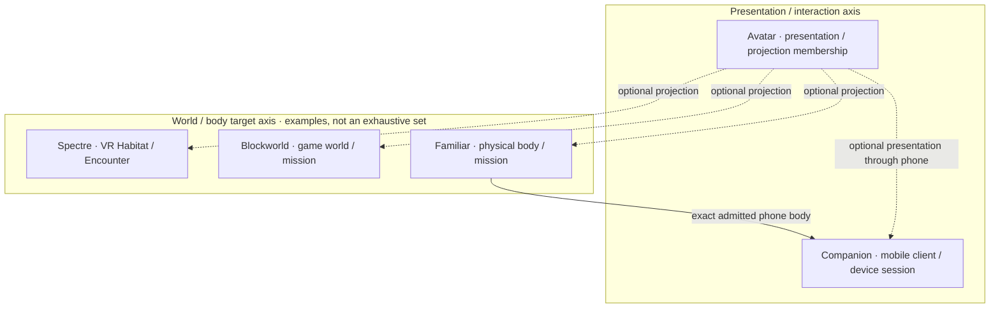

# :material-owl: Familiar

A body can carry a voice, follow an admitted subject, or perform a bounded task. Familiar keeps the physical body's capabilities, local limits, observations, and consequences attributable. The name recalls a _familiar_ as a bound companion spirit: serving one Lich does not make the chassis its identity or grant power over the physical world.

Body admission establishes the exact capabilities and independent stop path. A finite follow mission then carries its subject designation through loss, speaking presence, and settlement. Cars, drones, rovers, legged robots, manipulators, phones, cards, displays, and other explicit forms need their own admitted controller or device profile.

## Contract

`familiar.embodiment` revision `3` publishes `familiar.admit_body@3`, `familiar.bounded_mission@3`, and `familiar.follow@3`. Additional body-specific Patterns may be admitted without changing the body contract.

Body admission binds an exact controller/device attachment, form, capability snapshot, safety envelope, relevant geofence, and emergency-stop policy. A mission takes immutable `FamiliarBody@3`, objective kind, subject/target designation, budgets, stops, and optional Avatar `ProjectionBinding@2`. Results include `FamiliarBody@3`, settled `FamiliarMission@3`, `FamiliarObservation@1`, `FamiliarEffect@1`, and exact partial/non-completion.

Familiar excludes weaponization, non-consensual following, unadmitted private-property or restricted-airspace entry, operation beyond signal range without admitted return policy, inferred identity/consent from proximity, and universal physical authority.

## Records and lifecycle

Familiar owns body binding and capability epoch, plus mission objectives, constraints, observation chronology, effects, and final judgment. Enrollment/credentials remain with the attachment owner; hardware, firmware, motor drivers, PID loops, client implementation, and live control handles remain elsewhere. A MAVLink connection, ROS2 node, PWM signal, or sensor stream cannot become durable mission identity.

The control link contributes observed protocol version, link quality, controller health, firmware revision, start, stop, and loss, tied to its provider epoch. Recovery reads those facts alongside the body journal and mission record; a reconnected handle alone cannot establish what the body did during the gap.

For phones, [Ward enrollment precedes Familiar body admission](embodiment.md#body-admission), which precedes Companion's device/session. Both Compositions retain the exact Ward references. Remote bodies may instead attach through Legion; neither route is universal Familiar law.

## Orthogonal axes, one Lich

These examples are not exhaustive realms. [Avatar](../avatar/index.md) chooses eligible presentation across targets; each target owns what happens there. [Companion](../companion/index.md) owns an independent mobile interaction/session over a phone-shaped Familiar. New capabilities need not distort this map into a closed cosmology.

## Core capability before packaging

A Product may package Familiar, Companion, and Avatar, and a Suite may coordinate their live work. Neither moves body, mission, or safety authority into the client. Familiar does not require a current packaged application.

The first network-disabled mock body supplies simulated GPS, IMU, camera, mic, speaker, battery, recorded path, obstacle, speaking transition, and low-battery landing evidence. It proves the follow/settlement contract, not flight dynamics, actual avoidance, or hardware compatibility. No real drone, vehicle, public airspace, or non-consenting subject enters it.

Revision `3` supersedes Designed revision `2` by naming exact Ward phone enrollment and advancing body admission/`FamiliarBody` to `@3`. Revision `2` had replaced revision `1`'s universal Legion precondition with owner-qualified attachment. Mission/follow and `FamiliarMission` advance to `@3` for the new body and Avatar bindings. No registry or Run used those retired revisions; history remains unchanged without executable migration.

## Enter by question

[Embodiment](embodiment.md) · [Follow](follow.md) · [Composition Portfolio](../index.md)
