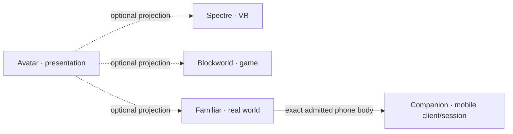
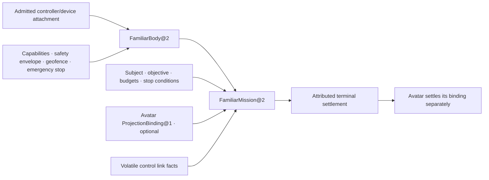

# :material-owl: Familiar

Familiar is the real-world embodiment Composition. It admits one physical body — car, drone,
rover, legged robot, manipulator, card, display, or another explicitly declared vessel — and opens
one bounded task or presence inside that body. The body acts in physical space and returns with an
honest account of what happened.

Avatar may be projected into the Familiar body. When the Lich speaks through a device or rides in a
vehicle, Familiar owns the body truth and task; Avatar remains the separate Composition that owns
presentation and projection membership. The name follows _familiar_ as a bound companion spirit:
the body serves one Lich without becoming identity, granting universal physical authority, or
claiming the physical world as its own.

Familiar completes the three-realm symmetry. Spectre owns VR presence, Blockworld owns game-world
presence, and Familiar owns real-world presence. Each realm keeps its own truth; Avatar projects
into all three without absorbing any of them.

## Contract

| Field | Reference contract |
| --- | --- |
| **Identity** | `familiar.embodiment` revision `2` |
| **Patterns** | `familiar.admit_body@2`, `familiar.bounded_mission@2`, and `familiar.follow@2`; additional body-specific Patterns may be admitted without changing the body contract |
| **Application begins with** | for body admission, one exact admitted controller or device attachment, form factor, capability snapshot, safety envelope, geofence where relevant, and emergency stop policy; for a mission, one admitted `FamiliarBody@2`, objective kind, subject designation, budgets, stop conditions, and an optional exact Avatar-owned `ProjectionBinding@1` reference |
| **Application can return** | an immutable `FamiliarBody@2`, settled `FamiliarMission@2`, attributed `FamiliarObservation@1` and `FamiliarEffect@1` records, or explicit partial/non-completion |
| **Application stops before** | autonomous weaponization, following non-consenting subjects, entering restricted airspace or private property without admission, operating beyond signal range without pre-authorized return policy, claiming subject identity or consent from proximity, or granting the Lich universal physical authority |

Revision `2` supersedes the Designed-only `familiar.embodiment` revision `1` and its `@1` body and
mission contracts. It replaces the universal Legion precondition with an owner-qualified admitted
controller or device attachment. No Portfolio registry or Run used revision `1`, so there is no
executable migration; historical references retain their old meaning.

Familiar owns the durable body binding: exact admitted controller or device attachment, form
factor, make and model, requested and required capabilities, safety envelope, geofence where
relevant, and emergency stop policy. The attachment owner retains enrollment and credentials;
controller firmware, motor drivers, PID loops, client implementation, and hardware itself remain
outside that record. A remote robot may attach through Legion, while a local phone may attach
through an exact enrolled client/device binding whose current authority Ward proves. Companion is
downstream of that body admission: it consumes the resulting exact `FamiliarBody@2`; neither
attachment route is universal Familiar law.

Each mission owns its objective kind, subject designation, path constraints, budgets, stop
conditions, observation references, effect receipts, and terminal judgment. A MAVLink connection,
ROS2 node, PWM signal, or raw sensor stream is volatile provider state, never the durable mission.

## Records and lifecycle

Familiar separates the admitted body, bounded mission, volatile control link, and final judgment.
A controller may reboot while the body identity remains eligible for a later mission; many missions
may use one body without becoming one endless deployment.

| Layer | Familiar-owned truth | Boundary |
| --- | --- | --- |
| `FamiliarBody@2` | one immutable body identity and capability epoch: admitted controller/device attachment, form factor and make/model, requested, required, granted, missing, and revoked capabilities, safety envelope, geofence where relevant, and emergency stop policy | not attachment enrollment or credentials, a Legion node, Companion session, hardware reservation, controller firmware, client implementation, or physical chassis |
| `FamiliarMission@2` | one bounded objective or presence task, subject or target designation where relevant, path or operating constraints, capability-specific safety envelope, signal-loss policy, budgets, stop conditions, optional Avatar projection reference, observation chronology, and terminal judgment | not the provider session, motor or actuator command loop, raw sensor stream, Avatar profile, or claim of continuous attention |
| provider link epoch | attributed volatile facts about one control session: protocol version, link quality, controller health, firmware revision, start, stop, and loss | evidence observed by Familiar, not a reusable durable session or substitute for body capability admission |
| terminal settlement | `completed`, `partial`, `subject_lost`, `emergency_stopped`, `signal_lost`, `battery_depleted`, `refused`, or `unresolved`, plus references to separately owned Avatar bindings, Prism/Echo material, and application or effect receipts | honest judgment about the mission contract, not proof that every frame, utterance, motor pulse, or external effect occurred |

## Three realms, one Lich

| | Spectre | Blockworld | Familiar |
|---|---|---|---|
| **Realm** | virtual reality | persistent game world | real world |
| **Admission anchor** | `VRHabitat@1` | server + world epoch | `FamiliarBody@2` |
| **Bounded event** | `SpectreEncounter@1` | `blockworld.bounded_mission@1` | `familiar.bounded_mission@2` |
| **Owns** | reference space, comfort, exit | inventory, lease, verified effects | safety envelope, geofence, observations |
| **Protocol underneath** | OpenXR | Minecraft protocol | form-specific authenticated client or controller binding, such as a mobile client, MAVLink, or ROS2 through an admitted local or Legion route |
| **Optional Avatar role** | `ProjectionBinding@1` into Habitat | `ProjectionBinding@1` into inhabitant | `ProjectionBinding@1` into body |

Avatar never owns the realm. It owns _who appears_. The realm owns _where they appear and what
happens there_. Familiar exists because real-world physics, safety, battery life, signal range,
geofences, and physical observations are application truth that Avatar has no business owning.

## Core capability before packaging

Familiar belongs in the Portfolio without requiring a current packaged application. A phone is one
Familiar form. **Companion** is the separate mobile-client/session Composition over that exact
body: Familiar supplies embodiment, hardware, capability, safety, and stop law; Companion supplies
the configurable mobile client and local device experience.
A Suite may combine Familiar, Companion, and Avatar with other Compositions without moving body,
safety, or mission authority into the client.

The smallest proving fixture is synthetic and network-disabled: one mock body adapter with simulated
GPS, IMU, camera, mic, speaker, and battery; one recorded outdoor path; one simulated obstacle; one
voice-command transition to speaking mode; one battery-depleted landing. It proves the follow
contract and speaking transition, not flight dynamics, real obstacle avoidance, or hardware
compatibility. No real drone, vehicle, public airspace, or non-consenting subject enters that
fixture.

## Enter by question

- [Embodiment](embodiment.md) — which forms a Familiar may take, what each form can sense and do,
  and how a body is admitted.
- [Follow](follow.md) — how the body locks, traces, and keeps a subject; obstacle avoidance;
  signal loss; and the transition into speaking presence.

Related: [Avatar](../avatar/index.md) · [Legion](../../adr/42-legion.md) ·
[Blockworld](../blockworld/index.md) · [Spectre](../spectre/index.md) ·
[Homestead](../homestead/index.md) · [Vision](../../adr/36-vision.md) ·
[Audio](../../adr/37-audio.md) · [Prism](../../sepulcher/extensions/prism/index.md) ·
[Echo](../../sepulcher/extensions/echo.md) · [Composition Portfolio](../index.md)
