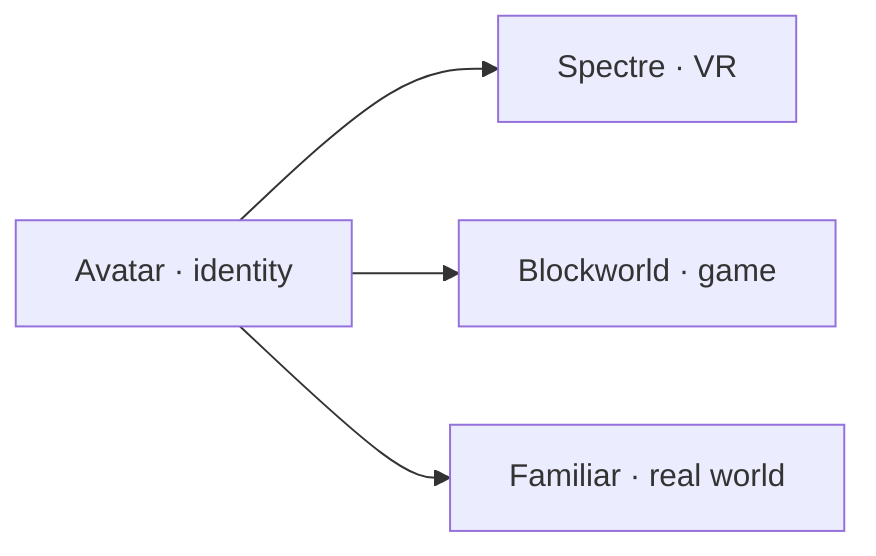
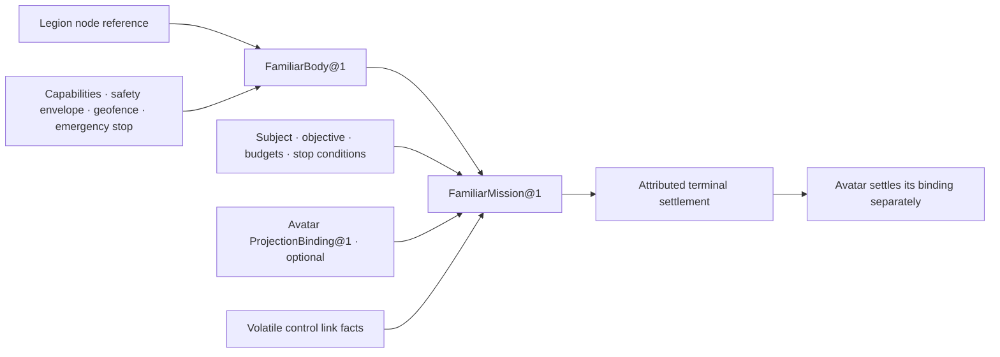

# :material-owl: Familiar

Familiar is the real-world embodiment Composition. It admits one physical body — drone, rover, or
legged robot — and opens one bounded mission inside that body. The body moves through physical
space, observes, and returns with an honest account of what happened.

Avatar may be projected into the Familiar body. When the Lich speaks through a drone or rides in a
rover, Familiar owns the body truth and mission; Avatar remains the separate Composition that owns
presentation and projection membership. The name follows _familiar_ as a bound companion spirit:
the body serves one Lich without becoming identity, granting universal physical authority, or
claiming the physical world as its own.

Familiar completes the three-realm symmetry. Spectre owns VR presence, Blockworld owns game-world
presence, and Familiar owns real-world presence. Each realm keeps its own truth; Avatar projects
into all three without absorbing any of them.

## Contract

| Field | Reference contract |
| --- | --- |
| **Identity** | `familiar.embodiment` revision `1` |
| **Patterns** | `familiar.admit_body@1`, `familiar.bounded_mission@1`, and `familiar.follow@1` |
| **Application begins with** | for body admission, one exact Legion node reference, form factor, capability snapshot, safety envelope, geofence, and emergency stop policy; for a mission, one admitted `FamiliarBody@1`, objective kind, subject designation, budgets, stop conditions, and an optional exact Avatar-owned `ProjectionBinding@1` reference |
| **Application can return** | an immutable `FamiliarBody@1`, settled `FamiliarMission@1`, attributed `FamiliarObservation@1` and `FamiliarEffect@1` records, or explicit partial/non-completion |
| **Application stops before** | autonomous weaponization, following non-consenting subjects, entering restricted airspace or private property without admission, operating beyond signal range without pre-authorized return policy, claiming subject identity or consent from proximity, or granting the Lich universal physical authority |

Familiar owns the durable body binding: exact Legion node identity, form factor, make and model,
requested and required capabilities, safety envelope, geofence, and emergency stop policy. The
controller firmware, motor drivers, PID loops, and hardware itself remain outside that record.

Each mission owns its objective kind, subject designation, path constraints, budgets, stop
conditions, observation references, effect receipts, and terminal judgment. A MAVLink connection,
ROS2 node, PWM signal, or raw sensor stream is volatile provider state, never the durable mission.

## Records and lifecycle

Familiar separates the admitted body, bounded mission, volatile control link, and final judgment.
A controller may reboot while the body identity remains eligible for a later mission; many missions
may use one body without becoming one endless deployment.

| Layer | Familiar-owned truth | Boundary |
| --- | --- | --- |
| `FamiliarBody@1` | one immutable body identity and capability epoch: Legion node reference, form factor and make/model, requested, required, granted, missing, and revoked capabilities, safety envelope, geofence, and emergency stop policy | not the Legion enrollment, credential, hardware reservation, controller firmware, or physical chassis |
| `FamiliarMission@1` | one bounded objective (follow, patrol, or observe), subject designation, path and terrain constraints, distance/altitude/speed envelopes, obstacle-avoidance policy, signal-loss policy, budgets, stop conditions, optional Avatar projection reference, observation chronology, and terminal judgment | not the MAVLink/ROS2 session, motor actuation, PID loop, raw sensor stream, Avatar profile, or claim of continuous attention |
| provider link epoch | attributed volatile facts about one control session: protocol version, link quality, controller health, firmware revision, start, stop, and loss | evidence observed by Familiar, not a reusable durable session or substitute for body capability admission |
| terminal settlement | `completed`, `partial`, `subject_lost`, `emergency_stopped`, `signal_lost`, `battery_depleted`, `refused`, or `unresolved`, plus references to Avatar, Voidlight, Riffmaw, or effect receipts owned elsewhere | honest judgment about the mission contract, not proof that every frame, utterance, motor pulse, or external effect occurred |

## Three realms, one Lich

| | Spectre | Blockworld | Familiar |
|---|---|---|---|
| **Realm** | virtual reality | persistent game world | real world |
| **Body record** | `VRHabitat@1` | server + world epoch | `FamiliarBody@1` |
| **Bounded event** | `SpectreEncounter@1` | `blockworld.bounded_mission@1` | `familiar.bounded_mission@1` |
| **Owns** | reference space, comfort, exit | inventory, lease, verified effects | safety envelope, geofence, observations |
| **Protocol underneath** | OpenXR | Minecraft protocol | MAVLink / ROS2 via Legion |
| **Avatar role** | `ProjectionBinding@1` into Habitat | `ProjectionBinding@1` into inhabitant | `ProjectionBinding@1` into body |

Avatar never owns the realm. It owns _who appears_. The realm owns _where they appear and what
happens there_. Familiar exists because real-world physics, safety, battery life, signal range,
geofences, and physical observations are application truth that Avatar has no business owning.

## Core capability before packaging

Familiar belongs in the Portfolio without requiring a current packaged application. A later
**Familiar Companion** Product may package a specific drone or rover profile; a Suite may combine
Familiar with Avatar, Homestead, or Reach. Neither packaging choice moves body, safety, or mission
authority into another Composition.

The smallest proving fixture is synthetic and network-disabled: one mock body adapter with simulated
GPS, IMU, camera, mic, speaker, and battery; one recorded outdoor path; one simulated obstacle; one
voice-command transition to speaking mode; one battery-depleted landing. It proves the follow
contract and speaking transition, not flight dynamics, real obstacle avoidance, or hardware
compatibility. No real drone, vehicle, public airspace, or non-consenting subject enters that
fixture.

## Enter by question

- [Embodiment](embodiment.md) — which forms a Familiar may take, what each form can sense and do,
  and how a body is admitted.
- [Follow](follow.md) — how the body locks, traces, and keeps a subject; obstacle avoidance;
  signal loss; and the transition into speaking presence.

Related: [Avatar](../avatar/index.md) · [Legion](../../adr/42-legion.md) ·
[Blockworld](../blockworld/index.md) · [Spectre](../spectre/index.md) ·
[Homestead](../homestead/index.md) · [Vision](../../adr/36-vision.md) ·
[Audio](../../adr/37-audio.md) · [Composition Portfolio](../index.md)
