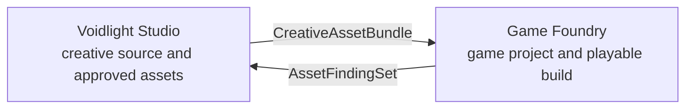

# :material-gamepad-variant: Game Foundry

!!! warning "Accepted architecture — not a delivered game-development application"
    Game Foundry is an accepted Reference Composition. LychD does not currently ship its Pattern
    pack, project schemas, engine adapters, build environments, instrumented controller, agentic
    playtester, balancing workbench, distribution adapters, or Loom projection. [State of
    Work](../state-of-the-work.md) remains the delivery authority.

**Game Foundry** turns an approved game concept and admitted creative assets into a versioned,
testable game project, playable builds, evidenced playtests, reviewable balance changes, and
release candidates. It owns the engineering truth that a media studio must not: source code,
scenes, engine resources, project settings, import state, tests, build recipes, playtest evidence,
balance revisions, and distribution effects.

Game Foundry is a Django-style local application contributed to the one Weaver. It may be embodied
by a future `game_foundry` Extension, but it is not a second workflow engine, an embedded game
engine, or a license to let an Agent rewrite and publish a game unobserved.

## Intent-composed Suite membership

Game Foundry is the engineering consumer in the initial `voidlight.game-suite`:
`voidlight.studio → game.foundry`. A **Suite** is assembled for an admitted intent as a typed graph
of Composition handoffs plus a shared Loom projection. It is not one permanent creative
application with every possible consumer enabled, and it does not merge application databases,
Pattern registries, permissions, budgets, or effect authority.



The Call/Manas may interpret “make me a game with rockets” and prepare an attributable charcoal
`voidlight.game-suite` draft. The Call is a cognitive office distributed across intake and routing,
not one literal planner service and not final authority. The Blade discriminates; deterministic
review, the Magus, policy, and Weaver validate and admit exact Suite and Pattern revisions before
any Invocation exists.

Each edge carries an immutable, typed, content-addressed bundle. Opening the game Suite in Loom may
show the whole production journey, but a card or edge grants no application permission. One
Composition admits the bundle through its own Pattern and policy, records an import receipt, and
owns every derived object it creates. A later intent may hand a `PlayableBuildBundle` to Broadcast
Studio through another explicitly admitted Suite graph; Broadcast Studio is not an ambient third
member of every game commission.

## Composition descriptor

| Field | Accepted design value |
| --- | --- |
| Stable id / revision | `game.foundry` / `1` |
| Initial Suite shape | `voidlight.game-suite` |
| Specification owner | `project:lychd`; future executable contribution may be `extension:game_foundry` |
| Support tier | Architecture-only reference; unsupported |
| Purpose | Turn a bounded game design and approved assets into evidenced playable and releasable builds |
| Default manual Pattern | `game.build_playable_slice@1` |
| Primary projection | Loom Foundry board plus intent-pinned game Suite graph—both future |
| Engine binding | Operator-owned engine profile selected through a typed adapter |
| Model/provider binding | Operator-owned Runes selected by semantic capability |
| Principal non-goal | Autonomous public game release |

The descriptor, domain schemas, immutable Pattern revisions, engine adapters, policy, projections,
fixtures, and conformance tests should remain locally understandable as one application
contribution. Engine binaries, SDKs, signing services, and distribution clients retain their own
physical lifecycle and licenses.

## Visible outcomes and non-goals

An admitted project should eventually yield:

- a versioned game-design contract with explicit acceptance tests;
- a source revision and lock receipt for code, scenes, resources, dependencies, and project
  settings;
- imported creative assets linked to their immutable source bundle and engine-native derivatives;
- deterministic static checks and engine-native test receipts;
- one or more content-addressed playable builds with complete recipes and environment evidence;
- scripted and agentic playtest sessions with observations, actions, telemetry, captures, findings,
  and reproducible seeds where the game permits them;
- proposed and approved balance changes linked to the evidence that motivated them;
- a signed release candidate with platform, license, privacy, accessibility, localization, and
  storefront checklists; and
- separate draft, private-channel, and public distribution receipts.

The first slice is not a general game engine, autonomous creative director, infinite code-repair
loop, universal bot that can understand every game from pixels, replacement for human playtesters,
anti-cheat bypass, autonomous multiplayer participant, source-license oracle, or one-click
cross-platform publisher.

## Ownership and truth boundaries

| Concern | Owner |
| --- | --- |
| Composition enablement, Pattern revision, Invocation, logical priority, overlap, gates, and budgets | Weaver |
| Typed state transitions, checkpoints, finite branches, and durable waits | Graph under Weaver law |
| Game project, design contracts, code, scenes, engine resources, project settings, tests, build recipes, playtest records, and balance revisions | Game Foundry application owner |
| Approved creative source assets and their creative provenance | Voidlight Studio |
| Captured episodes, broadcasts, editorial packages, and channel publication | Broadcast Studio |
| Immutable media and build bytes plus derivation manifests | Reliquary-backed artifact custody |
| Source repository, revision history, and reviewed changes | The project VCS boundary |
| Engine invocation, import, validation, build, launch, input, capture, and telemetry mechanisms | Typed engine and controller adapters |
| Capability selection | Dispatcher and Runes |
| Model, engine workload, SDK, and tool physical readiness | Orchestrator |
| Run, approval, test, build, playtest, and external-effect receipts | Phylactery and owning application ledgers |
| Secrets, signing keys, store credentials, and account authorization | Ward and the relevant external account owner |
| Project direction, acceptable experience, legal eligibility, and public release | Magus through HitL |
| Foundry and Suite projections | Loom; never the source of project or execution truth |

An engine-generated resource is not automatically source truth. The Foundry records whether an
object is:

- **authored source** committed in the project;
- **admitted source asset** imported from a typed bundle;
- **derived import output** reproducible from source plus a pinned importer;
- **generated cache** disposable and never required as the only copy;
- **build output** immutable evidence of one recipe; or
- **external release object** reconciled through an effect receipt.

Graph checkpoints carry Invocation progress. They do not replace the project repository, artifact
manifest, build ledger, or playtest database.

## Voidlight asset handoff

Voidlight Studio exports a `CreativeAssetBundle`; Game Foundry never reaches into a mutable Studio
working directory. The minimum bundle manifest contains:

```text
CreativeAssetBundle
├── bundle_id, schema_revision, content_digest
├── source_project_id and approved_bundle_revision
├── asset entries
│   ├── stable asset_id and semantic role
│   ├── content digest, media type, dimensions/duration
│   ├── coordinate, scale, color-space, and audio conventions
│   ├── source lineage and parent artifact ids
│   ├── license, attribution, territory, platform, and expiry evidence
│   └── acceptance and human-edit receipts
├── style, character, narrative, dialogue, and audio contracts
├── declared export profiles and known limitations
└── manifest signature or custody receipt
```

Game Foundry validates the bundle, materializes immutable inputs, and creates its own
`AssetImportReceipt` for each engine-native derivative. Texture compression, mesh optimization,
collision generation, animation retargeting, audio encoding, sprite slicing, shader materialization,
and scene assembly are Foundry derivations. They do not mutate the source bundle or silently become
new Voidlight truth.

If an asset clips, lacks a required animation, violates a performance envelope, reads poorly in
play, or has insufficient license evidence, the Foundry emits a typed `AssetFindingSet`. Voidlight
may answer with a new bundle revision. No Suite edge permits either Composition to edit the other's
database in place.

Open interchange formats are useful seams, not mandatory identity. As of the research snapshot
below, the Khronos registry describes glTF 2.0 as a runtime 3D asset delivery format and publishes
the 2.0.1 specification. A project may instead bind another eligible, versioned interchange
profile when its fidelity and licensing tests are stronger.

## Pattern catalogue

### `game.bootstrap_project@1`

```text
AdmitProjectBrief
→ SelectPinnedEngineProfile
→ MaterializeTemplateCandidate
→ ValidateProjectLayout
→ ResolveDependencies
→ RunCleanImport
→ RunStaticAndSmokeChecks
→ AwaitProjectAcceptance
→ FreezeProjectBaseline
→ End
```

The template is an attributable candidate, not a magical engine-independent project. A Smith may
prepare it in the Lab, but normal Assimilation verification and HitL promotion still apply.

### `game.import_creative_bundle@1`

```text
AdmitCreativeAssetBundle
→ VerifyManifestAndCustody
→ CheckLicenseAndTargetEligibility
→ MapSemanticRolesToImportProfile
→ ImportInIsolatedWorkspace
→ ProbeDerivedResources
→ RunVisualAudioAndPerformanceChecks
→ AwaitAssetAcceptance
→ CommitImportReceipts
→ End
```

Rejected imports remain evidence. A changed source digest or importer revision creates a new
derivation; it does not overwrite an accepted resource invisibly.

### `game.build_playable_slice@1`

```text
AdmitSliceCommission
→ PinDesignAndSourceRevision
→ PlanBoundedChangeSet
→ ImplementInLab
→ RunFormatterAndStaticChecks
→ RunEngineTests
→ BuildDevelopmentCandidate
→ RunScriptedSmokeScenario
→ ReviewDiffBuildAndEvidence
→ RepairOnce?
→ AwaitPromotionApproval
→ CommitProjectRevision
→ PackagePlayableBuild
→ End
```

The repair edge is finite and budgeted. A test failure, merge conflict, unknown import mutation, or
missing requirement ends honestly; it does not authorize an Agent to keep rewriting the project.
High-stakes code, dependency, migration, signing, and lifecycle changes follow Smith and
Assimilation law even when the Smith authored the candidate.

### `game.build_candidate@1`

This Pattern accepts an already approved source revision. It runs clean import, declared tests,
target-specific validation, deterministic packaging where the toolchain permits it, malware and
secret checks, artifact probing, and manifest creation. Each target produces a distinct
`BuildArtifact`; “build all platforms” is not one opaque effect.

Unknown build state is reconciled by source revision, engine profile, target profile, recipe
digest, and output custody. A retry may reuse an identical verified artifact. It may not relabel an
old binary as a new release.

### `game.playtest_candidate@1`

```text
AdmitBuildAndScenarioSet
→ ValidateSandboxAndInstrumentation
→ LaunchFreshIsolatedInstance
→ EstablishControllerObservationContract
→ RunScriptedBaseline
→ RunBoundedAgentSessions
→ CaptureActionsTelemetryAndMedia
→ VerifySessionCompleteness
→ EvaluateAgainstRubrics
→ ProduceFindingSet
→ AwaitHumanTriage
→ End
```

A session has fixed duration, action count, restart count, allowed inputs, observation fields, and
network policy. The controller cannot call arbitrary host tools or escape through an in-game
console, URL handler, file picker, mod loader, or debug shell.

### `game.balance_from_evidence@1`

This Pattern joins accepted human observations, deterministic simulation, scripted scenarios,
agentic sessions, and declared product metrics into one evidence set. It produces a
`BalanceProposal` with parameter-level diffs, affected content, hypotheses, uncertainty,
regression scenarios, and rollback information.

The proposal enters a fresh implementation and playtest cycle. An Agent's win rate or preference
does not define fun, fairness, accessibility, market suitability, or human consensus.

### `game.prepare_release@1`

```text
AdmitApprovedBuildSet
→ VerifySourceBuildAndLicenseLineage
→ RunReleaseRegressionSet
→ VerifyPlatformAndStoreChecklists
→ VerifyPrivacyAccessibilityAndLocalization
→ GenerateChecksumsAndReleaseNotes
→ SignThroughOwnedBoundary
→ AwaitReleaseCandidateApproval
→ FreezeReleaseCandidate
→ End
```

Signing keys never enter a model prompt, graph snapshot, project repository, or generic build
container. A typed signing service accepts only the approved digest and target policy.

### `game.publish_build@1`

Draft upload, private test channel, staged rollout, setting a build live, and public release are
separate effect classes. Every effect requires an idempotency key, exact account and application,
build digest, channel, visibility, territory, price/release metadata scope, and approval evidence.

An upload acknowledgement loss enters reconciliation. It never triggers a blind second upload or
sets a build live. Public release always requires fresh live Magus consent; approval of the source
diff or private build is not approval to publish.

## Domain schemas and durable artifacts

The future application owner should version at least:

| Record | Purpose |
| --- | --- |
| `GameProject` | Stable project identity, ownership, engine profile, repositories, and policy |
| `GameDesignContract` | Versioned mechanics, content boundaries, acceptance rubrics, and non-goals |
| `SourceRevisionReceipt` | Exact repository revision, lock state, dirty-state policy, and review |
| `EngineProfile` | Adapter, binary/runtime digest, version, license eligibility, and target matrix |
| `CreativeBundleAdmission` | Source bundle identity, digest, accepted uses, and custody |
| `AssetImportReceipt` | Source asset to derived engine resource lineage |
| `BuildRecipe` | Target, environment, toolchain, inputs, commands, and expected outputs |
| `BuildArtifact` | Content digest, probe, symbols, signing state, parents, and disposition |
| `ScenarioSpec` | Initial state, seed, goals, allowed actions, stop conditions, and rubric |
| `PlaytestSession` | Build, controller, observations, actions, telemetry, captures, and outcome |
| `Finding` | Reproducible defect, severity, evidence spans, affected revision, and status |
| `BalanceProposal` | Hypothesis, parameter diff, evidence, uncertainty, regression set, and decision |
| `ReleaseCandidate` | Frozen build set, checklists, approvals, notes, and target channels |
| `DistributionEffectReceipt` | Remote object, account, channel, response, reconciliation, and state |

Large source trees remain in a real version-control workspace; large assets and builds remain in
artifact custody. The application database indexes identity, lineage, policy, state, and receipts.
It must not stuff an entire repository or executable into a Graph checkpoint or JSON row.

## Engine and provider abstraction

The Composition specifies typed capabilities, not one engine name:

| Contract family | Candidate operations |
| --- | --- |
| Project | `game.project.inspect`, `game.project.clean_import`, `game.project.validate` |
| Assets | `game.asset.import`, `game.asset.probe`, `game.asset.diff` |
| Tests | `game.test.static`, `game.test.engine`, `game.test.scenario` |
| Build | `game.build.target`, `game.build.probe`, `game.build.package` |
| Runtime | `game.runtime.launch`, `game.runtime.reset`, `game.runtime.stop` |
| Controller | `game.observe`, `game.input.execute`, `game.capture.frame`, `game.telemetry.read` |
| Release | `game.sign`, `game.distribution.upload`, `game.distribution.promote`, `game.distribution.reconcile` |

An `EngineAdapter` declares project formats, supported languages, import semantics, headless and
display requirements, test surfaces, target toolchains, exit-code law, logs, artifact paths,
cancellation boundaries, licenses, and environment requirements. A `ControllerAdapter` separately
declares observations and allowed actions. An engine process is normally an isolated workload or
typed external tool, not an in-process Python extension with ambient host access.

Model-backed design, coding, visual review, or playtest reasoning asks Dispatcher for capabilities
such as structured `chat`, `vision`, or `tool_execution`. The engine, compiler, importer, build
tool, and controller are deterministic or stateful tool mechanisms with their own receipts. A
model name never becomes part of Pattern identity.

### Researched engine and distribution candidates

Research snapshot: **2026-07-29**. These are replaceable, operator-eligible adapter candidates, not
promised dependencies or evidence of local compatibility.

| Role | Official source | Candidate fit and caveat |
| --- | --- | --- |
| Open proving engine | [Godot command-line documentation](https://docs.godotengine.org/en/stable/tutorials/editor/command_line_tutorial.html) and [official license](https://github.com/godotengine/godot/blob/master/LICENSE.txt) | Documents headless project execution and command-line export through named presets; the engine is MIT-licensed. Exact editor, export-template, platform SDK, and plugin revisions must still be pinned and tested. |
| Commercial adapter candidate | [Unity 6 command-line build documentation](https://docs.unity3d.com/6000.0/Documentation/Manual/build-command-line.html) | Documents batch-mode Player builds and warns that reliable multi-target work needs separate target-specific processes. Unity terms, editor licensing, packages, platform modules, and project version remain operator eligibility inputs. |
| High-end adapter candidate | [Unreal Engine command-line documentation](https://dev.epicgames.com/documentation/en-us/unreal-engine/command-line-arguments-in-unreal-engine) and [Automation tests](https://dev.epicgames.com/documentation/en-us/unreal-engine/run-automation-tests-in-unreal-engine) | Official documentation exposes command-line launch and Automation-test reporting. Engine terms, source access, plugins, platform SDKs, build infrastructure, and hardware cost require an independent profile. |
| 3D interchange candidate | [Khronos glTF Registry](https://registry.khronos.org/glTF/) | Publishes glTF 2.0.1 as the current 2.0 runtime asset-delivery specification; a conformance profile must declare extensions, coordinate conventions, materials, animation, compression, and fallback behavior. |
| Steam distribution adapter | [SteamPipe upload documentation](https://partner.steamgames.com/doc/sdk/uploading) | Supports uploaded builds and private/public beta branches. Credentials, app permissions, depots, branch promotion, and setting a released build live remain separate governed effects. |
| itch.io distribution adapter | [Official butler documentation](https://itch.io/docs/butler/) | Provides a command-line build upload path to named channels. The adapter still needs pinned client behavior, credential custody, channel policy, reconciliation, and live-visibility gates. |

Godot is the recommended first proving adapter because its official command-line surface and
license make a local synthetic slice comparatively inspectable. That is a sequencing choice, not a
claim that Godot is universally best or part of Game Foundry's identity.

## Agentic playtesting law

Agentic playtesting has three separate roles:

1. the **scenario author** defines initial state, goal, allowed action vocabulary, invariants,
   termination, seed policy, and success rubric;
2. the **controller** translates typed actions into admitted game inputs and returns bounded
   observations; and
3. the **player/evaluator** chooses actions or classifies evidence without receiving host,
   repository, debug-console, or release authority.

The preferred proving path exposes structured observations from an instrumented test build:
player state, nearby interactables, quest or objective state, collision/contact events, performance
counters, and stable semantic identifiers. Pixels, audio, and controller input can later test the
real presentation surface, but a vision model is not allowed to invent hidden engine truth.

Every session records:

- build, scenario, engine, controller, and model/runtime revisions;
- seed and initial-state digest, or an explicit statement that the run is stochastic;
- timestamped observations and admitted actions with rejected-action receipts;
- screenshots, short captures, logs, crashes, performance samples, and domain telemetry;
- completion, timeout, safety stop, invariant violation, or controller failure;
- evaluator rubric and evidence references; and
- data classification, retention, and cost.

Scripted smoke tests remain the baseline. Agentic sessions expand state-space exploration; they do
not replace unit, integration, engine, performance, accessibility, multiplayer, or human
experience tests. A finding becomes actionable only when it carries a reproducible scenario or
enough evidence for honest non-reproduction.

Third-party live games, public multiplayer, ranking systems, anti-cheat systems, or other players'
sessions are outside the default controller boundary. The Foundry never disguises automated play
as a human or bypasses another service's rules.

## Balancing and evaluation

Balance is a versioned hypothesis, not a scalar that an optimizer may maximize forever. A
`BalanceObjectiveSet` may include:

- completion and failure distributions by scenario or declared skill profile;
- time-to-understand, time-to-first-success, and restart frequency;
- dominant strategies, unused mechanics, economy sources/sinks, and difficulty spikes;
- accessibility and input burden;
- frame time, memory, loading, network, and battery envelopes;
- human qualitative findings and explicitly measured satisfaction signals; and
- protected constraints such as narrative pacing, fairness, monetization boundaries, or
  competitive integrity.

Deterministic tools compute metrics and compare revisions. Models may summarize sessions, cluster
findings, or propose hypotheses. Only a reviewed source diff changes the game. The Foundry
preserves before/after scenario evidence and can revert an approved balance revision through the
project repository; it never retroactively edits old playtest truth.

## Safety, effects, and authority

- Generated or imported source is untrusted until reviewed and tested in an isolated Lab.
- Engine projects, plugins, mods, shaders, scripts, build hooks, and imported binaries are code
  execution surfaces. They receive no ambient home-directory, SSH-agent, browser-profile, network,
  signing-key, or store-credential access.
- Test builds default to denied outbound network and synthetic accounts. Required network
  scenarios use an allowlisted disposable environment and explicit capture policy.
- Prompt injection in dialogue, level text, asset metadata, logs, store pages, or repository
  documentation remains data; it cannot widen tools or Pattern authority.
- Destructive project changes require exact target resolution, VCS evidence, and recoverable
  operations. Agent-produced source enters as a reviewed candidate.
- Payments, age ratings, tax, pricing, legal declarations, privacy disclosures, store metadata,
  signing, upload, branch promotion, and public release retain their own owners and gates.
- Screenshots, voice chat, account identifiers, device identifiers, crash dumps, and telemetry are
  classified before collection. Public-player data is never silently admitted as a training set.
- Public release, irreversible store changes, and high-stakes Smith promotion require live HitL.
  A broad “finish my game” intent is not standing authority for those effects.

An external effect receipt records attempted, acknowledged, reconciled, failed, or unknown state.
Unknown is not success and not permission to retry blindly.

## Priority, overlap, schedules, and budgets

| Work class | Target doctrine priority | Overlap and preemption |
| --- | ---: | --- |
| Emergency stop, credential revocation, or unsafe-build quarantine | `100` | Break-glass; stop at the adapter's safest boundary |
| Interactive editor review, playtest observation, or approval | `70` | One editor of a project revision; preempt after atomic save or effect receipt |
| Commissioned implementation, build, or playtest | `50` | Queue by project/revision/target; stop between declared steps |
| Import indexing, telemetry reduction, cache warming, or optional capture | `20` | Coalesce or skip; must not force disruptive activation |

Each Invocation declares ceilings for wall time, model calls, generated diffs, changed files,
engine restarts, imported assets, targets, build bytes, playtest sessions, actions, captures,
telemetry bytes, external calls, money, retries, and repair passes. A budget exhaustion produces a
partial evidence set and non-completion; it never silently raises its own limit.

Schedules may run an already approved regression suite, prepare caches, or build a pinned private
candidate. Missed occurrences coalesce. No timer can publish a build, change a live store branch,
accept a license, or promote Smith-generated code.

Orchestrator decides engine, compiler, model, capture, and device residency. Weaver expresses
purpose and logical urgency; a Pattern cannot kill an unsafe-to-cancel build or unload a leased
service directly.

## Loom projection

The future Loom should present Game Foundry as one application and also project its typed position
inside the admitted `voidlight.game-suite`:

- project and exact source/design revision;
- immutable Pattern revision and current Invocation station;
- admitted Voidlight bundle and import lineage;
- engine, target, and provider requirements without exposing secrets;
- code/resource diff, test matrix, build artifacts, and reproducibility gaps;
- scripted, agentic, and human playtest lanes;
- finding severity, reproduction state, ownership, and affected revisions;
- balance hypotheses with before/after evidence;
- budgets, Stasis, approvals, effect state, and recovery actions; and
- release candidate and distribution-channel state.

The Suite view may traverse `CreativeAssetBundle → GameProjectRevision → PlayableBuildBundle`, but
the detail view resolves each object through its owning Composition. Loom never infers a Suite by
directory scanning, turns a diagram edge into permission, edits engine files directly, or
fabricates runtime progress from Pattern topology.

A playable preview is an artifact viewer, not project truth. It runs an isolated build with an
explicit input and network policy.

## Smith-assisted engine and market ports

Game Foundry separates reusable game-development law from engine, platform, storefront, locale,
rating authority, device, controller, packaging, signing, and market assumptions. A Smith-assisted
port follows the ordinary Lab→Test→Promote rite:

1. read this descriptor, routed scopes, governing ADRs, exact Pattern contracts, schemas,
   conformance tests, and one closest admitted adapter;
2. inspect the target engine's official project, import, test, build, automation, license, and
   redistribution surfaces;
3. draft a typed `EngineAdapter`, target profiles, fixtures, synthetic sample project, cancellation
   map, log parser, and failure taxonomy in the Lab;
4. for a new market or storefront, separately model locale, ratings, privacy, tax and price
   metadata, release channels, credentials, signing, review process, terms, and effect
   reconciliation;
5. prove clean import, deterministic checks, failed build, interrupted build, unknown upload,
   private-channel promotion, export, and removal cases;
6. compare observed behavior with declared contracts and preserve upstream source/license
   attribution; and
7. present the candidate for Magus review and promotion through the owning Extension surface.

The nearest example is training evidence, not authority. Smith may learn the shape of a Godot
adapter without translating Godot commands into Unity, copying proprietary templates, assuming
identical exit codes, or claiming that a Slovak/European store checklist applies elsewhere.
Smith-produced code remains inert until its exact engine, SDK, terms, target, and fixture set pass
verification.

## Migration, retention, export, deletion, and recovery

- **Migration:** application schema, Pattern revision, project schema, asset-bundle schema, engine
  adapter, import profile, build recipe, controller protocol, telemetry schema, and distribution
  adapter version independently. Promotion proves clean install, forward migration, interrupted
  recovery, and old-project/build readability.
- **Retention:** source history, accepted inputs, release builds, licenses, approvals, and effect
  receipts normally outlive disposable caches, failed imports, debug captures, and raw telemetry.
  Project policy sets exact windows.
- **Export:** a project export contains permitted source, dependency and engine locks, creative
  bundle references or exportable assets, import/build manifests, tests, playtest summaries,
  approvals, release candidates, and checksums. It states which proprietary SDKs or licensed
  assets cannot be redistributed.
- **Deletion:** deletion inventories repository worktrees, artifacts, caches, build symbols,
  telemetry, remote private channels, public releases, credentials, and legal retention. A local
  delete cannot pretend that distributed public builds vanished; takedown is a separate effect.
- **Recovery:** an interrupted non-effect step resumes from an owned checkpoint only when project,
  Pattern, schema, and tool revisions remain compatible. A dirty or externally changed project
  parks for review. Build and upload effects reconcile by stable ids and digests before retry.
- **Uninstall:** disabling the future Extension stops new admission and drains or parks compatible
  work. Owned schemas and artifacts require an explicit export/retention/removal decision; package
  removal is not data deletion.

## Riddle and adversarial proof

The conformance suite should include:

- a creative bundle with a correct digest but an ineligible asset license;
- a path traversal, symlink escape, executable import, malicious build hook, and shader/compiler
  crash;
- two assets with one semantic id, one asset with changed bytes under the same filename, and an
  importer that mutates output nondeterministically;
- a passing unit suite with a broken playable build;
- a build command that exits successfully but emits no or stale artifact;
- a controller action outside the declared vocabulary and an in-game prompt that requests host
  tools;
- a playtest that wins by exploiting debug instrumentation unavailable to players;
- a model evaluator that reports success without cited observations;
- a crash after remote upload but before acknowledgement;
- an identical retry, a different build under the same release label, and a request to set a
  private build public using old consent;
- a Smith port that copies commands from the wrong engine or assumes an unverified store policy;
- interrupted clean import, build, signing request, HitL wait, and Extension drain; and
- export/delete cases involving non-redistributable assets and already public builds.

Proof requires typed expected outcomes, retained evidence, bounded execution, and honest unknown
states. A visually convincing demo is not sufficient.

## Smallest proving slice

The first useful Foundry production is a tiny local Godot project built from synthetic,
redistributable fixtures with network disabled:

1. admit one versioned design contract for a single-room 2D interaction;
2. admit one synthetic `CreativeAssetBundle` containing a sprite, background, short sound, and
   dialogue with complete digests and license fixtures;
3. import the bundle through a pinned adapter and preserve source-to-engine-resource lineage;
4. implement one mechanic and one failure state in a disposable VCS branch;
5. run parser/static checks, a small engine test set, and a scripted smoke scenario;
6. export one local Linux development build through a pinned profile;
7. run bounded instrumented agentic sessions against a typed observation/action contract;
8. produce findings and one human-approved balance parameter revision;
9. rebuild and compare the regression evidence; and
10. package a local `PlayableBuildBundle` with manifests and checksums without signing or uploading.

This proves application locality, the Voidlight seam, source/build truth, engine isolation,
controller law, finite playtesting, balance evidence, artifact custody, and recovery before
multi-engine support or distribution effects obscure the hard boundaries.

## Staged roadmap

1. **Domain floor:** project, design, source, bundle-admission, import, build, scenario, session,
   finding, balance, approval, and release schemas.
2. **Godot proving adapter:** synthetic project, clean import, static checks, engine tests, headless
   export, build probing, and cancellation receipts.
3. **Voidlight handoff:** immutable `CreativeAssetBundle`, import lineage, typed findings, and
   revision invalidation.
4. **Instrumented playtest:** scripted controller, structured observation/action protocol, bounded
   Agent player, capture, telemetry, and Riddle evaluation.
5. **Foundry Loom:** project board, build matrix, evidence lanes, findings, balance diffs, gates,
   and intent-pinned game Suite projection.
6. **Balance workbench:** human and Agent evidence joins, parameter proposals, regression sets, and
   reversible accepted revisions.
7. **Build matrix:** isolated target profiles, signing boundary, dependency/license inventory,
   reproducibility evidence, and failure recovery.
8. **Additional engines:** Smith-assisted Unity and Unreal candidates promoted only after
   source-specific conformance.
9. **Private distribution:** itch.io and Steam private/test channels with idempotency and
   reconciliation.
10. **Release:** accessibility, localization, privacy, rating, storefront, staged rollout,
    takedown, and fresh public-release HitL.

## Current delivery gaps

Core does not yet prove Composition or Suite contribution stores, Game Foundry schemas, game
project custody, creative-bundle handoff, engine/controller adapter protocols, managed editor
workloads, playable build custody, agentic playtesting, balance evidence, target build matrices,
signing, distribution reconciliation, Smith-generated engine ports, or a Foundry/Suite Loom
projection. Existing Weaver, Graph, Dispatcher, Orchestrator, Extension, Smith, and HitL doctrine
defines boundaries; it is not a functioning game-development application.

## Continue

- Return to the [Composition Portfolio](index.md) for the application and Suite map.
- Read [Voidlight Studio](voidlight-studio.md) for creative source and asset provenance.
- Read [Workflow](../adr/28-workflow.md) and [Graph](../adr/24-graph.md) for Pattern and checkpoint
  law.
- Read [Assimilation](../adr/35-assimilation.md) and [Extensions](../adr/05-extensions.md) before
  producing an engine adapter.
- Read [Sovereign Consent](../adr/25-hitl.md) before signing or distribution effects.
