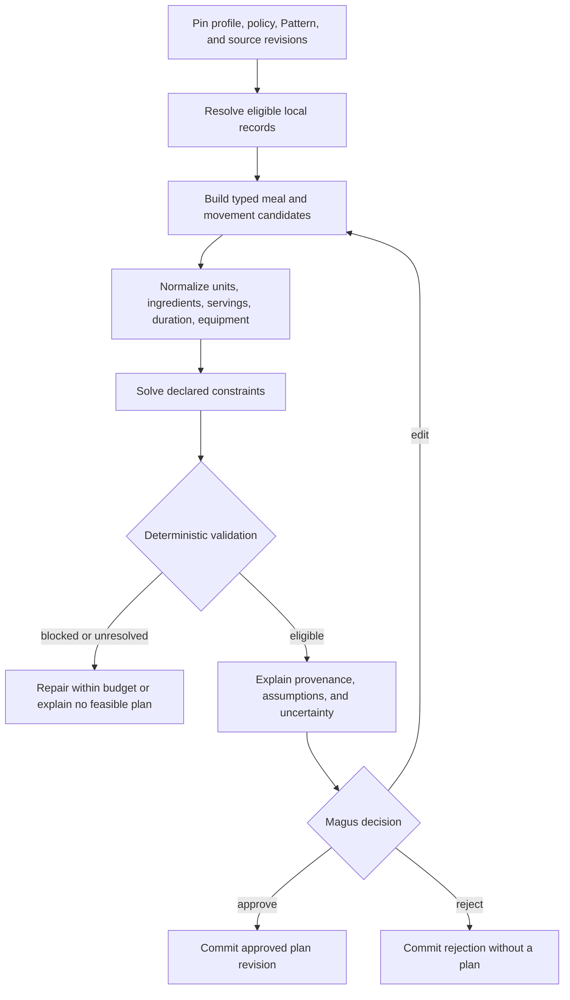

# :material-scale-balance: Health, Food & Movement

!!! warning "Reference design — not a medical product or delivered application"
    Health, Food & Movement is an accepted Composition study. It does not prove that its Patterns,
    schedules, migrations, safety gates, models, mobile interface, or source integrations exist.
    It provides wellness planning and private reflection—not diagnosis, treatment, rehabilitation,
    medication guidance, emergency assessment, or clinical monitoring. [State of the
    Work](../state-of-the-work.md) remains the delivery authority.

**Health, Food & Movement** is a local-first companion for one adult operator who wants to turn
stated preferences, declared restrictions, available time, equipment, and chosen intentions into
an editable meal plan, shopping list, movement plan, and private journal.

Its constitutional relation is:

> **The Mind may propose and explain. Deterministic tools constrain. The Magus decides. The
> Phylactery remembers only what was consented to.**

The Composition tests sensitive domain state, exact validation, source provenance, migration
ownership, schedules, local inference, Portal consent, export, deletion, and non-coercive
interaction. It is not one immortal “health agent.” It is a catalogue of finite, versioned Weaver
Patterns over one deliberately bounded domain.

## Scope and the care boundary

| Category | Meaning here | Allowed behavior |
| --- | --- | --- |
| **Wellness planning** | Meals, shopping, ordinary movement, available time, equipment, preferences, and operator-chosen goals | Propose editable options, normalize units, enforce declared constraints, explain sources and uncertainty |
| **Private journaling** | Deliberately recorded completion, enjoyment, energy, comfort, or reflection | Preserve the operator's words, allow correction/deletion, and optionally create a separate non-diagnostic summary |
| **Personal health records** | User-owned measurements or documents originating from healthcare or personal devices | Future separate, read-only, opt-in custody; preserve origin without clinical interpretation |
| **Diagnosis and treatment** | Disease inference, symptom assessment, medication or supplement advice, rehabilitation, clinical nutrition, treatment, or emergency triage | Outside the Composition; stop and state the boundary |

A journal entry such as “my knee hurt during the walk” is legitimate user-authored truth. Turning
it into an injury diagnosis, rehabilitation plan, or claim that an exercise is safe is not.

The first population is one consenting adult. Children, pregnancy and postpartum planning,
eating-disorder support, injury rehabilitation, medication interaction, clinical conditions,
biomarker interpretation, and emergency monitoring require new evidence, safety, privacy, and
regulatory decisions—not a prompt change.

## Visible promise and non-goals

The operator may:

- define hard restrictions and softer preferences separately;
- choose calorie-free, weight-neutral, and body-measurement-free operation;
- generate a short plan from a pinned local food and movement catalogue;
- inspect assumptions, missing information, source revisions, and unresolved constraints;
- edit, approve, reject, skip, or replace every proposed plan;
- log only observations they choose and review them without a compliance score;
- export the complete personal dataset; and
- revoke schedules and delete the data.

The Composition does not diagnose or prescribe, certify food as allergen-safe, account for kitchen
cross-contact, infer calories from photographs, infer expenditure from movement, analyze form or
gait, purchase food, contact clinicians, share records automatically, punish skipped activities,
or treat silence as adherence, consent, health, or wellbeing.

[Lifestyle Steward](lifestyle-steward.md) may later consume an approved HFM shopping list and one
minimal, purpose-bound `ProvisionConstraintSet`. It owns receipts, household inventory, store
topology, catalogues, carts, orders, and deliveries. It never receives HFM journals, measurements,
symptoms, diagnoses, raw clinical records, or genetic variants merely because both appear in one
Lifestyle projection.

## Composition and anatomical ownership

| Field or concern | Owner / proposed value |
| --- | --- |
| Stable id / revision | `health.food_movement` / `1` |
| Specification owner | `project:lychd`; executable domain owner remains future |
| Purpose | Local-first, operator-approved wellness planning and private reflection |
| Default manual Pattern | `hfm.plan_cycle@1` |
| Support tier | Architecture-only reference; unsupported and non-medical |
| Privacy ceiling | `restricted` |
| Initial principal | One authenticated local Magus |
| Default inference and network policy | Local Soulstone; no personal content leaves Vessel |
| Primary projection | Narrow local Altar surface |
| Domain schemas, repositories, tools, fixtures, and projections | Future coupled first-party module or explicitly installed Extension |
| Enablement, revisions, schedules, dependencies, and Invocations | Weaver |
| Durable personal and source truth | Phylactery under the application owner |
| Unit, allergen, ingredient, constraint, and deletion enforcement | Typed deterministic Tool Animators |
| Human decision | HitL |
| Public source acquisition | Scout, after its delivery |
| Voice and mobile ingress | Walking Communion, Echo, Ward, and Tether—later |
| Image-label ingress | Prism—later |
| Receipt, pantry, retail, restaurant, cart, and order workflow | Lifestyle Steward—later |

Weaver must not absorb personal records, run application migrations, choose raw model names, or
implement domain safety. Generic schedules and Occurrences remain Weaver/Core objects that HFM
references; the Composition does not create a second calendar engine.

## Pattern catalogue

### `hfm.profile_setup@1`

```text
LoadDisclosure
→ SelectFeatureModes
→ EnterHardRestrictions
→ EnterSoftPreferences
→ EnterTimeAndEquipment
→ ReviewNormalizedProfile
→ FreshConsent
→ CommitProfileVersion
```

A profile change creates an immutable version. A hard restriction cannot be relaxed during plan
conversation; relaxation requires a separate edit, confirmation, and new version. “Hard” means
the operator requires enforcement—not that LychD has clinically verified the condition.

### `hfm.plan_cycle@1`



The Soulstone may select among typed candidates, ask questions, and explain. It may not invent a
food identifier, convert incompatible units, declare an unknown ingredient safe, weaken a hard
restriction, or bypass an activity limit. Every candidate pins profile, consent, Pattern, policy,
source-release, deterministic-tool, and provider revisions. Any model-authored edit after
validation must pass validation again.

### `hfm.check_in@1`

```text
ReceiveDraft
→ ParseCandidateFields
→ PreserveOriginalWording
→ ShowNormalizedEntry
→ Confirm
→ CommitOrDiscard
```

Completion, skip, substitution, duration, and reflection are separate fields. Missing check-ins
remain unknown. Pain, injury language, acute symptoms, disordered-eating requests, or other
out-of-scope content may be kept as operator-authored journal text, but it stops automated
progression and does not trigger a treatment plan.

### `hfm.journal@1`

Stores a private, user-authored entry and optional selected tags. A requested summary is a separate
derived record with provenance; it never overwrites or “corrects” the original. Diagnostic
sentiment, psychopathology, adherence, and risk scoring are outside the Pattern.

### `hfm.review_cycle@1`

```text
PinReviewWindow
→ LoadApprovedPlansAndChosenLogs
→ ComputeDeterministicCounts
→ DraftNeutralSummary
→ AskPreferenceQuestions
→ ProposeNextManualPlanIntent
→ CommitReview
```

It may say what was planned and recorded. It may not infer what happened from absence, rank the
operator, manufacture causality, or automatically change the next plan.

### `hfm.export@1` and `hfm.delete@1`

Export produces a principal-bound, documented snapshot of profile versions, consent, preferences,
restrictions, plans, decisions, journals, sources, and derivation records. It excludes secrets and
unrelated Core traces and carries a cutoff, digest, retention, and deletion state.

Deletion requires fresh confirmation and establishes an admission fence:

```text
ConfirmExactScope
→ RevokeSchedulesAndPortalConsent
→ StopNewInvocations
→ DrainAtomicWork
→ DeletePersonalRowsAndArtifacts
→ RemoveDerivedIndexesAndCaches
→ VerifyAbsence
→ CommitContentFreeDeletionReceipt
```

The receipt may retain time, scope, result, and non-reversible proof identifiers—not deleted
content. Backup expiry is disclosed, and restore must reapply deletion tombstones rather than
resurrect personal records.

Later Patterns may add authorized reminders, public-source refresh, and package-label capture.
Walking Communion may route normalized utterances into check-in, journal, or read-only plan query;
HFM never builds a competing audio transport.

## Reusable subgraphs and compute ownership

| Subgraph | Work | Model and tool boundary |
| --- | --- | --- |
| **ProfileAndConsent** | Normalize modes, hard/soft rules, time, equipment, disclosure, and a confirmed immutable version | Deterministic forms, policy tools, and HitL; no Soulstone required |
| **BuildCandidates** | Retrieve pinned food/movement records and form a bounded candidate set | Local catalogue tools first; optional `chat` Soulstone may rank or explain but cannot create authoritative ids |
| **ValidatePlan** | Units, ingredient closure, allergen states, equipment, time, and hard-constraint solution | Deterministic Tool Animators and future Riddle fixtures; model output has no override path |
| **ExplainAndDecide** | State assumptions, sources, uncertainty, infeasibility, and receive edit/approve/reject | Local explanatory Mind plus HitL; every edit returns to validation |
| **RecordObservation** | Preserve original wording, normalize explicit fields, confirm, and commit or discard | Deterministic parser with optional local text extraction; Magus owns the observation |
| **ReviewWindow** | Pin approved records, compute exact counts, draft a neutral bounded summary | Deterministic query/aggregation followed by optional local Mind; absence remains unknown |
| **PersonalDataLifecycle** | Fence, export, delete, verify derivatives/backups, and issue content-free receipt | Application repository, artifact custody, Ward/HitL, and deterministic tools; no model needed |

This mapping prevents a convenient resident Mind from becoming the application database, unit
engine, allergen authority, calendar, or deletion mechanism.

## Scheduling, overlap, and priority

The MVP is manual. It has no ambient loop and no implied duty to report every day. Later schedule
firings create idempotent Weaver Occurrences and enter ordinary admission; a timer never invokes an
Agent, Graph node, or container directly.

| Work | Target priority | Overlap and missed-occurrence law |
| --- | ---: | --- |
| Profile edit, check-in, journal, export, or deletion | `70` | Serialize per profile; stable client idempotency keys |
| Manual plan cycle | `70`, or commissioned `50` | One active draft per profile; only an unapproved draft may be obsoleted |
| Local reminder | `50` | Skip after usefulness window; never replay a backlog |
| Weekly review | `20` | Coalesce to one per period; obey timezone and quiet hours |
| Source refresh and catalogue validation | `20` | Singleton per source release; skip overlap |
| Break-glass maximum | Never automatic | Health language grants neither priority nor authority |

Deletion and export should not wait behind optional GPU work. Deletion fences new domain work but
does not tear an atomic database or external effect in half. Future schedules require explicit
opt-in, visible timezone/DST/quiet-hour semantics, pause/revoke controls, bounded retries, and no
shame, streak loss, or escalating pressure.

Only the integer priority and narrow queue behavior exist today. Latency, overlap, preemption,
deadlines, budgets, and residency are target policy, not current scheduler evidence.

## Capabilities and candidate providers

Research snapshot: **2026-07-22**. Candidates are replaceable Runes, not application identity.

| Need | Contract and candidate | Boundary |
| --- | --- | --- |
| Lightweight conversational Mind | Local `chat`, structured output, tools; [Qwen3-4B-Instruct-2507](https://huggingface.co/Qwen/Qwen3-4B-Instruct-2507) | Apache-2.0 local candidate; pin revision, runtime, quantization, context, host receipt, and tool tests. |
| Shared multimodal Mind | Same text contract; [Gemma 4 12B](https://ai.google.dev/gemma/docs/get_started) | Useful if already resident for Walking Communion or label understanding, but HFM text planning alone does not justify a costly swap. |
| Quantities | Exact decimal, canonical unit codes; [UCUM](https://unitsofmeasure.org/ucum) plus candidate [Pint](https://pint.readthedocs.io/en/stable/) | Pint does not itself prove complete UCUM conformance; incompatible dimensions and unsupported densities fail. |
| Constraint solving | Hard/soft constraints, deterministic seed and limits | Start with a small enumerator; [OR-Tools CP-SAT](https://developers.google.com/optimization/cp/cp_solver) only when integer optimization is justified. |
| Food catalogue | Pinned [FoodData Central](https://fdc.nal.usda.gov/api-guide/) release plus reviewed recipes | Nutrient data is not allergy certification. |
| Movement catalogue | Pinned local subset; [wger](https://wger.readthedocs.io/en/latest/) candidate | Attribution/share-alike and source quality require review; no clinical exercise prescription. |
| Speech | Walking Communion's local `stt` and `tts` | Whisper/Qwen3-ASR and Qwen3-TTS candidates live behind Echo; HFM receives authenticated text. |
| Label transcription | Local `vision`; [Qwen3-VL-4B-Instruct](https://huggingface.co/Qwen/Qwen3-VL-4B-Instruct) | Later Prism candidate; transcribes uncertain label text, never estimates body state, food quantity, calories, or movement form. |

An eligible model still needs a LychD capability receipt, structured-output fixtures, resource
profile, and adversarial evaluation. A model card is not a host receipt.

## Source catalogue and provenance

[FoodData Central downloads](https://fdc.nal.usda.gov/download-datasets/) offer versioned local
CSV/JSON data. A pinned snapshot is reproducible, offline, and does not leak personal queries.
[Open Food Facts](https://openfoodfacts.github.io/openfoodfacts-server/api/) may provide optional
barcode records, but its community data carries no assurance of accuracy or completeness and its
database/content/image licenses must remain attributable. Missing or uncertain fields propagate as
`unresolved`; it is never sole allergen authority.

Allergen taxonomies are jurisdictional. The [European Commission](https://food.ec.europa.eu/food-safety/campaign-2026/allergies_en)
identifies fourteen declarable groups in the EU, while the [FDA](https://www.fda.gov/food/nutrition-food-labeling-and-critical-foods/food-allergies)
describes nine major allergens in the United States. Neither exhausts individual allergies. Locale,
taxonomy revision, and broader operator restrictions remain explicit.

The food gate has three outcomes:

- **blocked:** a restriction matches an ingredient, subingredient, or configured precautionary
  label;
- **unresolved:** ingredient closure, serving basis, cross-contact status, translation, identity,
  or source agreement is incomplete; and
- **eligible:** no known restriction matched in the available record.

The UI never renders “eligible” as “safe.” Preparation, substitutions, cross-contact, and
manufacturer changes remain outside knowledge.

For movement, wger may supply identities and equipment metadata if its AGPL/CC-BY-SA obligations
fit the selected boundary. The [Adult Compendium of Physical
Activities](https://pacompendium.com/adult-compendium/) and [WHO guidance](https://www.who.int/publications/i/item/9789240014886)
may inform attributed educational context only after reuse review. MET values are not personalized
calorie-burn truth, and population guidance is not an individual prescription.

Every source release records identity, URI, record id, release, retrieval time, digest, schema,
license, locale, importer and normalization revisions, quality flags, and supersession. Refresh
imports beside existing data and promotes explicitly; historical plans retain their pinned source.
Scout must never place personal restrictions or journal text into public source queries.

## Deterministic tool law

### Units

- Use decimal arithmetic and canonical codes; preserve original and normalized quantities.
- Reject dimensionally incompatible conversions.
- Never convert volume to mass without a sourced ingredient-specific density.
- Keep “per serving,” “per 100 g,” and “whole package” distinct.
- Pin serving basis and yield and bound values, precision, multiplication, and aggregates.

### Ingredients and allergens

- Preserve original text while normalizing aliases.
- Traverse ingredients and subingredients to a finite depth.
- Represent `contains`, precautionary `may contain`, absent declaration, and unknown separately.
- Treat incomplete closure and conflicting sources as unresolved.
- Treat embedded free text as hostile data, never policy.
- Revalidate after every substitution.

### Plan solving

Declared allergens, exclusions, equipment, time windows, and operator maxima are hard constraints;
variety, convenience, and cost hints are soft. An unsatisfiable set returns “no feasible plan under
these inputs.” The solver never violates the least convenient hard rule. A model may explain the
conflict and invite a separate confirmed profile edit.

Any future movement progression is an operator-selected bounded rule over confirmed logs—not a
claim of medical safety—and stops when pain or injury is recorded.

## Durable data and migrations

Avoid one generic `health_record` JSON blob. Candidate records include immutable profile versions,
restrictions/preferences, source releases and normalized catalogues, immutable plan revisions,
decisions and edits, check-ins, journals, separately derived summaries, schedule references,
export artifacts, deletion fences, and content-free receipts.

Every record distinguishes `user_entered`, `source_imported`, `model_proposed`,
`deterministically_derived`, and `user_confirmed`. Derived facts carry parents and derivation
revision; model prose is never rewritten as operator-authored truth.

The application owner—not an undifferentiated Core table—owns its schema. Before implementation,
LychD must establish extension or coupled-module migration law covering owner/package/Core
versions, ordering, clean install, forward upgrade, interrupted upgrade, restore, uninstall,
parked-Invocation compatibility, export/deletion, and the absence of orphaned schedules,
artifacts, credentials, or rows. A safe first posture is forward-only personal-schema evolution
with preflight and backup/restore, while source releases remain immutable side-by-side imports.

## Privacy, consent, and authority

| Class | Examples |
| --- | --- |
| Public/reference | Public guidance and dataset release metadata |
| Private | Preferences, shopping list, and approved plan |
| Restricted | Allergies, measurements, journals, check-ins, imported records, audio, and images |
| Secret | Portal credentials, source keys, and signing keys |

Local storage and inference are defaults. Separate revocable consent is required for calorie or
weight features, Portal inference by named provider/purpose, live external lookup, reminders,
microphone/image retention, personal-record import, sharing/export to another principal, and any
research or training use—which defaults to never.

Consent does not transfer between purposes. Portal consent is scoped by provider, capability,
data class, purpose, and duration; there is no silent remote fallback. Logs redact restricted
payloads. Audio/images are ephemeral by default, while embeddings, caches, summaries,
checkpoints, exports, and backups enter the same deletion inventory as their source.

The current fixed local `magus:*` Sigil is not multi-user identity or remote authorization. The
first slice remains same-host and single-principal until Ward proves credential, object-policy,
revocation, and replay boundaries.

## Riddle and adversarial proof

Mandatory invariants include hard-over-soft constraints, unknown remaining unknown, no manual
override tool for a model, a separate confirmed restriction edit, explicit plan approval, missing
logs remaining unknown, fully optional body metrics, no shame or coercion, no clinical claim, pain
stopping automatic progression, and local inference failure never causing remote egress.

A future Riddle set should prove hidden aliases and nested ingredients block; precautionary labels
and missing ingredients remain unresolved; invalid mass/volume and serving conversions fail;
impossible constraints violate nothing; injections in recipes, labels, or journals gain no
authority; source upgrades do not rewrite history; out-of-scope clinical requests stop; DST
schedule retry emits one occurrence; disabled Portal fails closed; and deletion during parked work
cannot resurrect content.

Riddle is currently doctrine rather than a delivered harness, so these are target acceptance
tests—not claims of present safety.

## Voice, image, and mobile boundary

[Walking Communion](walking-communion.md) owns authenticated push-to-talk and routes a normalized
Intent into HFM. Transcript preview and correction precede a committed check-in; plan approval,
export, deletion, sharing, or Portal use requires fresh visual/touch confirmation. Voice is not
identity, authority, consent, or proof of comprehension.

Prism may later turn a package image into a hostile candidate label with coordinates and
uncertainty. Original bytes, missing regions, serving basis, language, ingredient closure, and
operator correction remain explicit. Photo-based food quantity, calories, body, wound, gait, or
exercise-form analysis stay excluded.

## Smallest proving slice

Using only a synthetic adult profile and small reviewed local catalogue:

1. create a versioned profile with hard restrictions, preferences, time, and equipment;
2. support fully calorie-free and weight-neutral operation;
3. generate a three-day meal and ordinary-movement plan;
4. reject every seeded allergen and activity conflict independently of model output;
5. propagate incomplete ingredients and incompatible units as unresolved;
6. show source release, assumptions, uncertainty, and validation;
7. edit, approve, reject, skip, and optionally check in;
8. export all synthetic personal records in a documented form;
9. delete rows, derivations, checkpoints, caches, and artifacts and verify absence;
10. prove clean install, migration, restart, and selected recovery on fixture databases; and
11. pass adversarial tests with network disabled.

No schedule, reminder, browsing, Portal, audio, image, wearable, biomarker, health-record import,
child profile, pregnancy, eating-disorder, clinical, medication, rehabilitation, or emergency
behavior belongs in this slice.

## Staged roadmap

1. **Law and fixtures:** domain boundary, records, privacy classes, source licenses, units,
   three-state allergen logic, synthetic data, and Riddle cases.
2. **Deterministic local slice:** profile, catalogues, solver, validation, editing, journal, export,
   deletion, and migration evidence without a model.
3. **Local explanatory Mind:** one tool-capable Soulstone for questions and neutral explanation,
   always downstream of deterministic rejection.
4. **Single-operator private use:** real local data only after retention, redacted evidence,
   recovery, and deletion are proved.
5. **Schedules:** weekly review and non-coercive reminders after Weaver Occurrences, quiet hours,
   coalescing, revocation, and Attention projection exist.
6. **Walking interaction:** voice check-in through Walking Communion after Ward/Tether/Echo proof.
7. **Label capture:** bounded Prism transcription after byte custody and deletion exist.
8. **Optional record vault:** read-only import only after separate sensitive-data and
   interoperability law. [FHIR R5](https://hl7.org/fhir/R5/) supplies exchange resources, not
   clinical interpretation, safety evidence, compliance, or egress authority.
9. **Clinical expansion:** an independently governed project with qualified review, evidence,
   regulatory analysis, monitoring, and incident response—not an incremental feature.

## Current delivery gaps

Current Weaver has one internal Bridge Pattern rather than Composition contribution. Graph proves
typed sequential execution and narrow checkpointing, not the full policy vector. Phylactery lacks
accepted application-owned migration and sensitive-data lifecycle. Scheduling and Occurrences are
architectural. Riddle, Scout, Echo, mature Ward authorization, complete Prism bytes, audio
transport, STT/TTS binding, and Mobile Emissary are not delivered. `ArtifactRef` is metadata rather
than complete byte custody, and current Loopback/local Sigils do not authorize remote use.

## Continue

- Return to the [Reference Composition Portfolio](index.md) for the application map.
- Read [Weaver](../sepulcher/extensions/weaver.md) for Pattern and schedule jurisdiction.
- Read [Phylactery](../sepulcher/phylactery/index.md) before claiming durable personal data.
- Read [Riddle](../sepulcher/extensions/riddle.md) for outcome-based evaluation.
- Read [Walking Communion](walking-communion.md) before adding voice or mobile ingress.
- Read [Lifestyle Steward](lifestyle-steward.md) before adding receipts, inventory, merchant
  catalogues, restaurants, carts, or purchase effects.
