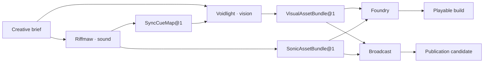

# :material-shape-outline: Compositions

A Composition is a job the Magus can recognize from beginning to end. It owns the purpose,
application records, policies, and finish condition; versioned Patterns carry that purpose through
LychD's common machinery.

This distinction keeps the Portfolio useful. Search, email, audio, a tunnel, a model, and a
container can all help an application, but none becomes an application merely by being reusable.

## The application test

A page belongs in the Portfolio when all three answers are concrete:

1. **What human purpose finishes here?** The result is more specific than “send,” “search,”
   “generate,” or “run a model.”
2. **Which truth does it own?** Its records and judgments have a domain home rather than living in
   chat history or a generic helper.
3. **How can it stop honestly?** Refusal, partial completion, unknown effects, restart, and recovery
   are part of the contract.

| Term | Office |
| --- | --- |
| **Composition** | operator-visible application purpose, records, policies, projections, effects, and Pattern catalogue |
| **Native Reference Composition** | first-party supported application contract and worked example |
| **Pattern** | one immutable executable score owned by a Composition |
| **Invocation** | one admitted performance of an exact Pattern revision |
| **Suite** | versioned coordination of separate Compositions through typed handoffs |
| **Extension** | a governed way for implementation to enter LychD; never an application by itself |

Portfolio membership accepts an application contract; it does not claim executable delivery. The
Portfolio is the grand design LychD is approaching; the canonical
[State of Work Portfolio boundary](../state-of-the-work.md#composition-portfolio-delivery) records
what has entered matter. A leaf mentions delivery only where that fact changes how its contract
should be read.

A Composition identity is a URL-safe key plus a separate revision, written here as
`example.application` revision `1`. Pattern identity remains separately versioned, for example
`example.perform_work@1`.

## The Portfolio

| Composition | It finishes with |
| --- | --- |
| [Voidlight](voidlight/index.md) | an attributable visual asset package |
| [Riffmaw](riffmaw/index.md) | an attributable sonic package and optional synchronization map |
| [Foundry](foundry/index.md) | a reproducible, playtested local build candidate |
| [Broadcast](broadcast/index.md) | a source-grounded local publication candidate |
| [Wellbeing](wellbeing/index.md) | an editable eating-or-fitness plan, honest infeasibility, or confirmed check-in |
| [Homestead](homestead/index.md) | a legible place or stores ledger, household provision result, bounded work order, or safely refused effect |
| [Scavenger](scavenger/index.md) | an evidence-bound acquisition campaign, shortlist, bargain, commitment, parcel result, or diligence packet |
| [Broker](broker/index.md) | a client answer grounded in current product knowledge, prepared act, human handoff, or exact blocker |
| [Blockworld](blockworld/index.md) | one finite mission whose world effects are verified and recoverable |
| [Reach](reach/index.md) | one bounded social turn, summon, or admitted presence effect |

[Communion](communion/index.md) remains a reference mobile route into these applications, not a
Composition of its own.

## Reuse without a universal helper

| Mechanism | What remains with the Composition |
| --- | --- |
| Scout search, fetch, render, or crawl | source policy, interpretation, ranking, and consequence |
| mail or platform delivery | recipient purpose, disclosure, approval, reply meaning, and follow-up |
| audio or vision processing | admitted source, domain interpretation, retention, and creative or operational judgment |
| Tether or Veil | application identity, object grants, and every consequential effect |
| Legion node or embedded body | task purpose, while the body keeps fresh safety admission and refusal |
| model or tool provider | application truth, decision policy, and authority |

Typed requests, observations, artifact references, and receipts may cross those seams. Ambient
database access, credentials, Sigils, provider sessions, and domain judgment do not.

Scavenger keeps irregular listing campaigns, seller negotiation, major commitments, parcels, and
property diligence. Homestead owns the bounded place and its recurring provision, whether stock
arrives from a supermarket or a field. Wellbeing owns eating, ordinary movement, and private
reflection. Typed inventory, food-need, and provision-result handoffs connect the last two without
moving merchant credentials, health records, private constraints, or effect authority.

## Suites do not dissolve their members

A Suite pins eligible Composition and Pattern revisions, declares typed ArtifactRef or Intent
handoffs, carries correlation and aggregate ceilings, and states partial-completion policy. It owns
no member records, secrets, Sigils, provider grants, consent, or effect authority.

The diagram is a designed handoff, not an executor. Weaver must still settle child identity,
revision closure, budgets, cancellation, Stasis, retry, effect receipts, compensation, and honest
partial completion before a Suite can run.

## How a leaf should read

Every Composition leaf answers the same practical questions without reproducing an ADR:

- identity, representative or default Pattern catalogue, application inputs, possible outcomes,
  and stopping line;
- one representative journey rather than a catalogue of imagined features;
- the records and typed handoffs that make the result attributable;
- the few authority, privacy, effect, and recovery boundaries that shape this application;
- a local delivery note only when present implementation materially changes interpretation; and
- the smallest fixture that could prove the contract.

There is no Crypt `compositions/` loader and no Markdown discovery path. The current source
registry and Loom prove only the bounded material recorded in
[State of Work](../state-of-the-work.md#loom-workflow-views); a live Portfolio store, application
selection, Suite execution, and scheduling remain designed.

Continue with [Workflow](../adr/28-workflow.md), then choose the application whose finish condition
matches the work.
