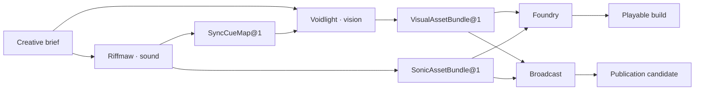

# :material-shape-outline: Compositions

A Composition is a reusable native application capability. It owns domain records, judgment,
policies, effects, and its Pattern catalogue independently of any one Product, customer, or
deployment. Versioned Patterns carry that truth through LychD's common machinery.

This distinction keeps the Portfolio useful. Search, email, audio, a tunnel, a model, and a
container can all help a Composition, but none becomes one merely by being reusable. A named
[Product](#products-package-compositions) selects one or more Compositions for a concrete profession
or market; a concrete use case states the job that Product helps its operator finish.

## The Composition test

A page belongs in the Portfolio when all three answers are concrete:

1. **Which reusable application capability lives here?** Its truth survives more than one Product,
   client, or deployment.
2. **Which truth does it own?** Its records and judgments have a domain home rather than living in
   chat history or a generic helper.
3. **Which outcomes can its Patterns settle honestly?** Refusal, partial completion, unknown
   effects, restart, and recovery remain part of the contract even when a Product presents them.

| Term | Office |
| --- | --- |
| **Composition** | reusable application capability owning domain records, judgment, policies, projections, effects, and a Pattern catalogue |
| **Product** | named professional or market package selecting one or more Compositions or Suites, profiles, projections, and concrete use cases |
| **Native Reference Composition** | first-party supported reusable application contract and worked example |
| **Pattern** | one executable-score family owned by a Composition; each immutable revision is a Scroll |
| **Scroll** | one whole immutable Pattern revision made of one or more Spell placements and their paths |
| **Spell** | one independently named semantic action contract placed at a Scroll station; its name grants no capability or authority |
| **Invocation** | one admitted Circle in which an exact Scroll may be cast |
| **Casting** | the performance of that exact Scroll within the Invocation |
| **Suite** | versioned coordination of separate Compositions through typed handoffs |
| **Extension** | a governed way for implementation to enter LychD; never an application by itself |

Portfolio membership accepts a reusable application contract; it does not claim executable
delivery. The Portfolio is the grand design LychD is approaching; the canonical
[State of Work Portfolio boundary](../state-of-the-work.md#composition-portfolio-delivery) records
what has entered matter. A leaf mentions delivery only where that fact changes how its contract
should be read.

When a native first-party Composition enters code, its authoritative records, policies, and finish
judgment live under `src/lychd/compositions/<identity>/**`. A browser or Android projection lives
under its `clients/<target>/**` project and cannot silently acquire that authority.

A Composition identity is a URL-safe key plus a separate revision, written here as
`example.application` revision `1`. Pattern identity remains separately versioned, for example
`example.perform_work@1`.

## The Portfolio

| Composition | Representative outcomes |
| --- | --- |
| [Voidlight](voidlight/index.md) | an attributable visual asset package |
| [Riffmaw](riffmaw/index.md) | an attributable sonic package and optional synchronization map |
| [Foundry](foundry/index.md) | a reproducible, playtested local build candidate |
| [Broadcast](broadcast/index.md) | a source-grounded local publication candidate |
| [Wellbeing](wellbeing/index.md) | an editable eating-or-fitness plan, honest infeasibility, or confirmed check-in |
| [Homestead](homestead/index.md) | a legible place or stores ledger, household provision result, bounded work order, or safely refused effect |
| [Scavenger](scavenger/index.md) | an evidence-bound acquisition campaign, shortlist, bargain, commitment, parcel result, or diligence packet |
| [Broker](broker/index.md) | a client answer grounded in current product knowledge, prepared act, human handoff, or exact blocker |
| [Blockworld](blockworld/index.md) | one finite mission whose world effects are verified and recoverable |
| [Reach](reach/index.md) | one bounded social turn, summon, or admitted presence effect |
| [Avatar](avatar/index.md) | one attributable Lich presentation projected into one or more separately admitted places, with honest partial settlement |
| [Spectre](spectre/index.md) | one admitted VR Habitat and bounded Encounter that completes, exits safely, or names its interruption |
| [Familiar](familiar/index.md) | one admitted physical body and bounded mission that follows, observes, speaks, and settles honestly |

## Candidate studies

Candidate studies test the application boundary without entering the Portfolio or implying
delivery. [Workshop](workshop/index.md) tests one evidence-driven technical-service capability;
**Mechanic** is the first Product that packages its passenger-vehicle profile.

[Communion](communion/index.md) remains a reference mobile route into these applications, not a
Composition or Product of its own.

## Products package Compositions

A Product is the named thing an operator recognizes and a business can offer for a profession or
market. It selects exact eligible Composition or Suite revisions, service profiles, projections,
supported use cases, defaults, and a delivery and support envelope. `Voidlight` remains a
Composition; a profession- or market-specific offer that packages its visual capability is a
Product. `Mechanic`, for example, packages Workshop's passenger-vehicle service profile; if it also
offers part sourcing, a Suite coordinates the typed handoff to Scavenger.

The Product owns that customer promise and packaging. It owns no Composition records, domain
judgment, secrets, Sigils, consent, or effect authority, and it is not another scheduler or
executor. A Suite remains the technical coordination contract when several Compositions must run;
a deployment remains one configured installation of the Product. Neither is a synonym for Product.

## Reuse without a universal helper

Distinct Composition names are semantic ownership boundaries, not claims of separate engines or
separately sold Products. Their pages keep owned truth, judgment, outcomes, and recovery explicit,
then link common mechanisms instead of restating them.

| Mechanism | What remains with the Composition |
| --- | --- |
| Scout search, fetch, render, or crawl | source policy, interpretation, ranking, and consequence |
| mail or platform delivery | recipient purpose, disclosure, approval, reply meaning, and follow-up |
| audio or vision processing | admitted source, domain interpretation, retention, and creative or operational judgment |
| Tether or Veil | application identity, object grants, and every consequential effect |
| Legion node or embedded body | task purpose, while the body keeps fresh safety admission and refusal |
| model or tool provider | application truth, decision policy, and authority |

Typed requests, observations, artifact references, and receipts may cross those seams. Ambient
database access, credentials, Sigils, provider sessions, and domain judgment do not.

Scavenger keeps irregular listing campaigns, seller negotiation, major commitments, parcels, and
property diligence. Homestead owns the bounded place and its recurring provision, whether stock
arrives from a supermarket or a field. Wellbeing owns eating, ordinary movement, and private
reflection. Typed inventory, food-need, and provision-result handoffs connect the last two without
moving merchant credentials, health records, private constraints, or effect authority.

Avatar keeps one Lich presentation profile and bounded multi-projection presence across separately
admitted places; Reach retains each external social turn, Blockworld each persistent-world mission
and effect, and Spectre each VR Habitat, Encounter, and safe exit. Avatar coordinates presentation
and projection settlement but receives no universal world, device, or body authority.

## Suites do not dissolve their members

A Suite pins eligible Composition and Pattern revisions, declares typed ArtifactRef or Intent
handoffs, carries correlation and aggregate ceilings, and states partial-completion policy. It owns
no member records, secrets, Sigils, provider grants, consent, or effect authority.

The diagram is a designed handoff, not an executor. Spellweaver must still settle child identity,
revision closure, budgets, cancellation, Stasis, retry, effect receipts, compensation, and honest
partial completion before a Suite can run.

## How a leaf should read

Every Composition leaf answers the same practical questions without reproducing an ADR:

- identity, representative or default Pattern catalogue, application inputs, possible outcomes,
  and stopping line;
- one representative journey rather than a catalogue of imagined features;
- the records and typed handoffs that make the result attributable;
- the few authority, privacy, effect, and recovery boundaries that shape this application;
- a local delivery note only when present implementation materially changes interpretation; and
- the smallest fixture that could prove the contract.

There is no Crypt `compositions/` loader, Product catalogue, or Markdown discovery path. The
current source registry and Loom prove only the bounded material recorded in
[State of Work](../state-of-the-work.md#loom-workflow-views); a live Portfolio store, application
selection, Product selection, Suite execution, and scheduling remain designed.

Continue with [Workflow](../adr/28-workflow.md), choose the Composition whose domain truth owns the
work, then name the Product and concrete use case that present it.
