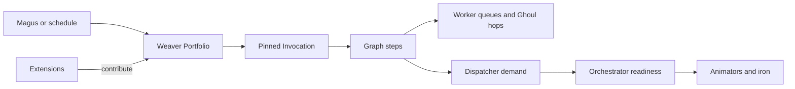

# :material-source-branch: Reference Compositions

!!! warning "Architecture portfolio — not delivered applications"
    These pages describe accepted application directions and the contracts by which they may enter
    LychD. They do not prove that their Patterns, models, clients, migrations, or effects exist.
    [State of the Work](../state-of-the-work.md) remains the delivery authority.

A **Reference Composition** is an operator-visible workflow application assembled from Patterns,
Agents, capabilities, policies, data, and optional Extension contributions. It is what the Magus
enables and uses; an Extension is only one way its implementation enters the body.

The living Portfolio uses this distinction:

```text
Extension  = how code, schemas, tools, and integrations enter LychD
Composition = the complete application the Magus operates
Pattern     = one versioned workflow the application can perform
Invocation  = one admitted execution of that Pattern
```

## Initial portfolio

| Composition | Primary Patterns | Principal proving pressure |
| --- | --- | --- |
| [Voidlight Studio](voidlight-studio.md) | research, article/script, media forge, review, correction, publication | Artifacts, provenance, heterogeneous model swaps, bounded repair, and external effects |
| [Minecraft Agent Server](minecraft-agent-server.md) | bounded mission, social turn, recovery, snapshot | Embodiment, persistent world truth, deterministic control, idempotent effects, and finite agency |
| [Health, Food & Movement](health-food-and-movement.md) | plan, check-in, journal, review, export/delete | Sensitive data, deterministic safety, schedules, migration ownership, and local-first inference |
| [Walking Communion](walking-communion.md) | voice turn, clarification, note capture, routed command | Mobile ingress, authenticated audio, reflex priority, interruption, and cross-Composition routing |

These are first-party reference designs. They exist to prove a general Composition law that a
private Crypt Extension or future independent package can also use. They are not activated merely
because their documentation ships.

## One Weaver, many applications

The Weaver is the singular logical application control plane. It may present the Portfolio,
register immutable Pattern revisions, admit Invocations, interpret schedules and triggers, and
govern logical priority, overlap, dependencies, budgets, pause, drain, and retirement.

That does not make it the physical Orchestrator:



- Weaver controls **purpose and logical time**.
- Worker queues control **durable delivery, claims, and retry**; Ghouls carry individual execution
  hops.
- Dispatcher controls **semantic capability selection**.
- Orchestrator controls **physical readiness and transitions**.
- Extensions own **their contribution implementation and schemas**; Phylactery, Ward, Vessel, and
  the relevant domain still own data custody, authorization, routing, and effects.

## Provider and model rule

A Composition specifies capabilities, not fashionable model names. A Pattern may require local
audio transcription, tool-aware reasoning, multi-reference image editing, or audio-driven video.
An operator profile binds those requirements to eligible Soulstones, Portals, and deterministic
Tool Animators.

Every model named in these pages is therefore one researched candidate with a dated source,
license, resource envelope, and known limitation. It is not part of the Composition's identity.

## Work policy

One integer cannot express every scheduling decision. Each Composition study therefore records:

| Policy | Meaning |
| --- | --- |
| **Urgency** | Target doctrine priority is `0..100`, higher is hotter; configured route defaults obey it, but raw `Intent.priority` is not yet bounded at admission. |
| **Latency class** | Reflex, interactive, commissioned batch, background, or metabolic. |
| **Preemptibility** | Immediate local stop, safe after an atomic step, or only after an effect receipt. |
| **Overlap** | Parallel, queue, coalesce, skip, or replace another occurrence. |
| **Budget** | Limits on time, tokens, money, storage, actions, generations, and retries. |
| **Residency preference** | Warm required, warm preferred, or cold activation acceptable. |

Only the current priority and narrow queue/runtime behavior have entered matter. The fuller policy
vector is an architectural target and must not be presented as a working scheduler.

## Illustrative single-host Portfolio

The operator's intended shape—Minecraft remaining alive while Studio commissions, personal
reviews, and walking voice turns interleave—does not require four continuously resident Minds.
One possible 24 GB profile is:

| Composition work | Logical class | Warm/cold preference | Interruption boundary |
| --- | --- | --- | --- |
| Walking utterance | Proposed reflex `80` | Small Ear and Voice resident if possible; interactive Mind warm preferred | After the current atomic lease; never tear an effect in half |
| Health manual turn | Interactive `70` | Reuse the local structured-text Mind; deterministic tools stay CPU-resident | After deterministic transaction or model call |
| Minecraft conversation | Interactive `70` | Reuse the same Mind; server, Sentinel, and bridge stay CPU-resident | After one verified game action receipt |
| Minecraft mission | Ordinary `50` | Acquire Mind for one decision, then release during pathing/waiting | Between verified actions |
| Voidlight production | Commissioned `50` | Load image/video/voice for approved batches, then unload | At artifact or cancelled-provider boundary |
| Reviews, indexing, reminders, snapshots | Background `20` | Warm-only preference; no disruptive cold swap | Coalesce, skip, or park |

An authenticated voice turn can therefore close admission to conflicting background work, wait for
the active lease to reach a safe boundary, request the audio/text substrate, answer, and then let
production resume. Its urgency does not grant permission to publish, delete health records, alter
Minecraft administration, or kill a generation that has no safe cancellation contract.

Candidate Runes may bind several roles to one model when the measured host supports them—for
example, one audio-aware local Mind for voice, text planning, and visual review—or bind every role
to a smaller specialist. The Composition asks for current capability families such as `chat`,
`vision`, `stt`, `tts`, or `tool_execution` with required tool ids such as `image.generate` and
`video.generate.image`. Dispatcher selects an eligible Animator; Orchestrator decides how that
selected Soulstone becomes physically ready. Gemma, Qwen, Wan, FLUX, and other names remain
provider-profile choices.

## Descriptor shape

The eventual contribution should be declarative enough for Weaver to inspect before admission.
This sketch is a design aid, not accepted TOML syntax or a current API:

```toml
[composition]
id = "example.application"
revision = "1"
owner = "extension:example"
support_tier = "experimental"
default_pattern = "example.manual@1"

[[composition.patterns]]
id = "example.manual@1"
priority = 50
latency = "commissioned"
overlap = "queue"
preemptibility = "after_effect_receipt"

[[composition.patterns.requirements]]
capability = "chat"
modalities_in = ["text"]
structured_output = true
privacy_ceiling = "private"

[composition.patterns.budget]
wall_seconds = 900
model_calls = 12
tool_effects = 20
```

Schedules, domain configuration, provider/model Runes, secrets, workload manifests, and personal
records remain separate owned objects referenced by stable ids. They must not be hidden inside one
untyped Composition blob.

## Composition page contract

Each application page carries:

1. visible intent and non-goals;
2. Pattern and subgraph inventory;
3. capability requirements and researched provider candidates;
4. logical priority, schedule, overlap, and preemption policy;
5. ownership across Weaver, Extensions, Animators, workloads, data, artifacts, and interfaces;
6. migration, provenance, retention, export, deletion, and recovery boundaries;
7. authority, privacy, safety, and external-effect gates;
8. the smallest proving slice and staged roadmap; and
9. explicit gaps between architecture and current delivery.

An application earns no private ADR merely because it exists. A new ADR is warranted only when it
discovers reusable law, such as managed-workload lifecycle, artifact custody, sensitive-data
governance, or a new trust boundary.

## Continue

- Read [Weaver](../sepulcher/extensions/weaver.md) for the workflow jurisdiction.
- Read [Weaver](../sepulcher/extensions/weaver.md) and [Workflow](../adr/28-workflow.md) for the
  governing workflow law.
- Enter the [Incubator](../incubator/index.md) for possibilities that have not joined this
  Portfolio.
