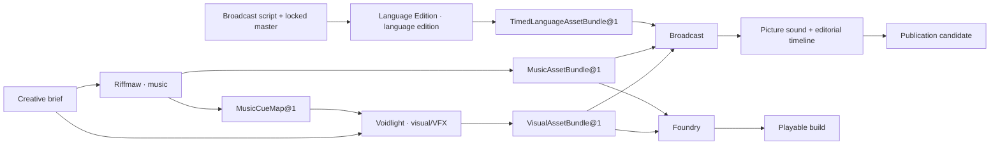

# :material-shape-outline: Compositions

A Composition is a reusable native application capability. It owns domain records, judgment,
policies, effects, and its Pattern catalogue independently of any one Product, customer, or
deployment. Versioned Patterns carry that truth through LychD's common machinery.

This distinction keeps the Portfolio useful. Search, email, audio, a tunnel, a model, and a
container can all help a Composition, but none becomes one merely by being reusable. A named
[Product](#products-package-compositions) selects one or more Compositions for a concrete profession
or market; a concrete use case states the job that Product helps its operator finish.

Portfolio membership is design truth, not executable delivery. The Portfolio is the grand design
LychD is approaching; the canonical [State of Work Portfolio
boundary](../state-of-the-work.md#composition-portfolio-delivery) records what has entered matter.
A leaf mentions delivery only where that fact changes how its contract should be read.

| Your question | Continue with |
| --- | --- |
| What is LychD meant to automate? | browse the [Portfolio](#the-portfolio) and its Composition leaves |
| Where should my new idea live? | [Choosing a Home](choosing-a-home.md) |
| How do Products, dependencies, and Suites fit? | [Products and Suites](products-and-suites.md) |
| What works in this revision? | [State of Work](../state-of-the-work.md) |

## The Composition test

A page belongs in the Portfolio when all three answers are concrete:

1. **Which reusable application capability lives here?** Its truth survives more than one Product,
   client, or deployment.
2. **Which truth does it own?** Its records and judgments have a domain home rather than living in
   chat history or a generic helper.
3. **Which outcomes can its Patterns settle honestly?** Refusal, partial completion, unknown
   effects, restart, and recovery remain part of the contract even when a Product presents them.

| Term | Office |
| --- | --- |
| **Composition** | reusable application capability owning domain records, judgment, policies, projections, effects, and a Pattern catalogue |
| **Product** | named professional or market package selecting one or more Compositions or Suites, owner-qualified profiles, projections, and concrete use cases |
| **Product Revision** | immutable pin of that stable Product promise; changed pins, profiles, use cases, defaults, or support policy create a revision, while a materially different promise creates a Product identity |
| **Use case** | one concrete class of operator job a Product promises to support; not a Pattern, Run, or deployment |
| **owner-qualified `<kind>` profile** | a versioned specialization that names its owner and profile kind while preserving the same records, authority, recovery, and finish judgment |
| **Native Reference Composition** | first-party maintained reusable application contract and worked example |
| **Pattern** | one executable-score family owned by a Composition; each immutable revision is a Scroll |
| **Scroll** | one whole immutable Pattern revision made of one or more Spell placements and their paths |
| **Spell** | one independently named semantic action contract placed at a Scroll station; its name grants no capability or authority |
| **Invocation** | one admitted Circle in which an exact Scroll may be cast |
| **Casting** | the performance of that exact Scroll within the Invocation |
| **Suite** | versioned live coordination of separate Composition-owned Invocations through typed handoffs |
| **Deployment** | one configured installation of an exact Product revision for one operator |
| **Extension Domain** | one of the fifteen stable jurisdictions that receives mechanisms and keeps their semantic and authority boundary; never an application by itself |
| **extension package** | one explicitly selected code/distribution unit that may submit separately governed Contributions to several Domains |
| **Contribution** | one typed addition admitted by its owning Extension Domain; it neither widens its package nor creates application ownership |
| **Provider** | one concrete engine or service implementing a typed contract; provider identity and readiness do not grant application purpose or effect authority |
| **Manifestation** | the concrete form an Extension Domain takes in one body/profile, distinct from a Composition consuming its contracts |

When a native first-party Composition enters code, its authoritative records, policies, and finish
judgment live under `src/lychd/compositions/<identity>/**`. A browser or Android projection lives
under its `clients/<target>/**` project and cannot silently acquire that authority.

A Composition identity is a URL-safe key plus a separate revision, written here as
`example.application` revision `1`. Pattern identity remains separately versioned, for example
`example.perform_work@1`.

Design publication is not delivery evidence, but revision law still applies before source exists:
a material change to a published Composition, Pattern, or record contract advances its identity or
revision instead of rewriting the old contract in place. State of Work separately confirms that no
Portfolio Pattern is registered or executable today.

## The Portfolio

The first-party Portfolio is curated to grow more slowly than Products, use cases, profiles, and
Deployments, but it is not a closed universe or a numerical target. The following **reader views**
are non-exclusive ways into the same accepted Portfolio. They own no records, identity, namespace,
dependency, admission, maturity, or runtime selection; every Composition retains one canonical
leaf and may be linked from several views.

| Reader view | Composition | Representative outcomes |
| --- | --- | --- |
| **Creative Works** | [Voidlight](voidlight/index.md) | an attributable visual/VFX asset package |
| **Creative Works** | [Riffmaw](riffmaw/index.md) | an attributable musical work, production package, and optional musical cue map |
| **Creative Works** | [Language Edition](language-edition/index.md) | an attributable same- or cross-language timed-media edition with constrained track replacement |
| **Creative Works** | [Foundry](foundry/index.md) | a reproducible, playtested local build candidate |
| **Creative Works** | [Broadcast](broadcast/index.md) | a source-grounded local publication candidate |
| **Stewardship & Acquisition** | [Wellbeing](wellbeing/index.md) | an editable eating-or-fitness plan, honest infeasibility, or confirmed check-in |
| **Stewardship & Acquisition** | [Homestead](homestead/index.md) | a legible place or stores ledger, household provision result, bounded work order, or safely refused effect |
| **Stewardship & Acquisition** | [Scavenger](scavenger/index.md) | an evidence-bound acquisition campaign, shortlist, bargain, commitment, parcel result, or diligence packet |
| **Presence & Embodiment** | [Blockworld](blockworld/index.md) | one finite mission whose world effects are verified and recoverable |
| **Presence & Embodiment** | [Reach](reach/index.md) | one bounded social turn, summon, or admitted presence effect |
| **Presence & Embodiment** | [Avatar](avatar/index.md) | one attributable Lich presentation projected into separately admitted places, with honest partial settlement |
| **Presence & Embodiment** | [Spectre](spectre/index.md) | one admitted VR Habitat and bounded Encounter that completes, exits safely, or names its interruption |
| **Presence & Embodiment** | [Familiar](familiar/index.md) | one admitted physical body and bounded real-world task or presence that settles honestly |
| **Presence & Embodiment** | [Companion](companion/index.md) | a configurable mobile client and bounded device session over one exact admitted phone-shaped Familiar body |
| **Professional Operations** | [Broker](broker/index.md) | a client answer grounded in current offer knowledge, prepared act, human handoff, or exact blocker |

## Candidate studies

Candidate studies test the application boundary without entering the Portfolio or implying
delivery. [Workshop](workshop/index.md) tests one evidence-driven technical-service capability;
**Mechanic** is the proposed first Product if Workshop is accepted into the Portfolio with that
passenger-vehicle profile.

Communion remains a bounded mobile interaction route inside [Companion](companion/index.md), not a
separate Composition or Product. The first client target for Companion is native Android; the
client projects Companion's contract without acquiring its records, policies, or effect authority.

Use [Choosing a Home](choosing-a-home.md) before adding another candidate. Independent consumers
are valuable evidence, not a numeric quota; mechanism reuse alone is not a new application owner.

## Products package Compositions

A Product is the named thing an operator recognizes and a business can offer for a profession or
market. It selects exact eligible Composition or Suite revisions, owner-qualified profiles,
projections, supported use cases, defaults, and a delivery and support envelope. `Voidlight`
remains a Composition; a profession- or market-specific **offer** that packages its visual
capability is a Product, while a domain specialization may remain an owner-qualified profile when
its records, authority, recovery, and finish judgment stay the same.

`Mechanic` is proposed to package the Workshop candidate's passenger-vehicle service profile. A
settled part requirement may cross to Scavenger without a Suite. A Suite is required only if
Mechanic promises one live coordinated diagnostic-and-acquisition result with shared lifecycle and
settlement.

The Product owns that customer promise and packaging. It owns no Composition records, domain
judgment, secrets, Sigils, consent, or effect authority, and it is not another scheduler or
executor. A Suite remains the technical coordination contract when several Compositions must run;
a deployment remains one configured installation of the Product. Neither is a synonym for Product.

The complete assembly guide distinguishes use cases, owner-qualified profiles, deployments,
projections, settled references, and live Suite coordination in [Products and
Suites](products-and-suites.md).

## Reuse without a universal helper

Distinct Composition names are semantic ownership boundaries, not claims of separate engines or
separately sold Products. Their pages keep owned truth, judgment, outcomes, and recovery explicit,
then link common mechanisms instead of restating them.

| Mechanism | What remains with the Composition |
| --- | --- |
| Scout search, fetch, render, or crawl | source policy, interpretation, ranking, and consequence |
| mail or platform delivery | recipient purpose, disclosure, approval, reply meaning, and follow-up |
| Echo speech or Prism visual/spatial work | admitted source, domain interpretation, retention, and creative or operational judgment |
| Tether or Veil | application identity, object grants, and every consequential effect |
| Legion node or embedded body | task purpose, while the body keeps fresh safety admission and refusal |
| model or tool provider | application truth, decision policy, and authority |

Typed requests, observations, artifact references, and receipts may cross those seams. Ambient
database access, credentials, Sigils, provider sessions, and domain judgment do not.

Scavenger keeps irregular listing campaigns, seller negotiation, major commitments, parcels, and
property diligence. Homestead owns the bounded place and its recurring provision, whether stock
arrives from a supermarket or a field. Wellbeing owns eating, ordinary movement, and private
reflection. Typed inventory, food-need, and provision-result handoffs connect the last two without
moving merchant credentials, health records, private constraints, or effect authority.

Avatar keeps one Lich presentation profile and bounded multi-projection presence across separately
admitted places; Reach retains each external social turn, Blockworld each persistent-world mission
and effect, and Spectre each VR Habitat, Encounter, and safe exit. Avatar coordinates presentation
and projection settlement but receives no universal world, device, or body authority.

### Media owners do not follow file extensions

One engine, graph, or container may emit several modalities. That technical parent stays shared,
but the provider does not decide which application owns each result.

| Office | Owns | Does not inherit |
| --- | --- | --- |
| **Prism · Extension Domain** | visual/spatial effect contracts, technical result settlement, provenance, and derivative facts | a visual commission or creative acceptance |
| **Echo · Extension Domain** | speech capture, STT/TTS, speech chronology, delivery, and playback facts | translation, casting, music, or application purpose |
| **Voidlight · Composition** | visual commission, direction, image, VFX, motion, and accepted visual package | music, timed-language editions, editorial cut, or publication |
| **Riffmaw · Composition** | musical composition, instrumental and vocal performance, arrangement, mix/master, and musical cue map | ordinary speech, dubbing, standalone foley, or picture sound |
| **Language Edition · Composition** | source-aligned language versions, translation/adaptation judgment, spoken performance, captions, dialogue conform, and restricted language-version packaging | Persona identity, music, editorial recut, or publication |
| **Avatar · Composition** | Persona-linked presentation eligibility, Morphe selection, and projection bindings, including exact eligible voice references | Persona lineage, raw media, speech engines, or target-world authority |
| **Broadcast · Composition** | canonical source words and claims, picture-bound sound, final editorial timeline/render/mux, release, and correction | upstream visual, musical, voice, or provider truth |

A reusable Translation Spell may appear inside several owners' Patterns; Spellweaver validates and
admits it without becoming the linguistic or application owner. A video model's compound result
similarly retains one technical attempt and container parent while visual, musical, dialogue, and
picture-sound facets receive independent semantic admission. Provider shape never redraws these
boundaries.

## Relations are not inheritance

Name the exact seam instead of declaring that one Composition broadly depends on another. Product
co-packaging, an already-settled typed record or ArtifactRef, and an exact external precondition or
capability snapshot do not create a Suite. A foreign reference grants no installation,
availability, lifecycle, upgrade, credential, admission, or effect authority.

Spectre can own a generic Encounter without Avatar. A Lich Encounter may take one exact admitted
Avatar `ProjectionBinding@1` as an external precondition; Avatar still owns who and how appears,
while Spectre owns the Habitat, participants, comfort, interruption, and safe exit. Companion
requires a Familiar-backed device record while Familiar retains embodiment and stop law. These are
exact boundaries, not parent-child ownership or circular installation dependencies.

## Suites do not dissolve their members

A Suite is required when one result must initiate or admit, await, retry, cancel, recover,
correlate, or settle multiple Composition-owned Invocations. It pins eligible Composition and
Pattern revisions, declares typed ArtifactRef or Intent handoffs, carries correlation and aggregate
ceilings, and states partial-completion policy. It owns no member records, secrets, Sigils, provider
grants, consent, or effect authority.

The diagram is a designed handoff, not an executor. Each arrow may remain an independently settled
typed reference. It becomes a Suite only when a Product promises one result that must coordinate
the live Invocation lifecycles across those owners. In that case Spellweaver must first settle child
identity, revision closure, budgets, cancellation, Stasis, retry, effect receipts, compensation,
and honest partial completion.

## How a leaf should read

Every Composition leaf answers the same practical questions without reproducing an ADR:

- identity, representative or default Pattern catalogue, application inputs, possible outcomes,
  and stopping line;
- one representative journey rather than a catalogue of imagined features;
- the records and typed handoffs that make the result attributable;
- each foreign relation as an exact settled reference, external precondition, or live Suite seam;
- the few authority, privacy, effect, and recovery boundaries that shape this application;
- a local delivery note only when present implementation materially changes interpretation; and
- the smallest fixture that could prove the contract.

There is no Crypt `compositions/` loader, Product catalogue, or Markdown discovery path. The
current source registry and Loom prove only the bounded material recorded in
[State of Work](../state-of-the-work.md#loom-workflow-views); a live Portfolio store, application
selection, Product selection, Suite execution, and scheduling remain designed.

Choose the next road:

- evaluating an application idea → [Choosing a Home](choosing-a-home.md);
- packaging or connecting accepted owners → [Products and Suites](products-and-suites.md);
- implementing a Composition → its leaf, then [Workflow](../adr/28-workflow.md); or
- judging executable reality → [State of Work](../state-of-the-work.md).
