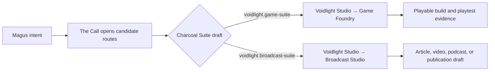
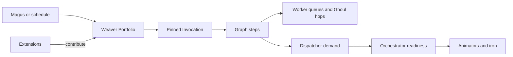

# :material-source-branch: Composition Portfolio

!!! warning "Architecture portfolio — not delivered applications"
    These pages describe accepted application directions and visibly marked candidate studies.
    They do not prove that their Patterns, models, clients, migrations, or effects exist.
    Directory membership does not establish maturity. [State of the
    Work](../state-of-the-work.md) remains the delivery authority.

A **Composition** is an operator-visible workflow application assembled from Patterns, Agents,
capabilities, policies, data, and optional Extension contributions. It is what the Magus enables
and uses; an Extension is only one way its implementation enters the body. A page becomes a
Reference Composition only when it explicitly declares acceptance under the governing ADRs.

The living Portfolio uses this distinction:

```text
Extension  = how code, schemas, tools, and integrations enter LychD
Composition = the complete application the Magus operates
Suite       = a versioned graph of Compositions and typed handoffs
Pattern     = one versioned workflow the application can perform
Invocation  = one admitted execution of that Pattern
```

## Initial portfolio

| Composition | Primary Patterns | Principal proving pressure |
| --- | --- | --- |
| [Voidlight Studio](voidlight-studio.md) | creative brief, style bible, asset request, image/audio/3D forge, review, export | Creative artifacts, provenance, model swaps, rights, bounded repair, and typed downstream handoff |
| [Game Foundry](game-foundry.md) | project bootstrap, asset import, playable slice, build, playtest, balance, release | Engine/project truth, code and resources, reproducible builds, embodied evaluation, and distribution effects |
| [Broadcast Studio](broadcast-studio.md) | research, article/script, media assembly, review, correction, publication | Claims, editorial lineage, deterministic timelines, accessibility, rights, and external publication |
| [Minecraft Agent Server](minecraft-agent-server.md) | bounded mission, social turn, recovery, snapshot | Embodiment, persistent world truth, deterministic control, idempotent effects, and finite agency |
| [Health, Food & Movement](health-food-and-movement.md) | plan, check-in, journal, review, export/delete | Sensitive data, deterministic safety, schedules, migration ownership, and local-first inference |
| [Walking Communion](walking-communion.md) | voice turn, clarification, note capture, routed command | Mobile ingress, authenticated audio, reflex priority, interruption, and cross-Composition routing |
| [Tech Scavenger](tech-scavenger.md) | purchase campaign, daily hunt, evidence request, negotiation, cash-on-delivery commitment | Web acquisition, marketplace policy, compatibility, seller evidence, privacy, idempotent messaging, and bounded economic consequence |
| [Lifestyle Steward](lifestyle-steward.md) | receipt ingestion, price review, inventory, trip planning, catalogue/menu watch, cart and checkout | OCR provenance, product identity, household uncertainty, sensitive-data minimization, local routing, cross-Composition constraints, and economic effects |

These are first-party reference designs. They exist to prove a general Composition law that a
private Crypt Extension or future independent package can also use. They are not activated merely
because their documentation ships.

Candidate studies live in this same directory but say so on the page. Directory membership does
not promote them into architectural law:

| Candidate study | Question |
| --- | --- |
| [Building in Public](building-in-public.md) | How could one evidenced vertical slice become a truthful tutorial season without manufacturing delivery? |

## Django-style application locality

The useful analogy is a Django application: keep one product capability locally understandable,
then compose several applications through explicit contracts instead of pouring every model,
workflow, adapter, and table into one global package.

A future implementation should keep these concerns adjacent within one Composition contribution:

```text
composition descriptor
├── domain schemas, repositories, and migrations
├── immutable Pattern revisions and typed step contracts
├── Agents, deterministic tools, and capability requirements
├── source, market, device, or provider adapters
├── policy, authority, retention, and budget declarations
├── Loom-safe projection metadata
├── fixtures, adversarial cases, and conformance tests
└── operator and Smith scopes that route to the smallest owning truth
```

This is a locality contract, not an accepted package ABI or permission to scan directories.
Pre-v1 code may remain coupled as [Extension law](../adr/05-extensions.md) requires. An enabled
organ enters through explicit selected `register(context)` contribution; its validated
Composition and Pattern metadata enter Weaver's shaped stores. Domain tables remain owned by the
application, model/provider bindings remain Runes, secrets remain Ward-owned, and physical
services remain Orchestrator-owned.

The future Loom should therefore show a Composition shelf, then its Pattern families and exact
immutable revisions. It may show declared domain/effect owners, capability demand, gates,
budgets, checkpoints, and selected run progress. It does not infer an application by crawling
Python or Markdown, and a visible card grants no execution authority. The current Loom has only
the documented static workflow projection; the Portfolio registry and live Composition
navigation remain Designed.

## Learning from examples without copying assumptions

Reference Compositions are executable design lessons for both humans and the future
[Smith](../adr/35-assimilation.md). Someone in another country should be able to select the
closest proven example—Slovak Bazoš acquisition or Slovak grocery catalogues, for example—bind
their own eligible model/provider Runes, and replace the country and merchant adapters while
retaining reusable workflow law.

A Smith-assisted port follows a bounded path:

1. read the Composition descriptor, its routed scopes, governing ADRs, Pattern contracts, tests,
   and evidence rather than the entire repository;
2. separate reusable domain law from Slovak locale, currency, units, merchants, selectors,
   consumer terms, and language;
3. inspect the target market's admitted public sources and draft new typed adapters, fixtures,
   policies, and conformance cases in the Lab;
4. reuse an existing capability or Pattern only where its declared contract actually matches;
5. run structural, deterministic, adversarial, and source-specific verification; and
6. present an attributable candidate for Magus review and promotion.

The example is training evidence, not authority. A Smith cannot assume that another country's
bazaar permits the same acquisition, that a copied selector is current, that a merchant session
is authorized, or that passing Slovak fixtures proves the port. Generated source Patterns remain
inert until the target origin policy, tests, and ordinary Assimilation gates pass.

## Suites: Compositions of Compositions

A **Suite** is an operator-visible, versioned graph of separately owned Compositions and the typed
handoffs between them. It gives a larger project one map without erasing the Django-style
application boundaries that make each Composition understandable and reusable.

```text
Suite
├── pins eligible Composition and Pattern revisions
├── declares typed artifact or intent handoffs
├── carries shared correlation, budget ceilings, and completion policy
├── projects the cross-Composition graph in Loom
└── owns no domain rows, secrets, provider grants, or effect authority
```

The first designed family contains two reusable Suite shapes selected from intent rather than one
permanent graph with every branch enabled:

| Suite | Composition graph | Primary result |
| --- | --- | --- |
| `voidlight.game-suite` | Voidlight Studio → Game Foundry | Accepted creative assets become an evidenced playable build |
| `voidlight.broadcast-suite` | Voidlight Studio → Broadcast Studio | Accepted creative assets become an attributable article, audio/video package, or publication draft |



Every member remains usable alone. A Suite edge transfers a schema-validated immutable artifact
reference or a newly admitted intent; it does not share database ownership, inherit a merchant or
publisher session, widen a Sigil, or turn one approval into approval for downstream effects.

The Call/Manas does not appear as one literal planner daemon. Its office across Context, Agent
postures, Graph routing, ReCall, and optional Shadow expansion makes the Magus's demand
addressable and may propose one or more attributable **charcoal Suite drafts**. The Blade
discriminates among those candidates; deterministic validation, policy, and the Magus decide what
may be published as a Suite revision; Weaver alone admits its concrete Pattern Invocations.

For “make me a game with rockets,” a candidate `voidlight.game-suite` might assign concept,
model-sheet, mesh, texture, animation, sound, and accepted asset-bundle work to Voidlight Studio,
then assign project scaffolding, import, rocket mechanics, level construction, builds, and
playtests to Game Foundry. The graph is inspected before expensive work begins, and every station
still requests its own capabilities, budget, evidence, and effects.

Today this is architecture and projection vocabulary. Existing handoffs must be explicit and
separately admitted. Automated Suite execution requires Weaver to define parent/child Invocation
identity, exact revision pinning, input/output closure, budgets, cancellation, Stasis, retries,
effect receipts, compensation, and partial completion. Until that law enters matter, Loom may show
the Suite graph and handoff readiness but cannot execute a line merely because two Composition
cards are connected.

This is the factory shape of LychD: not a machine that merely returns prose, but a body that can
turn one admitted Intent into a reviewable production graph and return attributable files,
artifacts, builds, evidence, and truthful non-completion.

## Forward manifestation and semantic return

A Suite graph has a forward production face and a reverse evidence face:

```text
forward: Intent → Invocation → typed handoff → downstream use → observed consequence
return:  finding → attribution candidates → unsupported claims → correction request
```

The reverse face is **semantic backpropagation** by metonymy. It returns meaning and measured
repair pressure through a version-pinned agentic graph; it is not a numerical gradient, does not
execute a Suite backward, and never mutates an artifact, Pattern, Persona, or model by itself.

[Riddle](../sepulcher/extensions/riddle.md#viii-the-returning-riddle-suite-feedback) owns the
versioned feedback vocabulary:

- `SuiteFindingSet@1` binds findings to an exact rubric, Suite, Composition, Pattern, Invocation,
  artifact, environment, evaluator, and evidence set;
- `AttributionCandidate@1` records supported, conflicting, and rival credit-or-fault hypotheses
  with uncertainty rather than manufacturing causal certainty;
- `InvalidationSet@1` identifies evaluation claims whose support no longer closes while preserving
  independent branches; and
- `CorrectionRequest@1` proposes a bounded delta, smallest supported cut, regression sentinels,
  and repair budget to the rightful owner.

These are records, not reverse execution edges. The owning Composition may accept a correction
request only through a new forward Invocation admitted by Weaver and ordinary policy. Riddle
re-evaluates the changed cut and its declared sentinels; unchanged branches may reuse evidence
only when their complete input, rubric, evaluator, environment, and artifact closure still match.

The return crosses several offices without collapsing them:

| Return question | Owner |
| --- | --- |
| What passed, failed, became unsupported, or remains uncertain? | Riddle |
| Who acted, observed, edited, delegated, or authored the correction? | Mirror attribution; the Answer binds the surviving act |
| Which records and physical consequences exist? | Oculus correlation plus the owning domain and Phylactery |
| Which bounded forward repair may run next? | Weaver admission, owning Composition policy, and HitL where required |
| Should a Pattern, adapter, or Composition candidate change? | Smith through Lab→test→promote |
| May one attributed result become a future Seed? | Archive/Memory admission under its own policy |
| May any examples become an actual training corpus and weight update? | Soulforge only after separate corpus admission, training, independent evaluation, and promotion |

Identity does not prove blame; artifact authorship does not prove defect causality; a high Riddle
score does not grant training consent. Suite traces, prompts, outputs, tool results, and artifacts
are excluded from training by default. A Soulforge candidate begins only after provenance,
privacy, consent or license, deduplication, sealed holdout, objective, and Magus/HitL corpus
admission. This is the boundary between an agentic network correcting its structure and a trainer
computing literal gradients.

## One Weaver, many applications

The Weaver is the singular logical application control plane. It may present the Portfolio,
register immutable Pattern revisions, admit Invocations, interpret schedules and triggers, and
govern logical priority, overlap, dependencies, budgets, pause, drain, and retirement.

That does not make it the physical Orchestrator:



- Weaver controls **purpose and logical time**.
- Worker queues control **durable delivery, claims, and retry**; Ghouls carry individual execution
  hops.
- Dispatcher controls **semantic capability selection**.
- Orchestrator controls **physical readiness and transitions**.
- Extensions own **their contribution implementation and schemas**; Phylactery, Ward, Vessel, and
  the relevant domain still own data custody, authorization, routing, and effects.

## Provider and model rule

A Composition specifies capabilities, not fashionable model names. A Pattern may require local
audio transcription, tool-aware reasoning, multi-reference image editing, or audio-driven video.
An operator profile binds those requirements to eligible Soulstones, Portals, and deterministic
Tool Animators.

Every model named in these pages is therefore one researched candidate with a dated source,
license, resource envelope, and known limitation. It is not part of the Composition's identity.

## Work policy

One integer cannot express every scheduling decision. Each Composition study therefore records:

| Policy | Meaning |
| --- | --- |
| **Urgency** | Target doctrine priority is `0..100`, higher is hotter; configured route defaults obey it, but raw `Intent.priority` is not yet bounded at admission. |
| **Latency class** | Reflex, interactive, commissioned batch, background, or metabolic. |
| **Preemptibility** | Immediate local stop, safe after an atomic step, or only after an effect receipt. |
| **Overlap** | Parallel, queue, coalesce, skip, or replace another occurrence. |
| **Budget** | Limits on time, tokens, money, storage, actions, generations, and retries. |
| **Residency preference** | Warm required, warm preferred, or cold activation acceptable. |

Only the current priority and narrow queue/runtime behavior have entered matter. The fuller policy
vector is an architectural target and must not be presented as a working scheduler.

## Illustrative single-host Portfolio

The operator's intended shape—Minecraft remaining alive while Studio commissions, personal
reviews, and walking voice turns interleave—does not require four continuously resident Minds.
One possible 24 GB profile is:

| Composition work | Logical class | Warm/cold preference | Interruption boundary |
| --- | --- | --- | --- |
| Walking utterance | Proposed reflex `80` | Small Ear and Voice resident if possible; interactive Mind warm preferred | After the current atomic lease; never tear an effect in half |
| Health manual turn | Interactive `70` | Reuse the local structured-text Mind; deterministic tools stay CPU-resident | After deterministic transaction or model call |
| Lifestyle receipt or shopping review | Interactive `70` | Ready local OCR or visual Mind only for the active artifact; money, product, and route tools stay deterministic | After accepted receipt transaction or before any cart/checkout effect |
| Minecraft conversation | Interactive `70` | Reuse the same Mind; server, Sentinel, and bridge stay CPU-resident | After one verified game action receipt |
| Minecraft mission | Ordinary `50` | Acquire Mind for one decision, then release during pathing/waiting | Between verified actions |
| Voidlight production | Commissioned `50` | Load image/video/voice for approved batches, then unload | At artifact or cancelled-provider boundary |
| Game Foundry build or playtest | Commissioned `50` | Keep engine/build tools ready only for the bounded candidate; acquire a Mind or vision controller only for declared planning/review episodes | At committed source revision, immutable build, or completed playtest episode |
| Broadcast production | Commissioned `50` | Load editorial, voice, image, or video capabilities by approved stage; deterministic assembly remains CPU-resident | At accepted package artifact or reconciled publication receipt |
| Tech Scavenger seller reply or offer | Ordinary `50` | Reuse the local structured-text Mind; deterministic price and compatibility tools stay CPU-resident | After one message-effect receipt; never duplicate an unknown send |
| Reviews, indexing, reminders, snapshots | Background `20` | Warm-only preference; no disruptive cold swap | Coalesce, skip, or park |

An authenticated voice turn can therefore close admission to conflicting background work, wait for
the active lease to reach a safe boundary, request the audio/text substrate, answer, and then let
production resume. Its urgency does not grant permission to publish, delete health records, alter
Minecraft administration, or kill a generation that has no safe cancellation contract.

Candidate Runes may bind several roles to one model when the measured host supports them—for
example, one audio-aware local Mind for voice, text planning, and visual review—or bind every role
to a smaller specialist. The Composition asks for current capability families such as `chat`,
`vision`, `stt`, `tts`, or `tool_execution` with required tool ids such as `image.generate` and
`video.generate.image`. Dispatcher selects an eligible Animator; Orchestrator decides how that
selected Soulstone becomes physically ready. Gemma, Qwen, Wan, FLUX, and other names remain
provider-profile choices.

## Descriptor shape

The eventual contribution should be declarative enough for Weaver to inspect before admission.
This sketch is a design aid, not accepted TOML syntax or a current API:

```toml
[composition]
id = "example.application"
revision = "1"
owner = "extension:example"
support_tier = "experimental"
default_pattern = "example.manual@1"

[[composition.patterns]]
id = "example.manual@1"
priority = 50
latency = "commissioned"
overlap = "queue"
preemptibility = "after_effect_receipt"

[[composition.patterns.requirements]]
capability = "chat"
modalities_in = ["text"]
structured_output = true
privacy_ceiling = "private"

[composition.patterns.budget]
wall_seconds = 900
model_calls = 12
tool_effects = 20
```

Schedules, domain configuration, provider/model Runes, secrets, workload manifests, and personal
records remain separate owned objects referenced by stable ids. They must not be hidden inside one
untyped Composition blob.

## Composition page contract

Each application page carries:

1. visible intent and non-goals;
2. Pattern and subgraph inventory;
3. capability requirements and researched provider candidates;
4. logical priority, schedule, overlap, and preemption policy;
5. ownership across Weaver, Extensions, Animators, workloads, data, artifacts, and interfaces;
6. migration, provenance, retention, export, deletion, and recovery boundaries;
7. authority, privacy, safety, and external-effect gates;
8. the smallest proving slice and staged roadmap; and
9. explicit gaps between architecture and current delivery.

An application earns no private ADR merely because it exists. A new ADR is warranted only when it
discovers reusable law, such as managed-workload lifecycle, artifact custody, sensitive-data
governance, or a new trust boundary.

## Continue

- Read [Weaver](../sepulcher/extensions/weaver.md) for the workflow jurisdiction.
- Read [Weaver](../sepulcher/extensions/weaver.md) and [Workflow](../adr/28-workflow.md) for the
  governing workflow law.
- Candidate studies remain in this Portfolio until explicitly accepted, rejected, or removed.
