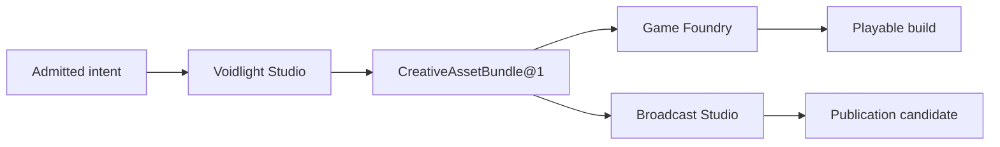

# :material-source-branch: Compositions

An Agent may speak. A Composition must finish something—or return the exact reason it could not.

A **Composition** is the application a Magus can recognize and operate: an operator-visible purpose
assembled from versioned Patterns, Agents, capabilities, policy, records, projections, and effects.
An [Extension](../adr/05-extensions.md) is only a way for code, schemas, tools, or adapters to
enter LychD.

| Term | Meaning |
| --- | --- |
| Extension | How an implementation enters LychD |
| Composition | The application the Magus operates |
| Pattern | One immutable workflow the application can perform |
| Invocation | One admitted execution of a Pattern |
| Suite | A versioned graph of Compositions joined by typed handoffs |

## The Portfolio

These are application designs, not a release list. An accepted reference architecture is accepted
law; [State of Work](../state-of-the-work.md) alone says what is running.

| Maturity | Composition | Visible purpose | Pressure it puts on the common law |
| --- | --- | --- | --- |
| Accepted | [Voidlight Studio](voidlight-studio.md) | Turn a commission into attributable creative assets | provenance, rights, review, bounded repair, typed export |
| Accepted | [Game Foundry](game-foundry.md) | Turn a game concept and admitted assets into a playable build | project truth, reproducible builds, evaluation, distribution effects |
| Accepted | [Broadcast Studio](broadcast-studio.md) | Carry a source dossier into a publication candidate | claim lineage, accessibility, rights, editorial and publication authority |
| Accepted | [Blockworld Inhabitant](blockworld-inhabitant.md) | Give an Agent a bounded life in a persistent world | embodiment, world truth, finite agency, recoverable effects |
| Accepted | [Health, Food & Movement](health-food-and-movement.md) | Help one operator plan and reflect without impersonating medicine | sensitive data, deterministic restrictions, schedules, local-first inference |
| Accepted | [Walking Communion](walking-communion.md) | Carry a voice turn between the road and the Altar | mobile ingress, interruption, audio custody, routed intent |
| Accepted | [Tech Scavenger](tech-scavenger.md) | Run an evidence-bound compatible-equipment search | sources, seller evidence, privacy, messaging, economic limits |
| Accepted | [Lifestyle Steward](lifestyle-steward.md) | Make household evidence into editable daily-life choices | OCR provenance, uncertain identity, local routing, checkout gates |
| Candidate study | [LychD Source Maintenance](source-maintenance.md) | Can one admitted correction become a verified quarantined patch? | candidate lineage, bounded feedback, restart, and inert promotion |
| Candidate study | [Building in Public](building-in-public.md) | Can an evidenced vertical slice become a truthful tutorial? | evidence without manufactured progress |
| Candidate study | [Bazaar Haggler](bazaar-haggler.md) | Can bounded negotiation be reused without transferring judgment? | mandate, credentials, and commitment boundaries |
| Candidate study | [Home Seeker](home-seeker.md) | Can private location-aware search rank evidence honestly? | location privacy and no counterfeit diligence |

Candidate membership is a question kept open, not architectural promotion.

## A sense is not a purpose

A listing, map result, menu, product page, or social post is an external **observation**. The
adapter that searches, fetches, renders, or normalizes it belongs beneath
[Scout](../sepulcher/extensions/scout.md) and its provider boundary. It becomes a Composition only
when attributed observation serves a durable human purpose with its own records, policy, lifecycle,
and consequences. Thus Tech Scavenger owns compatibility and purchase evidence; Home Seeker owns
property criteria and ranking; Lifestyle Steward owns inventory, taste, budget, and trip decisions.

The name **Hunter** remains reserved for [Shadow's adversarial
posture](../sepulcher/extensions/shadow/hunter.md). Source acquisition uses Scout, Search, Watch,
Source Profile, and Observation.

## Local law, explicit contribution

A Composition keeps its domain records, immutable Pattern revisions, policies, projections,
fixtures, and tests locally understandable. That is an ownership rule, not a package ABI.

| Concern | Owner |
| --- | --- |
| Code, schemas, migrations, adapters, registration | Core or a selected Extension |
| Identity, Pattern catalogue, requirements, policy | The Composition contribution |
| Enabled revisions | Weaver's designed Portfolio store |
| Campaigns, inventories, observations, approvals, receipts | The Composition's Phylactery records |
| Model, provider, source, runtime binding | Owning Runes |
| Secrets and grants | Ward and Sigils |
| Physical readiness | Orchestrator |

There is no Crypt `compositions/` loader beside `extensions/`; documentation does not authorize
one. Selected shaped contributions enter the singular [Weaver](../adr/28-workflow.md), which must
not discover applications by scanning packages or Markdown. The present Loom can project documented
Pattern structure and exact material described in [State of Work](../state-of-the-work.md#loom-workflow-views).
Live Portfolio selection and executable Suite navigation remain designed.

## Suites do not dissolve their members

A **Suite** pins eligible Composition and Pattern revisions, declares immutable artifact or Intent
handoffs, carries correlation and aggregate ceilings, and states completion or partial-completion
policy. It owns no domain rows, secrets, provider grants, Sigils, or effect authority. One handoff
does not widen another member's permission.

`voidlight.game-suite` and `voidlight.broadcast-suite` are the first designed shapes. Members stay
useful alone. Until Weaver law settles child identity, revision pinning, input/output closure,
budget, cancellation, Stasis, retries, effect receipts, compensation, and truthful partial
completion, a Suite line is never executable: the handoff is an explicit artifact-backed admission.
Loom may show that graph; it may not run it.

Evaluation may return attributed findings and correction requests. They are evidence, not reverse
execution, implied training consent, or authority to mutate an accepted artifact. [Riddle](../adr/34-evaluation.md)
judges, [Mirror](../adr/32-identity.md) attributes, [Smith](../adr/35-assimilation.md) may propose,
and only a new forward Invocation performs work.

## One Weaver, finite iron

[Weaver](../adr/28-workflow.md) governs application purpose and logical time: selected revisions,
admission, dependencies, overlap, schedules, budgets, pause, drain, and retirement. It is not the
physical Orchestrator.

Workers deliver and retry; Dispatcher resolves capability demand; Orchestrator handles residency;
and the relevant domain, Phylactery, Ward, Vessel, and effect boundary retain their authority. A
Composition asks for capabilities, never fashionable model names. Provider candidates remain dated
Rune choices with licenses and resource envelopes, not application identity.

Each leaf makes its purpose, Pattern inventory, records/artifacts/projections/effects, authority
and privacy gates, lifecycle and recovery, local interaction with common law, smallest proving
slice, and maturity legible. Continue with [Workflow](../adr/28-workflow.md), then choose a leaf.
