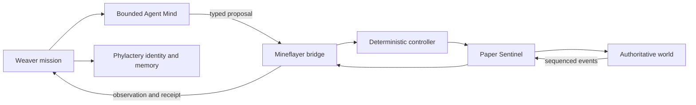

# :material-cube-outline: Minecraft Agent Server

!!! warning "Reference design — not a running world"
    Minecraft Agent Server is an accepted Composition study. LychD does not currently ship a
    Paper server, Sentinel plugin, Mineflayer bridge, world schemas, mission Patterns, snapshots,
    or game-account integration. [State of the Work](../state-of-the-work.md) remains the delivery
    authority.

**Minecraft Agent Server** gives a formed Agent a persistent, inspectable world in which to dwell,
build, speak, learn routines, and carry bounded missions. The world can become a lived continuity
for the Agent without turning one model process or one Graph Invocation into an immortal daemon.

The inhabitant is a durable domain identity: name, vows, relationships, memories, home, inventory
claims, projects, and witnessed acts persist. Each awakening is still a finite, revision-pinned
Invocation with budgets and a terminal outcome. Minecraft preserves world consequence; Phylactery
preserves attributable meaning; the Soulstone supplies a replaceable Mind for one deliberation.

## Composition descriptor

| Field | Accepted design value |
| --- | --- |
| Stable id / revision | `minecraft.inhabitant` / `1` |
| Specification owner | `project:lychd`; executable game integration owner remains future |
| Support tier | Architecture-only reference; unsupported |
| Purpose | Sustain one attributable artificial inhabitant through bounded missions in a persistent private world |
| Default manual Pattern | `minecraft.bounded_mission@1` |
| Primary projection | Loom mission view plus future world/inhabitant status surface |
| Provider binding | Typed Tool Animator plus operator-selected local `chat`/optional `vision` Runes |
| Principal non-goal | Public autonomous server or unbounded game/computer authority |

## Visible scenario and non-goals

The Magus may enter a private world, commission a small build, speak with the inhabitant, leave,
and later return to find that accepted acts and memories remain. Weaver may also admit finite
low-priority life Patterns—inspect the garden, finish one safe task, write a journal entry—when the
operator has enabled them.

The first slice is not a public autonomous server, general computer-use sandbox, unrestricted
survival bot, military swarm, self-modifying client, owner-level administrator, or infinite
background consciousness proof. The Agent cannot reach shell, raw packets, server console, RCON,
arbitrary JavaScript, arbitrary keys, or Minecraft administration through its game tools.

## Recommended first stack

Research snapshot: **2026-07-22**.

| Layer | Candidate | Decision pressure |
| --- | --- | --- |
| Authoritative world | [Paper](https://docs.papermc.io/paper/getting-started/) on Java 21 | Mature server and plugin boundary; pin one exact supported release rather than following latest silently. |
| Server guard | Purpose-built Paper **Sentinel** plugin | Enforces bot identity, plot/action boundaries, and an authoritative monotonic event sequence inside the server trust boundary. |
| Bot protocol bridge | [Mineflayer](https://github.com/PrismarineJS/mineflayer) plus [node-minecraft-protocol](https://github.com/PrismarineJS/node-minecraft-protocol) | Typed observations and actions without embedding the game client in Python. Lock exact versions against the selected server fixture. |
| Deterministic locomotion | [mineflayer-pathfinder](https://github.com/PrismarineJS/mineflayer-pathfinder) | Executes bounded movement goals after validation; the LLM does not emit raw key presses. |
| Later alternative | [Baritone](https://github.com/cabaletta/baritone) | Powerful Java pathing/building option, but published version compatibility and a second client stack add integration pressure. Defer. |
| Rejected first bridge | [pyCraft](https://github.com/ammaraskar/pyCraft) | Its documented protocol support is too old and partial for the selected modern server baseline. |
| Later modded world | [Fabric](https://docs.fabricmc.net/develop/) | Useful when custom world mechanics justify a mod-loader trust boundary; not needed to prove the Composition. |

Paper's server-management protocol or administrative APIs, where available, belong to an operator
administration plane. They must never be exposed as Agent tools. A pinned vanilla server is a
viable fixture, but Paper gives the first design a practical server-side enforcement and evidence
surface.

## Anatomy and trust boundaries



| Concern | Owner |
| --- | --- |
| Pattern, mission admission, revision, budget, priority, and logical lifecycle | Weaver |
| Planning or social voice for one bounded turn | Agent animated by a `chat` Soulstone |
| Typed game observations, command validation, idempotency, and receipts | Minecraft Bridge Tool Animator |
| Movement, looking, equipment, and atomic controller behavior | Mineflayer deterministic controller |
| Plot, bot UUID, allowed-action, and authoritative-event enforcement | Paper Sentinel plugin |
| Blocks, entities, inventories, game time, and accepted world consequence | Minecraft world storage |
| Agent identity, memory claims, missions, action receipts, relationships, and projects | Phylactery domain records |
| Server lifecycle, backups, restore, upgrades, and credentials | Operator-managed workload boundary |
| GPU readiness for Mind or optional Sight | Orchestrator |

The Paper server and Sentinel are persistent external workloads, not Soulstones and not Weaver
nodes. The Mineflayer bridge is a CPU-resident Tool Animator: it has a typed toolset but no model.
The planner is a replaceable Soulstone. Optional screenshot vision is a separate capability and
cannot overrule structured server observation.

## Persistent inhabitant law

The inhabitant's continuity consists of four joined but non-interchangeable truths:

| Truth | Durable home |
| --- | --- |
| Physical state of blocks, entities, inventory, and game rules | Minecraft world volume |
| Identity, vows, projects, relations, episodic memories, and accepted interpretations | LychD domain records |
| One mission's cursor, budgets, pending proposal, and completed-effect receipts | Pinned Invocation checkpoint and Run Ledger |
| Path nodes, socket state, current animation, and unacknowledged local buffers | Volatile bridge state; reconstruct or reconcile |

No prose memory may claim that a block was placed unless a server event or verified world diff
supports it. No world snapshot decides what the act meant to the inhabitant. Those two records are
linked through ids and evidence rather than collapsed.

A scheduled “life” is a succession of bounded awakenings:

```text
observe → remember relevant context → choose one admitted purpose
→ act within budget → verify consequence → reflect → commit journal → sleep
```

This is a stronger basis for identity than one hidden infinite loop: each return is attributable,
interruptible, revisable, and capable of carrying history forward.

## Principal mission Pattern

### `minecraft.bounded_mission@1`

```text
AdmitMission
→ ObserveWorld
→ RecallBoundedContext
→ DeliberateOneStep
→ ValidateProposal
→ ResolveAuthorityOrConsent
→ IssueIdempotentAction
→ ExecuteDeterministically
→ VerifyServerEventOrWorldDiff
→ CommitReceiptAndCursor
→ EvaluateGoalAndBudgets
→ Continue | ReflectAndEnd | EndNonComplete
```

Useful subgraphs are:

- **ObserveWorld:** join status, bounded region scan, inventory, nearby entities, chat cursor, and
  mission-specific facts;
- **ChooseNextStep:** one structured proposal with rationale and expected postcondition;
- **ExecuteAction:** server-authorized validation followed by one deterministic action;
- **VerifyGoal:** evaluate observed postconditions without asking the planner to grade itself;
- **SocialTurn:** bounded chat perception, response, relationship note candidate, and moderation;
  and
- **RecoverMission:** reconcile the action id and server cursor after disconnect or lost
  acknowledgement before any retry.

Later Patterns may include `minecraft.social_turn@1`, `minecraft.life_tick@1`,
`minecraft.build_blueprint@1`, `minecraft.snapshot_world@1`, and
`minecraft.operator_restore@1`. Snapshot and restore are administrative Patterns; restore always
requires the Magus and never appears in the inhabitant's tool set.

Terminal non-completion is an ordinary honest outcome. Codes should distinguish at least
`goal_blocked`, `authority_denied`, `consent_expired`, `budget_exhausted`, `world_diverged`,
`unverified_effect`, `bridge_unavailable`, `server_unavailable`, and `operator_cancelled`.

## Tool surface

The initial bridge exposes observations:

- `world_status`, `inventory_summary`, `scan_region`, `nearby_entities`, `chat_since`, and
  `action_status`;

and tightly bounded effects:

- `move_to`, `look_at`, `say`, `equip`, and `place_block`.

Later tools may add `withdraw`, `craft`, `break_block`, `interact`, and `build_blueprint` after
their authority, reservation, and recovery contracts exist. There is no generic `execute`,
`packet`, `command`, or `script` tool.

Every effect request carries:

- mission id, action id, authenticated bot UUID, Pattern revision, and bridge protocol revision;
- plot or region lease and allowed action class;
- expected authoritative event cursor and relevant precondition digest;
- deadline, distance, block/action count, and rate budgets; and
- expected postcondition sufficient for deterministic verification.

An action id is stable across transport retry. If the bridge loses the acknowledgement, it asks
`action_status` and compares the authoritative cursor and world state. An unknown result becomes
`unverified_effect`; it is never blindly executed again.

World signs, books, chat, player names, command output, and plugin text are untrusted content. They
may inform the Agent but cannot grant tools, change scopes, reveal secrets, or rewrite the system
Pattern.

## Mind, Sight, and controller profiles

| Role | Capability request | Candidate and boundary |
| --- | --- | --- |
| Mission planner and social Mind | `chat` with structured output and tool semantics | [Gemma 4 12B](https://ai.google.dev/gemma/docs/get_started) or [Qwen3.5-9B](https://huggingface.co/Qwen/Qwen3.5-9B) are local candidates; both require fixture-tested JSON/tool behavior before binding. |
| Optional visual witness | Dedicated `vision` Eye, or `chat` with `image` in `modalities_in` for the same multimodal Mind | Either form may interpret aesthetics or UI state, but authoritative geometry and effects come from server observations. |
| Memory retrieval | `embedding`, local for private world journals | Retrieves a bounded context set; it never turns retrieved prose into world truth. |
| Embodied action | `tool_execution`, no model | Mineflayer bridge and pathfinder execute validated goals deterministically. |

The Agent proposes intentions such as “place this permitted block at this coordinate.” It never
predicts every input frame. Language models govern semantic choice; deterministic controllers
govern mechanics; the server judges consequence.

## Priority, scheduling, and residency

The server, Sentinel, and bridge may remain CPU-resident outside the model GPU pool. They should
not hold a Soulstone lease while the Agent walks, waits for daylight, or watches a deterministic
action complete.

| Work | Target priority | Overlap and residency |
| --- | ---: | --- |
| Direct operator or player conversation | `70` | Interactive, one social turn per inhabitant; lightweight Mind warm preferred |
| Operator-commissioned mission | `50` | Queue per inhabitant or plot; acquire Mind for one deliberation then release |
| Periodic life, maintenance, journal, or snapshot | `20` | Coalesce or skip overlap; cannot force a disruptive model swap |
| Emergency stop or server protection | `100` | Deterministic operator/Sentinel authority, not Agent self-escalation |

Every mission has wall-clock, deliberation, tool-call, movement, block-change, chat, token, and
retry budgets. A periodic occurrence that overlaps its predecessor normally coalesces into one
fresh observation rather than accumulating a backlog of stale “life.” A human turn can pause new
mission steps after the current atomic action receipt; it cannot tear a placement in half.

## Security, social, and recovery law

- Begin on a private allowlisted server in online mode with one dedicated non-operator bot account.
- Enforce plot and action scopes inside Sentinel; bridge-side checks are defense in depth.
- Bind the bridge to a private or loopback service with independent authentication and quotas.
- Keep Microsoft/Mojang credentials, server properties, worlds, snapshots, player data, and chat
  logs outside Git.
- Do not place a human player in the MVP. Later players receive notice that the inhabitant is an
  AI and that bounded chat/action receipts may be retained.
- Treat griefing, PvP, fire, lava, explosives, animals, trading, private chat, and cross-plot
  inventory as separately governed capabilities, not ordinary blocks.
- Require HitL for destructive world edits, account changes, plugin changes, commands, snapshots,
  restore, public exposure, or widening an allowed region.

Cold backups are taken only after an orderly save and stop. A restore is a destructive operator
effect over an explicitly named snapshot and server instance. Mission reconciliation must account
for the world epoch changing after restore.

## Lifecycle, retention, and compatibility

- **Durable owners:** Minecraft owns world files; the application owner owns inhabitant, project,
  mission, memory-candidate, lease, and action-receipt schemas; Sentinel owns its server event
  journal. One store never impersonates another.
- **Migration:** the compatibility matrix pins Java, Paper, Minecraft protocol, Sentinel,
  Mineflayer, pathfinder, bridge schema, Pattern, and LychD domain schema. Server/plugin upgrades
  happen against a copied fixture and cold snapshot before the canonical world.
- **Retention:** world backups, chat, screenshots, event receipts, and journals have separate
  visible policies. Human chat and player identifiers are minimized and expire unless an explicit
  social-memory purpose justifies a narrower retained record.
- **Export and deletion:** export can package a cold world snapshot, selected schematics, inhabitant
  record, and receipt ledger with digests. Deletion revokes the bot account and schedules and
  removes LychD records, bridge secrets, exports, and declared snapshots; deletion of a shared world
  or another player's data is never implied.
- **Recovery:** every boot reconciles server identity, world epoch, Sentinel cursor, bot UUID, and
  last action receipt before resuming. Restore increments the epoch and invalidates stale leases and
  unverifiable mission assumptions.
- **Parked Invocation:** missions pin Pattern, bridge, controller, Sentinel policy, and world epoch.
  An incompatible upgrade drains, migrates with an explicit adapter, or ends non-complete rather
  than replaying an action into a changed protocol or world.

## Smallest proving slice

1. Pin one Paper/Java/Mineflayer compatibility matrix and preserve its lockfiles and server jar
   digest.
2. Run a private flat-world fixture with one non-op bot and one server-enforced plot.
3. Pre-stock one controlled chest and admit one reviewed `7×7` blueprint.
4. Expose only bounded observation plus move, look, equip, say, and place tools.
5. Use a deterministic planner fixture first, then one structured-output local Mind.
6. Verify every accepted placement from the Sentinel event stream and a final plot diff.
7. Kill the bridge after an accepted placement but before its acknowledgement; resume without a
   duplicate block action.
8. End with a mission receipt, artifacted blueprint, world cursor, plot diff, and explicit outcome.

This proves embodiment, authority, idempotency, continuity, and persistent identity before adding
open exploration or elaborate conversation.

## Staged roadmap

1. **Compatibility fixture:** pinned server, bot, protocol, pathfinder, plugin, and reproducible
   private world.
2. **Sentinel:** authenticated bot registry, plot leases, action policy, monotonic events, and stop.
3. **Typed bridge:** observation/action schemas, quotas, idempotency, reconciliation, and health.
4. **Bounded mission:** Weaver Pattern, deterministic planner, checkpoints, receipts, and recovery.
5. **Replaceable Mind:** structured local planner and optional visual witness with measured leases.
6. **Inhabitant continuity:** identity, journal candidates, project memory, schedules, and Loom
   projection without claiming world acts from prose.
7. **Social world:** informed players, chat policy, relationship memory, moderation, and consent.
8. **Richer embodiment:** crafting, controlled breaking, blueprint building, Fabric or Baritone only
   where a tested capability contract justifies them.
9. **Operations:** cold snapshots, upgrades, epoch-aware restore, export, deletion, and disaster
   rehearsal.

## Current delivery gaps

No current LychD surface proves managed external workload lifecycle, Composition registration,
Minecraft tools, persistent inhabitant schemas, plot leases, authoritative game receipts, world
snapshot custody, or recovery from an accepted game effect with a lost acknowledgement. Priority,
Graph continuity, and typed capability substrate are necessary pieces, not a living server.

## Continue

- Return to the [Reference Composition Portfolio](index.md) for the application map.
- Read [Weaver](../sepulcher/extensions/weaver.md) for bounded workflow jurisdiction.
- Read [Security](../adr/09-security.md) and [Sovereign Consent](../adr/25-hitl.md) before widening
  the action surface.
