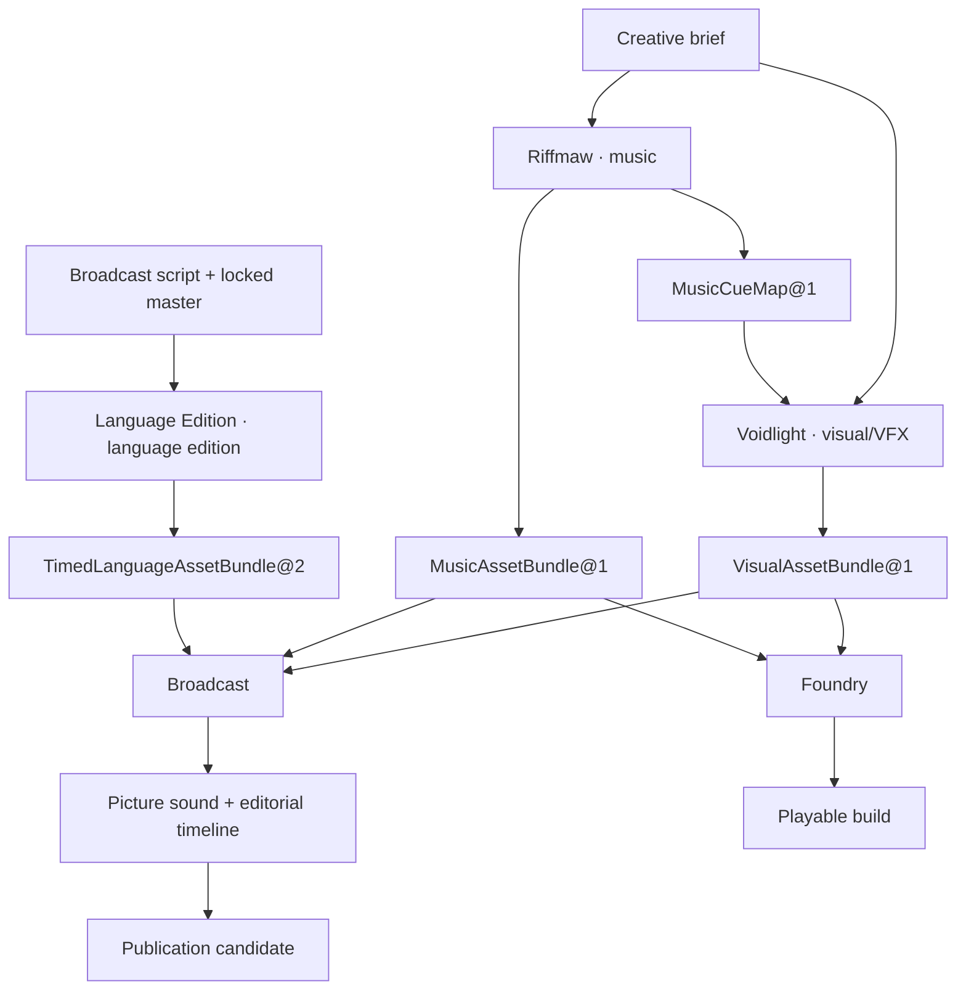

# :material-vector-link: Products and Suites

An editor can assemble a film from visual, music, and language bundles that already exist. A different promise—commission changes in all three and deliver one jointly settled result—must coordinate their live work. Products and Suites give those two situations different homes.

A **Product** names the profession or market promise, pins eligible Composition/Suite revisions, owner-qualified profiles, projections, use cases, defaults, and support envelope. A **Suite** owns reusable live coordination through its own authority-qualified identity, revision, and exact coordination Pattern/Scroll. Casting it creates one parent Invocation/Run and separately owned Composition Invocations/Runs. A direct Intent can cast a Suite without a Product; several Products may pin the same eligible Suite.

## From promise to one execution

| Term | Meaning |
| --- | --- |
| Product-supported use case | a class of operator job |
| Deployment | one configured Product or Composition-reference-profile context for an operator |
| Composition Pattern, or Suite-owned coordination Pattern across several | reusable technical realization |
| Invocation | one admitted Circle for requested work |
| Run | the durable execution and ledger identity representing that Invocation |

Suite coordination pins members/Patterns, typed ArtifactRef/Intent handoffs, correlation, aggregate ceilings, and partial completion. Members retain records, judgment, policy, consent, secrets, Sigils, credentials, provider grants, and effects. Product owns the promise and packaging, without becoming an executor or scheduler.

## Compositions relate without nesting

Replace a broad `depends_on: composition` edge with the actual relation:

| Relation | Consequence |
| --- | --- |
| Co-packaging | Several capabilities share a Product; no Suite follows. |
| Settled typed reference | Exact record, artifact, observation, receipt, or binding enters as input; no Suite follows. |
| External precondition/reference | A foreign binding, capability, or policy is required but its lifecycle remains outside consumer control; no Suite follows. |
| Live coordination | One result must initiate/admit, await, retry, cancel, recover, correlate, or settle several owners' Invocations; a Suite is required. |

References supply no installation, availability, upgrade, lifecycle, credential, admission, ambient database, or effect authority.

### Avatar and Spectre

Spectre can admit a generic VR Habitat/Encounter without Avatar. Meeting the Lich may require an exact already admitted `ProjectionBinding@2` as an external precondition. Its binding may still be live, but Spectre cannot create, revise, close, await, cancel, or recover it. Attributed results can later cross without a circular dependency.

A promise to admit a new projection, open the Encounter, await their attributed results, cancel both when required, and report partial completion needs a Suite. A Product may package that promise, not create its authority.

### Companion and Familiar

Companion requires an exact Familiar-backed device, while Familiar retains capability, safety, and stop law. Opening the mobile session needs no Suite. Coordinating its conversation with a Familiar mission or real-world effect does.

### Workshop and Scavenger

Proposed Mechanic packages Workshop's passenger-vehicle service profile. A settled part requirement can enter Scavenger without moving diagnosis or seller authority. Joint diagnostic/acquisition cancellation, ceilings, recovery, and partial settlement require a Suite that a later Product may pin.

### Voidlight, Riffmaw, Language Edition, and Broadcast

Language Edition can use a settled Broadcast script/locked master, Voidlight visual reference, and Riffmaw music master without live coordination. Broadcast can later admit the settled language bundle in another Invocation. New visual corrections, music revisions, edition rebuilds, dependent cancellation, and aggregate publication settlement instead require a Suite.

Each arrow can remain a settled reference. A compound video model does not create a Suite; independent semantic owners must admit its facets. [Workflow](../adr/28-workflow.md#compositions-products-suites-and-schedules) owns the Suite execution contract; [State](../state-of-the-work.md#composition-portfolio-delivery) records delivery.

## Deployment and projection are different axes

A deployment profile is an immutable eligible topology/configuration template. A **Deployment** instantiates an exact Product revision or Composition-owned reference profile for an operator, with actual hosts, bindings, credentials, and policy. A Productless reference creates no market promise, supported-use-case catalogue, or support envelope. Another host, customer, or credential set ordinarily creates another Deployment.

A domain projection is the owner's read model. A client projection owns presentation/platform integration/bounded local state. A public projection is a website, screenshot, report, or explanation. Neither the latter two nor a new interface creates application authority or delivery evidence.

## Commercial catalogues and open-source Products

Commercial catalogues may live outside LychD and reference exact public revisions. Their websites own presentation; private Product truth stays outside technical docs. LychD may link rather than copy it.

An open-source Product reference needs exact Product/use-case and Composition/Suite/profile pins; code licence/notices and separate model, data, fixture, font, screenshot, mark, and redistribution rights; reproducible installation/acceptance; State evidence; and honest externally supplied dependencies. Source alone is insufficient. When necessary weights, corpora, providers, or assets cannot be redistributed, describe “open-source Product code with externally supplied dependencies,” not an unqualified FOSS Product. State must record the evidence before it becomes a technical reference; this page creates no catalogue or selector.

[Choosing a Home](choosing-a-home.md) · [Workflow](../adr/28-workflow.md#compositions-products-suites-and-schedules) · [State of Work](../state-of-the-work.md#composition-portfolio-delivery)
