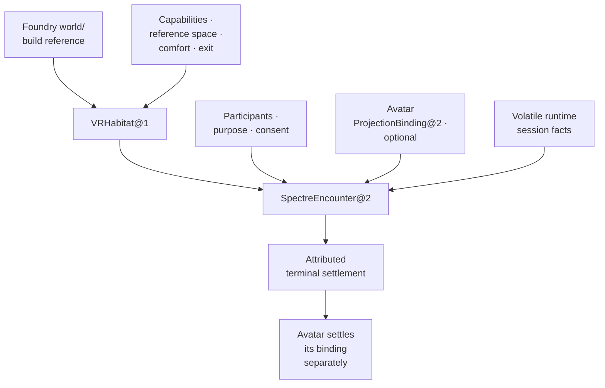

# Entering and leaving an Encounter

The participant enters an admitted VR Habitat to meet the Lich. Later the runtime loses focus, a tracking permission is revoked, or the headset connection disappears. An Encounter keeps those events attributable and ends according to what can actually be observed.

## Admit this meeting

`spectre.enter_encounter@2` begins with exact `VRHabitat@1`, participants, purpose, consent, and—when meeting the Lich—an already admitted Avatar `ProjectionBinding@2` for that Habitat. A generic Encounter needs no Avatar. Spectre may report the target result but cannot create, revise, replace, or close Avatar's binding.

`SpectreEncounter@2` keeps participant/entry admission, purpose, Habitat revision, consent chronology, optional Avatar reference, significant semantic interactions, focus/pause/recenter, interruption/recovery, exit, and terminal judgment. Changed participants, purpose, consent scope, or Avatar binding need fresh admission or an explicit recovery boundary. Many Encounters can use a Habitat without becoming one endless session.

## Runtime state and experienced events

The [OpenXR lifecycle](https://registry.khronos.org/OpenXR/specs/1.1/man/html/XrSessionState.html) describes readiness, visibility, focus, stopping, pending loss, and exit. Spectre records attributed events such as `runtime_ready`, `input_suspended`, `exit_requested`, `runtime_stopping`, and `runtime_lost`. These observations prove neither attendance, perception, consent, understanding, nor memory.

An `XrSession`, game process, socket, device handle, or pose stream remains volatile provider state. Preserve runtime version, session-state changes, selected space kind, capabilities, start/stop/loss, and session epoch as observations. They cannot replace durable Encounter identity.

`XR_SESSION_STATE_LOSS_PENDING` or equivalent loss opens interruption. Policy either settles it or offers explicit recovery: enumerate capabilities again, recheck purpose/consent, create and link a fresh provider epoch. A runtime `EXITING` request ends the XR road without automatic restart. Rendering and input cannot be fabricated across the gap.

## Each participant may leave

Participants independently pause, recenter, leave, or revoke consent. Departure removes that person; continuation requires the remaining participants, purpose, consent, and comfort policy to permit it. A required participant's departure can settle the whole Encounter as safely exited or interrupted.

The admitted modality determines what each person actually received. Optional tracking revocation removes or degrades the feature under policy. If the remaining mode no longer meets purpose or comfort requirements, expose exit and settle instead of inventing an equivalent experience.

Safe exit means following the declared local pause, disclosure, handoff, and exit protocol and settling observed results. It guarantees neither physical safety, device behavior, comfort for every body, nor unseen effects. [WebXR's privacy model](https://www.w3.org/TR/webxr/#security-privacy-and-comfort-considerations) motivates retaining semantic events and minimum capability facts rather than raw tracking archives.

Head/hand/gaze/face/body/room-mesh/camera/microphone/device-id/per-frame streams remain volatile in the admitted runtime or separately governed owner. They are never used to infer identity, attention, affect, intent, consent, co-location, or remembered experience. Spectre receives no ambient engine console, filesystem, tracking database, microphone, world mutation, or body authority.

## Settle what happened

Return `completed`, `safely_exited`, `interrupted`, `refused`, or `unresolved`, with exact externally owned Avatar/world/audio/effect receipts. No terminal can claim that every frame, gesture, utterance, or external effect occurred.

In the reference journey, the Habitat admits required features and records optional downgrade; Avatar independently supplies its binding. The participant enters through a declared immersive or companion modality. Spectre records pause, focus, recenter, reference-space changes, consent and semantic events. Tracking revocation may narrow participation or lead to exit. Runtime loss then either settles interruption or receives explicit fresh-epoch recovery. Avatar separately settles its projection from that attributed result.

## First proof and revision continuity

A network-disabled synthetic fixture admits seated, separate bounded room-scale, and companion-screen Encounters, with a static or head-and-hands Avatar. Prove required-feature refusal, optional downgrade, focus loss, recenter/space change, participant exit, consent revocation, visible exit request, abrupt loss, new-epoch recovery, export, and deletion. It proves no hardware compatibility, universal comfort, content quality, multiplayer, physical safety, or delivery.

`spectre.virtual_reality` revision `2` replaces Designed revision `1` for Lich encounters: `spectre.enter_encounter@2`/`SpectreEncounter@2` consume Avatar's corrected `ProjectionBinding@2`. Habitat admission and `VRHabitat@1` stay unchanged. No registry or Run used revision `1`; historical references retain meaning without executable migration.

Return to [Spectre](index.md).
