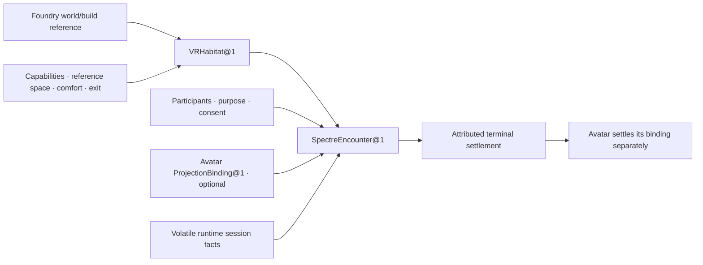

# :material-ghost-outline: Spectre

Spectre is the Virtual Reality (VR) Composition. **VR is its Habitat modality; each admitted
virtual place is one distinct `VRHabitat@1`.** That record binds an exact world or scene to a
runtime capability snapshot, reference-space policy, comfort and accessibility policy, retention
boundary, and visible exit. Spectre opens one bounded **Encounter** inside that Habitat and brings
its participants back with an honest account of what happened.

An Avatar may be projected into the VR Habitat. When a participant meets the Lich through that
Avatar, the bounded meeting is a Spectre Encounter; Avatar remains the separate Composition that
owns presentation and projection membership. The name follows _spectre_ as an appearance or
apparition: what is seen may be compelling without becoming identity, physical truth, or
authority.

## Contract

| Field | Reference contract |
| --- | --- |
| **Identity** | `spectre.virtual_reality` revision `1` |
| **Patterns** | `spectre.admit_habitat@1` and `spectre.enter_encounter@1` |
| **Application begins with** | for Habitat admission, an exact world or scene reference, engine/runtime capability snapshot, reference-space, comfort, accessibility, retention, and exit policy; for an Encounter, one admitted `VRHabitat@1`, participants, purpose, consent, and an optional exact Avatar-owned `ProjectionBinding@1` reference |
| **Application can return** | an immutable `VRHabitat@1` or settled `SpectreEncounter@1`: completed, safely exited, interrupted, refused, or unresolved, with provider facts and external world or effect receipt references |
| **Application stops before** | content or world authorship, persistent-world authority, headset/runtime ownership, raw tracking archives, Persona or Avatar ownership, generic multiplayer, public release, or a claim that presence was physical |

Spectre owns the durable VR Habitat binding and epoch: exact world or scene references; requested,
required, negotiated, missing, and revoked VR capabilities; admitted spatial context; reference
space; and comfort, accessibility, retention, and exit policy. The source world, engine project,
runtime, and device remain outside that record.

Each Encounter owns its participants, purpose, consent changes, focus, pause, recenter,
interruption, exit, recovery chronology, significant semantic interactions, and terminal
judgment. An OpenXR `XrSession`, game process, socket, device handle, or pose stream is volatile
provider state, never the durable Habitat or Encounter.

## Records and lifecycle

Spectre separates the admitted place, bounded meeting, volatile runtime, and final judgment. A
headset session may disappear while the Habitat remains eligible for a later Encounter; many
Encounters may occur in one Habitat without becoming one endless social world.

| Layer | Spectre-owned truth | Boundary |
| --- | --- | --- |
| `VRHabitat@1` | one immutable virtual-place and capability epoch: exact world or scene, adapter/runtime revision, requested, required, granted, missing, and revoked capabilities, reference-space policy, comfort, accessibility, retention, disclosure, and exit policy | not the source project, engine build, headset, reference-space handle, multiplayer service, or persistent world |
| `SpectreEncounter@1` | one participant list, purpose, Habitat revision, entry admission, consent chronology, optional Avatar projection reference, semantic interaction chronology, interruption/recovery, exit, and terminal judgment | not an engine loop, raw sensor archive, Avatar profile, generic chat room, or proof of physical presence |
| provider session epoch | attributed volatile facts about one runtime session: runtime version, session-state changes, selected reference-space kind, capability availability, start, stop, and loss | evidence observed by Spectre, not a reusable durable session or identity signal |
| terminal settlement | `completed`, `safely_exited`, `interrupted`, `refused`, or `unresolved`, plus references to Avatar, world, audio, or effect receipts owned elsewhere | honest judgment about the Encounter contract, not proof that every frame, gesture, utterance, or external effect occurred |

Changing the world/build digest, required capability set, reference-space policy, comfort or
accessibility policy, retention rule, or exit contract creates a new Habitat revision or epoch. A
runtime restart alone does not rewrite the Habitat. Changing participants, purpose, consent scope,
or the referenced Avatar binding creates a fresh Encounter admission or an explicit recovery
boundary; history is never silently edited.

## VR Habitat and Encounter

Spectre is not a generic home for every spatial, rendered, or game experience. A Habitat says
where a VR meeting can occur and which local capabilities and safety policies govern it; an
Encounter says who met there, for what bounded purpose, what semantically happened, and how they
left. One Habitat may admit many separately identified Encounters without turning into one endless
session.

This reusable application truth remains stable even while the first packaged use, hardware
profile, and richer Patterns are still being discovered. Revision one deliberately promises no
multiplayer, persistent social world, full-body embodiment, eye or face tracking, mixed-reality
mapping, or production hardware profile.

Two admission paths keep Avatar optional without weakening the user's intended meeting:

- a **generic Encounter** admits the Habitat, participants, purpose, consent, and required
  capabilities without any Avatar projection;
- an **Encounter with the Lich** additionally requires one exact Avatar-owned
  `ProjectionBinding@1` already admitted for that Habitat. Spectre references that binding and may
  report its attributed target result, but cannot create, revise, replace, or close it on Avatar's
  behalf.

| Neighbour | Retained authority |
| --- | --- |
| [Foundry](../foundry/index.md) | project, engine-native world, controllers, build candidate, and playtest evidence |
| [Blockworld](../blockworld/index.md) | persistent authoritative world, mission, inventory, lease, and verified world effects |
| [Avatar](../avatar/index.md) | Lich presentation profile, Morphe selection, projection membership into this VR Habitat, and aggregate projection settlement; the Encounter only references the exact binding |
| [Reach](../reach/index.md) | external social event, Habitat audience, delivery, and bounded social turn |
| Prism Form and Kinesis | spatial assets, rigs, morph targets, technical motion, retargeting, and provenance |
| Echo and Riffmaw | capture, speech timeline, cloning/synthesis, playback, and produced sonic assets |
| VR engine and OpenXR runtime | scene graph, rendering, physics, per-frame tracking, input, haptics, compositing, and device lifecycle |

Typed participant, Avatar, world, artifact, interaction, and receipt references may cross these
seams. Spectre receives no ambient engine console, filesystem, raw tracking database, microphone,
world mutation, or body authority.

## Runtime state is evidence, not Encounter truth

[OpenXR session lifecycle](https://registry.khronos.org/OpenXR/specs/1.1/man/html/XrSessionState.html)
distinguishes readiness, visibility, input focus, stopping, pending loss, and exit. Those states
describe what the runtime can render or accept, not whether a participant attended, perceived an
event, consented, understood, or remembers it. Spectre may translate them into attributed semantic
chronology such as `runtime_ready`, `input_suspended`, `exit_requested`, `runtime_stopping`, and
`runtime_lost`; it does not store the provider handle as Encounter identity.

`XR_SESSION_STATE_LOSS_PENDING` or an equivalent provider loss opens an interruption boundary. The
Encounter policy either settles `interrupted` or offers an explicit recovery attempt. Recovery
enumerates capabilities again, rechecks consent and purpose, creates a fresh provider session
epoch, and links it to the interruption; it never pretends that rendering, input, or presence
continued invisibly. A runtime `EXITING` request ends the XR route and is not automatically
restarted.

[OpenXR reference spaces](https://registry.khronos.org/OpenXR/specs/1.1/man/html/XrReferenceSpaceType.html)
also differ materially. Habitat admission pins whether the experience is view-relative,
seated/local, floor-relative, or room-scale; whether floor or stage bounds are required; how
recenter and reference-space change are handled; which locomotion is allowed; and which downgrade
or refusal follows when the runtime cannot provide the declared space. A runtime space and its
bounds are volatile provider facts, not the durable Habitat itself.

Capability admission follows the same fail-closed split. Required capabilities refuse admission
when absent; optional capabilities become an explicit downgrade. The Habitat records requested,
granted, missing, and revoked facts rather than inferring hands, haptics, room bounds, eye or face
tracking, passthrough, anchors, or body tracking from the word “VR.”

## Participants, accessibility, privacy, and exit

An Encounter names its participant set and per-participant admission. Each participant may pause,
recenter, leave, or revoke consent independently. Their departure removes their participation; the
Encounter continues only when the remaining participants, declared purpose, consent rules, and
comfort policy permit it. A policy-required participant leaving may instead settle the whole
Encounter as safely exited or interrupted.

A headset profile is not silently imposed on every participant. Seated, standing, room-scale,
captioned, controller-free, companion-screen, or audio-led routes are admitted only when the
Habitat explicitly supports them. The Encounter records which modality each participant actually
received. A flat or audio companion route may support access or observation, but it never claims
tracked spatial presence, shared reference space, haptics, privacy, or embodiment equivalent to an
immersive participant.

The visible exit and recovery contract must remain available in every admitted modality. “Safe
exit” means Spectre followed the declared local pause, disclosure, handoff, and exit protocol and
settled what it could observe. It is not a guarantee of physical safety, device behavior, comfort
for every body, or an unseen external effect.

[WebXR's privacy and feature model](https://www.w3.org/TR/webxr/#security-privacy-and-comfort-considerations)
treats immersive capabilities and pose data as sensitive. Spectre therefore keeps semantic events
and minimum capability facts by default. Raw head, hand, gaze, face, body, room-mesh, camera,
microphone, device-identifier, and per-frame streams stay volatile inside the admitted
engine/runtime or their separately governed owner. They are never mined to infer identity,
attention, affect, intent, consent, physical co-location, or remembered experience.

## Representative journey: meet the Lich in VR

1. The Magus admits one `VRHabitat@1` from an exact VR world or scene, OpenXR runtime capability
   snapshot, requested and required features, reference-space policy, retention rule, comfort and
   accessibility policy, and visible exit. Missing optional hand, haptic, or room-scale support
   becomes an explicit downgrade; a missing required capability refuses the Habitat.
2. Avatar independently admits one `ProjectionBinding@1` targeted at the Habitat. Spectre cannot
   create or revise the Avatar profile, Morphe, Persona, binding, or other simultaneous
   projections.
3. A participant enters that Habitat for one declared purpose and meets the Lich through that
   projection. Spectre opens a new `SpectreEncounter@1` referencing the exact binding rather than
   resuming an ambient endless session. A declared caption or companion route records its actual
   non-immersive modality rather than pretending equivalent spatial presence.
4. Spectre records semantic VR events, focus loss, pause, recenter, reference-space change,
   participant consent change, interruption, and exit while high-rate pose and device state remain
   volatile inside the engine/runtime path.
5. The participant revokes one optional tracking capability, so Spectre removes or degrades that
   feature according to policy without treating the signal as identity or intent. If the remaining
   mode no longer satisfies the purpose or comfort policy, Spectre offers visible exit and settles
   safely rather than improvising an equivalent experience.
6. A later runtime loss creates an explicit interruption. Recovery requires fresh capability and
   consent admission and a linked provider session epoch; otherwise the Encounter settles
   `interrupted`. Avatar separately settles its projection binding from Spectre's attributed result,
   and neither Composition claims the other's records or authority.

## First integration hypothesis

[OpenXR 1.1](https://registry.khronos.org/OpenXR/) is the protocol baseline: a future adapter must
enumerate the selected runtime and extensions rather than infer support from the standard.
[Godot](https://docs.godotengine.org/en/4.7/tutorials/xr/setting_up_xr.html) is the first engine
candidate. A standalone Quest 3 OpenXR application is the smallest first hardware hypothesis;
[WiVRn](https://github.com/WiVRn/WiVRn) or
[Monado](https://monado.freedesktop.org/) provide later Linux/FOSS-first routes, while SteamVR or a
vendor runtime remains an optional compatibility profile rather than architecture law.

The minimum proving profile needs a stereoscopic view, head pose, one tested action/input profile,
one explicit reference-space policy, visible exit, and runtime-loss handling. Hand, eye, body,
face, passthrough, spatial anchors, haptics, and room bounds are optional capabilities and remain
honestly absent when the selected runtime cannot supply them. High-rate head, hand, gaze, and
device state stays inside the engine/runtime path; only admitted artifacts and semantic encounter
events cross into durable LychD records.

The first fixture is synthetic and network-disabled: one Habitat admitting a seated Encounter, a
separate bounded room-scale Encounter, and one declared companion-screen route; a static or
head-and-hands Avatar; required-capability refusal; optional-capability downgrade; focus loss;
recenter and reference-space change; one participant exit; consent revocation; visible exit
request; abrupt runtime loss; explicit recovery with a new session epoch; and complete
export/deletion. It proves the Habitat and Encounter contracts, not headset compatibility, comfort
for every participant, content quality, multiplayer, physical safety, or delivery.

Related: [Foundry World](../foundry/world.md) · [Blockworld](../blockworld/index.md) ·
[Avatar](../avatar/index.md) · [Vision](../../adr/36-vision.md) ·
[Audio](../../adr/37-audio.md) · [Composition Portfolio](../index.md)
