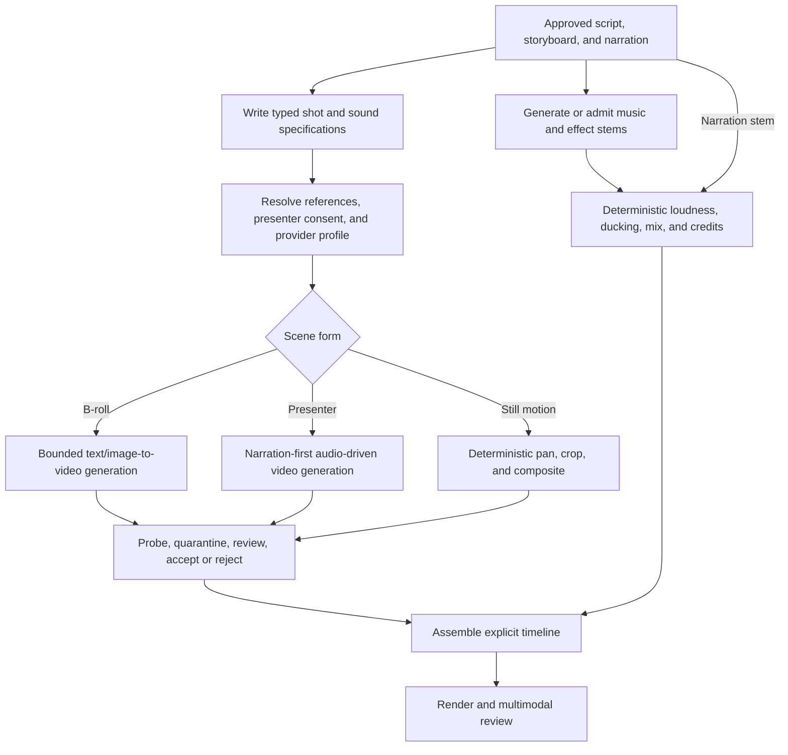

# :material-camera-timer: Voidlight Studio

!!! warning "Reference design — not a delivered studio"
    Voidlight Studio is an accepted Composition study. LychD does not currently ship its Pattern
    pack, source ledger, media tools, model profiles, render environment, publication adapters, or
    artifact migrations. [State of the Work](../state-of-the-work.md) remains the delivery
    authority.

**Voidlight Studio** turns an operator commission into an auditable article-and-video bundle. It
preserves the line from sources to claims, prose, narration, scenes, generated assets, timeline,
review findings, and final render. The Magus supplies intent and remains editor and publisher;
Agents perform bounded research, drafting, generation, assembly, and review.

The Studio is a Weaver Workflow Application, not a second workflow engine. A future private-coupled
`voidlight` Extension may contribute its Patterns, schemas, tools, projections, and provider
profiles. Weaver governs the logical production; it does not become the media store, model host,
renderer, rights registry, or publication authority.

## Composition descriptor

| Field | Accepted design value |
| --- | --- |
| Stable id / revision | `voidlight.studio` / `1` |
| Specification owner | `project:lychd`; future executable contribution may be `extension:voidlight` |
| Support tier | Architecture-only reference; unsupported |
| Purpose | Produce a source-grounded, auditable local article-and-video bundle under Magus curation |
| Default manual Pattern | `voidlight.build_local_bundle@1` |
| Primary projection | Loom production board plus Reliquary artifact view—both future |
| Provider binding | Operator-owned Runes profiles selected by capability |
| Principal non-goal | Autonomous or automatic public publication |

## Visible outcome and non-goals

One admitted commission should eventually yield a versioned local bundle containing:

- a frozen source dossier and claim ledger;
- a canonical article, derived script, storyboard, and asset plan;
- generated or licensed stills, narration, music or effects, captions, and timing evidence;
- a reproducible timeline and rough/final renders;
- model, prompt, seed, license, lineage, review, and human-edit receipts; and
- explicit publication readiness without publication itself.

The first slice is not an autonomous content farm, truth oracle, infinite self-repair loop,
deepfake factory, rights-clearing service, or one-click public publisher. It may write in the
Hexanomicon or Zenith Voidlighter voice, but presentation identity never dissolves source
provenance or human responsibility.

## Anatomical ownership

| Concern | Owner |
| --- | --- |
| Commission, Pattern selection, revision, gates, budgets, and logical priority | Weaver |
| Research, writing, directing, review, and correction roles | Agents |
| Capability and tool binding | Dispatcher and Runes |
| Model readiness, leases, unload, and hardware arbitration | Orchestrator |
| Source acquisition, request validation, media probing, deterministic render, and effect adapters | Typed Tool Animators |
| Model-backed text, image, video, speech, and music powers | Soulstones or opted-in Portals |
| Run, claim, review, approval, and external-effect receipts | Phylactery |
| Media bytes, manifests, and immutable derivation graph | Reliquary-backed artifact custody |
| Editorial truth, likeness and voice consent, and public release | Magus through HitL |
| Production board and review surfaces | Loom and future Studio projection |

The article is the canonical editorial object for the initial essay form. The script is derived
from it and may diverge only through an attributable editorial revision. A video render is never
the only surviving source of its own assertions.

## Principal production Pattern

### `voidlight.build_local_bundle@1`

```text
AdmitCommission
→ FreezeSourceSet
→ SnapshotAndNormalizeSources
→ BuildClaimLedger
→ DraftCanonicalArticle
→ DeriveScript
→ VerifyClaims
→ AwaitEditorialApproval
→ BuildStoryboard
→ PlanAssets
→ ForgeStillAssets
→ SynthesizeNarration
→ BackTranscribeAndAlign
→ BuildTimeline
→ RenderRoughCut
→ ReviewBundle
→ RepairOnce?
→ PackageBundle
→ End
```

The Pattern is intentionally finite. The optional repair edge has a fixed finding set, generation
budget, and maximum pass count. Unresolved findings end in non-completion or an operator decision;
they do not summon an unbounded Agent loop.

The graph groups into six reusable subgraphs:

1. **Source dossier:** acquire, snapshot, extract, classify, and freeze inputs.
2. **Editorial:** map claims, draft the article and script, verify support, and obtain approval.
3. **Storyboard and asset plan:** assign every spoken claim, visual beat, citation, transition,
   and generation request before expensive inference begins.
4. **Asset forge:** generate, inspect, accept, reject, or replace immutable media artifacts.
5. **Assembly:** align narration, construct an explicit timeline, and render deterministically.
6. **Review and bounded repair:** inspect factual, visual, audio, continuity, rights, and technical
   findings, then repair only approved targets.

### Future motion and sound subgraph

The still-image essay is the proving slice, not the final audiovisual grammar. After artifact
custody, cancellation, and generation budgets are proved, an approved storyboard may enter this
explicit later subgraph:



Every generated clip is short, bounded, immutable, and independently accepted. Presenter motion
begins from approved narration so speech timing is not invented by the video model. Music and
effects remain separable stems with source and license receipts; final mixing and timeline
assembly are deterministic even when their input media is generative.

Later independent Patterns may include:

- `voidlight.review_bundle@1` for a new review against an immutable bundle;
- `voidlight.revise_from_correction@1` for source-backed correction and derivation invalidation;
- `voidlight.publish_draft@1` for an unlisted or draft external effect;
- `voidlight.publish_public@1` for a separate fresh public-release approval; and
- `voidlight.presenter_calibration@1` for operator-approved likeness and voice fixtures.

Review, correction, and publication are separate Invocations because they carry different
authority, evidence, failure, and idempotency law.

## Capability and tool contract

The Pattern asks for semantic capabilities. Until a broader capability-ontology decision exists,
media operations can enter through named `tool_execution` tools while model calls retain the
existing `chat`, `vision`, `stt`, `tts`, `embedding`, and `rerank` capability families.

| Family | Candidate typed tools |
| --- | --- |
| Sources | `source.acquire`, `source.extract`, `artifact.materialize` |
| Inspection | `media.probe`, `image.inspect`, `audio.align` |
| Images | `image.generate`, `image.edit.multi_ref` |
| Video | `video.generate.text`, `video.generate.image`, `video.generate.audio_driven` |
| Audio | `audio.generate.music`, `audio.generate.effects` |
| Assembly | `timeline.render`, `caption.mux` |
| External effects | `platform.publish_draft`, `platform.publish_public` |

For a model-backed tool id, the local endpoint is still a Soulstone and the remote endpoint a
Portal. Its typed adapter deterministically validates and dispatches the request and commits an
artifact receipt; FLUX, Wan, LTX, TTS, and music generation remain stochastic model acts.
Media probing and a pinned FFmpeg render can be deterministic operations. “Tool” therefore names
the callable contract, not a claim that generation itself is deterministic.

A provider requirement may constrain modalities, structured output, image resolution, video
duration, timestamp support, local-only or Portal eligibility, data classification, license,
cancellation behavior, hardware envelope, cold-start time, monetary budget, and required artifact
or provenance fields. A Pattern must not contain the string `Wan` or `FLUX` as workflow identity.

## Researched provider candidates

Research snapshot: **2026-07-22**. These are replaceable Runes, not promised dependencies.

### Mind, Ear, and Voice

| Role | Candidate | Fit and caveat |
| --- | --- | --- |
| Local multimodal editorial Mind | [Gemma 4 12B](https://ai.google.dev/gemma/docs/get_started) | Accepts text, image, and audio with text output and targets desktops or small servers; it is a candidate role, not the Studio's identity. |
| Compact reasoning and visual review | [Qwen3.5-9B](https://huggingface.co/Qwen/Qwen3.5-9B) | Candidate for structured drafting and visual understanding; exact tool and runtime behavior needs local receipts. |
| Local transcription and alignment | [Qwen3-ASR](https://github.com/QwenLM/Qwen3-ASR) | Provides ASR and forced-alignment paths useful for narration timestamps and caption evidence. |
| Conservative transcription baseline | [OpenAI Whisper](https://github.com/openai/whisper) | Mature modular ASR baseline for back-transcribing the rendered narration. |
| Local narration | [Qwen3-TTS](https://github.com/QwenLM/Qwen3-TTS) | Candidate expressive speech backend; voice design or cloning requires consent and provenance. |

### Image and video

| Role | Candidate | Fit and caveat |
| --- | --- | --- |
| Default local image forge | [FLUX.2 klein 4B](https://github.com/black-forest-labs/flux2) | Apache-2.0 4B variants support generation and reference editing; the publisher reports about 8 GB VRAM. Larger variants carry different terms. |
| Typography or photoreal alternative | [Z-Image](https://github.com/Tongyi-MAI/Z-Image) | Apache-2.0; Turbo is documented around 16 GB VRAM and is attractive for bilingual text, while advertised edit weights must be verified as released. |
| Poster and multi-image specialist | [Qwen-Image](https://github.com/QwenLM/Qwen-Image) | Apache-2.0 generation and editing family with strong text rendering; single-host fit must be measured. |
| Local motion tier | [Wan2.2 TI2V-5B](https://github.com/Wan-Video/Wan2.2) | Apache-2.0 text/image-to-video; official offload path targets 720p/24 fps on a 24 GB GPU. |
| Audio-driven presenter tier | [Wan2.2-S2V-14B](https://huggingface.co/Wan-AI/Wan2.2-S2V-14B) | Reference image plus audio can drive a presenter, but the official single-GPU example requires at least 80 GB VRAM. |
| Managed quality tier | [Wan 2.7](https://www.alibabacloud.com/help/en/model-studio/video-generate-edit-model) | Current Model Studio video family; remote result URLs expire, so opted-in outputs must be ingested immediately with Portal receipts. |
| Integrated audio-video tier | [LTX-2.3](https://github.com/Lightricks/LTX-2) | Broad synchronized audio/video workflows; official minimum is 32 GB VRAM and its community license needs review for the operator's use. |

[HunyuanVideo-1.5](https://github.com/Tencent-Hunyuan/HunyuanVideo-1.5) is excluded from a
Slovak/EU deployment under its published geographic license restriction even though its hardware
profile is attractive. Technical fit never overrides legal eligibility.

For music, [ACE-Step](https://github.com/ace-step/ACE-Step) is a future Apache-2.0 local candidate.
For synchronized video effects, [MMAudio](https://github.com/hkchengrex/MMAudio) is a research
candidate whose model/dependency licenses and commercial suitability must be reviewed for the
exact bundle. Generated music and effects remain optional; a lawful licensed library is often the
safer first provider.

## Deterministic assembly and artifact law

[OpenTimelineIO](https://github.com/AcademySoftwareFoundation/OpenTimelineIO) is a useful
interchange candidate. [FFmpeg](https://ffmpeg.org/ffmpeg.html) should perform the authoritative
render and mux after generative steps. Reproducibility means pinning the build, codec
implementation, filter graph, fonts, inputs, stream mapping, command, and metadata—not claiming
that `-bitexact` makes different hardware and versions identical.

Every material artifact needs, as applicable:

- content digest, media type, dimensions, duration, sample rate, and parent artifact ids;
- source URL or local origin, acquisition time, excerpt map, classification, and license evidence;
- capability, provider, model id, immutable revision, runtime or image digest, and Runes profile;
- normalized request, prompt, negative prompt, seed, sampler, inference settings, and cost;
- accepted, rejected, superseded, or edited disposition with human edit attribution;
- complete timeline/render command and output probe;
- Portal request/response receipt and immediate custody transfer when remote; and
- retention, export, deletion, publication, and takedown state.

The claim ledger forms a traceable chain:

```text
frozen source → supported claim → article span → script beat
              → narration/caption span → storyboard scene → frame or time range
```

Changing or withdrawing a source marks downstream claims and artifacts stale. It does not rewrite
history or silently mutate a published bundle.

## Gates and external effects

Required gates include source classification and acquisition rights, explicit Portal egress,
editorial approval before expensive generation, storyboard and budget approval, presenter
likeness and voice consent, asset-license acceptance, accepted-asset replacement, final bundle
approval, and publication.

Draft/unlisted upload and public publication are distinct effect-bearing Patterns. Each receives
an idempotency key and records the remote platform, account, object id, visibility, response, and
human approval. Retry may reconcile an existing remote object; it may never create a duplicate
because an acknowledgement was lost.

## Lifecycle, retention, and compatibility

- **Durable owner:** a future `voidlight` application owner owns project, source-snapshot, claim,
  script, scene, finding, approval, and bundle schemas; Reliquary custody owns immutable media bytes
  and manifests. Graph checkpoints are never the project database.
- **Migration:** application schema, manifest schema, Pattern revision, provider receipt, and
  render-environment version are versioned separately. Upgrades prove clean install, forward
  migration, interrupted
  recovery, and old-bundle readability before promotion.
- **Retention:** the Magus selects source, intermediate, rejected-generation, raw narration,
  provider-receipt, and final-bundle retention under license and takedown constraints. Expiring
  Portal outputs are ingested immediately or the Invocation fails honestly.
- **Export and deletion:** one export contains the bundle, lineage, sources permitted for export,
  prompts/settings, approvals, and checksums. Deleting an unpublished project inventories derived
  assets, caches, remote drafts, and credentials; published work additionally needs takedown and a
  content-free receipt rather than pretending public copies vanished.
- **Recovery:** immutable accepted artifacts and the manifest permit assembly to resume without
  regenerating prior assets. Unknown provider effects reconcile by id before retry.
- **Parked Invocation:** every run pins Pattern, checkpoint, manifest, and tool-schema revisions.
  An incompatible upgrade drains, explicitly migrates, or terminates non-complete; it never resumes
  an old checkpoint under a new production grammar.

## Priority, residency, and preemption

| Work class | Target doctrine priority | Physical expectation |
| --- | ---: | --- |
| Operator intervention, cancel, or safety action | `100` | Break-glass authority only |
| Interactive Studio editing and review | `70` | Prefer warm lightweight Mind or reviewer |
| Commissioned production | `50` | Queue expensive generations; safe-boundary preemption |
| Indexing, proxies, optional enhancement, or archive work | `20` | Must not force a disruptive cold swap |

The MVP is commissioned manually. One bundle revision admits at most one build Invocation; a
duplicate client request reconciles by commission and revision id. New commissions may queue or
run logically beside one another, but two render or repair Invocations may not mutate the same
bundle revision. A correction creates a new derived revision instead of replacing an approved
artifact in place.

Future schedules may prepare proxies, indexes, source-refresh candidates, or an already approved
batch during quiet hours. They coalesce rather than replay missed work and never schedule public
publication. A schedule firing is a Weaver Occurrence entering normal admission—not a timer that
loads Wan, starts FFmpeg, or calls a publisher directly.

The current operator-configured hard-swap gate defaults to `40`, so background work at `20` cannot
trigger a disruptive hard swap. The richer latency, overlap, and preemption vector remains future
architecture. Current priority is run-wide; a node cannot silently escalate its own Invocation.

On a 24 GB target, an illustrative serial residency profile is: editorial Mind unloads, image
model loads and unloads, Wan2.2 5B loads only for approved clips and unloads, Voice or music loads
and unloads, then the lightweight reviewer returns. Media probing and FFmpeg remain CPU-resident.
Orchestrator—not the Pattern—decides the actual placements and transitions.

## Smallest proving slice

The first useful Voidlight production is a three-to-five-minute motion essay without generative
video:

1. freeze a small operator-approved source set;
2. produce an article, claim ledger, script, and approved storyboard;
3. generate or admit still images with complete provenance;
4. synthesize narration locally, back-transcribe it, and derive captions;
5. construct an explicit timeline with restrained pans, zooms, cuts, citations, and credits;
6. render with a pinned FFmpeg environment;
7. perform one bounded factual, audio, visual, and technical review/repair pass; and
8. package the local bundle, thumbnail, manifest, and receipts without uploading it.

This slice proves the production grammar before expensive motion generation or a synthetic
presenter obscures the harder questions of truth, lineage, and recovery.

## Staged roadmap

1. **Schemas:** commission, source snapshot, claim, article, script, scene, asset, timeline,
   finding, approval, and bundle manifests.
2. **Deterministic essay:** operator assets, local TTS, captions, OpenTimelineIO or equivalent,
   and pinned FFmpeg rendering.
3. **Image forge:** replaceable local image providers, acceptance UI, budget, and lineage.
4. **Studio board:** Loom projection for steps, artifacts, gates, findings, and invalidation.
5. **Motion clips:** bounded local image/video generation with cancellation and resource receipts.
6. **Presenter and sound:** consent-bound voice/likeness, audio-driven motion, lawful music/effects.
7. **Publication:** draft then public adapters with idempotency, reconciliation, and takedown.
8. **Teaching kit:** publish the Pattern grammar and manifests without publishing operator secrets,
   private sources, voice fixtures, or model credentials.

## Current delivery gaps

The Core does not yet prove Composition contribution, media-tool ontology, playable artifact
custody, claim lineage, production manifests, provider eligibility by license, GPU-aware generation
budgets, Studio projection, or publication reconciliation. Current priority and capability
structures are useful substrate, not a functioning studio.

## Continue

- Return to the [Reference Composition Portfolio](index.md) for the application map.
- Read [Weaver](../sepulcher/extensions/weaver.md) for workflow jurisdiction.
- Read [Dispatcher](../adr/22-dispatcher.md) and [Orchestrator](../adr/23-orchestrator.md) before
  binding a model family or residency profile.
