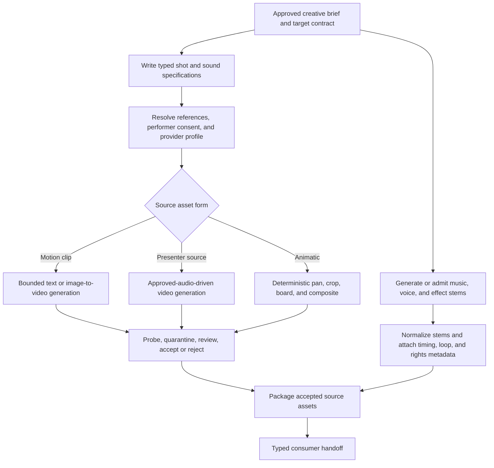
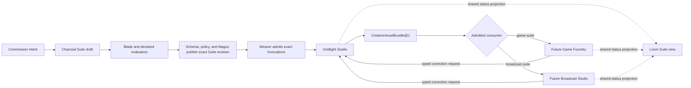

# :material-camera-timer: Voidlight Studio

!!! warning "Reference design — not a delivered studio"
    Voidlight Studio is an accepted Composition study. LychD does not currently ship its Pattern
    pack, creative schemas, asset library, media tools, model profiles, export adapters, Suite
    projection, or artifact migrations. [State of Work](../state-of-the-work.md) remains the
    delivery authority.

**Voidlight Studio** is the shared creative workshop and asset library of the Voidlight Suite
family. It turns an operator commission into typed, immutable, rights-aware creative packages:
style bibles, concept art, sprites, textures, 3D assets, dialogue, voices, music, effects,
previsualization, and cutscene source media. The Magus supplies intent and remains creative
director; Agents perform bounded research, drafting, generation, transformation, review, and
packaging.

The Studio is a Weaver Workflow Application, not a second workflow engine. A future private-coupled
`voidlight` Extension may contribute its Patterns, schemas, tools, projections, and provider
profiles. Weaver governs logical production; it does not become the media store, model host,
renderer, rights registry, game engine, or publication authority.

The Studio deliberately does **not** own an entire game or article/video pipeline.
[Game Foundry](game-foundry.md) owns gameplay source, engine-native import, scenes, builds,
playtests, balancing, and game release. [Broadcast Studio](broadcast-studio.md) owns article
claims, canonical prose, scripts, broadcast timelines, final renders, channel metadata, and
publication. Both consume explicit Voidlight asset handoffs instead of sharing its tables or
silently inheriting its authority.

## Composition descriptor

| Field | Accepted design value |
| --- | --- |
| Stable id / revision | `voidlight.studio` / `2` |
| Specification owner | `project:lychd`; future executable contribution may be `extension:voidlight` |
| Support tier | Architecture-only reference; unsupported |
| Purpose | Produce reusable, auditable creative assets and typed consumer-ready packages under Magus curation |
| Default manual Pattern | `voidlight.build_asset_package@1` |
| Suite membership | Intent-selected `voidlight.game-suite` or `voidlight.broadcast-suite` |
| Primary projection | Loom creative board and asset library plus Reliquary artifact view—both future |
| Provider binding | Operator-owned Runes profiles selected by capability |
| Principal non-goal | Owning consumer gameplay, broadcast assembly, build, playtest, or publication truth |

## Visible outcome and non-goals

One admitted commission should eventually yield a versioned local creative package containing:

- a frozen reference dossier, creative brief, target contract, and style-bible revision;
- typed asset specifications and accepted generated, licensed, captured, or human-authored media;
- concept sheets, stills, sprite atlases, texture sets, 3D exchange assets, dialogue, narration,
  music, effects, previsualization, or cutscene source media as commissioned;
- model, prompt, seed, license, lineage, review, and human-edit receipts; and
- a validated `CreativeAssetBundle@1` handoff without claiming that a consumer imported, rendered,
  played, built, or published it.

The Studio is not an autonomous content farm, game engine, level editor, build farm, playtester,
truth oracle, infinite self-repair loop, deepfake factory, rights-clearing service, broadcast
timeline, or one-click publisher. It may create in the Hexanomicon or Zenith Voidlighter voice,
but presentation identity never dissolves source provenance, consent, consumer contracts, or
human responsibility.

## Anatomical ownership

| Concern | Owner |
| --- | --- |
| Commission, Pattern selection, revision, gates, budgets, and logical priority | Weaver |
| Reference research, creative direction, asset drafting, review, and correction roles | Agents |
| Capability and tool binding | Dispatcher and Runes |
| Model readiness, leases, unload, and hardware arbitration | Orchestrator |
| Reference acquisition, request validation, media probing, deterministic transforms, and export adapters | Typed Tool Animators |
| Model-backed text, image, video, speech, and music powers | Soulstones or opted-in Portals |
| Run, specification, review, approval, export, and handoff receipts | Phylactery |
| Media bytes, manifests, and immutable derivation graph | Reliquary-backed artifact custody |
| Creative acceptance, likeness and voice consent, and consumer handoff | Magus through HitL |
| Asset library, production board, Suite graph, and review surfaces | Loom and future Studio projection |
| Gameplay, engine import, builds, playtests, and game release | [Game Foundry](game-foundry.md) |
| Claims, article, script, broadcast timeline, final render, and publication | [Broadcast Studio](broadcast-studio.md) |

The creative package is canonical only for the assets and contracts the Studio owns. A consumer
may derive an engine-native material, gameplay animation, article scene, or final edit, but that
derived object belongs to the consumer's revision and lineage. Neither a game build nor a video
render may become the only surviving source of a Studio asset.

## Principal production Pattern

### `voidlight.build_asset_package@1`

```text
AdmitCreativeCommission
→ ResolveConsumerTargetContract
→ FreezeReferencesAndExistingAssets
→ DraftCreativeBrief
→ ResolveOrEstablishStyleBible
→ PlanTypedAssetSet
→ AwaitPlanAndBudgetApproval
→ ForgeOrAdmitAssetsByKind
→ ProbeAndNormalize
→ ReviewPackage
→ RepairOnce?
→ ValidateConsumerContract
→ ApproveImmutablePackage
→ EmitTypedHandoff
→ End
```

The Pattern is intentionally finite. The optional repair edge has a fixed finding set, generation
budget, and maximum pass count. Unresolved findings end in non-completion or an operator decision;
they do not summon an unbounded Agent loop. Handoff completion proves only that the immutable
package satisfied its declared export contract. It does not claim that Game Foundry imported it
or that Broadcast Studio rendered it.

The graph groups into six reusable subgraphs:

1. **Reference dossier:** acquire, snapshot, extract, classify, and freeze references and existing
   assets.
2. **Creative contract:** declare purpose, audience, consumer, style, asset kinds, dimensions,
   budgets, rights, target formats, and acceptance tests before expensive inference begins.
3. **Asset forge:** generate, edit, capture, inspect, accept, reject, or replace immutable asset
   candidates without mutating an accepted artifact.
4. **Normalization:** deterministically probe, trim, transcode, pack, label, and validate assets
   against the pinned target contract.
5. **Review and bounded repair:** inspect visual, audio, continuity, identity, rights, and
   technical findings, then repair only approved targets.
6. **Package and handoff:** freeze an export manifest, transfer typed artifact references, and
   record a consumer acknowledgement or honest pending state.

### Asset-family Patterns

The application exposes smaller immutable Pattern revisions rather than teaching one Agent to
improvise every medium. The principal Pattern may admit their already accepted outputs through
typed ports; it does not implicitly launch nested Invocations before Weaver's callable-Pattern
law exists:

| Pattern | Owned outcome | Explicit boundary |
| --- | --- | --- |
| `voidlight.establish_style_bible@1` | Palette, typography, shape language, motifs, prohibited forms, reference sheets, voice and audio direction | A style revision guides consumers; it does not rewrite accepted assets |
| `voidlight.forge_concept_set@1` | Character, environment, prop, mood, and key-art concepts with variant lineage | Concepts are not engine-ready meshes or final broadcast frames |
| `voidlight.forge_sprite_set@1` | Frames, atlas, anchors, timing intent, palettes, and preview | Game Foundry owns runtime animation graphs, collision, and import |
| `voidlight.forge_texture_set@1` | Typed channels, color-space intent, tiling metadata, scale, and previews | Game Foundry owns engine-native material graphs and shader behavior |
| `voidlight.forge_model_asset@1` | Exchange mesh, UVs, named parts, optional rig/animations, units, axes, LOD intent, and turntable | Game Foundry owns engine scene objects, physics, optimization acceptance, and build fit |
| `voidlight.forge_dialogue_pack@1` | Character voice guide, dialogue units, alternates, pronunciation and performance direction | Broadcast Studio or Game Foundry owns narrative placement and runtime branching |
| `voidlight.forge_audio_pack@1` | Voice takes, music or effect stems, loops, loudness targets, timing and license receipts | The consumer owns final mix, ducking, spatialization, and playback logic |
| `voidlight.forge_cutscene_sources@1` | Shot intent, boards, animatic, accepted clips, stems, captions or dialogue cues | The consumer owns engine sequence or broadcast timeline and final render |
| `voidlight.export_asset_package@1` | Deterministic package transform, manifest, checksums, validation, and handoff receipt | Export grants neither consumer authority nor release authority |

`voidlight.review_asset_package@1` can inspect an immutable package later.
`voidlight.revise_from_correction@1` creates a derived revision and invalidation receipt.
`voidlight.presenter_calibration@1` can create consent-bound likeness and voice fixtures. Review,
correction, calibration, and export remain separate Invocations because they carry different
authority, evidence, failure, retention, and idempotency law.

### Motion, sound, and cutscene source forge

After artifact custody, cancellation, and generation budgets are proved, an approved shot and
sound specification may enter this Studio-owned subgraph:



Every generated clip is short, bounded, immutable, and independently accepted. Performer motion
begins from approved audio so speech timing is not invented by the video model. Music, voice, and
effects remain separable stems with source and license receipts. A preview composite may help
creative review, but authoritative engine sequencing or broadcast assembly begins only after the
consumer accepts the handoff.

## Intent-composed Voidlight Suites

A **Suite** is assembled for an admitted intent; it is not one permanent branch over every
creative product. The initial named Suite shapes are:

- `voidlight.game-suite`: Voidlight Studio → [Game Foundry](game-foundry.md); and
- `voidlight.broadcast-suite`: Voidlight Studio → [Broadcast Studio](broadcast-studio.md).



A **Suite** is a typed graph of Composition Invocations and artifact handoffs with one
operator-facing Loom projection. It is not a super-Composition, ambient transaction, shared
database, directory scanner, or union of permissions. Each node keeps its own Pattern revision,
domain records, budgets, checkpoints, effect authority, and recovery. A downstream correction
creates a new explicit Studio Invocation; Game Foundry or Broadcast Studio cannot reach into the
Studio library and mutate an accepted asset.

The Call/Manas may interpret “make me a game with rockets” as a request for the game Suite and
prepare that charcoal graph draft. This is doctrine language for intent interpretation, not a
literal all-powerful service and not final authority. The Blade and declared evaluators
discriminate among candidates; schema validation, policy, and the Magus govern publication of an
exact Suite revision; only Weaver admits its concrete Pattern Invocations.

A Suite may correlate runs by a shared commission id and show one creative journey. Weaver still
admits each Invocation independently, and an approval granted to export an asset never becomes
permission to ship a game, render a canonical broadcast, upload a draft, or publish publicly.
Suite execution remains Designed: until Weaver owns automated edge law, each handoff is an explicit
artifact-backed admission rather than a child Invocation launched by the diagram.

### Consumer ownership

The former all-in-one article-and-video idea decomposes at the handoff:

```text
Voidlight Studio
  reference and style research
  creative brief and asset specifications
  stills, voices, music, effects, clips, boards, and manifests
  CreativeAssetBundle@1
        ↓
Broadcast Studio
  source-to-claim ledger and canonical article
  script, storyboard placement, captions, broadcast timeline
  rough/final render, channel package, correction, and publication
```

Game production follows the same law:

```text
Voidlight Studio
  style bible, concepts, sprites, textures, meshes, rigs, audio, and cutscene sources
  CreativeAssetBundle@1
        ↓
Game Foundry
  engine import, gameplay code, scenes, levels, runtime animation and materials
  builds, automated and agentic playtests, balancing, platform release
```

Article claims, engine truth, and release receipts therefore stay with the Composition able to
verify them. The shared Studio preserves creative provenance and reuse without becoming the owner
of every product that consumes art.

## Capability and tool contract

The Pattern asks for semantic capabilities. Until a broader capability-ontology decision exists,
media operations can enter through named `tool_execution` tools while model calls retain the
existing `chat`, `vision`, `stt`, `tts`, `embedding`, and `rerank` capability families.

| Family | Candidate typed tools |
| --- | --- |
| References | `source.acquire`, `source.extract`, `artifact.materialize` |
| Creative contract | `creative.brief.validate`, `style_bible.compile`, `asset_spec.validate` |
| Inspection | `media.probe`, `image.inspect`, `audio.align`, `model3d.probe` |
| Images | `image.generate`, `image.edit.multi_ref` |
| 2D game assets | `sprite.pack`, `sprite.preview`, `texture.channels.validate` |
| 3D exchange | `model3d.convert`, `model3d.preview`, `model3d.package` |
| Video | `video.generate.text`, `video.generate.image`, `video.generate.audio_driven` |
| Audio and dialogue | `audio.generate.music`, `audio.generate.effects`, `dialogue.compile`, `audio.normalize` |
| Preview | `animatic.render`, `contact_sheet.render`, `turntable.render` |
| Package and handoff | `asset.export`, `asset.package.validate`, `composition.handoff` |

For a model-backed tool id, the local endpoint is still a Soulstone and the remote endpoint a
Portal. Its typed adapter deterministically validates and dispatches the request and commits an
artifact receipt; FLUX, Wan, LTX, TTS, and music generation remain stochastic model acts.
Media probing and a pinned FFmpeg render can be deterministic operations. “Tool” therefore names
the callable contract, not a claim that generation itself is deterministic.

A provider requirement may constrain modalities, structured output, image resolution, video
duration, timestamp support, local-only or Portal eligibility, data classification, license,
cancellation behavior, hardware envelope, cold-start time, monetary budget, and required artifact
or provenance fields. A Pattern must not contain the string `Wan` or `FLUX` as workflow identity.
Sprite packing, channel checks, 3D probing, deterministic conversion, loudness measurement, and
manifest validation should remain deterministic even when the asset entering them was generated
stochastically.

## Researched provider candidates

Research snapshot: **2026-07-22**. These are replaceable Runes, not promised dependencies.

### Creative Mind, Ear, and Voice

| Role | Candidate | Fit and caveat |
| --- | --- | --- |
| Local multimodal creative Mind | [Gemma 4 12B](https://ai.google.dev/gemma/docs/get_started) | Accepts text, image, and audio with text output and targets desktops or small servers; it is a candidate role, not the Studio's identity. |
| Compact direction and visual review | [Qwen3.5-9B](https://huggingface.co/Qwen/Qwen3.5-9B) | Candidate for structured briefs, dialogue, and visual understanding; exact tool and runtime behavior needs local receipts. |
| Local transcription and alignment | [Qwen3-ASR](https://github.com/QwenLM/Qwen3-ASR) | Provides ASR and forced-alignment paths useful for voice takes, dialogue cues, and timing evidence. |
| Conservative transcription baseline | [OpenAI Whisper](https://github.com/openai/whisper) | Mature modular ASR baseline for back-transcribing accepted voice assets. |
| Local narration | [Qwen3-TTS](https://github.com/QwenLM/Qwen3-TTS) | Candidate expressive speech backend; voice design or cloning requires consent and provenance. |

### Image, motion, and visual assets

| Role | Candidate | Fit and caveat |
| --- | --- | --- |
| Default local image forge | [FLUX.2 klein 4B](https://github.com/black-forest-labs/flux2) | Apache-2.0 4B variants support generation and reference editing; the publisher reports about 8 GB VRAM. Larger variants carry different terms. |
| Typography or photoreal alternative | [Z-Image](https://github.com/Tongyi-MAI/Z-Image) | Apache-2.0; Turbo is documented around 16 GB VRAM and is attractive for bilingual text, while advertised edit weights must be verified as released. |
| Poster and multi-image specialist | [Qwen-Image](https://github.com/QwenLM/Qwen-Image) | Apache-2.0 generation and editing family with strong text rendering; single-host fit must be measured. |
| Local motion tier | [Wan2.2 TI2V-5B](https://github.com/Wan-Video/Wan2.2) | Apache-2.0 text/image-to-video; official offload path targets 720p/24 fps on a 24 GB GPU. |
| Audio-driven presenter tier | [Wan2.2-S2V-14B](https://huggingface.co/Wan-AI/Wan2.2-S2V-14B) | Reference image plus audio can drive a presenter, but the official single-GPU example requires at least 80 GB VRAM. |
| Managed quality tier | [Wan 2.7](https://www.alibabacloud.com/help/en/model-studio/video-generate-edit-model) | Current Model Studio video family; remote result URLs expire, so opted-in outputs must be ingested immediately with Portal receipts. |
| Integrated audio-video tier | [LTX-2.3](https://github.com/Lightricks/LTX-2) | Broad synchronized audio/video workflows; official minimum is 32 GB VRAM and its community license needs review for the operator's use. |

[HunyuanVideo-1.5](https://github.com/Tencent-Hunyuan/HunyuanVideo-1.5) is excluded from a
Slovak/EU deployment under its published geographic license restriction even though its hardware
profile is attractive. Technical fit never overrides legal eligibility.

This research snapshot does not yet accept a 3D-generation, retopology, rigging, or animation
provider. A 3D Rune must earn its place with format, topology, scale, UV, skeleton, animation,
license, hardware, and deterministic probe receipts; a fashionable demo is not an interchange
contract. The same applies to specialized sprite and texture generators.

For music, [ACE-Step](https://github.com/ace-step/ACE-Step) is a future Apache-2.0 local candidate.
For synchronized video effects, [MMAudio](https://github.com/hkchengrex/MMAudio) is a research
candidate whose model/dependency licenses and commercial suitability must be reviewed for the
exact bundle. Generated music and effects remain optional; a lawful licensed library is often the
safer first provider.

## Deterministic transforms and artifact law

[OpenTimelineIO](https://github.com/AcademySoftwareFoundation/OpenTimelineIO) is a useful
cutscene and broadcast interchange candidate. [FFmpeg](https://ffmpeg.org/ffmpeg.html) can produce
Studio previews, normalize audio/video source assets, and materialize deterministic derivatives.
Game Foundry or Broadcast Studio owns any authoritative product render. Reproducibility means
pinning the build, codec implementation, filter graph, fonts, inputs, stream mapping, command, and
metadata—not claiming that `-bitexact` makes different hardware and versions identical.

Every material artifact needs, as applicable:

- content digest, media type, dimensions, duration, sample rate, and parent artifact ids;
- source URL or local origin, acquisition time, excerpt map, classification, and license evidence;
- capability, provider, model id, immutable revision, runtime or image digest, and Runes profile;
- normalized request, prompt, negative prompt, seed, sampler, inference settings, and cost;
- accepted, rejected, superseded, or edited disposition with human edit attribution;
- complete transform or preview-render command and output probe;
- Portal request/response receipt and immediate custody transfer when remote; and
- retention, export, deletion, consent, and rights-restriction state.

The creative derivation graph forms a traceable chain:

```text
frozen reference + style revision + asset specification
→ generated, licensed, captured, or human-authored candidate
→ accepted immutable asset revision
→ normalized derivative
→ CreativeAssetBundle@1
→ consumer-owned import or placement receipt
```

Changing or withdrawing a reference, consent, or license marks affected derivatives and handoffs
stale. It does not rewrite history or silently mutate a previously handed-off bundle. Broadcast
Studio owns the stronger source → claim → article → script → frame chain for factual work; Game
Foundry owns the asset → import → scene → build chain for a game.

## Typed immutable handoff

`CreativeAssetBundle@1` is a manifest over Reliquary artifact references, not a zip file whose
filenames carry hidden meaning. Its minimum contract is:

| Object | Required fields |
| --- | --- |
| Bundle identity | Bundle id, immutable revision, commission id, Studio Pattern revision, digest, creation time |
| Consumer target | Intended Composition, target-profile id/revision, purpose, required versus optional assets |
| Asset entry | Stable asset id, semantic kind and role, artifact digest, media/exchange type, parents, disposition |
| Spatial and visual contract | Dimensions or units, axes, origin/anchor, color space, alpha, channels, frame or LOD intent |
| Temporal and audio contract | Duration, frame/sample rate, loop points, cue ids, loudness target, language and pronunciation where applicable |
| Rights and provenance | Origin, provider/runtime, prompts/settings where applicable, license evidence, consent, allowed uses, expiry or territory constraints |
| Validation | Pinned validators, results, known findings, waivers, Magus approval, export receipt |

The target-profile revision is supplied or accepted by the consumer Composition. For Game Foundry
it may declare engine interchange formats, units, axes, sprite anchors, skeleton names, texture
channels, polygon and memory budgets, platform constraints, and audio loop rules. For Broadcast
Studio it may declare frame geometry, color space, alpha, frame rate, audio layout, loudness,
caption or cue interchange, and edit-safe handles.

Handoff follows a two-sided protocol:

```text
Studio validates export contract
→ freezes CreativeAssetBundle@1
→ emits artifact references plus idempotency key
→ consumer validates import contract
→ consumer records accepted, partially accepted, rejected, or unknown receipt
→ any correction becomes a new typed request and new Studio Invocation
```

An accepted Studio export can still fail consumer import. Unknown acknowledgement is reconciled by
bundle id and digest; it is never “fixed” by generating another package blindly. The consumer may
cache or derive its own copies, but it records the Studio bundle revision as a parent and never
writes into the Studio's asset records.

## Gates and external effects

Required gates include reference classification and acquisition rights, explicit Portal egress,
creative-plan and budget approval before expensive generation, performer likeness and voice
consent, asset-license acceptance, accepted-asset replacement, target-contract validation, final
package approval, and consumer handoff.

Portal generation and cross-Composition handoff are effect-bearing steps. Each receives an
idempotency key and records the provider or consumer, request, object or bundle id, response, and
human approval. Retry reconciles by remote request id or immutable bundle digest; it may never
duplicate a paid generation or consumer handoff because an acknowledgement was lost. Upload,
game release, and broadcast publication are not Studio gates because they are not Studio effects.

## Lifecycle, retention, and compatibility

- **Durable owner:** a future `voidlight` application owner owns commission, reference snapshot,
  creative brief, style revision, asset specification, finding, approval, export, and handoff
  schemas; Reliquary custody owns immutable media bytes and manifests. Graph checkpoints are never
  the project database.
- **Migration:** application schema, manifest schema, Pattern revision, provider receipt, and
  transform environment are versioned separately. Upgrades prove clean install, forward
  migration, interrupted recovery, old-bundle readability, and target-profile compatibility
  before promotion.
- **Retention:** the Magus selects reference, intermediate, rejected-generation, raw performance,
  provider-receipt, accepted-asset, and handoff retention under license, consent, and withdrawal
  constraints. Expiring Portal outputs are ingested immediately or the Invocation fails honestly.
- **Export and deletion:** one export contains permitted assets, lineage, references permitted for
  export, prompts/settings, approvals, target contract, and checksums. Deleting a Studio project
  inventories derived assets, caches, Portal objects, handoffs, and credentials. Consumer or
  published copies require a withdrawal/takedown request and content-free receipt rather than
  pretending downstream bytes vanished.
- **Recovery:** immutable accepted artifacts and the manifest permit package work to resume
  without regenerating prior assets. Unknown provider and handoff effects reconcile by id before
  retry.
- **Parked Invocation:** every run pins Pattern, checkpoint, manifest, and tool-schema revisions.
  An incompatible upgrade drains, explicitly migrates, or terminates non-complete; it never resumes
  an old checkpoint under a new production grammar.

## Priority, residency, and preemption

| Work class | Target doctrine priority | Physical expectation |
| --- | ---: | --- |
| Operator intervention, cancel, or safety action | `100` | Break-glass authority only |
| Interactive Studio editing and review | `70` | Prefer warm lightweight Mind or reviewer |
| Commissioned production | `50` | Queue expensive generations; safe-boundary preemption |
| Indexing, proxies, optional enhancement, or archive work | `20` | Must not force a disruptive cold swap |

The MVP is commissioned manually. One bundle revision admits at most one package Invocation; a
duplicate client request reconciles by commission and revision id. New commissions may queue or
run logically beside one another, but two export or repair Invocations may not mutate the same
bundle revision. A correction creates a new derived revision instead of replacing an approved
artifact in place.

Future schedules may prepare previews, indexes, reference-refresh candidates, or an already
approved batch during quiet hours. They coalesce rather than replay missed work and never schedule
consumer release or publication. A schedule firing is a Weaver Occurrence entering normal
admission—not a timer that loads Wan, starts FFmpeg, or sends a handoff directly.

The current operator-configured hard-swap gate defaults to `40`, so background work at `20` cannot
trigger a disruptive hard swap. The richer latency, overlap, and preemption vector remains future
architecture. Current priority is run-wide; a node cannot silently escalate its own Invocation.

On a 24 GB target, an illustrative serial residency profile is: creative Mind unloads, image
model loads and unloads, Wan2.2 5B loads only for approved clips and unloads, Voice or music loads
and unloads, then the lightweight reviewer returns. Media and 3D probing plus FFmpeg remain
CPU-resident where practical. Orchestrator—not the Pattern—decides actual placements and
transitions.

## Smallest proving slice

The first useful Voidlight production is a small style-led 2D asset pack with no engine or channel
integration:

1. freeze a small operator-approved reference set and one synthetic consumer target profile;
2. approve a creative brief and a versioned style bible;
3. generate or admit one character concept, a short sprite sequence, one texture or background,
   and one dialogue or effect stem with complete provenance;
4. probe and normalize every accepted artifact with deterministic tools;
5. perform one bounded visual, audio, continuity, rights, and technical review/repair pass;
6. package `CreativeAssetBundle@1` with checksums, lineage, rights, and target metadata;
7. validate it against both Studio export and synthetic consumer-import fixtures; and
8. record the handoff receipt without running an engine, building a game, rendering a final
   broadcast, or publishing anything.

This slice proves reusable style, heterogeneous media custody, deterministic packaging, and the
Composition boundary before 3D generation, expensive motion, real engine import, or public release
obscures the harder questions of lineage and recovery.

## Staged roadmap

1. **Shared schemas:** commission, reference snapshot, creative brief, style revision, asset
   specification, target profile, finding, approval, bundle, and handoff receipt.
2. **Deterministic library:** operator assets, content-addressed custody, probes, thumbnails,
   normalization, export manifests, and synthetic consumer conformance.
3. **Image and 2D forge:** replaceable providers, concept/style continuity, sprite and texture
   tools, acceptance UI, budgets, and lineage.
4. **Studio and Suite projection:** Loom views for library assets, steps, gates, findings,
   invalidation, explicit handoffs, and per-Composition authority.
5. **Voice, dialogue, and sound:** consent-bound performances, dialogue packs, lawful music/effects,
   alignment, loop and loudness metadata.
6. **3D exchange:** provider research, mesh/UV/rig/animation contracts, deterministic probes,
   previews, target profiles, and bounded conversion.
7. **Motion and cutscene sources:** bounded image/video generation, animatics, separate stems,
   cancellation, and resource receipts without claiming final assembly.
8. **Consumer integrations:** conformance handoffs to Game Foundry and Broadcast Studio after each
   Composition independently exists and owns its import truth.
9. **Teaching kit:** publish Pattern grammar, target-profile examples, and manifests without
   publishing operator secrets, private references, performer fixtures, or model credentials.

## Current delivery gaps

The Core does not yet prove Composition contribution, the Suite abstraction, creative asset
schemas, media/3D tool ontology, artifact custody, style or derivation lineage, target profiles,
typed cross-Composition handoff, provider eligibility by license, GPU-aware generation budgets, or
Studio/Suite projection. Game Foundry and Broadcast Studio remain future application designs.
Current priority and capability structures are useful substrate, not a functioning studio.

## Continue

- Return to the [Composition Portfolio](index.md) for the application and Suite map.
- Read [Weaver](../sepulcher/extensions/weaver.md) for workflow jurisdiction.
- Read [Dispatcher](../adr/22-dispatcher.md) and [Orchestrator](../adr/23-orchestrator.md) before
  binding a model family or residency profile.
