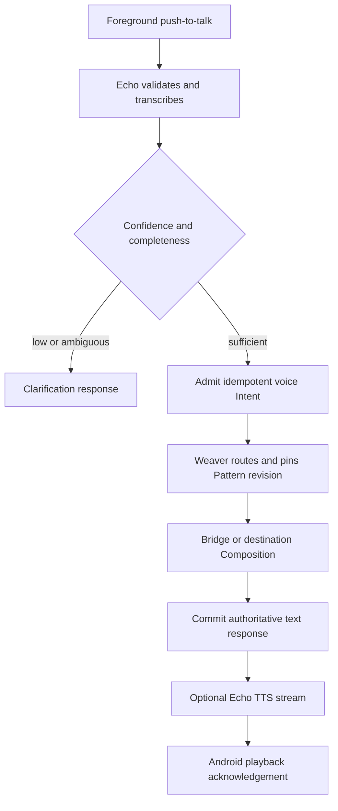

# :material-account-voice: Walking Communion

!!! warning "Reference design — not a working mobile interface"
    Walking Communion is an accepted Composition study. Current LychD has no Android client,
    remote caller authentication, Tether, audio WebSocket, working STT/TTS adapters, or playable
    artifact custody. [State of Work](../state-of-the-work.md) owns that boundary.

**Walking Communion** gives the Magus a deliberate voice path into the Lich while away from the
Altar. A thin Kotlin Android client—the **Mobile Emissary**—carries a bounded utterance through a
private Tether. Echo converts resonance into an authenticated Intent; Weaver routes it into Bridge
or another Composition; the committed text response may then return through Echo as speech.

The APK is not a second Lich and not an in-process LychD Extension. It runs on another body and
speaks a narrow protocol. The end-to-end application is the Composition.

## Composition descriptor

| Field | Accepted design value |
| --- | --- |
| Stable id / revision | `walking.communion` / `1` |
| Specification owner | `project:lychd`; Mobile Emissary and server contribution owners remain future |
| Support tier | Architecture-only reference; unsupported |
| Purpose | Carry one authenticated bounded voice utterance from a private Android client into the Portfolio and return a committed response |
| Default manual Pattern | `communion.voice_turn@1` |
| Primary projection | Kotlin Mobile Emissary with a corresponding local session/result view |
| Provider binding | Echo `stt`/`tts` plus Dispatcher-selected `chat` Runes |
| Principal non-goal | Always-on surveillance, voice-only authority, or emergency monitoring |

## Visible scenario and non-goals

While walking, the operator holds a button and says, for example:

- “Record this thought for the Voidlight essay.”
- “Log a forty-minute walk and how my knee feels.”
- “What is the next approved Studio task?”
- “Ask the Minecraft inhabitant for a status report.”

The phone displays the normalized transcript, sends one explicit utterance, and receives a text
answer with optional live speech. Ambiguous or consequential commands require clarification or a
separate touch confirmation.

The first slice is not always listening, an emergency service, a medical monitor, an
administrative console, or an offline command queue. Voice is content—not identity, authority, or
consent.

## Anatomical ownership

| Concern | Owner |
| --- | --- |
| Microphone permission, push-to-talk, local VAD, codec, playback, and barge-in | Kotlin Mobile Emissary |
| Encrypted private reachability | Tether / WireGuard |
| Device and application authentication, scopes, revocation, and object policy | Ward |
| Audio session, chunks, validation, STT/TTS, and ephemeral buffering | Echo / Vessel |
| Utterance routing, Pattern selection, logical priority, and child Invocation | Weaver |
| Queue delivery, retry, and crash pickup | Workers / Ghouls |
| STT, chat, and TTS provider selection | Dispatcher |
| Soulstone readiness, co-residency, lease drain, and swaps | Orchestrator |
| Run, transcript policy, response, and receipt truth | Phylactery and owning Composition |
| Domain action and confirmation | Destination Composition and HitL |

WireGuard proves possession of an enrolled tunnel key and encrypts packets. It does not identify
the current human or app process, authorize an object, prevent application replay, or make a
stolen phone trustworthy. Tether narrows reachability; Ward supplies application authority.

## Media path and semantic boundary

Raw audio chunks and live socket state must never become Graph checkpoint state. Echo owns the
high-frequency media path:

```text
microphone frames → VAD/codec → authenticated stream → STT → final utterance
```

Only one complete, authenticated, bounded utterance becomes an idempotent Intent:



TTS delivery is a projection of the committed response, not workflow success. If speech synthesis
or the socket fails, the principal-bound text remains available.

## Candidate Pattern inventory

### `communion.voice_turn@1`

One utterance becomes one finite Invocation:

```text
AdmitVoiceIntent
→ NormalizeTranscript
→ ClassifyReadOnlyRoute
→ ClarifyOrRoute
→ InvokeBridgeOrDestination
→ CommitTextResponse
→ RequestOptionalSpeech
→ End
```

The MVP routes only to Bridge, note capture, and narrow read-only status queries. Cross-Composition
effects arrive later through explicit parent/child Invocation and authority contracts.

### Later Patterns

- `communion.capture_note@1`: store an operator-approved text note with provenance.
- `communion.review_pending@1`: summarize pending Composition work without mutating it.
- `communion.route_command@1`: create a typed candidate command and, when necessary, a separate
  visual/touch consent request.
- `communion.resume_result@1`: retrieve a completed response after disconnect without replaying
  the original Intent.

A voice session is not one immortal Pattern. Echo may keep a short-lived connection and Weaver may
relate successive turns, but every consequential utterance has a stable id, bounded run, and
terminal outcome.

## Reusable subgraphs and compute ownership

| Subgraph | Work | Owner and capability |
| --- | --- | --- |
| **CaptureAndTranscribe** | Foreground audio frames, VAD, bounds, final marker, STT, confidence, and normalized transcript | Mobile Emissary + Echo; local Ear Soulstone behind `stt` |
| **AuthenticateAndAdmit** | Device/app proof, replay window, scopes, quotas, utterance id, and Intent admission | Tether narrows reachability; Ward authenticates/authorizes; Weaver admits |
| **ClarifyAndRoute** | Read-only route classification, low-confidence clarification, and exact Pattern selection | Local `chat` Mind under Weaver; no authority escalation |
| **DestinationHandoff** | Create a typed child Invocation for Bridge, note capture, HFM, Minecraft, or Studio | Weaver parent/child relation; destination owns data, gates, and effects |
| **CommitAndSpeak** | Commit authoritative text, request optional TTS, stream playback, and acknowledge delivery | Destination/Phylactery commit first; Echo Voice Soulstone projects speech afterward |
| **RecoverDisconnectedTurn** | Resume result lookup by principal and utterance id without replaying the original command | Ward + Weaver/Phylactery; stale audio is discarded |

Only CaptureAndTranscribe and CommitAndSpeak touch audio bytes. Only the destination subgraph may
perform a domain effect, under that Composition's own policy.

## Capability contract and candidate providers

The Composition requests capabilities, not one mandatory speech model:

| Need | Capability shape |
| --- | --- |
| Modular transcription | `stt`, streaming preferred, timestamps/confidence, local required by default |
| Native audio understanding | `chat` with `audio` in `modalities_in`, structured text output |
| Intent reasoning | `chat`, tool/structured-output support, low-latency local profile |
| Speech response | `tts`, streaming preferred, explicitly approved voice identity |
| Transport | authenticated bidirectional audio session with bounded frames and replay protection |

Research snapshot: **2026-07-22**. These are exploration anchors, not delivery claims:

| Role | Candidate | Fit and caveat |
| --- | --- | --- |
| Unified local audio-aware Mind | [Gemma 4 12B](https://ai.google.dev/gemma/docs/capabilities/audio) | Google documents multilingual audio understanding and ASR with text output. Audio clips are currently bounded to 30 seconds; it is not speech output or automatically a low-latency stream. |
| Smaller edge-aware alternative | [Gemma 3n](https://ai.google.dev/gemma/docs/gemma-3n) | Designed for phones and laptops with audio input, useful for future on-device fallback or a light server tier. |
| Dedicated local Ear | [Qwen3-ASR and ForcedAligner](https://github.com/QwenLM/Qwen3-ASR) | Open ASR/alignment path for streaming or offline transcription and timestamp evidence. Runtime fit still needs a host receipt. |
| Conservative Ear | [OpenAI Whisper](https://github.com/openai/whisper) | Mature open transcription baseline; modular pipeline preserves an auditable transcript before reasoning. |
| Modular NVIDIA speech set | [NVIDIA Speech NIM](https://docs.nvidia.com/nim/speech/latest/about/index.html) | Separate streaming ASR and TTS services expose HTTP/gRPC and map cleanly to Ear/Voice Animators; deployment and license terms must be verified for the chosen models. |
| Full-duplex experimental Soulstone | [Nemotron 3 VoiceChat 12B](https://developer.nvidia.com/nemotron-voicechat-early-access) | Unifies ASR, reasoning, and TTS for real-time speech-to-speech, but remains early access and should not replace the auditable modular MVP. |
| Open full-duplex experiment | [Kyutai Moshi](https://github.com/kyutai-labs/moshi) | Open spoken-dialogue framework with streaming audio codec; a later conversational tier, not the authority or workflow owner. |
| Local Voice | [Qwen3-TTS](https://github.com/QwenLM/Qwen3-TTS) | Expressive local speech and voice design; cloning or presenter identity requires explicit voice consent and provenance. |
| Android capture | [Android `AudioRecord`](https://developer.android.com/reference/android/media/AudioRecord) | Native pull-based microphone frames suit bounded streaming; the app owns permissions, buffers, lifecycle, and immediate local stop. |
| Device credential | [Android Keystore](https://developer.android.com/privacy-and-security/keystore) | Keeps an app-specific proof-of-possession key and can require fresh device authentication for sensitive confirmation. |
| Private transport | [WireGuard Android](https://git.zx2c4.com/wireguard-android/about/) | Provides an Android tunnel implementation/library; remains transport rather than application authentication. |

The first reliable configuration is modular: Ear → text Mind → Voice. A full-duplex model may later
provide a lower-latency projection, but important commands should still yield a normalized textual
Intent and durable result.

## Priority, residency, and preemption

The client never chooses doctrine priority. After Ward authentication, quotas, frame validation,
and utterance completion, the server maps the voice endpoint to an operator-configured **reflex**
class. The first proposed value is `80`: above ordinary interactive `70`, below break-glass `100`,
and still subject to quotas and safe-boundary preemption. This value is architecture, not a current
server mapping.

| Work | Target policy |
| --- | --- |
| Foreground voice turn | Reflex latency; safe preemption after the current atomic capability lease |
| Clarification and live TTS | Interactive; no authority escalation |
| Destination command | Inherits the destination Pattern's authority and effect policy, not voice urgency |
| Transcription cleanup or optional indexing | Background; must not force a disruptive swap |

Safe preemption means:

1. stop admitting new conflicting background work;
2. let active leases finish their atomic step;
3. park affected Graphs at legal boundaries;
4. ready the Ear/Mind/Voice substrate;
5. serve the admitted voice turn; and
6. restore background admission afterward.

It never means killing a database mutation, upload, Minecraft action, render, or in-flight model
call. Interactive priority is scheduling urgency, not permission to perform a consequential act.

A cold GPU swap may still take too long for natural conversation. A viable profile needs one of:

- a small persistent Ear and Voice on CPU/GPU;
- a session-duration Audio Coven reservation with idle expiry;
- on-device transcription fallback;
- or an explicitly accepted slower push-to-talk interaction.

Orchestrator chooses residency. Weaver may declare latency and forecast demand but cannot name the
container to evict.

## Android client contract

The Mobile Emissary should remain deliberately thin:

- foreground push-to-talk with visible microphone and duration state;
- local VAD, mono encoding, bounded frames, jitter/reconnect buffer, and immediate cancel;
- `session_id`, `utterance_id`, frame sequence, content digest, final marker, and retry cursor;
- separate WireGuard tunnel key and Android-Keystore application key;
- challenge-response authentication yielding a short-lived scoped session;
- transcript preview and correction before consequential routing;
- text display before or alongside speech playback;
- local barge-in and a distinction between “stop speaking” and “cancel the run”; and
- no durable workflow, master credential, provider secret, or application database.

If offline, the MVP fails visibly closed. Optional local capture is only an encrypted draft with a
short expiry and requires explicit review and send after reconnection. It never executes
automatically when connectivity returns.

## Privacy, authority, and failure law

- Raw voice is `restricted`; transcript and reply are at least `private`.
- Raw and synthesized bytes are ephemeral by default and are not used for training.
- Portal STT/TTS requires explicit provider opt-in; no silent privacy fallback exists.
- Every tunneled request still requires Ward authentication and principal-bound object policy.
- Duplicate, stale, out-of-order, oversized, malformed, or replayed frames fail closed.
- Low-confidence speech requests clarification; it never guesses a consequential command.
- Voice-only “yes” cannot authorize administration, publication, purchases, world rollback, or
  health treatment. Sensitive effects require a normalized action and fresh visual/touch consent.
- A disconnected run may complete and leave text; stale buffered speech never autoplays later.
- “Health” utterances do not receive emergency priority or make the system a medical service. A
  deterministic local emergency dialer action remains independent of LychD.

Always-on listening is a separate surveillance capability, not an MVP toggle. It would require a
local-only wake word, persistent OS indicator, no server bytes before wake, bystander policy,
capture audit, battery and data limits, and an unmistakable hard disable.

## Lifecycle, retention, and compatibility

- **Durable owner:** Walking Communion owns enrolled-device metadata, revocation, session envelope,
  utterance/result correlation, and delivery acknowledgement only. The destination Composition
  owns a routed note, health log, Studio commission, or Minecraft mission; Echo's audio buffer is
  not durable domain state.
- **Migration:** mobile protocol, frame/codec, authentication challenge, Intent, Pattern, and result
  schemas version independently. Client/server negotiation fails closed when no safe overlap
  exists; an APK update cannot reinterpret a queued old command.
- **Retention:** raw and synthesized audio expire after the bounded session by default. Transcript,
  response, authentication audit, and derived artifacts follow explicit purpose and retention;
  destination data follows the destination's stricter policy.
- **Export and deletion:** the mobile app can export no server authority or secrets. The principal
  may inspect/export retained transcript metadata and revoke/delete the device enrollment and
  Communion-owned history; destination records are exported or deleted through their owning
  Composition rather than by a broad voice command.
- **Recovery:** reconnect retrieves a committed result by principal and `utterance_id`. It never
  resends stale audio, replays the Intent, or autoplays an old response.
- **Parked Invocation:** each admitted utterance pins Pattern and protocol revisions. Compatible
  server upgrades may return its result; incompatible parked work terminates honestly and requires
  a fresh, visible utterance.

## Smallest proving slice

1. One adult operator and one locally enrolled Android device.
2. Foreground push-to-talk capped at roughly fifteen seconds.
3. Isolated WireGuard path exposing only one TLS-protected voice endpoint.
4. Separate app-key challenge/response and short-lived scopes.
5. Local modular STT, one text reasoning Soulstone, and local TTS.
6. Bridge, note capture, and read-only status commands only.
7. Server-assigned interactive/reflex priority with one active turn per device.
8. Ephemeral audio bytes, durable text result, reconnect by `utterance_id` without replay.
9. Tests for stolen tunnel key, revoked app key, replay, object guessing, priority flood,
   transcript injection, disconnect, deletion expiry, and locked-device playback.

No public proxy, always-on capture, Portal, mobile approval, administrative tool, health diagnosis,
emergency monitoring, or delayed command execution belongs in this slice.

## Staged roadmap

1. **Protocol:** freeze utterance, frame, acknowledgement, replay, cancellation, and result schemas.
2. **Ward before reachability:** implement credential-backed caller and object authorization.
3. **Tether:** prove isolated gateway, enrollment, rotation, revocation, and exact route allowlist.
4. **Echo ingress:** bounded byte transport, STT, ephemeral custody, and durable text outcome.
5. **Android PTT:** capture, authentication, reconnect, text response, and local stop.
6. **Speech response:** TTS streaming and foreground-only playback acknowledgement.
7. **Weaver voice turn:** pinned Pattern, clarification, priority propagation, and Bridge routing.
8. **Cross-Composition routing:** typed child Invocations and independent effect consent.
9. **Conversational tier:** measured Audio Coven residency, barge-in, and optional full-duplex model.
10. **Ambient research:** only after a separate privacy and bystander decision.

## Current delivery gaps

The current core proves priority propagation, narrow runtime transitions, modality metadata, and an
immutable audio `ArtifactRef`. It does not prove audio byte storage, remote Ward identity, Tether,
Echo transport, STT/TTS, mobile replay safety, Composition registration, or cross-Composition
Invocation. The current Loopback Altar must not be tunneled to a phone and called secure.

## Continue

- Read [Audio Echo](../adr/37-audio.md) and the [Echo](../sepulcher/extensions/echo.md).
- Read the hardened [Tether](../sepulcher/extensions/tether.md) and future
  [Ward](../sepulcher/extensions/ward.md).
- Return to the [Reference Composition Portfolio](index.md) for the application map.
