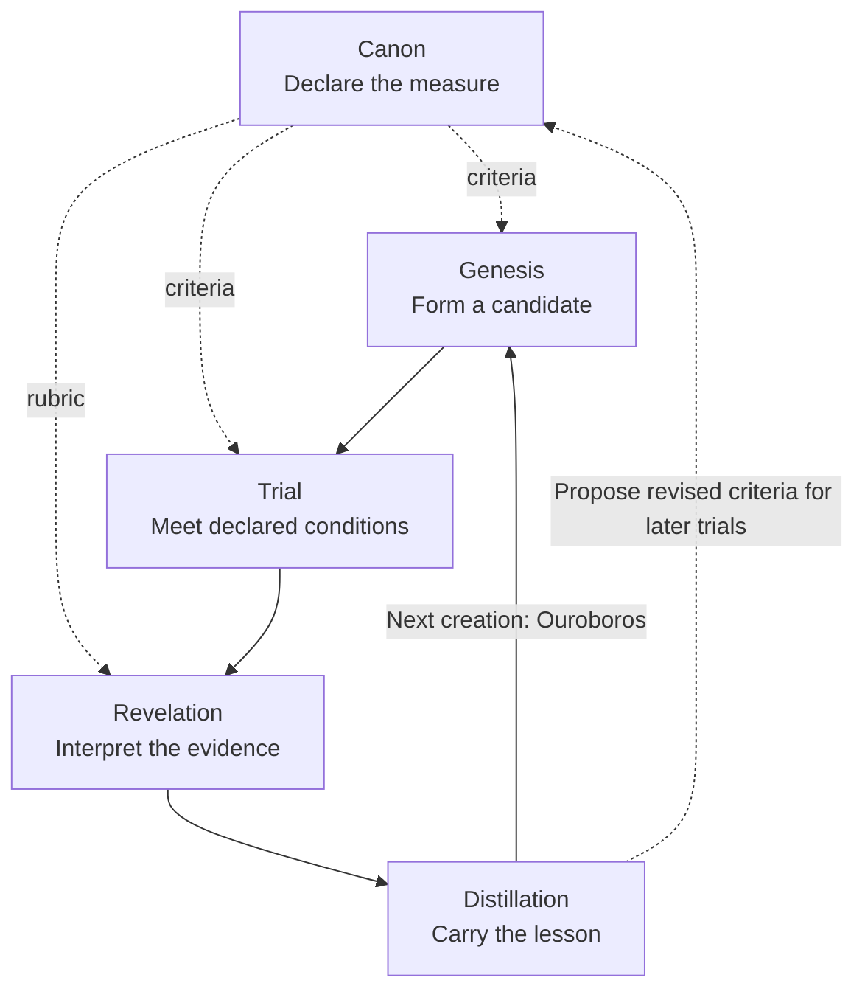

# :material-autorenew: Transmutation

A purpose acquires form, the form meets a world it cannot dictate, and the encounter changes
what can be made next. **Transmutation** follows that whole passage. **Ouroboros** names its
return: consequence becomes a distinction carried into another act of creation.

Beside [Transcendence](../transcendence/index.md), which unfolds the Great Work's horizon,
these chapters follow the transformation of a particular undertaking. Their questions can be
practiced through ordinary development and review; the autonomous operating designs they link
remain subject to the delivery boundaries in [State of Work](../../state-of-the-work.md).

## Tree of Life

The Tree brings purpose, possibility, understanding, restraint, generosity, integration,
persistence, acknowledgment, connection, and manifestation into relation. The author's
whiteboard workflow preceded this comparison. The sefirotic reading deepens that independently
developed design by asking what each contribution needs from another.

[Genesis](genesis.md#tree-of-life) develops this reading and its question of symmetry,
including the named sefirot, pillars, Adam Kadmon, and source distinctions.
The five chapters below follow the undertaking through those
relations. They are not five sefirot or a fixed roster of Agents.

## Five chapters of the return

| Chapter | Question | What it carries |
| --- | --- | --- |
| [Genesis](genesis.md) | What shall we bring into existence? | Purpose, explored alternatives, and an attributable candidate. |
| [Trial](trial.md) | What happens when the candidate meets declared conditions? | Experiments, observations, and their limits. |
| [Canon](canon.md) | By what measure can we judge it? | Criteria, constraints, and the evidence needed for a verdict. |
| [Revelation](revelation.md) | What did the encounter disclose? | Findings, uncertainty, diagnoses, and proposed corrections. |
| [Distillation](distillation.md) | What should the next creation inherit? | A lesson with its conditions, source, and a proposed next use. |

This is a reading order. **Canon enters before creation and testing**, and informs how results
are interpreted. Criteria cannot be chosen after seeing a result merely to make it pass.

The arrows show dependencies of meaning and evidence. [Weaver's Ouroboros](../../sepulcher/extensions/weaver/ouroboros.md#why-the-whole-is-not-one-dag)
keeps the operational distinction between a recurring method and separately admitted acts.
This cycle is not itself one executable DAG or a hidden coordinator.

The chapter names carry a light literary thread through the
[Pentateuch](https://bible.usccb.org/bible/thepentateuch/0): beginnings, departure, ordered
practice, an accounting of the journey, and remembrance before a new undertaking. Each chapter
acknowledges its source; the engineering correspondence is the Hexanomicon's own composition.

## From meaning to method

[SDLC](../../adr/16-sdlc.md#the-agentic-graph-of-creation) owns the architectural
passage from candidate through verification to an owned effect.
[Weaver's Creation](../../sepulcher/extensions/weaver/creation.md) applies the creative method to
software. [Drift](../../sepulcher/extensions/drift/workflow-improvement.md) connects declared
criteria with observed results and findings; [Soulforge](../../sepulcher/extensions/soulforge/discernment-training.md)
receives a separately justified training hypothesis when the lesson calls for one.
