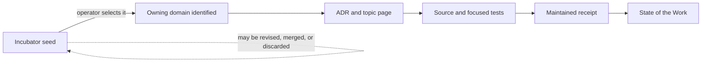

# :material-test-tube: Incubator: Uncommitted Forms

!!! warning "Proposal shelf — not LychD delivery"
    Everything in this chamber is an **uncommitted design seed**. An Incubator page is not an
    accepted Covenant, implemented capability, operator guide, release promise, priority, or
    delivery label. [State of the Work](../state-of-the-work.md) remains the sole granular public
    delivery record.

The Incubator preserves ideas that are too coherent to lose and too early to harden into law. It
is where a possible Pattern, extension, workload, product surface, or tutorial can be examined
before the project knows which organ should own it.

This is deliberately not called a backlog. A backlog implies commitment and ordering. Actionable
work enters GitHub Issues only after the operator chooses to pursue it and the owning architecture
is clear. Publication here means **remember this possibility**, not **build this next**.

## Current programs

| Seed | Possible form | What it explores |
| --- | --- | --- |
| [Building in Public](building-in-public.md) | Publication method | Tutorial seasons that follow a real feature from idea through ADR, Rune, migration, extension, Pattern, evidence, and release. |

## Graduated into Reference Compositions

The Magus selected four application directions. They now live as evolving designs in the
[Reference Composition Portfolio](../compositions/index.md):

- [Voidlight Studio](../compositions/voidlight-studio.md)
- [Minecraft Agent Server](../compositions/minecraft-agent-server.md)
- [Health, Food & Movement](../compositions/health-food-and-movement.md)
- [Walking Communion](../compositions/walking-communion.md)

Graduation means the direction and owning contract are accepted. It does not mean the application
is implemented, scheduled, installed, or assigned a delivery state.

The former seed URLs retain short graduation notices for [Voidlight
Studio](voidlight-studio.md), [Minecraft Agent Server](minecraft-agent-server.md), and the renamed
[Food and Exercise seed](food-and-exercise-agent.md); they are not parallel specifications.

## Incubator, architecture, backlog, and delivery

These surfaces answer different questions:

| Surface | Question | Authority |
| --- | --- | --- |
| **Incubator** | What might be worth forming, and what would it take to test? | Proposal only. |
| **GitHub Issue or Project** | What accepted work are we choosing and tracking? | Actionable coordination, not architecture or proof. |
| **ADR and owning topic** | What architecture and domain law did we accept? | Decision and doctrine. |
| **Source, tests, and receipts** | What behavior can be observed and reproduced? | Executable evidence. |
| **State of the Work** | What delivery boundary does that evidence support publicly? | Delivery truth. |

Merely writing a detailed seed does not make it **Designed**. That delivery label begins only when
accepted architecture has an owner and State records the exact designed boundary.

## What every seed must carry

An Incubator card should make future judgment cheaper by recording:

1. the human intent and visible scenario;
2. a candidate LychD composition, explicitly marked as provisional;
3. the smallest useful proving slice;
4. authority, privacy, safety, and external-effect boundaries;
5. data ownership, migration, export, deletion, and recovery questions;
6. dependencies that do not yet exist;
7. the strongest unresolved questions;
8. a publication or tutorial angle that does not pretend commands already work; and
9. the criteria by which the seed could leave this chamber.

Not every seed is an extension. A mature design may instead become a Weaver Pattern, an Agent, an
extension-owned integration, a local managed service, an external Animator, or a separate project
that interoperates with LychD. The Incubator exists partly to prevent this classification from
being guessed too early.

## The tutorial boundary

The Incubator may record a **tutorial arc**, but it does not own runnable commands. Once a slice
works, its concept, configuration, operation, and troubleshooting move to the owning Sepulcher or
Divination topic. A video or article then teaches from that source and links back to it instead of
becoming a second, drifting manual.

> _The Incubator protects possibility from forgetfulness and the body from premature law._
