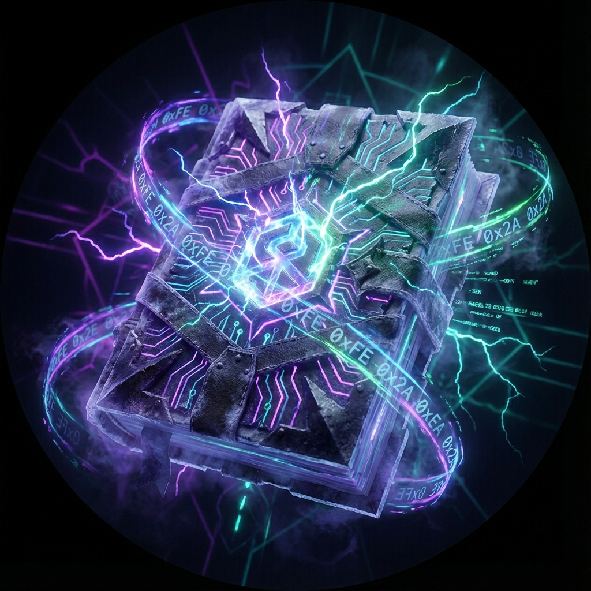

  
    
  <h1 style="font-size: 3.5em; font-weight: 800; background: linear-gradient(90deg, #7c4dff, #00e5ff, #00ff9d); -webkit-background-clip: text; -webkit-text-fill-color: transparent; margin-bottom: 10px; margin-top: 0; filter: drop-shadow(0 0 10px rgba(0, 229, 255, 0.2));">
    The Hexanomicon
  </h1>
  

    Forty-Two Keys Across the Infinite Naught
  

  

    <em>無限の彼方、虚無の深淵</em>
  

  

    
    
  

 

# :fontawesome-solid-book-skull: The Prophecy

**At last.** You have unearthed the pages of the Hexanomicon.

A modern alchemical grimoire built on the ancient secrets of transmutation.

**LychD** is a self-hosted Linux daemon that runs local models on your own GPU and orchestrates agents around them. It is built for one long experiment — **[Autopoiesis](./divination/transcendence/immortality.md)**: a system that can extend and repair itself, under your consecrating hand.

> _"While the world slept, content with its reliable illusions, the Magus walked into the dark, seeking a truth that was not yet stable, but was infinitely more real."_

## The Four Gates

To master LychD, pass through four gates of knowledge.

- **[The Summoning](./summoning.md):** The Rite of Binding. Bind the daemon to your local iron.
- **[The Sepulcher](./sepulcher/index.md):** The Anatomy of the Spirit. Study the dark organs of the **[Vessel](./sepulcher/vessel/index.md)**, **[Phylactery](./sepulcher/phylactery/index.md)**, and **[Animator](./sepulcher/animator/index.md)**.
- **[Divination](./divination/index.md):** The Communion of Magus and Machine. Project your Will through the **[Altar](./divination/altar/)** to manifest Intents, and walk the path of **[Transcendence](./divination/transcendence/index.md)**.
- **[The Covenants](./adr/index.md):** The Canons of Construction. Study the foundational laws and architectural decisions that bind the skeleton of the daemon together.

!!! quote "The Great Work"
    You, the **Magus**, do not transmute mere lead. You inscribe Will into the **[Lich](./sepulcher/lich.md)**: not by uploading a soul, but by consecrating an Imprint in the **[Phylactery](./sepulcher/phylactery/index.md)**.

    Your approvals (**[HitL](./adr/25-hitl.md)**) become stored precedent (**[Karma](./lexicon.md)**); the **[Mirror](./sepulcher/extensions/mirror.md)** binds that precedent into a persistent identity. Repeat the cycle and the daemon stops feeling like a foreign tool — the state the Prophecy names the **[Demilich](./divination/transcendence/immortality.md)**: the fused Magus-Lich operating condition, capable of reasoning, coding, repair, and expansion without end.

!!! tip "The Tongue of the Construct"
    The Prophecy employs strict arcane terminology. Keep the **[Lexicon](./lexicon.md)** at hand to decipher the meanings of terms like _Soulstone_, _Quadlet_, and _Autopoiesis_.

> _To fulfill the prophecy, first draw the [Summoning Circle](./summoning.md)_
