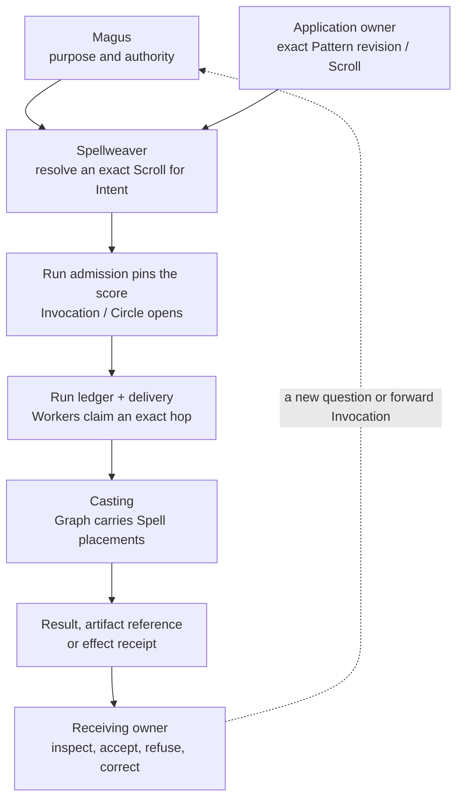
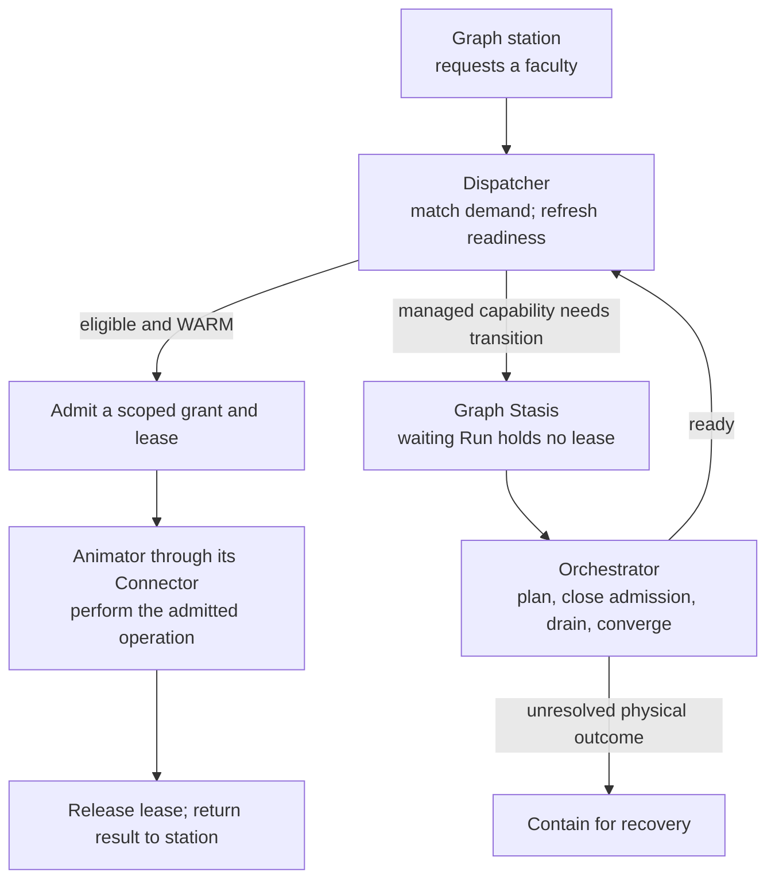

# :material-map-marker-path: Map

_One body, many roads, one return._

Follow one act through LychD: a purpose becomes admitted work, work meets a capability, and its
consequence returns to someone who must judge it. This is a map of the accepted architecture.
[State of Work](./state-of-the-work.md) marks how far each road currently reaches.

## One body in one breath

An **Intent** is a request for work. Spellweaver resolves its **Scroll**, the exact workflow score
for an immutable Pattern revision. Admission opens one **Invocation**; its **Run** is the durable
record of that execution. **Graph** carries the casting through stations that place named actions,
or **Spells**. Follow those relationships through the diagram:

## From logical work to iron

[Dispatcher](./adr/22-dispatcher.md) chooses an eligible capability; [Orchestrator](./adr/23-orchestrator.md)
makes managed local substrate ready. A warm capability can be granted directly. The waiting Run
holds no capability lease while Orchestrator converges readiness. Current grants serve the
narrow v1 chat and non-empty toolset path; general call, job, and session grants remain designed.

An [Animator](./sepulcher/animator/index.md) presents a local Soulstone or a remote Portal through
an exact Connector. Remote work additionally follows its own
[execution road](./sepulcher/extensions/weaver/execution-roads.md), privacy, and effect boundaries.
Portal, delegated coding runtime, and sovereign A2A peer are different forms of labor.

## The return has several records

The [Phylactery](./sepulcher/phylactery/index.md) keeps committed Run and checkpoint truth.
[Ghouls](./sepulcher/vessel/ghouls.md) deliver and settle execution; a checkpoint names a lawful
place to resume. The Run ledger decides terminal status even when an event is missing.

[Oculus](./sepulcher/extensions/oculus.md) concerns observations and their limits;
[Riddle](./sepulcher/extensions/riddle/index.md) concerns evaluated claims. Their findings may
inform a decision, but the receiving owner still accepts the result or admits a new correction.
[Archive law](./adr/27-memory.md) separately governs what may become memory. Completion alone
neither promotes a memory nor admits a training example.

## The application road

A [Composition](./compositions/index.md) owns the application's records, judgment, effects, and
Pattern catalogue. A [Suite](./compositions/products-and-suites.md) may own a coordination Pattern
when several Composition-owned Invocations must start, wait, cancel, or recover together. The
Suite's parent Run keeps their relationship; each member keeps its own Run and authority.

An optional **Product** selects the Composition or Suite revisions and presents a profession or
market promise. A **Deployment** instantiates that Product or an exact Composition-owned reference
profile in an operator's configuration. Neither packaging nor placement replaces the application
owner.

## Identity, presentation, media, and place

An act can involve the same Lich without merging all its owners. [Mirror](./sepulcher/extensions/mirror.md)
binds Persona identity; [Avatar](./compositions/avatar/index.md) chooses an eligible presentation.
Prism and Echo supply visual and speech mechanisms. Creative acceptance belongs to the application
using them. A Habitat, game world, physical Familiar, or Companion session retains the meaning and
consequence of its own encounter.

The [ownership tables in Choosing a Home](./compositions/choosing-a-home.md) locate those exact
boundaries. Extension packages contribute through the receiving offices described in
[Extensions](./sepulcher/extensions/index.md); a Registrant records provenance and a Provider
names a mechanism. Neither name alone transfers an application's judgment.

## Choose your road

| You need to find… | Open… |
| --- | --- |
| An organ and its operating guide | [Sepulcher](./sepulcher/index.md) |
| The owner of an application idea | [Choosing a Home](./compositions/choosing-a-home.md) |
| The way separate applications work together | [Products and Suites](./compositions/products-and-suites.md) |
| An undertaking's continuing brief, concerns, and decisions | [Atlas](./divination/altar/atlas.md) |
| A term's exact meaning | [Lexicon](./lexicon/index.md) |
| The decision behind a boundary | [Covenants](./adr/index.md) |
| The purpose behind the whole | [Transcendence](./divination/transcendence/index.md) |

## Continue into the owning chapter {#what-the-map-does-not-own}

The map ends at the owning page. Follow that page for exact records, refusal, recovery, and law;
follow State for executable evidence. The [Lich](./sepulcher/lich/index.md) gives this connected
whole its name, and the [Great Work](./divination/transcendence/index.md) asks what its returns
ought to become.
