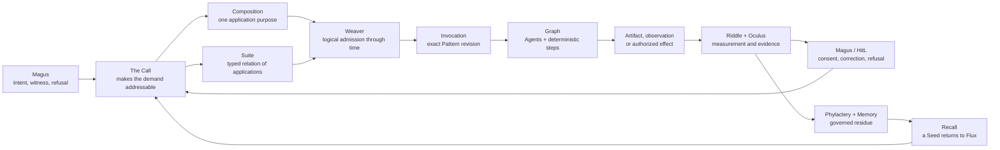
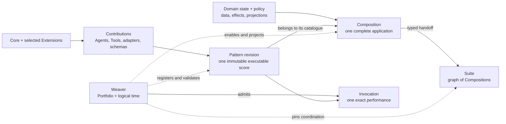
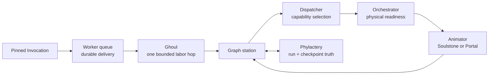

# :material-map-marker-path: Map

_One body, many roads, one return._

!!! warning "Orientation map — not a release roadmap"
    This page is a static projection across LychD's canonical documentation. It summarizes
    relationships and routes to the pages that own them; it defines no rival architecture,
    execution authority, delivery state, or build order. [State of
    Work](./state-of-the-work.md) alone records what has entered matter.

Hexanomicon is deliberately entered through several doors. This balcony shows how those rooms
belong to one palace before you choose the smallest road that can answer your question.

## One body in one breath

The Magus offers an Intent. The Call makes it addressable. A Composition gives it one application
purpose, or a Suite relates several independently owned applications. Weaver admits exact Pattern
Invocations; Graph, Agents, deterministic steps, and capability providers carry the work. What
happens returns through evidence, consequence, correction, and governed memory. The next Call may
therefore begin changed without pretending that repetition alone is identity or truth.



The [Lich](./sepulcher/lich/index.md) is the recurrent whole sustained across this movement. No
single node—not a model, Agent, database, workflow, Composition, or interface—is the whole by
itself.

## The application road

Extensions contribute mechanisms. Patterns make work repeatable. Compositions make work useful as
operator-visible applications. Suites connect those applications without erasing their
independent data, policy, identity, or authority. Weaver registers, pins, schedules, and admits
their logical movement; it does not own every thread it weaves.



The shortest vocabulary is:

```text
Extension  = how implementation enters the body
Pattern    = one repeatable workflow score
Composition = the application the Magus operates
Suite       = Compositions connected through typed handoffs
Weaver      = the logical application control plane
Invocation  = one admitted performance of one Pattern revision
```

Enter the [Composition Portfolio](./compositions/index.md) for application contracts and candidate
studies. Enter [Weaver](./sepulcher/extensions/weaver.md) for Pattern lifecycle, logical time,
admission, schedules, and the boundary between coordination and ownership.

## From logical work to iron

Weaver expresses purpose and logical time. Workers and Ghouls carry durable execution hops. Graph
owns typed movement and checkpoints. Dispatcher resolves semantic capability demand. Orchestrator
decides how physical services become ready. Animators provide the actual capability.



This separation prevents a workflow from commanding hardware directly, a provider from choosing
the application's purpose, or an execution queue from becoming a second scheduler.

## Roads through Hexanomicon

| Your question | Begin here | Continue through |
| --- | --- | --- |
| What can this revision actually do? | [State of Work](./state-of-the-work.md) | cited source, tests, lockfiles, and maintained receipts |
| How do I bring it to first life? | [Summoning](./summoning.md) | Codex → Binding → Vessel → witnessed result |
| Which organ owns this mechanism? | [Sepulcher](./sepulcher/index.md) | Lich, Vessel, Phylactery, Animators, Extensions |
| How does Intent become an application and a run? | [Composition Portfolio](./compositions/index.md) | Weaver → Pattern → Invocation → Graph |
| How does the system observe the external world? | [Scout](./sepulcher/extensions/scout.md) | source adapter → attributed observation → domain Composition |
| How are alternatives tested without becoming reality? | [Shadow](./sepulcher/extensions/shadow/index.md) | candidate worlds → Riddle evidence → separate promotion authority |
| How do identity, evidence, and memory return? | [Lich](./sepulcher/lich/index.md) | Answer → Mirror → Riddle/Oculus → Seed → Recall |
| How do several applications become one factory? | [Suites](./compositions/index.md#suites-compositions-of-compositions) | typed handoffs → independently admitted child Invocations |
| Which law governs a change? | [Covenants](./adr/index.md) | owning ADR → topic page → State → source evidence |
| What is the Great Work ultimately trying to cultivate? | [Transcendence](./divination/transcendence/index.md) | Nigredo → Albedo → Citrinitas → Rubedo → Infinity |

## What the Map does not own

- **Definitions** remain canonical in the [Lexicon](./lexicon/index.md).
- **Architectural law** remains in the [Covenants](./adr/index.md).
- **Application contracts** remain in the [Composition Portfolio](./compositions/index.md).
- **Operated anatomy** remains in the [Sepulcher](./sepulcher/index.md).
- **Meaning and formation** remain in [Transcendence](./divination/transcendence/index.md).
- **Delivery and saturation** remain in [State of Work](./state-of-the-work.md).

Map may grow clearer as the specification grows, but it never colors an unproved road as
walked. When a relationship changes, its owning law changes first; this page then redraws the
route.

> _Prophecy reveals why the palace must exist. Map reveals how its chambers meet. State
> records which roads have actually been walked._
