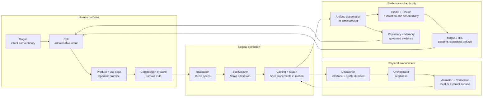

# :material-map-marker-path: Map

_One body, many roads, one return._

This is an orientation, not architectural law or a release roadmap. [State of
Work](./state-of-the-work.md) records what has entered matter.

## One body in one breath



The [Lich](./sepulcher/lich/index.md) names the recurrent whole sustained across this return. No
model, Agent, database, workflow, Composition, Product, or interface is the whole by itself.

## The application road

Extensions contribute mechanisms; Scrolls make work repeatable; Compositions own reusable
application truth. A Product packages one or more of them for a profession or market and names the
concrete use cases offered to its operator. Suites connect Compositions without erasing their
independent data, policy, identity, or authority. Spellweaver registers, pins, schedules, and admits
logical movement; it does not own every thread it weaves.

The shortest vocabulary is:

```text
Extension   = how implementation enters the body
Spell       = one independently named semantic action contract
Scroll      = one immutable Pattern revision containing Spell placements and their paths
Pattern     = the technical executable-score family
Composition = reusable application capability and domain truth
Product     = professional or market package of Compositions and use cases
Suite        = independently owned Compositions related by typed handoffs
Spellweaver = logical admission and time
Invocation  = one admitted Circle
Casting     = performance of one exact Scroll inside that Circle
```

Enter the [Composition Portfolio](./compositions/index.md) for reusable application contracts,
Product boundaries, and candidate studies. Enter
[Spellweaver](./sepulcher/extensions/weaver/index.md) for Scroll/Pattern lifecycle, logical time,
admission, schedules, and the boundary between coordination and ownership.

## From logical work to iron

Spellweaver admits purpose and logical time. Workers and Ghouls carry durable hops; Graph owns typed
movement and checkpoints. Dispatcher resolves exact interface/profile demand, Orchestrator owns
local readiness, and an Animator plus its Connector supplies the admitted invocation surface.
Phylactery retains run and checkpoint truth. A
Pattern asks for capability without commanding hardware; a provider cannot choose application
purpose.

The [Avatar Composition](./compositions/avatar/index.md) may bind one Lich presentation to several
simultaneous physical, ambient, social, or virtual projections, but it adds no universal world,
device, or body authority. Every target and local controller retains its own truth and refusal.
For [Spectre](./compositions/spectre/index.md), VR is the Habitat; when a participant meets the Lich
through its Avatar there, Spectre owns that bounded Encounter while Avatar retains presentation
and projection membership.

## Roads through Hexanomicon

| Your question | Begin here | Continue through |
| --- | --- | --- |
| What can this revision actually do? | [State of Work](./state-of-the-work.md) | cited source, tests, lockfiles, and maintained receipts |
| How does Intent become a Product use case and a run? | [Composition Portfolio](./compositions/index.md#products-package-compositions) | Composition or Suite → Invocation/Circle → Spellweaver → Scroll/casting → Graph |
| Which organ owns a physical mechanism? | [Sepulcher](./sepulcher/index.md) | Vessel, Phylactery, Animators, and Extensions |
| How do observations become evidence and memory? | [Lich](./sepulcher/lich/index.md) | Riddle/Oculus → Phylactery/Memory → correction or Recall |
| Which law governs a change? | [Covenants](./adr/index.md) | owning ADR → topic page → State → source evidence |
| What is the Great Work ultimately trying to cultivate? | [Transcendence](./divination/transcendence/index.md) | Nigredo → Albedo → Citrinitas → Rubedo → Infinity |

## What the Map does not own

Definitions belong to the [Lexicon](./lexicon/index.md), law to the
[Covenants](./adr/index.md), application contracts to the [Composition
Portfolio](./compositions/index.md), anatomy to the [Sepulcher](./sepulcher/index.md), formation
to [Transcendence](./divination/transcendence/index.md), and delivery to [State of
Work](./state-of-the-work.md). When a relationship changes, its owner changes first; this page
then redraws the route.
