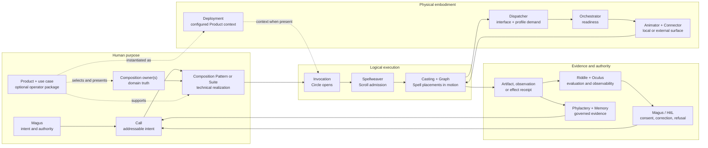

# :material-map-marker-path: Map

_One body, many roads, one return._

This is an orientation, not architectural law or a release roadmap. [State of
Work](./state-of-the-work.md) records what has entered matter.

## Choose your road

| Your question | Begin here | Continue through |
| --- | --- | --- |
| What can this revision actually do? | [State of Work](./state-of-the-work.md) | cited source, tests, lockfiles, and maintained receipts |
| Where should a new automation or Product idea live? | [Choosing a Home](./compositions/choosing-a-home.md) | use case, Product, profile, Pattern, projection, Suite, or candidate Composition |
| How do Products and application owners assemble? | [Products and Suites](./compositions/products-and-suites.md) | Composition owner(s), exact owner-qualified profile refs, Pattern or Suite, Invocation represented by Run, and Deployment context when a Product is installed |
| Which organ owns a physical mechanism? | [Sepulcher](./sepulcher/index.md) | Vessel, Phylactery, Animators, and Extensions |
| How do observations become evidence and memory? | [Lich](./sepulcher/lich/index.md) | Riddle/Oculus → Phylactery/Memory → correction or Recall |
| Which law governs a change? | [Covenants](./adr/index.md) | owning ADR → topic page → State → source evidence |
| What is the Great Work ultimately trying to cultivate? | [Transcendence](./divination/transcendence/index.md) | Nigredo → Albedo → Citrinitas → Rubedo → Infinity |

## One body in one breath



The [Lich](./sepulcher/lich/index.md) names the recurrent whole sustained across this return. No
model, Agent, database, workflow, Composition, Product, or interface is the whole by itself.

## The application road

Extension Domains receive typed Contributions. Extension packages are selected code/distribution
units that may submit Contributions across several Domains; Providers are concrete engines or
services bound behind an accepted contract. A Manifestation names the form a Domain takes in one
body or profile. Scrolls make work repeatable; Compositions own reusable application truth. When
present, a Product packages one or more Compositions for a profession or market
and names the concrete use cases offered to its operator; current native Patterns do not require a
Product selector. A settled foreign reference does not create a Suite; live coordination across
several Composition-owned Invocations does. Suites preserve each member's independent data, policy,
identity, and authority. Spellweaver registers, pins, schedules, and admits logical movement; it
does not own every thread it weaves.

The shortest vocabulary is:

```text
Extension Domain = stable jurisdiction that receives mechanisms without becoming an application
Extension package = selected code/distribution unit; it may contribute across Domains
Contribution     = one typed addition admitted by its owning Domain
Provider         = concrete engine or service behind a typed contract
Manifestation    = the Domain's concrete form in one body/profile
Spell            = one independently named semantic action contract
Scroll           = one immutable Pattern revision containing Spell placements and their paths
Pattern          = the technical executable-score family
Composition      = reusable application capability and domain truth
Product          = professional or market package of Compositions and use cases
Use case         = one concrete class of operator job supported by a Product
<kind> profile   = owner-qualified specialization preserving the same truth and finish
Suite            = live lifecycle coordination of independently owned Compositions
Deployment       = one configured installation of an exact Product revision
Spellweaver      = logical admission and time
Invocation       = one admitted Circle
Run              = durable execution and ledger identity representing that Invocation
Casting          = performance of one exact Scroll inside that Circle
```

Enter the [Composition Portfolio](./compositions/index.md) for reusable application contracts,
Product boundaries, and candidate studies. Enter
[Spellweaver](./sepulcher/extensions/weaver/index.md) for Scroll/Pattern lifecycle, logical time,
admission, schedules, and the boundary between coordination and ownership.

## From logical work to iron

Spellweaver admits purpose and logical time. Workers and Ghouls carry durable hops; Graph owns typed
movement and checkpoints. Dispatcher resolves exact interface/profile demand, Orchestrator owns
local readiness, and an Animator plus its Connector supplies the admitted invocation surface.
Phylactery retains run and checkpoint truth. A
Pattern asks for capability without commanding hardware; a provider cannot choose application
purpose.

## Identity, presentation, media, and place

These nearby offices meet often without nesting inside one another:

| Question | Owner | Boundary |
| --- | --- | --- |
| Who is this Persona across revision and attribution? | [Mirror](./sepulcher/extensions/mirror.md) | identity binding, never appearance, device, world, or caller authority |
| How may the Lich appear here? | [Avatar](./compositions/avatar/index.md) | presentation envelope, Morphe, and projection binding, never Persona lineage or target authority |
| Which visual/spatial or speech effect may execute? | [Prism](./sepulcher/extensions/prism/index.md) / [Echo](./sepulcher/extensions/echo.md) | semantic Extension contracts and lifecycle facts, never application judgment |
| Which creative or language work is accepted? | [Voidlight](./compositions/voidlight/index.md) / [Riffmaw](./compositions/riffmaw/index.md) / [Language Edition](./compositions/language-edition/index.md) / [Broadcast](./compositions/broadcast/index.md) | visual/VFX, music, timed-language edition, and editorial/publication truth respectively |
| Where does the projection meet consequence? | [Spectre](./compositions/spectre/index.md) / [Blockworld](./compositions/blockworld/index.md) / [Familiar](./compositions/familiar/index.md) | VR Habitat and Encounter, persistent game world and mission, or admitted physical body and task |
| Who owns the mobile client and device session? | [Companion](./compositions/companion/index.md) over an exact phone-shaped Familiar body | configurable client, bounded local session, disclosure, and reconnect; Familiar retains device capability, safety, and stop law |

Avatar may bind one presentation to several simultaneous physical, ambient, social, or virtual
projections, but every target and local controller retains its own truth and refusal. A Spectre
participant may meet the Lich through an Avatar inside VR; Spectre still owns that Encounter.
An admitted phone is a Familiar body; Companion is the mobile-client/session Composition over it, not the
Lich's identity or a generic personal endpoint.

## What the Map does not own

Definitions belong to the [Lexicon](./lexicon/index.md), law to the
[Covenants](./adr/index.md), application contracts to the [Composition
Portfolio](./compositions/index.md), anatomy to the [Sepulcher](./sepulcher/index.md), formation
to [Transcendence](./divination/transcendence/index.md), and delivery to [State of
Work](./state-of-the-work.md). When a relationship changes, its owner changes first; this page
then redraws the route.
