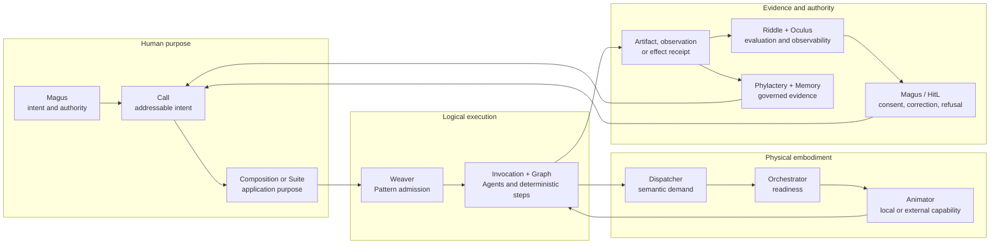

# :material-map-marker-path: Map

_One body, many roads, one return._

This is an orientation, not architectural law or a release roadmap. [State of
Work](./state-of-the-work.md) records what has entered matter.

## One body in one breath



The [Lich](./sepulcher/lich/index.md) names the recurrent whole sustained across this return. No
model, Agent, database, workflow, Composition, or interface is the whole by itself.

## The application road

Extensions contribute mechanisms; Patterns make work repeatable; Compositions make it useful to an
operator. Suites connect applications without erasing their independent data, policy, identity, or
authority. Weaver registers, pins, schedules, and admits logical movement; it does not own every
thread it weaves.

The shortest vocabulary is:

```text
Extension   = how implementation enters the body
Pattern     = one immutable workflow score
Composition = the application the Magus operates
Suite        = independently owned Compositions related by typed handoffs
Weaver       = logical admission and time
Invocation   = one admitted performance of an exact Pattern revision
```

Enter the [Composition Portfolio](./compositions/index.md) for application contracts and candidate
studies. Enter [Weaver](./sepulcher/extensions/weaver/index.md) for Pattern lifecycle, logical time,
admission, schedules, and the boundary between coordination and ownership.

## From logical work to iron

Weaver admits purpose and logical time. Workers and Ghouls carry durable hops; Graph owns typed
movement and checkpoints. Dispatcher resolves capability demand, Orchestrator readiness, and an
Animator supplies local or external capability. Phylactery retains run and checkpoint truth. A
Pattern asks for capability without commanding hardware; a provider cannot choose application
purpose.

## Roads through Hexanomicon

| Your question | Begin here | Continue through |
| --- | --- | --- |
| What can this revision actually do? | [State of Work](./state-of-the-work.md) | cited source, tests, lockfiles, and maintained receipts |
| How does Intent become an application and a run? | [Composition Portfolio](./compositions/index.md) | Weaver → Pattern → Invocation → Graph |
| Which organ owns a physical mechanism? | [Sepulcher](./sepulcher/index.md) | Vessel, Phylactery, Animators, and Extensions |
| How do observations become evidence and memory? | [Lich](./sepulcher/lich/index.md) | Riddle/Oculus → Phylactery/Memory → correction or Recall |
| Which law governs a change? | [Covenants](./adr/index.md) | owning ADR → topic page → State → source evidence |
| What is the Great Work ultimately trying to cultivate? | [Transcendence](./divination/transcendence/index.md) | Nigredo → Albedo → Citrinitas → Rubedo → Infinity |

## What the Map does not own

Definitions belong to the [Lexicon](./lexicon/index.md), law to the
[Covenants](./adr/index.md), application contracts to the [Composition
Portfolio](./compositions/index.md), anatomy to the [Sepulcher](./sepulcher/index.md), formation
to [Transcendence](./divination/transcendence/index.md), and delivery to [State of
Work](./state-of-the-work.md). When a relationship changes, its owner changes first; this page
then redraws the route.
