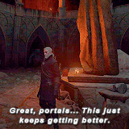
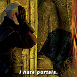

# :material-weather-hurricane: Portal: The Rift to the Void

> _"Not all spirits can be contained within the Crypt. Some are too vast, too alien, and too terrible to dwell on mortal iron. To commune with them, we do not build a cage; we tear open the sky."_

A **Portal** is a configured connection to an external, cloud-based intelligence (OpenAI, Anthropic, Google, Groq). Unlike a **[Soulstone](./soulstone.md)**, which lives and breathes on your local GPU, a Portal delegates the act of cognition to distant, hyperscale entities dwelling in the Void.

Technically, a Portal is a pure configuration entry within the **[Codex](../codex.md)**. It generates no containers and consumes no local VRAM. It simply teaches the **[Dispatcher](../../adr/20-dispatcher.md)** how to transmute a remote endpoint into a live `pydantic_ai.Model`.

## 🌀 The Nature of the Rift

Portals serve specific strategic purposes in the Necromancer's arsenal:

- **The Frontier Reasoning:** When the logic required is too complex for a local model, summon the crushing intellect of a frontier model (e.g., `gpt-4o`, `claude-3-5-sonnet`).
- **The Prototyping:** Before you commit to downloading terabytes of weights, use a Portal to test your prompts against a reference intelligence.
- **The Burst Overflow:** If your local VRAM is fully occupied by a high-priority **[Simulation](../../adr/35-simulation.md)**, the system can route simpler tasks through a Portal.

## 📜 The Pydantic Bridge

LychD leverages the Pydantic AI framework to ensure that Portals are first-class citizens of the mind.

- **Model & Provider:** The `provider` field in your TOML tells the system which Pydantic AI class to instantiate (e.g., `AnthropicModel`, `OpenAIChatModel`).
- **Standardized Profiles:** Regardless of the vendor, the Portal adheres to the same **[Contract of Existence](./index.md)**. It respects your `temperature`, `max_tokens`, and `top_p` settings.
- **The Fallback Ritual:** The system often wraps a local Soulstone and a cloud Portal into a `FallbackModel`. If your local hardware returns a 4xx or 5xx error, the Lych automatically "Tears the Sky" and replays the request through the Portal to ensure the thought is completed.

## 🖋️ Inscribing a Portal

To open a rift, you must define its properties in the `portals/` directory of your Codex.

```toml
# ~/.config/lychd/portals/openai.toml

[gpt4]
description = "The Frontier Intelligence."
provider = "openai" # Determines the Pydantic AI Model class

# 1. The Address (Manifestation)
uri = "https://api.openai.com/v1"

# 2. The Identity (Contract)
model_name = "gpt-4o"

# 3. The Offering (Security)
# 'api_key_env' points to an Environment Variable.
# This keeps your secrets safe from the physical scroll.
api_key_env = "OPENAI_API_KEY"

# 4. The Personality (Inference Defaults)
temperature = 1.0
max_tokens = 8192
capabilities = ["text-generation", "vision-analysis"]
```

!!! danger "The Tithe (Token Creep)"
    Beware, Magus. While a [Soulstone](./soulstone.md) serves you for the cost of electricity, a Portal demands a **Tithe**.
    Every thought processed draws credits from your account. The Lich does not care about your bank balance; it will loop and generate until the work is done or your card is declined.

!!! warning "The Leak of Secrets"
    When you use a Portal, you are sending data through the Rift. The **[Sovereignty Wall](../../adr/21-orchestrator.md)** is your only shield.
    - If `LYCHD_SOVEREIGNTY_MODE` is active, Portals are physically disabled.
    - If an Intent is marked as `sensitive`, the Orchestrator will **FORBID** the use of a Portal, forcing the data to wait for local iron.

> _"I hate portals."_ — Geralt of Rivia

<div align="center" style="display: flex; justify-content: center; gap: 20px; flex-wrap: wrap;">

  

  
</div>
