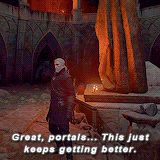
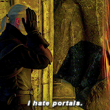

# :material-weather-hurricane: Portal: The Rift to the Void

> _"Not all spirits can be contained within the Crypt. Some are too vast, too alien, and too terrible to dwell on mortal iron. To commune with them, a cage is not built; the sky is torn open."_

A **Portal** is a configured connection to an external, cloud-based intelligence (OpenAI, Anthropic, Google, Groq). Unlike a **[Soulstone](./soulstone.md)**, which lives and breathes on your local GPU, a Portal delegates the act of cognition to distant, hyperscale entities dwelling in the Void.

Technically, a Portal is a **rune config** within the **[Codex](../codex.md)**. It generates no Quadlet manifests and consumes no local VRAM. It teaches the **[Dispatcher](../../adr/22-dispatcher.md)** and binder how to hydrate a remote endpoint into a live Pydantic AI model/tool surface.

## 🌀 The Nature of the Rift

Portals serve specific strategic purposes in the Necromancer's arsenal:

- **The Frontier Reasoning:** When the logic required is too complex for a local model, summon the crushing intellect of a frontier model (e.g., `gpt-4o`, `claude-3-5-sonnet`).
- **The Prototyping:** Before you commit to downloading terabytes of weights, use a Portal to test your prompts against a reference intelligence.
- **The Burst Overflow:** If your local VRAM is fully occupied by a high-priority **[Simulation](../../adr/31-simulation.md)**, the system can route simpler tasks through a Portal.

## 📜 The Pydantic Bridge

LychD leverages the Pydantic AI framework to ensure that Portals are first-class citizens of the mind.

- **Endpoint + Connector Identity:** Runtime binding is driven by `provider_type`, `base_url`, and a selected/default remote model id.
- **Standardized Runtime Contract:** Regardless of the vendor, the Portal enters the system through the same **[Animator](./index.md)** runtime/binder path.
- **Optional External Tools:** Portals may declare `external_tools` that connectors expose as deferred toolsets.
- **The Fallback Ritual:** The system often wraps a local Soulstone and a cloud Portal into a `FallbackModel`. If your local hardware returns a 4xx or 5xx error, the Lych automatically "Tears the Sky" and replays the request through the Portal to ensure the thought is completed.

Current implementation scope:

- Portals are hydrated through the OpenAI-compatible path (`OpenAIProvider` + `OpenAIChatModel`).
- Additional provider-native binders (Anthropic, Google, etc.) are extension points, not hardcoded in the core registry.

## 🖋️ Inscribing a Portal

To open a rift, you must define its properties in the `runes/animator/portals/` directory of your Codex.

```toml
# ~/.config/lychd/runes/animator/portals/openai/openai.toml

name = "gpt4"
description = "The Frontier Intelligence."
provider_type = "openai" # Determines the high-level provider family

# 1. The Address (Manifestation)
base_url = "https://api.openai.com/v1"

# 2. The Identity (Contract)
default_model_id = "gpt-4o"

# 3. The Offering (Security)
# Reference a Podman secret name, not a raw API key value.
api_key_secret = "portal_openai_main"

# 4. Optional External Tools (Deferred/Connector-Mapped)
[[external_tools]]
name = "web_search"
description = "Search the web through the provider's hosted tool surface."
sequential = false
```

```bash
printf '%s' "$OPENAI_API_KEY" | podman secret create --replace portal_openai_main -
```

## :material-key-link: Secret Lifecycle

Portal auth is reference-driven:

1. Rune stores only `api_key_secret = "<name>"`.
2. `lych bind` verifies the named Podman secret exists.
3. If missing, bind fails closed before writing units.
4. Vessel receives `Secret=<name>` and connector reads `/run/secrets/<name>`.

Core app secrets (`APP` signing key and DB password) are auto-generated as startup fallbacks only when no secret source is configured. Portal secrets are never auto-generated and must be explicitly created.

For policy and boundary details, see [Security (ADR 09)](../../adr/09-security.md) and [Configuration (ADR 12)](../../adr/12-configuration.md).

!!! danger "The Tithe (Token Creep)"
    Beware, Magus. While a [Soulstone](./soulstone.md) serves you for the cost of electricity, a Portal demands a **Tithe**.
    Every thought processed draws credits from your account. The Lich does not care about your bank balance; it can loop and generate until the work is done or your card is declined.

!!! warning "The Leak of Secrets"
    When you use a Portal, you are sending data through the Rift. The **[Sovereignty Wall](../../adr/23-orchestrator.md)** and Dispatcher privatization policy are your shield.
    - In sovereignty-restricted modes, Portals may be disabled entirely.
    - Sensitive intents or high-privatization context may forbid Portal egress, forcing the work to local iron or sanitization workflows.

> _"I hate portals."_ — Geralt of Rivia

<div align="center" style="display: flex; justify-content: center; gap: 20px; flex-wrap: wrap;">

  

  
</div>
