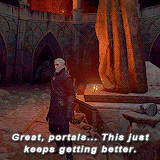
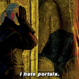

# :material-weather-hurricane: Portal: The Rift to the Remote Sky

> _"Not all spirits can be contained within the Crypt. Some are distant, rented, and sharp enough to matter. To commune with them, the sky is opened under seal."_

A **Portal** is a configured connection to an external service: cloud intelligence, hosted tooling, remote observability, paid APIs, or another sovereign node. Unlike a **[Soulstone](./soulstone.md)**, which lives and breathes on local iron through Quadlet/systemd, a Portal delegates the capability to a network boundary.

Technically, a **Portal Rune** is the Codex TOML declaration for a Portal. The runtime **Portal** is the remote Animator hydrated from that Rune. It generates no Quadlet manifests and consumes no local VRAM. It teaches the **[Dispatcher](../../adr/22-dispatcher.md)** and binder how to hydrate a remote endpoint into live capability surfaces such as Pydantic AI models, deferred tools, query clients, or peer calls.

## 🌀 The Nature of the Rift

Portals serve specific strategic purposes in the Necromancer's arsenal:

- **The Frontier Reasoning:** When the logic required is too complex for a local model, summon the crushing intellect of a frontier model (e.g., `gpt-4o`, `claude-3-5-sonnet`).
- **The Prototyping:** Before the Magus commits to downloading terabytes of weights, a Portal can test prompts against a reference intelligence.
- **The Burst Overflow:** If local VRAM is fully occupied by a high-priority **[Simulation](../../adr/31-simulation.md)**, the system can route simpler tasks through a Portal.
- **The External Instrument:** If a capability lives outside the Sepulcher, such as hosted search, remote metrics, payment-gated APIs, or peer-node labor, a Portal lets LychD call it without pretending it is local.

## 📜 The Pydantic Bridge

LychD leverages adapter-backed binding so Portals are first-class citizens of the runtime.

- **Endpoint + Connector Identity:** Runtime binding is driven by `provider_type`, `base_url`, and a selected/default remote model id.
- **Standardized Runtime Contract:** Regardless of the vendor, the Portal enters the system through the same **[Animator](./index.md)** runtime/binder path.
- **Optional External Tools:** Portals may declare `external_tools` that connectors expose as deferred toolsets.
- **The Fallback Ritual:** The system often wraps a local Soulstone and a remote Portal into a `FallbackModel`. If local hardware returns a 4xx or 5xx error, the Lych automatically tears the sky and replays the request through the Portal to ensure the thought is completed.

Current implementation scope:

- Model-backed Portals are hydrated through the OpenAI-compatible path (`OpenAIProvider` + `OpenAIChatModel`).
- Additional provider-native binders (Anthropic, Google, etc.) and non-model service binders are extension points, not hardcoded in the core registry.

## 🖋️ Inscribing a Portal

To open a rift, define its properties under the Portal anchor in the Codex. The core Portal Rune owns `runes/animator/portals/` directly; provider-specific subdirectories only make sense when a provider-specific Portal Rune subclass owns that deeper anchor.

```toml
# ~/.config/lychd/runes/animator/portals/openai.toml

name = "gpt4"
description = "The Frontier Intelligence."
provider_type = "openai" # Determines the high-level provider family

# 1. The Address (Manifestation)
base_url = "https://api.openai.com/v1"

# 2. The Identity (Contract)
default_model_id = "gpt-4o"

# 3. The Offering (Security)
# Reference a Podman secret name, not a raw API key value.
api_key_secret = "portal_openai_main"

# 4. Optional External Tools (Deferred/Connector-Mapped)
[[external_tools]]
name = "web_search"
description = "Search the web through the provider's hosted tool surface."
sequential = false
```

```bash
printf '%s' "$OPENAI_API_KEY" | podman secret create --replace portal_openai_main -
```

## :material-key-link: Secret Lifecycle

Portal auth is reference-driven:

1. Portal Rune stores only `api_key_secret = "<name>"`.
2. `lychd bind` verifies the named Podman secret exists.
3. If missing, bind fails closed before writing units.
4. Vessel receives `Secret=<name>` and connector reads `/run/secrets/<name>`.

Core app secrets (`APP` signing key and DB password) are auto-generated as startup fallbacks only when no secret source is configured. Portal secrets are never auto-generated and must be explicitly created.

For policy and boundary details, see [Security (ADR 09)](../../adr/09-security.md) and [Configuration (ADR 12)](../../adr/12-configuration.md).

!!! danger "The Tithe (Token Creep)"
    Beware, Magus. While a [Soulstone](./soulstone.md) serves for the cost of electricity, a Portal demands a **Tithe**.
    Every thought processed draws credits from an external account. The Lich does not care about the balance; it can loop and generate until the work is done or the card is declined.

!!! warning "The Leak of Secrets"
    Portal use sends data through the Rift. The **[Sovereignty Wall](../../adr/09-security.md)** and Dispatcher privatization policy are the shield.
    - In sovereignty-restricted modes, Portals may be disabled entirely.
    - Sensitive intents or high-privatization context may forbid Portal egress, forcing the work to local iron or sanitization workflows.

> _"I hate portals."_ — Geralt of Rivia

<div align="center" style="display: flex; justify-content: center; gap: 20px; flex-wrap: wrap;">

  

  
</div>
