# :material-book-open-page-variant: Codex

> _"The Hexanomicon is the prophecy. The Codex is the law."_

The Codex is the **immutable configuration** from which the Sepulcher is summoned. It is located at `~/.config/lychd/`.

## 🏛️ The Anatomy of the Book

The Codex is strictly organized. The Librarian (Loader) is exacting and will ignore scrolls placed in the wrong section.

```mermaid
graph TD
    Codex[~/.config/lychd/]
    Prime[lychd.toml]
    SoulDir[soulstones/]
    PortalDir[portals/]

    Codex --> Prime
    Codex --> SoulDir
    Codex --> PortalDir

    SoulDir --> S1[hermes.toml]
    SoulDir --> S2[logic_cluster.toml]

    PortalDir --> P1[openai.toml]
    PortalDir --> P2[anthropic.toml]

    style Codex fill:#2a2a2a,stroke:#7c4dff,stroke-width:2px
    style Prime fill:#1a1a1a,stroke:#fff
    style SoulDir fill:#1a1a1a,stroke:#ff5252
    style PortalDir fill:#1a1a1a,stroke:#40c4ff
```



### I. The Prime Directive (`lychd.toml`)

This contains the fundamental settings for the Daemon itself—machinery, logging, and database paths. It does not define intelligence, only the vessel that holds it.

### II. The Soulstones (`soulstones/`)

The repository of local power. Place your TOML inscriptions defining **Containerized Models** here.
_See [Soulstone](./animator/soulstone.md) for schema details._

!!! tip "The Model Root"
    You can define a `model_root` in `lychd.toml`. Soulstones can then use **relative paths** for their weights.
    - **Absolute:** `model_path = "/mnt/data/hermes.gguf"` (Always works)
    - **Relative:** `model_path = "hermes.gguf"` (Resolves to `$MODEL_ROOT/hermes.gguf`)

### III. The Portals (`portals/`)

The catalogue of distant voices. Place your TOML inscriptions defining **Cloud API** connections here.
_See [Portal](./animator/portal.md) for schema details._

## 🔮 The Rite of Binding

The Codex is merely a book of **Potential** until it is spoken. The `lychd bind` command is the bridge between the Configuration (Codex) and the Operating System (Reality).

```bash
# 1. Edit your Scrolls
vim ~/.config/lychd/soulstones/my-model.toml

# 2. Perform the Rite
lychd bind
```

### The Transmutation Process

1. **Validation:** The Librarian reads the Codex.
    * **Port Safety:** It ensures no Soulstone claims a port reserved by the System (Postgres, Phoenix, Server) or another Soulstone.
    * **Grouping:** It resolves explicit grouping logic (`group="logic"`).
2. **Calculation:** The Scribe resolves the **Law of Exclusivity** (calculating `Conflicts=` for every unit).
3. **Inscription:** The Scribe writes active **Runes** (Podman Quadlet files) into the System's Binding Site (`~/.config/containers/systemd/`).
4. **Reanimation:** Systemd reloads, and the new services manifest instantly.

!!! info "The Environment (XDG)"
    For Magi who customize their environment, LychD respects the **XDG Base Directory** standards.
    If you set `XDG_CONFIG_HOME`, the Codex will be sought at `$XDG_CONFIG_HOME/lychd` and the Runes will be inscribed to `$XDG_CONFIG_HOME/containers/systemd`.

!!! warning "The Ephemeral Runes"
    **Do not edit the files in `~/.config/containers/systemd/` manually.**
    These files are **Runes**, projected by the Scribe. They are ephemeral artifacts. The next time you run `lychd bind`, the Scribe will wipe that directory clean and rewrite it from scratch.
    If you wish to change the reality, **edit the Codex**, not the projection.
