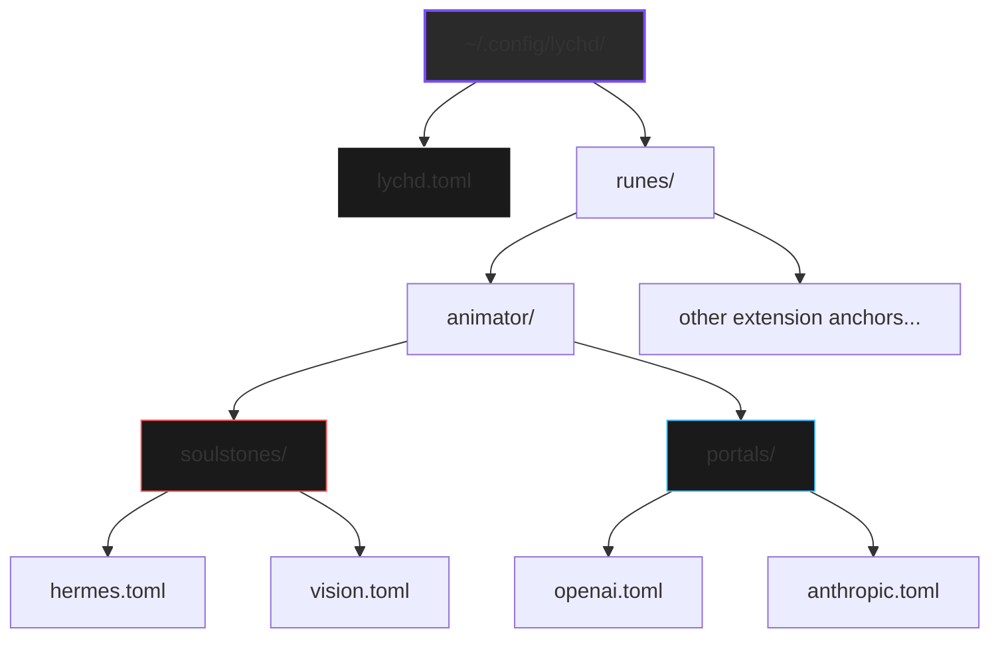

# :material-book-open-page-variant: Codex

> _"The Hexanomicon is the prophecy. The Codex is the law."_

The Codex is the **immutable configuration** from which the Sepulcher is summoned. It defines the fundamental laws of existence for the Lich.

It is physically located at **`~/.config/lychd/`** (respecting `XDG_CONFIG_HOME`).

This page explains the Codex as an operator-facing structure and ritual surface.

- For the technical configuration contract (schema ownership, loader rules, validation order), see [Configuration (ADR 12)](../adr/12-configuration.md).
- For filesystem geography and Host/Container mount symmetry, see [Layout (ADR 13)](../adr/13-layout.md).

## 🏛️ The Anatomy of the Book

The Codex is strictly organized. The Librarian (Loader) reads by anchor and ignores scrolls placed in the wrong section.


```mermaid
graph TD
    Codex[~/.config/lychd/]
    Prime[lychd.toml]
    RuneDir[runes/]
    AnimatorDir[animator/]
    SoulDir[soulstones/]
    PortalDir[portals/]
    XDir[other extension anchors...]

    Codex --> Prime
    Codex --> RuneDir
    RuneDir --> AnimatorDir
    RuneDir --> XDir
    AnimatorDir --> SoulDir
    AnimatorDir --> PortalDir

    SoulDir --> S1[hermes.toml]
    SoulDir --> S2[vision.toml]

    PortalDir --> P1[openai.toml]
    PortalDir --> P2[anthropic.toml]

    style Codex fill:#2a2a2a,stroke:#7c4dff,stroke-width:2px
    style Prime fill:#1a1a1a,stroke:#fff
    style SoulDir fill:#1a1a1a,stroke:#ff5252
    style PortalDir fill:#1a1a1a,stroke:#40c4ff
```

### I. The Prime Scroll (`lychd.toml`)

This contains the fundamental settings for the Daemon itself: server behavior, logging, persistence, queue defaults, and global policy.

It governs the Sepulcher at the daemon level and provides defaults used by rune families.

Typical examples:

- runtime and service settings
- persistence and queue settings
- global policy thresholds (including privacy/egress policy)
- defaults shared across extensions

The Prime Scroll carries global law. Instance declarations live in `runes/`.

### II. The Rune Archive (`runes/`)

This is the archive of instance scrolls.

Each subdirectory (anchor) belongs to a rune family. Core modules and installed extensions may declare additional anchors. The Librarian reads scrolls from their anchor territory and validates them before any binding occurs.

In practice:

- one TOML file = one instance
- the folder path determines which rune family owns the file
- misplaced scrolls are ignored or rejected during validation
- valid runes become intent for the binding ritual

The rune archive is extensible. Installing an extension can add new anchors without changing how the Codex is read.

### III. Common Built-In Rune Families

The Codex ships with animator-related rune families by default:

- `runes/animator/`: animation root defaults and shared animator-level configuration
- `runes/animator/soulstones/`: local container-backed runtimes
- `runes/animator/portals/`: remote provider connections

For details on each family:

- [Animator](./animator/index.md) for the overall animation model
- [Soulstone](./animator/soulstone.md) for local runtimes and containerized inference
- [Portal](./animator/portal.md) for remote providers and cloud connections
- [Extensions](./extensions/index.md) for extension-owned capabilities and added rune families

!!! tip "The Prime Scroll Sets the Ground"
    Keep daemon-wide settings and shared defaults in `lychd.toml`.
    Put instance-specific declarations in rune files under `runes/`.
    This keeps the Codex readable and keeps the binding ritual deterministic.

## 🔮 The Rite of Binding

The Codex is merely a book of **Potential** until it is spoken. The `lychd bind` command is the bridge between the Configuration (Codex) and the Operating System (Reality).

```bash
# 1. Edit your Scrolls
vim ~/.config/lychd/runes/animator/soulstones/my-model.toml

# 2. Perform the Rite
lychd bind
```

### The Transmutation Process

1. **Reading:** The Librarian reads `lychd.toml` and the rune archive by anchor.
2. **Validation:** The Codex is checked for structural violations before manifestation (ownership, identity, singleton, and policy constraints).
3. **Calculation:** The Scribe resolves runtime relationships and orchestration consequences.
4. **Inscription:** The Scribe writes active **Runes** (Podman Quadlet files) into the System's Binding Site (`~/.config/containers/systemd/`).
5. **Reanimation:** Systemd reloads, and the new services manifest.

For the technical rules behind this sequence:

- [Configuration (ADR 12)](../adr/12-configuration.md)
- [Containers (ADR 08)](../adr/08-containers.md)
- [Orchestrator (ADR 23)](../adr/23-orchestrator.md)

!!! warning "The Ephemeral Runes"
    **Do not edit the files in `~/.config/containers/systemd/` manually.**

    These files are **Runes**, projected by the Scribe. They are ephemeral artifacts. The next time `lychd bind` runs, the Scribe wipes that directory clean and rewrites it from scratch.

    If you wish to change the reality, **edit the Codex**, not the projection.
