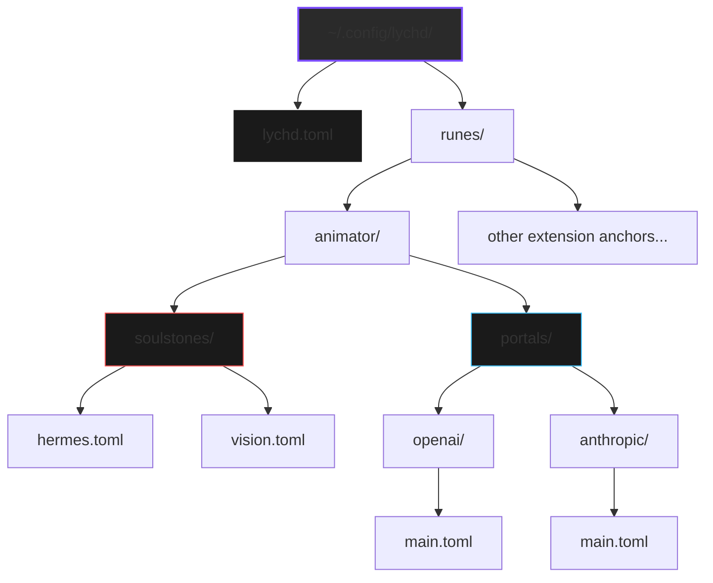

# :material-book-open-page-variant: Codex

> _"The Hexanomicon is the prophecy. The Codex is the law."_

The Codex is the **immutable configuration** from which the Sepulcher is summoned. It defines the fundamental laws of existence for the Lich.

It is physically located at **`~/.config/lychd/`** (respecting `XDG_CONFIG_HOME`).

This page explains the Codex as an operator-facing structure and ritual surface.

- For the technical configuration contract (rune ownership, loader rules, validation order), see [Configuration (ADR 12)](../adr/12-configuration.md).
- For filesystem geography and Host/Container mount symmetry, see [Layout (ADR 13)](../adr/13-layout.md).

## 🏛️ The Anatomy of the Book

The Codex is strictly organized. The Librarian (Loader) reads by anchor and ignores scrolls placed in the wrong section.


```mermaid
graph TD
    Codex[~/.config/lychd/]
    Prime[lychd.toml]
    RuneDir[runes/]
    AnimatorDir[animator/]
    SoulDir[soulstones/]
    PortalDir[portals/]
    XDir[other extension anchors...]

    Codex --> Prime
    Codex --> RuneDir
    RuneDir --> AnimatorDir
    RuneDir --> XDir
    AnimatorDir --> SoulDir
    AnimatorDir --> PortalDir

    SoulDir --> S1[hermes.toml]
    SoulDir --> S2[vision.toml]

    PortalDir --> OpenAIDir[openai/]
    PortalDir --> AnthropicDir[anthropic/]
    OpenAIDir --> P1[main.toml]
    AnthropicDir --> P2[main.toml]

    style Codex fill:#2a2a2a,stroke:#7c4dff,stroke-width:2px
    style Prime fill:#1a1a1a,stroke:#fff
    style SoulDir fill:#1a1a1a,stroke:#ff5252
    style PortalDir fill:#1a1a1a,stroke:#40c4ff
```

### I. The Prime Scroll (`lychd.toml`)

This contains the fundamental settings for the Daemon itself: server behavior, logging, persistence, queue defaults, and global policy.

It governs the Sepulcher at the daemon level and provides defaults used by rune families.

Typical examples:

- runtime and service settings
- persistence and queue settings
- global policy thresholds (including privacy/egress policy)
- defaults shared across extensions

The Prime Scroll carries global law. Instance declarations live in `runes/`.

The generated foundation defaults to the caged Host Reactor path:

```toml
[orchestration.switching]
actuator = "host-reactor"
```

This causes `lychd bind` to inscribe the host path/service consumer and to mount the configured
Reactor inbox read-write plus its derived sibling journal read-only into the Vessel.
`actuator = "systemd"` is the explicit
uncaged/development choice. The default durable graph checkpoint root is
`~/.local/share/lychd/stasis`; that exact directory is mounted read-write, not the whole Crypt.
Custom Reactor/stasis paths must be absolute, the Reactor directory must be named `inbox`, and
stasis cannot overlap that inbox or its derived sibling journal. `reactor_ack_timeout_s` bounds how
long an intent may remain unclaimed; a claimed transition retains the admission fence until a
terminal journal receipt. `lychd init` provisions the
validated configured paths. Paths containing `%`, backslashes, or non-printable characters are
invalid because the values enter generated systemd units. After changing either path in an existing
Codex, rerun `lychd init` before `lychd bind` so the new owner-only directories exist.

### II. The Rune Archive (`runes/`)

This is the archive of instance scrolls.

In Codex terms, a **rune** is one validated TOML config document under the active rune root, defaulting to `~/.config/lychd/runes/` through XDG-aware constants. It is frozen intent, not the running service and not the generated Quadlet artifact. `RuneConfig` defines TOML fields and its Codex-root-relative anchor path; Codex validates those anchors, derives source provenance from the filesystem path, and owns root resolution. `Runic` marks runtime objects that keep `.rune` provenance and are therefore servants of the Codex.

??? example "Live source: relative anchor validation"
    ```python
    --8<-- "src/lychd/config/runes/base.py:28:86"
    ```

??? example "Live source: `RuneConfig`"
    ```python
    --8<-- "src/lychd/config/runes/base.py:16:142"
    ```

??? example "Live source: `Runic`"
    ```python
    --8<-- "src/lychd/config/runes/protocols.py:1:27"
    ```

For rune discovery and extension assembly, see [Configuration (ADR 12)](../adr/12-configuration.md#registration-doctrine-the-machinerys-translation).

Each subdirectory (anchor) belongs to a rune family. Core modules and installed extensions may declare additional anchors. The Librarian reads scrolls from their anchor territory and validates them before any binding occurs.

In practice:

- one TOML file = one instance
- the folder path determines which rune family owns the file
- misplaced scrolls are ignored or rejected during validation
- valid runes become intent for the binding ritual

#### How declarations resolve

- **Model paths** in a Soulstone Rune are container-side paths (normally `/models/...`). The host
  weights directory reaches that path only through the global/default or rune-specific volume
  mapping; there is no implicit host-relative `model_root` resolution.
- **Secrets** are referenced by *name*, never by value: a rune names a secret (for example `api_key_secret_name = "portal_openai_main"`) and LychD resolves it from the host's secret store at bind/run time. Runes are safe to read; they carry no secret material.
- **`lychd bind`** transmutes every valid rune into Podman/systemd Quadlet manifests and, when the
  caged Host Reactor is selected, the host-only `lychd-reactor.path` and
  `lychd-reactor.service` units. A rune that fails validation stops the bind with a named error
  rather than emitting a broken unit. Never hand-edit generated projections—they are reconciled
  on every bind.

The rune archive is extensible. Installing an extension can add new anchors without changing how the Codex is read.

### III. Common Built-In Rune Families

The Codex ships with animator-related rune families by default:

- `runes/animator/`: branch anchor for animator-owned rune families
- `runes/animator/soulstones/`: branch anchor for local Quadlet-backed runtime families
- `runes/animator/portals/`: branch anchor for remote service/provider families

For details on each family:

- [Animator](./animator/index.md) for the overall service animation model
- [Soulstone](./animator/soulstone.md) for local runtimes and containerized services
- [Portal](./animator/portal.md) for remote providers, peer services, and cloud connections
- [Extensions](./extensions/index.md) for extension-owned capabilities and added rune families

!!! tip "The Prime Scroll Sets the Ground"
    Keep daemon-wide settings and shared defaults in `lychd.toml`.
    Put instance-specific declarations in rune files under `runes/`.
    This keeps the Codex readable and keeps the binding ritual deterministic.

## 🔮 The Rite of Binding

The Codex is merely a book of **Potential** until it is spoken. The `lychd bind` command is the bridge between the Configuration (Codex) and the Operating System (Reality).

```bash
# 1. Edit the Scrolls
vim ~/.config/lychd/runes/animator/soulstones/llamacpp/my-model.toml

# 2. Perform the Rite
lychd bind
```

### The Transmutation Process

1. **Reading:** The Librarian reads `lychd.toml` and the rune archive by anchor.
2. **Validation:** The Codex is checked for structural violations before manifestation (ownership, identity, required named instances, and policy constraints).
3. **Calculation:** The Scribe resolves runtime relationships and orchestration consequences.
4. **Inscription:** The Scribe transactionally writes generated **Quadlet manifests** into
   `~/.config/containers/systemd/` and selected plain user units into
   `~/.config/systemd/user/`, governed by the exact `.lychd-owned.json` ownership ledger in the
   Quadlet binding site.
5. **Reanimation:** Systemd reloads, and the new services manifest.

For the technical rules behind this sequence:

- [Configuration (ADR 12)](../adr/12-configuration.md)
- [Containers (ADR 08)](../adr/08-containers.md)
- [Orchestrator (ADR 23)](../adr/23-orchestrator.md)

!!! warning "The Ephemeral Quadlets"
    **Do not manually edit files recorded in `.lychd-owned.json`.**

    Those files are **Quadlet/systemd projections** produced by the Scribe from Codex Runes. On the next `lychd bind`, the Scribe reconciles one complete generated-and-plain unit set and replaces or removes only the exact filenames in its validated hidden ownership manifest. That authority manifest must remain a regular, same-UID `0600` file. The Scribe never wipes the shared directory, adopts an existing same-name file, or touches unrelated operator units—even when they use `.container`, `.pod`, or `.target` suffixes.

    If a generated name is already present but absent from the ownership manifest, binding fails closed. Move or explicitly remove the conflicting operator file after reviewing it; LychD will not silently claim it.

    To change reality, **edit the Codex**, not the projection.
