# :material-grave-stone: Crypt

> _"The Codex writes the laws, but the Crypt holds the memories. It is the cold earth in which the Lich rests."_

The **Crypt** is the persistent data volume of the LychD system. While the [Codex](./codex.md) is immutable configuration, the Crypt is living tissue.

It is physically located at **`~/.local/share/lychd`** (respecting `XDG_DATA_HOME`).

## 🧱 The Physical Foundation (Persistence)

The Crypt employs a **Decoupled Strategy** for persistence. We treat **Code** (Files) and **Data** (Database) as separate organs with different preservation needs.

### 1. Code Persistence (The Body)

**Mechanism:** **Federated Git.**

The Code (Extensions and Core Source) is managed as a collection of Git repositories.

- **Safety:** Every modification is a commit. History is preserved via the Git log.
- **Universality:** This works on any filesystem (Ext4, Btrfs, XFS).

### 2. Data Persistence (The Soul)

**Mechanism:** **Hybrid Snapshots.**
The Database (Postgres) is binary and fragile. It requires atomic backups. Ideally, it lives on a **Btrfs Subvolume** for instant rollback, but it can function on standard filesystems via `pg_dump`.

- **Immortal Mode (Btrfs):** Instant subvolume snapshots. Zero-latency backups.
- **Mortal Mode (Ext4):** Slow SQL dumps. Functional, but heavy.

!!! tip "Ascension"
    Mortal users can ascend to Immortality (Instant DB Rollback) without reformatting their drive by using the **Loopback Method** (mounting a Btrfs image file at `~/.local/share/lychd`).

## 🗺️ The Cartography of the Crypt

The Crypt is a flat, federated structure. It is not nested inside a single "active" folder.

```mermaid
graph TD
    Crypt[~/.local/share/lychd/]

    Crypt --> Core[core/]
    Crypt --> Lab[lab/]
    Crypt --> Ext[extensions/]
    Crypt --> PG[postgres/]
    Crypt --> Lock[lychd.lock]

    subgraph "Sphere 0: The Self"
        Core -- Git Repo --> Source[src/]
    end

    subgraph "Sphere I: Workspace"
        Lab -- Scratchpad --> Projects
    end

    subgraph "Sphere III: The Federation"
        Ext -- Git Repo --> PluginA
        Ext -- Git Repo --> PluginB
    end

    subgraph "The Phylactery"
        PG --> Active[active/]
        PG --> Snap[snapshots/]
    end

    style Crypt fill:#2a2a2a,stroke:#7c4dff,stroke-width:2px
    style PG fill:#1a1a1a,stroke:#ff5252
    style Core fill:#1a1a1a,stroke:#40c4ff
    style Ext fill:#1a1a1a,stroke:#00e5ff
```

## 🔮 The Spheres of Creation

To prevent the Lich from destroying itself or your data, it operates within a **Hermetic Seal**. The Agent interacts with the world via specific **Spheres**.

### 🧪 Sphere I: The Lab (Internal / Read-Write)

**Host Path:** `~/.local/share/lychd/lab` $\leftrightarrow$ **Container Path:** `/home/lich/lab`

The **Genesis Sphere**. This is the Agent's private scratchpad.

- **Usage:** Cloning new repos, drafting extensions, running tests.
- **Safety:** Managed by Git inside the project folders. Not system-backed.

### 🌍 Sphere II: The Outlands (External / Read-Write)

**Host Path:** _(User Projects)_ $\leftrightarrow$ **Container Path:** `/home/lich/work/...`

The **Labor Sphere**.

- **Mounts:** You define external paths (e.g., `~/Projects/MyStartup`) to let the Agent work on your code.
- **Safety:** **The Git Ward.** The Agent refuses to touch this sphere unless a git repository is present and clean.

### 🧩 Sphere III: The Extensions (Internal / Read-Only)

**Host Path:** `~/.local/share/lychd/extensions` $\leftrightarrow$ **Container Path:** `/home/lich/.local/share/lychd/extensions`

The **Living Tissue Sphere**.

- **Federation:** A collection of Git repositories tracked by `lychd.lock`.
- **Promotion:** To install a new extension, the Agent builds it in the **Lab**, then triggers a **Promotion Ritual** to move it here and commit the change.

### 📚 Sphere IV: The Library (External / Read-Only)

**Host Path:** _(External)_ $\leftrightarrow$ **Container Path:** `/home/lich/library`

The **Reference Sphere**.

- **Purpose:** The Agent can read your books/docs (RAG), but it is physically barred from modifying them.
