# :material-grave-stone: Crypt

> _"The Codex writes the laws, but the Crypt holds the memories. It is the cold earth in which the Lich rests, and the only ground where it may leave its mark."_

The **Crypt** is the persistent data volume of the LychD system. While the [Codex](./codex.md) is immutable configuration, the Crypt is living tissue.

It is physically located at **`~/.local/share/lychd`** (respecting `XDG_DATA_HOME`).

## 🧱 The Physical Foundation (Btrfs)

To support the dark art of **[Autopoiesis](../divination/transcendence/immortality.md)** (Self-Modification), the Crypt mandates a specific filesystem structure.

**The Crypt must reside on a Btrfs filesystem.**

!!! danger "The Requirement for Time Travel"
    The Lich is capable of rewriting its own source code. To ensure survival, the system relies on **Atomic Snapshots**.

    Before the Lich performs a self-modification ritual, it freezes time. It takes a Btrfs snapshot of the entire `active` subvolume. If the ritual fails, the system performs an instant, atomic rollback.

    - **Linux Native:** If your disk is `ext4`, `lychd init` will automatically forge a **Loopback Image** to simulate Btrfs behavior.

## 🗺️ The Cartography of the Crypt

The Crypt is divided into two primary planes of existence: **Active** (The Present) and **Snapshots** (The Past).

```mermaid
graph TD
    Crypt[~/.local/share/lychd/]

    subgraph Snapshots [The Past]
        SnapDir[snapshots/]
        S1[backup_v1/]
        S2[pre_upgrade_v2/]
    end

    subgraph Active [The Present / Active Subvolume]
        ActiveDir[active/]

        subgraph Spheres
            Postgres[postgres/]
            Lab[lab/]
            Ext[extensions/]
        end
    end

    Crypt --> ActiveDir
    Crypt --> SnapDir
    SnapDir --> S1
    SnapDir --> S2
    ActiveDir --> Postgres
    ActiveDir --> Lab
    ActiveDir --> Ext

    style ActiveDir fill:#2a2a2a,stroke:#7c4dff,stroke-width:2px
    style SnapDir fill:#1a1a1a,stroke:#555,stroke-dasharray: 5 5
    style Postgres fill:#1a1a1a,stroke:#4caf50
    style Lab fill:#1a1a1a,stroke:#ff5252
    style Ext fill:#1a1a1a,stroke:#40c4ff
```

### I. The Active Subvolume (`active/`)

This is the Btrfs subvolume mounted by the Vessel. It contains the "Live" state of the system.

1. **Postgres (`active/postgres`):** The physical files of the [Phylactery](./phylactery/index.md).
    - **Note:** The system applies `chattr +C` (No CoW) to this directory to ensure high database performance.
2. **The Lab (`active/lab`):** The Agent's Workspace.
3. **The Extensions (`active/extensions`):** The Installed Capabilities.

### II. The Snapshots (`snapshots/`)

A directory containing read-only, atomic copies of the `active` subvolume from previous points in time.

## 🔮 The Spheres of Creation

To prevent the Lich from destroying your personal files, it operates within a **Hermetic Seal**. The Agent cannot see your home directory. It lives entirely within the `active/` subvolume, interacting via specific **Spheres**.

### 🧪 The Lab (Read-Write)

**Host Path:** `active/lab` $\leftrightarrow$ **Container Path:** `/app/lab`

The Lab is the **Output Sphere** and the **Workspace**. It is the **only** directory where the Agent has Write permissions.

- **Fabrication:** The Agent generates code, runs tests, and builds artifacts here.
- **Airlock:** You use the [CLI](../adr/12-cli-interface.md) to move files in and out.
    - `lychd import doc.pdf` $\rightarrow$ Copies to Lab.
    - `lychd export script.py` $\rightarrow$ Copies from Lab to Host.

### 🧩 The Extensions (Read-Only)

**Host Path:** `active/extensions` $\leftrightarrow$ **Container Path:** `/app/extensions`

The **Living Tissue Sphere**. This contains the currently installed plugins and agents.

- **Safety:** The Agent sees this as **Read-Only**. It cannot accidentally delete installed code while running.
- **Promotion:** To install a new extension, the Agent builds it in the **Lab**, then triggers a **Promotion Ritual** to move it here (restarting the daemon in the process).

### 📚 The Library (Read-Only)

**Host Path:** _(External)_ $\leftrightarrow$ **Container Path:** `/app/library`

The **Reference Sphere**. Unlike the Lab and Extensions, the Library does **not** live inside the Crypt.

- **Mounts:** You define external paths in your `lychd.toml` (e.g., `~/Books`, `~/Projects`).
- **Access:** These are mounted into the container as **Read-Only**. The Agent can read your books, but it can never burn them.
