# :material-eye-lock-outline: Anonymization, taint, and egress

> _The gate judges what leaves. The Spellweaver only brings the sealed vessel to its threshold._

Sensitive material may be copied long before a Portal Spell placement appears. Spellweaver therefore carries
privacy lineage through the Pattern and creates a new sanitized branch before remote inference.
[Context](../../../adr/21-context.md#privatization-and-the-privacy-cut) owns labels and the Privacy
Cut; [Security](../../../adr/09-security.md#portal-privatization-and-egress) owns declassification
and refusal; this page owns the journey through the score.

!!! warning "Foundation delivered; egress still closed"
    Context Blocks now carry Privatization Labels, conservative aggregate joins, and restricted
    defaults for present material without lineage. A deterministic local Censor can rebuild
    bounded JSON-like values and issue non-authorizing transformation evidence. It is not the
    semantic Privacy Agent, verified Privacy Cut, sanitized provider branch, or Portal Egress Gate.
    Portal declarations and probes remain observable, but Dispatcher still quarantines both family
    and direct-key Portal dispatch.

## The leverage of a local boundary

Anonymization is not merely a defensive filter. Once delivered, it is what can make subsidized
remote reasoning admissible for a delegated coding agent. The **local anonymizer** is the whole
chain—deterministic Censor, local Privacy Agent, verifier, and Privacy Cut—not one model trusted to
declare its own output safe. The **local bastion** is likewise a compound boundary: Coffin
supervision, the Portal Egress Gate, and the Provider Gate.

Together they can expose one useful, sanitized task projection to one named remote runtime under
job, destination, model, time, token, and spend bounds. The raw checkout, credentials, identity
map, pseudonym map, and promotion authority remain local. The returned candidate comes back
quarantined for local rehydration, testing, and admission.

That is the economic leverage: inexpensive or subsidized provider capacity becomes usable without
pricing raw disclosure into the bargain. If the Cut cannot preserve enough program structure and
diagnostic meaning to answer the task, or the bastion cannot attest the exact exit, the work stays
local.

## One cut, two contexts

```mermaid
flowchart LR
    A["Governed inputs<br/>query · SQL · tools · memory · artifacts"] --> B["Join labels and lineage"]
    B --> C["DisclosurePlan@1<br/>consumer · purpose · minimum projection"]
    C --> D["Deterministic Censor<br/>candidate + TransformationReceipt"]
    D --> E["Local Privacy Agent<br/>proposal/findings only"]
    E --> F["Deterministic applicator<br/>final candidate + chained receipt"]
    F --> G["Independent verifier<br/>CutVerification@1"]
    G --> H["Privacy Cut<br/>new Context branch"]
    H --> I["Security Egress Gate<br/>exact target and wire payload"]
    I --> J["Portal · A2A · remote delegate"]
    J --> K["Quarantined return"]
```



The raw branch remains local and labelled. The Privacy Cut rebuilds every field that will reach the
consumer/target: Portal instructions/history/query/tools/options, A2A values/envelope/ArtifactRefs,
or delegated workspace/artifact metadata and content. It never reuses raw continuation objects,
ambient workspace state, or a prefix-cache key.

The Cut may keep a lease-minted opaque telephone token stable within that branch; `<phone_1>` is
only explanatory notation, never an accepted token format. An irreversible Cut retains no reversal
map and cannot promise rehydration. A reversible Cut puts the map in an encrypted local
`PseudonymMapLease@1`; only an opaque lease reference may survive a checkpoint. The lease is bound
to Cut, Run, attempt, consumer/purpose, keyed token namespace, digests, key epoch, authorized
rehydration station, expiry, and cryptographic erasure. Another Cut receives another namespace. If
that lease cannot survive the declared remote deadline and return window, the Pattern stays local
or accepts a redaction-only result explicitly.

## Transformations are evidence

| Act | Result |
| --- | --- |
| Redact | Remove a value without a reversal map |
| Pseudonymize | Replace it with a scoped token while a local map exists |
| Generalize | Reduce precision while preserving useful meaning |
| Anonymize | Meet a declared residual-risk policy and threat model |

None grants egress by itself. The Censor produces a candidate and receipt; the Privacy Agent emits
findings and typed proposed operations but never changes authoritative bytes. A deterministic
applicator creates any final candidate and a terminal receipt chained to every prior receipt. That
ordered chain binds the exact wire candidate and all transformations while remaining non-
authorizing. An independent verifier issues a separate `CutVerification@1`; Context seals the
branch; Security decides whether that exact wire/export candidate may cross its tagged target. One
component never upgrades its own claim into permission.

Source influence also survives. A successful disclosure assessment does not relabel a private
source or its derivatives as public. Pseudonymized material remains private while a reversal or
likely linkage route exists; private code may be an authorized sanitized disclosure without ever
becoming anonymous.

Deterministic work runs first. The delivered first slice rebuilds bounded JSON-like values and
redacts secret-shaped fields, JWTs, PEM private keys, emails, telephones, IPv4 addresses, and UUIDs
with typed placeholders. Bank and payment identifiers, IPv6, long numeric ids, suspicious
high-entropy strings, normalization policy, and semantic combinations remain future detector work.
Typed placeholders matter: an amount, date, telephone, and order id do not carry the same meaning.

A local Privacy Agent handles semantic and quasi-identifiers that rules may miss. It can say
“this combination still identifies a household” and propose a narrower representation. It cannot
lower a label, call a Portal, or treat its own confidence as permission.

## Test the recipient's threat model

Masking visible identifiers is not a sufficient privacy claim. The `DisclosurePlan@1` names every
relevant entity that may reasonably use auxiliary information: provider and subprocessors, A2A
peer, delegated runtime, configured gateway or storage custodian, and intended later recipients.
The verifier evaluates the exact candidate from each relevant perspective:

- **no isolation:** can a person, account, household, organization, repository, or record still be
  singled out inside the supplied material?
- **no linkage:** can remaining values, structure, timing, paths, quotations, commits, or outside
  data reconnect it to its source?
- **no sensitive inference:** can the candidate reveal a protected fact even without recovering a
  name?
- **no credentials:** are secrets, bearer material, private keys, session state, and authority-
  bearing references absent rather than merely renamed?
- **sufficient utility:** do the exact identifiers, relationships, citations, imports, diagnostics,
  and invariants required by the task still survive?

[NIST SP 800-188](https://csrc.nist.gov/pubs/sp/800/188/final) similarly requires a declared data-
sharing model, measurable de-identification performance, and re-identification study rather than
assuming masking is enough. The EDPB's July 2026
[anonymisation consultation draft](https://www.edpb.europa.eu/public-consultations/guidelines-022026-on-anonymisation_en)
uses isolation, linkage, and inference as its practical test and makes the relevant entity's
perspective material. These sources guide the threat model; this page is engineering law, not a
claim of legal compliance.

| Material | Default treatment before remote eligibility |
| --- | --- |
| credentials, tokens, cookies, private keys | remove; never pseudonymize; rotate and quarantine if prior exposure is possible |
| direct identifiers | redact, or pseudonymize only when stable relation is task-essential |
| quasi-identifiers such as exact time, place, role, rare event | generalize, suppress, or keep local after linkage assessment |
| filenames, URLs, repository names, commits, stack traces, unique strings | treat as potentially identifying and proprietary; a secret-free checkout is not anonymous |
| relationships and ordering | retain only the minimum dependency structure required by the task |
| task-critical semantics | validate independently; if transformation breaks them, choose a local road or refuse |

## Labels begin at the source

SQL is storage, not the classifier. Domain and repository ports attach table and column defaults,
row- or subject-specific policy, and query lineage before values reach Context. Computed fields
inherit the values that formed them. Unknown or raw access is restricted at the governed boundary.

Tools declare whether output introduces a sensitive source, inherits or joins inputs, remains
local-only, proposes sanitization, or enters quarantine. A `sensitive` annotation warns the
contract; it does not become a prompt hint that the model may ignore.

The same rule covers screenshots, filenames, EXIF, OCR, transcripts, captions, embeddings, model
summaries, checkpoints, and delegated results. A derivative does not launder its source.

## Seal the exact exit

Every remote path has two checks:

1. Before road admission or reservation, policy verifies that the aggregate label, purpose,
   destination, and required transformation path are eligible.
2. Before the first outbound payload byte, transmission verifies the canonical payload digest,
   tagged Portal/A2A/delegated-runtime target, Principal and Sigil identities, policy revision,
   expiry, and exact `DisclosureBasis`: either `RawEligible`, or `CutEvidence` with the terminal
   transformation-receipt-chain and `CutVerification@1` digests.

Every physical transmission gets a fresh EgressDecision. Exact same-envelope transport redelivery
within one admitted road-owned attempt retains its sealed bytes, target, idempotency identity, road
decision, and Cut/token namespace only when the adapter profile permits it and a bounded disclosure
use remains. A semantic retry, fallback, resumed stream with changed body, delegated child call, or
change of content, model, target, actor, policy, or custody route creates a fresh road decision. If
that new attempt requires transformation, it also forms a fresh recipient-specific Cut and, when
reversible, a fresh unpredictable namespace and lease. Consent can authorize only an eligible exact
disclosure; it cannot make a credential safe or repair missing lineage.

The provider, peer, or delegate's response remains attributed, tainted by the disclosed source
influence, and untrusted. Rehydrating pseudonyms is a separate local presentation act after
quarantine and schema validation. It accepts only exact tokens actually disclosed by that Cut at
schema-declared category/path positions; invented, altered, replayed, cross-field, or arbitrary-
prose placeholders refuse. The Context rehydration port emits `RehydrationReceipt@1` over the
quarantined-return and final digests, typed substitutions, lease/Cut, and restored influence label;
the final candidate is validated again. Rehydrated material cannot flow directly to an executable
field, effect, public/Discord delivery, or another remote call—each later audience or effect needs
its own authorization. Tool effects, Archive admission, publication, and training re-check their
own authority.

```text
CAPTURED → CLASSIFIED → MINIMALLY_PROJECTED
→ TRANSFORMED → SEMANTICALLY_ASSESSED → VERIFIED → CUT_SEALED
  ├─ EGRESS_ALLOWED → SUBMITTING
  │                    ├─ IN_FLIGHT → RETURN_QUARANTINED
  │                    └─ INDETERMINATE → reconcile | terminal non-completion
  │  RETURN_QUARANTINED → VALIDATED → REHYDRATED? → ADOPTED | terminal non-completion
  ├─ REVIEW_REQUIRED → new plan | terminal non-completion
  └─ REFUSED → local fallback | terminal non-completion

reversible map: ACTIVE → CLAIMED → CONSUMED | EXPIRED | REVOKED → KEY_DESTROYED
```

The sequence describes Pattern law, not one mutable record. Service attempts, Intercom tasks,
AgentJobs, Context receipts, and Security decisions retain their own authoritative states. Cut
candidate/map cleanup is orthogonal: refusal, failed review, cancellation, failure, expiry,
revocation, adoption, and an indeterminate attempt reaching its retention deadline all enter key
destruction. Cleanup removes only ephemeral Cut/vault custody; it never purges the Composition's
separately admitted authoritative result.

## Let Loom show the boundary

A future Pattern contribution declares boundary metadata separately from Graph mechanics:

- execution plane and eligible local or Portal providers;
- egress, local-only, write, delegation, and quarantine behavior;
- label propagation or admitted declassification;
- required receipt, Gate, consent, and failure edge.

Loom may derive badges such as `PORTAL-ELIGIBLE`, `EGRESS`, `SANITIZES`, `DELEGATE`, `WRITES`,
`QUARANTINED OUTPUT`, and `HITL`. The manifest shows what may happen; occurrence evidence records
the provider, decision, payload digest, receipt, and result that actually happened. A hand-authored
`dangerous = true` flag is not enough.

Spellweaver rejects a contributed Scroll/Pattern whose remote Spell placement has no exact road
policy, whose declassification edge has no transformer and verifier evidence, or whose A2A,
delegated, retry, or fallback branch can bypass the parent boundary.

## Refusal is part of the score

| Failure | Pattern result |
| --- | --- |
| Missing or unknown lineage | Treat as restricted; remain local |
| Detector, Privacy Agent, or verifier uncertainty | Deny or route to declared review |
| Isolation, linkage, inference, credential, or utility test fails | Narrow the projection, remain local, or refuse |
| Receipt does not match payload | Deny before transmission |
| Policy or consent expired | Re-evaluate; never reuse the old decision |
| Provider fails or changes | No silent fallback; create a new attempt |
| Pseudonym lease is lost or expires | Do not reconstruct it; follow the declared no-rehydration/refusal path |
| Return proposes an effect | Keep quarantined until the effect owner reauthorizes it |

Restricted local receipts may retain canonical digests; logs, Loom, exports, and broadly visible
evidence use only opaque ids or Security's domain-separated keyed `EvidenceDigest@1`. Neither form
is anonymization. Both omit raw sensitive spans and the pseudonym map. Memory, embeddings, training
data, backups, and shared artifacts retain lineage and deletion obligations after the Run ends.

[Portal](../../animator/portal.md) owns provider declaration and operation.
[Execution roads](execution-roads.md) owns local/Portal/A2A/coding selection;
[Pattern lifecycle](pattern-lifecycle.md) owns revision pinning;
[Stasis and return](stasis-and-return.md) owns durable waiting; and
[Delegated agents](delegated-agents.md) owns the opaque child boundary. The [State of
Work](../../../state-of-the-work.md#context-privatization-and-portal-egress) records what exists.
