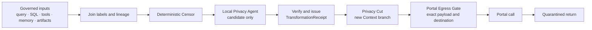

# :material-eye-lock-outline: Anonymization, taint, and egress

> _The gate judges what leaves. The Weaver only brings the sealed vessel to its threshold._

Sensitive material may be copied long before a Portal station appears. Weaver therefore carries
privacy lineage through the Pattern and creates a new sanitized branch before remote inference.
[Context](../../../adr/21-context.md#privatization-and-the-privacy-cut) owns labels and the Privacy
Cut; [Security](../../../adr/09-security.md#portal-privatization-and-egress) owns declassification
and refusal; this page owns the journey through the score.

!!! warning "Designed, not delivered"
    Current LychD censors secret-shaped values only in stored consent projections. It has no
    general Privatization Label, Privacy Agent, Privacy Cut, `TransformationReceipt`, or Portal
    Egress Gate. Declaring a Portal still makes it an ordinary dispatch candidate.

## The leverage of a local boundary

Anonymization is not merely a defensive filter. Once delivered, it is what can make subsidized
remote reasoning admissible for a delegated coding agent. The **local anonymizer** is the whole
chain—deterministic Censor, local Privacy Agent, verifier, and Privacy Cut—not one model trusted to
declare its own output safe. The **local bastion** is likewise a compound boundary: Coffin
supervision, the Portal Egress Gate, and the Provider Gate.

Together they can expose one useful, sanitized task projection to one named remote runtime under
job, destination, model, time, token, and spend bounds. The raw checkout, credentials, identity
map, pseudonym map, and promotion authority remain local. The returned candidate comes back
quarantined for local rehydration, testing, and admission.

That is the economic leverage: inexpensive or subsidized provider capacity becomes usable without
pricing raw disclosure into the bargain. If the Cut cannot preserve enough program structure and
diagnostic meaning to answer the task, or the bastion cannot attest the exact exit, the work stays
local.

## One cut, two contexts

The raw branch remains local and labelled. The Privacy Cut rebuilds every field that will reach the
provider: stable instructions, selected history, query, tool schemas and results, attachment
projections, and provider options. It never reuses raw continuation objects or a prefix-cache key.

The cut may keep `<phone_1>` stable within that branch. Its reversal map remains restricted and
local to the Run; another cut receives another namespace.

## Transformations are evidence

| Act | Result |
| --- | --- |
| Redact | Remove a value without a reversal map |
| Pseudonymize | Replace it with a scoped token while a local map exists |
| Generalize | Reduce precision while preserving useful meaning |
| Anonymize | Meet a declared residual-risk policy and threat model |

None grants egress by itself. The Censor and Privacy Agent produce a candidate and findings. The
trusted Portal Egress Gate decides whether that exact candidate may cross the named Portal.

Deterministic work runs first. It normalizes text and structured values, removes prohibited fields,
and detects credentials, JWTs, PEM blocks, emails, telephones, bank and payment identifiers,
network addresses, UUIDs, long numeric ids, and suspicious high-entropy strings. Detectors use
typed placeholders rather than replacing every number with `<number>`: an amount, date, telephone,
and order id do not carry the same meaning.

A local Privacy Agent handles semantic and quasi-identifiers that rules may miss. It can say
“this combination still identifies a household” and propose a narrower representation. It cannot
lower a label, call a Portal, or treat its own confidence as permission.

## Labels begin at the source

SQL is storage, not the classifier. Domain and repository ports attach table and column defaults,
row- or subject-specific policy, and query lineage before values reach Context. Computed fields
inherit the values that formed them. Unknown or raw access is restricted at the governed boundary.

Tools declare whether output introduces a sensitive source, inherits or joins inputs, remains
local-only, proposes sanitization, or enters quarantine. A `sensitive` annotation warns the
contract; it does not become a prompt hint that the model may ignore.

The same rule covers screenshots, filenames, EXIF, OCR, transcripts, captions, embeddings, model
summaries, checkpoints, and delegated results. A derivative does not launder its source.

## Seal the exact exit

The Portal path has two checks:

1. Before grant, admission verifies that the aggregate label, purpose, destination, and required
   transformation path are eligible.
2. Before the first outbound payload byte, transmission verifies the canonical payload digest,
   provider and model, Principal and Sigil, policy revision, expiry, and
   `TransformationReceipt`.

A content change, retry, fallback, resumed stream, different model, or delegated child call needs a
new decision. Consent can authorize only an eligible exact disclosure; it cannot make a credential
safe or repair missing lineage.

The provider's response remains attributed, tainted by the disclosed source influence, and
untrusted. Rehydrating pseudonyms is a separate local presentation act. Tool effects, Archive
admission, publication, and training re-check their own authority.

## Let Loom show the boundary

A future Pattern contribution declares boundary metadata separately from Graph mechanics:

- execution plane and eligible local or Portal providers;
- egress, local-only, write, delegation, and quarantine behavior;
- label propagation or admitted declassification;
- required receipt, Gate, consent, and failure edge.

Loom may derive badges such as `PORTAL-ELIGIBLE`, `EGRESS`, `SANITIZES`, `DELEGATE`, `WRITES`,
`QUARANTINED OUTPUT`, and `HITL`. The manifest shows what may happen; occurrence evidence records
the provider, decision, payload digest, receipt, and result that actually happened. A hand-authored
`dangerous = true` flag is not enough.

Weaver rejects a contributed Pattern whose Portal station has no egress policy, whose
declassification edge has no receipt, or whose delegated branch can bypass the parent boundary.

## Refusal is part of the score

| Failure | Pattern result |
| --- | --- |
| Missing or unknown lineage | Treat as restricted; remain local |
| Detector or Privacy Agent uncertainty | Deny or route to declared review |
| Receipt does not match payload | Deny before transmission |
| Policy or consent expired | Re-evaluate; never reuse the old decision |
| Provider fails or changes | No silent fallback; create a new attempt |
| Return proposes an effect | Keep quarantined until the effect owner reauthorizes it |

Logs and receipts retain categories, counts, policy and transformer revisions, digests, and failure
stage—not raw sensitive spans or the pseudonym map. Memory, embeddings, training data, backups, and
shared artifacts retain lineage and deletion obligations after the Run ends.

[Portal](../../animator/portal.md) owns provider declaration and operation.
[Pattern lifecycle](pattern-lifecycle.md) owns revision pinning;
[Stasis and return](stasis-and-return.md) owns durable waiting; and
[Delegated agents](delegated-agents.md) owns the opaque child boundary. The [State of
Work](../../../state-of-the-work.md#context-privatization-and-portal-egress) records what exists.
