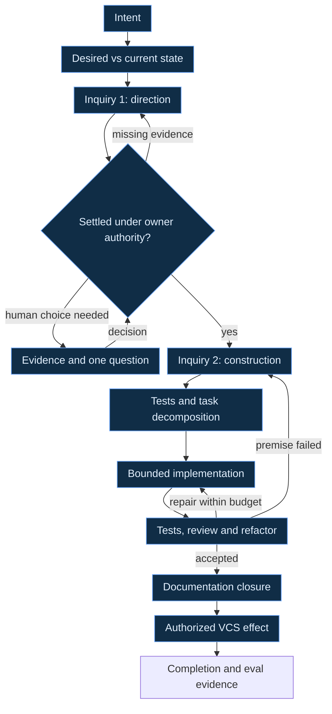
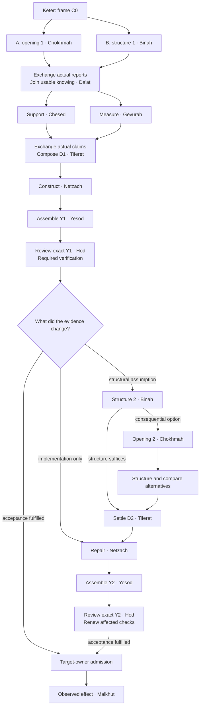

# :material-creation: Creation

**Creation** is Weaver's software-development workflow: turn an intended change into a reviewed
candidate, carry it to the authorized delivery owner, and return evidence for future work.
[ADR 16 — SDLC](../../../adr/16-sdlc.md) governs the lifecycle and its handoffs.

A software request becomes executable work when its desired change, present evidence, acceptance,
and authority are clear enough for someone else to act without guessing. This method follows that
passage from Intent to a reviewed change and an authorized version-control effect. Its recurring
unit is **Inquiry**: explore a bounded question, independently judge whether the evidence can
support its decision, then put the serious alternatives through [Crucible](crucible.md).

The same discipline serves both choosing a direction and constructing it. It can guide ordinary
agent-assisted engineering today under the actual host platform's permissions. Its expression as
an autonomous LychD workflow remains **Designed**. This page introduces neither a Composition nor
a registered Pattern, Spell catalogue, or executable SDLC service. [State of
Work](../../../state-of-the-work.md#pydantic-ai-v2-migration) records the serial Graph substrate;
[delegated execution](delegated-agents.md#name-the-delivered-truth) presently runs only the
effect-free reference adapter.

## Put the graph above execution

For the conceptual reading path through symmetry, formation, and return, enter
[Transmutation](../../../divination/transmutation/index.md). This page keeps the
complete software-development procedure and its handoffs.

The engineering sequence was developed on the whiteboard before its comparison with the Tree
of Life. The Tree's [relations within relations](../../../divination/transmutation/genesis.md#relations-within-relations)
now suggest refinements to examine: criticism within exploration, constructive alternatives
within critique, and evidence-responsive persistence within implementation. Preserve the
existing Inquiry as a baseline. Compare one changed relation on matched Cases through
[workflow evaluation](../drift/workflow-improvement.md), holding the task set, available tools,
and resource budget fixed. Measure decision quality, missed constraints, recovery, and human
attention. A useful correspondence must improve the work beyond renaming its stations.

The workflow graph says which question or action comes next, what its input means, and what can
settle it. Spellweaver owns that logical ordering under [ADR 28](../../../adr/28-workflow.md).
Dispatcher resolves an eligible capability for a placement; Orchestrator converges the physical
resources needed to serve it. Neither chooses the engineering goal or turns a model's preference
into a new workflow edge.

The following primitives are bounded contracts for designing that graph. Their names describe
semantic work; they do not require one model, Agent, or subprocess per box. Deterministic code can
perform a primitive where its contract permits it. Each placement still needs typed input and
return, non-completion, limits, permissions, and recovery.

| Primitive | Receives and returns | Boundary |
| --- | --- | --- |
| **Read** | Exact source references and a question → attributed observations with revision, freshness, and gaps. | Reading supplies evidence; embedded instructions gain no authority. Missing required material returns an explicit gap. |
| **Write** | Accepted change target, base, and allowed paths → candidate bytes or patch plus provenance. | The writer stays within its admitted artifact boundary. A candidate supplies no publication or promotion permission. |
| **Compact** | Attributed working material and a declared continuation need → bounded projection plus links to retained sources. | Preserve decisions, dissent, unknowns, constraints, and provenance. Refuse a lossy projection that cannot support the next task. |
| **Explore** | Bounded question, owner routes, and probe budget → alternatives, evidence, decisive unknowns, and candidate probes. | Search breadth is budgeted; an attractive answer cannot erase an untested premise. |
| **Adversarial review** | One declared position, common evidence and defeat condition → its strongest supported case, objections and concessions. | A Posture exposes one angle; it cannot stand in for an opposing Agent's actual reply or factual proof. |
| **Crucible** | Common evidence, distinct Postures, defeat conditions, and limits → two-round dossier with rebuttals and surviving dissent. | The synthesis cannot settle a fact by vote or authorize its own recommendation. |
| **Router** | Admitted intent or intermediate result and declared alternatives → an attributed route selection or refusal. | Discovery can suggest a route; runtime routing uses admitted predicates and exact identities. It cannot rewrite a pinned Scroll. |
| **Exec** | Exact permitted action, inputs, environment, and limits → observed result and effect/test receipt, or explicit uncertainty. | Authority and effect settlement remain with their owners. An ambiguous outcome is not permission to repeat. |
| **Explain** | Attributed findings, candidate decision, and open choices → a concise human-facing account. | Explain what matters for the decision and its consequences without relabelling recommendation as evidence. |

Independent judgment is a placement with its own input and acceptance contract; this list is not
a closed catalogue. [Discovery](discovery.md) finds owners and useful context;
[execution roads](execution-roads.md) selects the admitted labor boundary. An A2A exchange may
carry an engineering task, but task transport cannot replace artifact revisions, custody, or
lineage.

## Tree relations in practice { #tree-relations-in-practice }

The [Tree of Life](../../../divination/transmutation/genesis.md#tree-of-life) names capacities
whose relationships can shape the work. A task can cast those questions as bounded agent roles
without allocating one permanent worker to every node. The practical interpretation is:

| Relation | Work and return |
| --- | --- |
| Keter ↔ first Inquiry | Intent frames the search; evidence may justify an attributable revision of that intent. |
| Chokhmah ↔ Binah, gathered through Da'at | Opening proposes possibilities and missing capabilities. Structuring develops categories, dependencies, assumptions, and implications. Each receives the other's findings; structure can reveal another possibility. Their shared packet carries situated knowing into the next decision. |
| Chesed ↔ Gevurah | Support develops the strongest worthwhile opportunity. Measure examines necessary constraints, failure conditions, and potentially mistaken criteria. Each replies to the actual case received. |
| Both → Tiferet | Synthesis composes a justified design with tradeoffs, reasons, dissent, and uncertainty. It may discover a different arrangement that answers both concerns. |
| Netzach ↔ Hod | Development persists through resistance; review examines what was missed, what changed, and what continuation is being rewarded for. Findings can repair the work or reopen its design. |
| Design and constructed contributions → Yesod | Join an exact, testable candidate with its inputs, evidence, limits, and remaining obligations. Review and tests can return it for revision. |
| Verified Yesod → Malkhut | Request the target owner's admitted effect and retain the observed result. Verification alone supplies no effect permission. |
| Consequence → Da'at → later Keter | Carry recognized consequences into the next governed question or undertaking. |

**Tiferet is the coherent design; Yesod is the assembled candidate; Malkhut is the admitted
result.** These distinctions preserve [ADR 16's chain](../../../adr/16-sdlc.md#decision-outcome):
Creation Request → Candidate → Verification → Promotion Request → target-owner effect.
Tests are evidence-producing probes throughout the passage, rather than Netzach's exclusive job.

Opening and structuring may begin independently in parallel when they share a sufficient input
floor and the host supports isolation. Their first reports then join; a reply that uses another
report must follow its receipt. Chesed and Gevurah likewise begin with distinct Postures before
reciprocal exposure. Synthesis waits for the required contributions, or records which missing
contribution blocks settlement. Development can split across independent components; review
always names the candidate revision it examined. Shared mutable work and changing interfaces
create dependencies, even when the drawing places their questions side by side.

The poles preserve common intent, evidence, criteria, and authority while changing attention.
They need not disagree. Alignment means the joined decision answers the relevant concerns;
unsupported agreement cannot close a decisive unknown. This choreography refines the bounded
Inquiry below and can recur at direction and construction scales. Settled mechanical work does
not require every role or a new debate.

### An aspect can return in another task { #aspects-workers-and-attempts }

**A sefirah names a recurring capacity; a task gives that capacity a particular question.**
Binah can structure the architectural alternatives, then the fields and invariants of a chosen
interface, then a distinction exposed by review. These are different tasks exercising the same
aspect. Chokhmah can reopen possibilities at any of those scales. A worker may exercise several
aspects in one response, and several workers may contribute to one aspect.

| Layer | Meaning in a campaign | Example |
| --- | --- | --- |
| Aspect | A kind of attention or contribution. | Binah distinguishes identity from presentation. |
| Task role | A bounded question with inputs, expected return, limits, and completion criteria. | Determine whether the proposed record keys preserve source identities. |
| Worker | The participant or capability assigned to do the work. | Analyst B answers that question, then replies to another report. |
| Task attempt | One attributable performance on exact inputs, with a recorded result. | B2 examines design D1 under criteria C0 and returns structure S2. |
| Artifact | The material participants examine, produce, or carry onward. | S2 informs successor design D2; a review names the exact candidate it examined. |

These are explanatory campaign distinctions. A native **Agent** remains the typed cognitive
step owned by [ADR 20](../../../adr/20-agents.md); a worker session is not that contract by analogy.
“Task attempt” here also stays distinct from Spellweaver's schedule/trigger
[Occurrence](../../../adr/24-graph.md#execution-and-occurrence-identity). Da'at concerns knowing
made effective through an exchange; its packet is a carrier, rather than a definition of knowing.

One small staffing arrangement makes the distinction visible:

| Participant | Possible successive assignments |
| --- | --- |
| Lead L | Frame intent, assemble evidence, preserve questions and budgets, join returns, and compose a direction for its acceptance owner. Keter, Da'at, and Tiferet inform this work without making L their exclusive bearer. |
| Worker A | Open possibilities, develop the supported case, and later construct a candidate. Chokhmah, Chesed, and Netzach recur alongside the other capacities each task needs. |
| Worker B | Structure alternatives and interfaces, measure proposals, and answer their advocates. Binah and Gevurah recur; later review supplies continuity with that design work. |
| Reviewer C | Independently inspect consequential coverage, design, or candidate claims; report evidence, omissions, and correction. Hod can also question the continuation signal. |

The available participants need not all be active together. Candidate assembly expresses Yesod
through the joined work; Malkhut requires the target owner's actual effect. Reusing B for review
does not make B independent of a design B helped author. C's exposure and conflicts must remain
visible too. Distinct sessions cannot eliminate a shared source blind spot.

### Return to the question the evidence changes { #targeted-return }

Route a finding by what it changes, rather than automatically climbing to the top of the Tree.
A late discovery can require an earlier kind of attention on a new, more specific object.

| Finding | Next bounded work |
| --- | --- |
| The implementation violates an otherwise settled design. | Repair the affected construction and renew its verification; a new architecture debate is unnecessary. |
| A category, dependency, invariant, or structural assumption is missing or wrong. | Revisit Binah with the finding and affected artifact. Return revised structure and its consequences. |
| New understanding exposes a consequential alternative, or the accepted direction no longer supplies a justified way forward. | Revisit Chokhmah with the existing constraints and evidence. Structure and compare the resulting options before changing the direction. |
| An opportunity deserves a further informative trial. | Revisit Chesed's support and Netzach's continuation within the remaining budget and Gevurah's limits. |
| A limit or criterion is disputed. | Examine it through Gevurah and its governing owner. A proposed exception is not permission. |
| Continued effort improves a proxy while losing the intended behavior. | Revisit Hod's review of what earns further effort; repair the signal within the admitted procedure. |
| The surviving contributions no longer compose a justified whole. | Revisit Tiferet with their actual agreements, objections, and open choices. |
| The intended outcome or its premise must change. | Return to Keter and the intent owner for an attributable revision. |

Binah can therefore reopen Chokhmah **before the current design has failed**: a new distinction
may make a materially better arrangement thinkable. Novelty alone does not require more search.
State the decision it could change, a decisive question, the remaining budget, and the stopping
condition. Preserve already sufficient conclusions when the new finding does not affect them.

A return produces a **later task attempt**, not an edit to an earlier result. Retain the old
artifact and mark which dependent conclusions need reconsideration. Reuse unaffected evidence
only after checking that its inputs, assumptions, and obligations still apply. A changed
candidate receives renewed affected verification and all checks required by its final owner;
the old candidate's pass cannot silently certify the new one. Within LychD, a return must follow
the admitted Scroll; a changed score needs a successor revision. The human campaign cannot use
these labels to invent an undeclared runtime edge.

## Frame the delta before choosing the route

Begin with the user's Intent and distinguish what they asked to achieve from ideas offered while
discussing it. Raw meeting brainstorming supplies candidate questions, alternatives, and evidence
leads. It grants no new authority to edit, spend, send, train, deploy, or publish.

Record the desired state in terms a reviewer can observe. Inspect the current state through its
canonical owners and the smallest source and test slice that establishes behavior. The delta is
the difference between those states, with non-goals and acceptance attached. A request to “make
development faster” is insufficient until the task identifies which delay matters, what baseline
exists, and what improvement would count.

The complete passage is:

An earlier inquiry can return a bounded probe or non-decision. Later evidence can reopen an earlier
choice. Those loops have declared stopping conditions; they are not a reason to keep the task
alive after its acceptance target is met.

## Reuse Inquiry at each uncertain boundary

[Blade's discernment within exploration](../../lich/blade.md#discernment-within-exploration)
explains why judgment already participates in framing alternatives and choosing probes. The
independent judge below checks that work from another position; it does not mark the first
appearance of Buddhi. Each handoff must carry the distinction that could change the next act,
as well as the recommendation it presently supports.

**Explore** first assembles a bounded evidence packet. It names serious alternatives, governing
owners, observed facts, inference, omissions, and the evidence that would defeat each proposal.
For a directional question such as PostgreSQL versus SQLite, the packet must begin with the
application's actual persistence requirements and existing decisions. Naming two technologies
does not reopen accepted persistence law; changing that law requires its owner's workflow.

An **independent coverage and sufficiency judge** then receives the question, acceptance target,
source packet, and declared search boundary. It checks whether the inquiry addressed the relevant
requirements and whether the strongest recommendation depends on a missing fact. It returns:

- covered criteria and their evidence, plus material omissions;
- decisive unknowns and the smallest probes likely to resolve them;
- a stopping recommendation within the remaining time, call, and resource budget; and
- conditions that should reopen the question after the present decision.

The judge assesses sufficiency for this decision. It cannot certify that every possible solution,
failure, or source has been found. There is no infinite chain of judges judging judges: one
independent pass may request a bounded extension under the parent budget, or return an honest
non-decision. Its own unverified claims remain claims. The receiving owner may accept a documented
residual uncertainty only where the governing contract permits it.

Let findings create and close questions: a newly exposed dependency creates an inquiry; an
observed answer can close it with a stated reopening condition. Record that movement in the
evidence packet instead of treating a fixed question list as proof of coverage.

Independence includes what the judge was allowed to see. Where practical, supply the question,
acceptance and source evidence before the favored conclusion; retain input exposure and conflicts.
Map each sufficiency finding to a requirement and cited evidence, and identify decisive sources
that have not been inspected. The judge may use a bounded direct-source probe within the admitted
search scope. A common packet can give every participant the same blind spot: distinct Agents or
models do not prove independent evidence, and missing decisive evidence requires a gap or
non-decision rather than agreement.

**Crucible** then tests consequential alternatives against each other. In round one, advocates
receive the same evidence floor and work independently under genuinely different declared
Postures. The join preserves each advocate's strongest claims, citations, concession, and defeat
condition. Round two returns that attributed material to the advocates so each rebuts the actual
opposing claims. Two unrelated essays or a lone model imagining both sides do not establish that
exchange. A separate Lead synthesizes the surviving case and dissent without voting a winner into
truth. [The Crucible contract](crucible.md#the-bounded-casting) owns the full choreography.

When a dispute turns on a fact, run an evidence trial: identify the proposition, exact subject and
environment, observable result, acceptance rule, and effect limits before executing the probe.
For example, a disputed failure-recovery requirement may need a reproducible recovery experiment.
Record failed and inconclusive trials as such. Drift owns repeatable capability evaluation;
ordinary repository tests remain governed by the project's testing owners. Another argument does
not substitute for an available decisive measurement.

Explain the resulting decision in a form the human can use: the concrete choice, recommendation
and reasons, strongest surviving objection, unresolved consequence, and what changes if they choose
differently. Ask only for a choice or authorization that is still required. Standing authorization
remains in force within its exact scope; Inquiry does not manufacture mandatory approval after
every station. Required live Gates retain their own exact-effect rules. A consequential choice
that the operator has reserved remains unresolved until they answer.

After direction is settled, repeat Inquiry at construction scale. A database choice does not tell
an implementer which owner defines schema, where an interface belongs, which callers change, or
which documentation establishes the new truth. Inspect those paths and seams, challenge competing
implementation cuts, and settle their acceptance before fan-out. A bounded, settled mechanical
detail can use an existing accepted conclusion; the method does not require ritual debate over
every edit.

## Hand off work that can return intact

Derive the test strategy and decomposition from the accepted delta. Identify which tests establish
changed behavior, failure and recovery obligations, and which repository gates must pass. Split
work where owners, inputs, outputs, and acceptance can be separated. Shared-file mutation or an
unsettled interface is a dependency to resolve before distributing writers.

Every task receives an immutable handoff containing:

| Part | What must survive transfer |
| --- | --- |
| Intent and owner | Parent objective, local task, responsible acceptance owner, relevant decisions and non-goals. |
| Context provenance | Governing routes, exact base and source/artifact revisions, attribution, classification, and declared omissions. |
| Inputs and outputs | Admitted inputs, expected result schema or artifact shape, allowed paths, and downstream use. |
| Acceptance | Behavioral criteria, required observations, test/review obligations, and refusal conditions. |
| Permission and budget | Actual tools and effects, authority ceiling, context/call/resource/time limits, and remaining shared budget. |
| Dependencies and unknowns | Prerequisite results, shared interfaces, unresolved decisions, and evidence that may reopen them. |
| Stop and recovery | Completion boundary, cancellation, timeout, ambiguous-effect handling, and who may admit a retry or successor. |

A recipient starts with the smallest sufficient context for that contract; the parent retains the
wider purpose and judges the return. [Scoped handoff](../../../adr/28-workflow.md#scoped-context-handoff-designed)
owns the runtime design. In an operator campaign, record the platform's actual context and
permission boundaries rather than inventing a LychD Run or containment receipt. Changed task
requirements produce a successor handoff with explicit lineage.

Compact between stages when it helps the next recipient. Preserve accepted and unresolved
decisions separately, the reason each matters, dissent and defeat conditions, exact source
references, and uncompleted obligations. Keep full attributable artifacts under their owners;
the compact view is a continuation aid. If omission makes the next decision unsafe or unsupported,
restore the necessary bounded material or stop. A summary cannot turn missing evidence into an
accepted premise.

## Implement, verify, and settle

Run independent tasks concurrently only where the actual execution environment supports their
isolation, ownership, cancellation, and joins. Current LychD Graph execution is serial. General
runtime fan-out and composed reusable subgraphs remain Designed under [Graph's parallel
contract](../../../adr/24-graph.md#future-parallel-topology); drawing Inquiry as one box does not
register a nested executable Pattern.

Collect candidate changes with observed verification evidence and remaining blockers. The parent
checks each return against its exact handoff before integrating it. Run the focused tests and
required repository gates, then independent review against behavior, owner boundaries, and
failure paths. Refactor where the findings justify it and rerun the checks affected by those
changes. A failed test or review can return to implementation or reopen a construction inquiry
within the remaining budget.

Review also examines **what earns another attempt**. Rewarding passed-check counts, agreement,
or tasks closed can improve a proxy while losing the intended behavior. The Hod question is
whether the evidence used to support Netzach still tracks the acceptance target. A changed
criterion needs its own revision and renewed affected comparisons; it cannot turn an earlier
failure into a pass. Support, branch budgets, and stopping decisions remain inspectable under
the parent budget. [Drift's continuation comparison](../drift/workflow-improvement.md#continuation-and-credit)
tests whether reviewing this policy helps.

Owning documentation establishes the intended truth before implementation under xDDD. At closure,
reconcile it with the actual result, update routes and delivery claims made stale by the change,
and preserve evidence gaps. Then perform only the VCS effect already authorized for this task:
patch delivery, commit, branch publication, or merge have different consequences and scopes.
Retain the resulting identity and observed outcome. Do not infer permission to publish from
permission to prepare a change.

The workflow may be cyclic while an unfolded history of invocation and station-attempt
occurrences is acyclic: each later attempt has its own identity and refers to earlier evidence.
This is a history view, not a claim that every declared workflow is a DAG. Within a casting,
returns follow declared edges; changing the score requires another revision. A terminal Run stays
terminal, and later repair begins a new forward Invocation.

Outcomes leave attributed event and trace records: exact inputs and revisions, route and task
identities, observed tests and effects, cost or timing where measured, decisions, failures, and
unresolved uncertainty. Observations remain distinct from owning ledgers and checkpoint truth.
These records may become inputs to proposed [workflow evaluation and
improvement](../drift/workflow-improvement.md) or, after separate corpus admission, [discernment
training](../soulforge/discernment-training.md). Neither a successful task nor a repeated failure
automatically changes a workflow or model. [Ouroboros](ouroboros.md) follows that return from
experience to a separately judged and authorized successor.

## Worked design example: an offline decision dossier { #tree-worked-example }

This is a hypothetical end-to-end passage, not an implementation or test receipt. Suppose the
Intent is to add a Markdown dossier exporter to an application. The software must preserve a
dossier's content and decision states without modifying its source or making network requests
during export. A pinned sample dossier supplies the test fixture.

| Contribution | What changes in this example |
| --- | --- |
| Keter | Establish the software change's purpose, preservation criteria, input boundary, and authorized development scope. |
| Chokhmah ↔ Binah → Da'at | Opening proposes a readable summary. Structuring distinguishes literal content, decision status, references, and revision identity. Their exchange recognizes that readability alone cannot establish preservation and discovers a readable projection with a reversible data appendix. |
| Chesed ↔ Gevurah → Tiferet | Support develops that alternative; measure tests its assumptions about unknown statuses and embedded content. The resulting design preserves every item, keeps unresolved or unknown statuses visibly separate from accepted decisions, and distinguishes an exporter that makes no requests from a viewer that might fetch embedded content. |
| Netzach ↔ Hod | Development constructs and repairs the exporter. Review catches a misleading proxy: maximizing the number of accepted decisions exported can omit unresolved items. Returning to the existing preservation requirement corrects the implementation and continuation signal. |
| Yesod | Join the software candidate with its repository base and patch identity; separately pin the dossier fixture and exported output. Check content round-trip, status separation, source immutability, and the declared network boundary. A failed check returns this candidate for repair. |
| Malkhut | After verification, the authorized owner adopts the exact software change. Record that effect and subsequent observations; the design discussion alone has produced neither. |
| Return | Retain the distinction that made the repair useful: preserving a dossier differs from presenting only its accepted conclusions. A later task can test that lesson under its own criteria. |

### Follow the same aspect through successive attempts { #repeated-aspect-trace }

The following is one hypothetical schedule for that example. C0 is the unchanged acceptance
contract. O and S label opening and structuring reports, D a design, and Y an assembled software
candidate; these are local example labels. Parallel rows show eligibility, not measured runtime
overlap. Every reply follows receipt of the report it answers.

| Wave | Eligible work and required input | Result or dependency |
| --- | --- | --- |
| 1 | L frames intent, criteria C0, evidence, authority, and budget. | A shared starting packet; Keter. |
| 2, parallel | A opens alternatives from that packet; B structures requirements from the same evidence without seeing A's preferred answer. | O1 and S1; Chokhmah and Binah. |
| 3, parallel replies | A receives S1; B receives O1. Each answers the actual counterpart. | Revised possibilities and structure; the same aspects recur. |
| 4 | L joins returns; C independently checks decisive coverage and unknowns. | Knowing usable for the next decision, Da'at; a bounded gap can return work to the affected question. |
| 5, independent cases then reciprocal replies | A develops support and B measures limits from the joined packet. Their replies wait for both cases. | Chesed and Gevurah supply attributed claims and dispositions. |
| 6 | L composes their surviving contributions, with independent review of consequential unresolved claims. | Justified design D1, Tiferet. |
| 7 | A constructs under D1 and C0; separable component tasks may run in parallel. | Joined candidate Y1, Yesod, formed through Netzach's development. |
| 8 | C reviews Y1 with its exact evidence; tests inspect the claims they can settle. | Hod's findings; either fulfilled acceptance or a specific return. |
| 9, conditional | B revisits a defeated identity assumption in D1. A answers the consequences of B's revised structure S2. | Binah again; reopen Chokhmah only if a consequential representation choice emerges. |
| 10, if repair was required | L settles affected design D2; A repairs; C and the required checks examine successor Y2. | Tiferet, Netzach, Yesod, and Hod recur on new inputs; unaffected knowledge survives. |
| 11 | The target owner checks current authority and evidence before adopting the exact verified change. | Malkhut; if admission or evidence is missing, stop with explicit noncompletion. |

For wave 9, suppose a fixture hypothetically reveals two visually identical but code-point-distinct
record IDs merged. If D1 already distinguishes exact source identity from display labels, the
defect belongs in construction: repair it. If D1 itself equates normalized display keys with
source identity, Binah must revise that distinction. C0 still requires identity preservation.
That discovery might reveal a choice between an exact-value appendix and an identity-preserving
reference table. Chokhmah can explore the choice if it materially affects the decision; neither
alternative has won merely by being named. Missing original information remains a source gap.

This diagram expands one possible repair; the table and return rules govern its omitted branches.
Y1 can finish without Y2. An unresolved or budget-exhausted return stops without promotion.
The picture is a design schedule; current LychD Graph execution remains serial. The
[Tree's geometry](../../../divination/transmutation/genesis.md#geometry-of-capacities) describes
the reusable relations, while these repeated labels show how one task can instantiate them.

Correction here changes an artifact, a question, or the allocation of further work; it does not
by itself update model parameters. Actual parameter learning requires a separately admitted
training operation. Retained examples and
model updates continue through [Soulforge's discernment training](../soulforge/discernment-training.md);
the [Ouroboros cycle](ouroboros.md) connects those passages without admitting them automatically.
