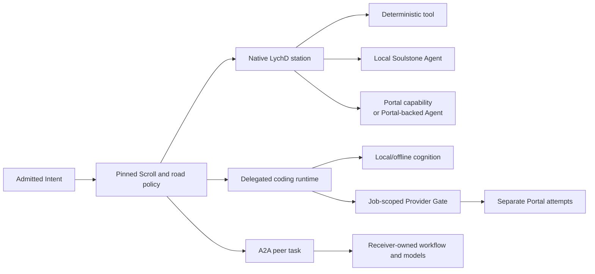

# :material-routes: Execution roads

> _Choose who owns the labor before choosing which sky supplies the thought._

Spellweaver chooses an execution shape inside one immutable Scroll. It does not operate a cheapest-
model router. [Workflow](../../../adr/28-workflow.md#execution-road-planning) owns the road policy
and occurrence evidence; [Context](../../../adr/21-context.md#privatization-and-the-privacy-cut)
owns the material branches; [Security](../../../adr/09-security.md#portal-privatization-and-egress)
owns every remote disclosure. Dispatcher binds an already eligible capability and Orchestrator
makes managed local substrate ready; neither decides the semantic road.

!!! warning "Designed road planner"
    Current Spellweaver routes once among fixed source-defined Pattern revisions and can run local
    capabilities or the no-effect delegated reference adapter. General Portal egress is
    quarantined; A2A has no transport; and no effectful coding-agent Coffin exists.
    `ExecutionRoadPolicy@1` and `ExecutionRoadDecision@1` are accepted design targets, not shipped
    records.

## The roads are layered

Portal, A2A, and coding agents answer different questions. Portal is a cognition/service boundary.
A2A is sovereign task delegation. A coding agent is a contained iterative runtime. They are not
three values in one provider dropdown.

The peer's internal model is not the sender's Portal. Conversely, a coding CLI does not stop being
a delegated runtime merely because its planner calls an API. That child API call is another exact
disclosure edge under the parent job.

A native Agent loop follows the same rule. Validation repair, tool-result follow-up, changed
history, or another model round creates another exact Portal payload and decision; the first grant
or disclosure never preauthorizes the loop.

## Choose by the work

| Road | Choose it when | What the remote or lower-trust side owns | Canonical return |
| --- | --- | --- | --- |
| **Local deterministic/tool work** | parsing, retrieval, classification, transformation, validation, or an exact tool can settle the station | no remote custody; the local tool still receives only its authorized projection | validated value or owner-settled effect receipt |
| **Local Soulstone Agent** | one bounded cognitive step needs raw/private semantics or local availability is sufficient | local model inference only; AgentSpec, Sigil, truth, and effects remain outside the model | typed Agent result, still subject to factual/domain validation |
| **Portal capability / Portal-backed Agent** | LychD retains decomposition and needs one bounded remote inference or service operation | provider receives one exact admitted payload; no workspace, Sigil, tool authority, or application judgment | immediate `ModelGrant`/`CallGrant` return or durable `JobGrant`/`ServiceJobAttempt` result, always quarantined before adoption |
| **A2A / Intercom** | an enrolled sovereign peer should own one public task schema on its own iron | peer chooses its private Scroll, models, tools, and refusal under its policy | authenticated typed terminal, refusal, failure, expiry, revocation, cancellation, or loss |
| **Delegated coding agent** | repository exploration, iterative tool use, tests, patch generation, or verification needs its own runtime loop | one `read`, `candidate`, or `verify` Coffin over an immutable projection or disposable worktree | quarantined analysis, candidate patch, ArtifactRefs, or verification receipts |
| **Interactive coding seat** | a human is actively operating a provider-supported Codex, Claude Code, Copilot, or similar client | the human client and its account session; not a LychD service | an external artifact that later enters ordinary admission and provenance |

If the task can be expressed as one model request while LychD keeps the plan, use a local or Portal-
backed native Agent. If the receiver must own a durable public task, use A2A. If the worker needs a
workspace and iterative tools under LychD containment, use a delegated coding agent. A consumer
subscription never becomes an automated road merely because the payload was sanitized.

## Decide in this order

1. **Name the application owner and purpose.** The Composition judges the result and the Scroll
   pins the exact semantic station. A model, peer, or coding runtime does not choose its own job.
2. **Classify and minimize.** Join source influence, select the smallest typed projection, and
   remove fields not needed for the declared output. Raw history, an entire checkout, or a database
   row is not the default request shape.
3. **Eliminate forbidden roads.** Unknown lineage, `local_only`, missing identity, prohibited
   category, unavailable containment, absent task schema, opaque egress, incompatible retention,
   or insufficient authority closes that branch before price or speed is considered.
4. **Choose the labor owner.** Keep the station native, give one sovereign task to a peer, or create
   one contained coding `AgentJob`. This decides decomposition, workspace, wait, and result law.
5. **Choose cognition inside that boundary.** Native and delegated work may be deterministic,
   local-model, or Portal-backed. An A2A receiver chooses privately; the sender does not route its
   provider.
6. **Seal every crossing.** Form a consumer-specific Privacy Cut when required, verify it, obtain a
   fresh tagged-target `EgressDecision`, reserve budgets, and commit the road decision. Reach,
   asynchronous, paid, autonomously retriable, or post-submit-reconcilable work also persists its
   road-owned attempt before transmission; a bounded immediate Portal call retains its grant plus
   decision and dispatch/security events.
7. **Quarantine and adopt.** Remote success supplies candidate material. The Composition's local
   validators and effect owners decide whether it enters application truth.

Local work is the refusal-safe baseline, not an automatic quality winner. A declared policy may
prefer an eligible Portal or peer for latency, specialization, or cost, but economics can only
order roads that have already passed privacy, authority, custody, durability, and terms gates.

## One disclosure plan per boundary

Anonymization is receiver-specific. The same sanitized text is not automatically reusable across
a provider, a sovereign peer, and a coding runtime.

| Consumer | Minimum projection | Additional boundary |
| --- | --- | --- |
| local deterministic station | exact authorized fields; raw values only when its Spell requires them | no egress decision, but labels and tool/effect authority remain |
| Portal provider | stable instructions, selected history/query/evidence, schemas/options needed for one operation | exact `PortalTarget`, canonical wire digest, provider/model/custody facts |
| A2A peer | values conforming to an admitted public task schema plus authorized ArtifactRefs; never prompt floor, local Graph, tools, Sigil, or model inventory | exact `A2ATarget`, peer/task authorization, durable Intercom identity |
| coding runtime | bounded task plus immutable source projection or disposable candidate worktree | runtime/profile/Coffin identity; every child remote call crosses its own Provider Gate |
| logs and telemetry | digests, safe category counts, revisions, decisions, and failure stages | never raw spans, pseudonym maps, credentials, prompts, patches, or private errors |

A remote coding runtime that needs the full private checkout is not made safe by redacting a few
strings. If imports, identifiers, filenames, diagnostics, relationships, or tests cannot survive
the projection, use a local coding runtime or refuse. A black-box CLI that bypasses Provider Gate,
selects hidden fallback providers, or requires transparent MITM is ineligible.

## What Spellweaver closes

Every eligible placement pins `ExecutionRoadPolicy@1` with:

- Pattern, Spell, placement, input/output, error, and non-completion identities;
- allowed labor and cognition roads plus deterministic branch predicates and precedence;
- source classes, required lineage, consumer-specific projection, Privacy Cut/verifier, consent,
  and residual-disclosure limits;
- exact effect, workspace, tool, artifact, quarantine, and result-adoption boundaries;
- provider/peer/runtime eligibility without embedding credentials or live handles;
- deadline, request, token, concurrency, spend, retry, and fan-out ceilings;
- immediate, durable-job, or live-session continuity; idempotency and reconciliation; and
- explicit fallback edges and the terminals allowed to enter them.

Before admission, Spellweaver creates `ExecutionRoadDecision@1` and the Run ledger stores it. The
later dispatch event, `ServiceJobAttempt`, Intercom task/outbox, or `AgentJob` references its id.
The decision binds exact input/export digest, artifact-reference-set digest, opaque custody refs,
canonical content-digest/media-type/size/classification evidence, source-manifest and influence-label
digests, safe residual-disclosure summary/digest, opaque restricted lineage refs, purpose, policy,
expiry, budgets, target, parent-decision/retry generation, expected result, validators, and record
classification/visibility/retention. It carries no caller-supplied full `ArtifactRef`, raw subject,
filename, material-parent, source span, reversal value, credential, or live grant/lease handle. It
records selection only and never
becomes another status ledger or settles the road owner's truth. A durable road record commits with
it atomically when possible; otherwise the decision commits first and the idempotent road record
adopts its id.

The complete record is restricted, deployment-local, and non-exportable. Loom, logs, and external
receipts receive only an opaque decision id or Security's scoped keyed `EvidenceDigest@1` projection;
plain canonical hashes never become broadly visible evidence or an anonymization claim.

Spellweaver rejects a Scroll when a remote edge can bypass classification, Cut, byte-time egress,
budget reservation, durable submission, quarantine, or explicit adoption. It also rejects A2A
without task/peer/durable-return law, coding delegation without containment/workspace/artifact law,
and Portal fallback that can silently change provider or payload. Loom may show these declared
boundaries; it cannot prove that an occurrence crossed them correctly.

## Failure stays on the score

| Observation | Required route |
| --- | --- |
| local model unavailable before work | take only an explicit eligible branch and create its first attempt |
| Privacy Cut loses task semantics | remain local, request narrower input, or refuse |
| verifier is uncertain | deny or enter a declared human-review Gate; confidence is not permission |
| provider/peer/runtime fails before submission | a declared fallback may create a fresh road decision and road-owned attempt |
| timeout or crash after submission | reconcile the same road-owned identity; do not activate another road yet |
| exact same-envelope transport redelivery | retain the road-owned attempt, sealed bytes, target, idempotency identity, road decision, and Cut/namespace only when the adapter proves atomic same-key/same-payload replay or no prior effect; obtain a fresh EgressDecision and consume one bounded disclosure use |
| target, model, peer, workspace, payload, policy, custody route, or semantic attempt changes | create a new road decision and EgressDecision; when transformation is required, create a fresh consumer-specific Cut and, if reversible, a fresh namespace/lease |
| remote return proposes a tool, patch, publication, or other effect | keep it quarantined until the local owner separately authorizes that effect |
| pseudonym lease is missing or expired | no rehydration; settle the declared degraded/refused path without raw reconstruction |

`INDETERMINATE` and `LOST` are evidence-bearing outcomes, not permission to repeat. A fallback
decision points to its parent decision while both road-owned histories remain intact.

Continue with [anonymization](anonymization.md) for the Cut, [delegated
agents](delegated-agents.md) for the Coffin/workspace path, [Portal
Roads](../../animator/portal-roads.md) for provider selection, and [A2A](../../../adr/26-a2a.md) for
sovereign task exchange. [State of Work](../../../state-of-the-work.md) remains the delivery owner.
