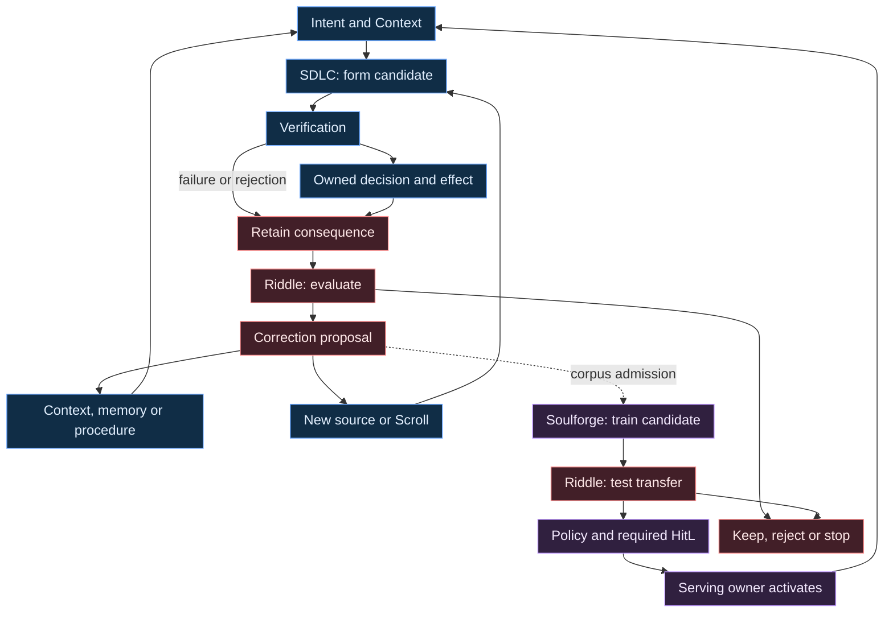

# :material-autorenew: Ouroboros

**Ouroboros is the return of consequence into the next act of creation.** A Lich encounters a
need, forms and tests a candidate, acts through the proper owner, and retains what the encounter
teaches. A later attempt can then change its question, Context, method, or capability. The useful
return is a better distinction: what mattered, why it mattered, and when that lesson stops applying.

This page connects the [SDLC](sdlc.md), [workflow evaluation](../riddle/workflow-improvement.md),
and [discernment training](../soulforge/discernment-training.md) operating designs. It is a map of
governed handoffs, with no new coordinator, registered Pattern, or autonomous implementation.
[Creation](../../../adr/16-creation.md#the-agentic-graph-of-creation) owns the candidate boundary;
[State of Work](../../../state-of-the-work.md#smith-forge-promotion) owns delivery.

## Three returns, at different speeds

Blue follows one piece of work. Red asks whether the work and its method succeeded. Violet changes
model competence only when a training hypothesis earns that more expensive passage. Context and
memory admission can improve the next attempt without changing weights. An evaluation may also
conclude that the present method should remain.

Arrows show dependencies between settled records and separately admitted acts. They do not launch
the next owner, share its authority, or create a hidden Run spanning all three cycles. An eventual
application must publish its exact Pattern; live coordination across Composition-owned
Invocations needs a named [Suite](../../../compositions/products-and-suites.md#compositions-relate-without-nesting).

### Why the whole is not one DAG

The workflow may revisit exploration, repair a candidate, or return after an evaluation. Its
design therefore contains cycles. Each recorded occurrence still has an identity and earlier
causes: `explore₁ → judge₁ → probe₁ → explore₂`. Such an unfolded causal history can be a DAG
without pretending that the reusable workflow is acyclic. A new semantic attempt adds a history
entry; exact transport redelivery preserves its admitted attempt and idempotency identity. This
causal view follows retained dependencies and attributed causal claims, with capture gaps left
visible. It supplies no claim of complete causal observation or new scheduling Occurrence type.
Changing the score requires a new immutable Scroll revision and a later Invocation.

The [Graph](../../../adr/24-graph.md) owns executable topology and checkpoints. Spellweaver owns
logical sequencing, [Dispatcher](../../../adr/22-dispatcher.md) selects an eligible capability,
and [Orchestrator](../../../adr/23-orchestrator.md) owns physical readiness and transitions.
Readiness, refusal, cost and failures return as evidence to the higher decision. A box drawn above
these offices cannot bypass them. The current serial graph does not deliver this entire cycle or
durable parallel fan-out.

## Two perspectives on the same work

The [Tree of Life](../../../lexicon/tree-of-life.md) illuminates **how creation becomes formed**:
purpose, possibility, understanding, generosity, restraint, integration, persistence, correction,
connection and manifestation. The [inner instrument](../../lich/index.md#the-inner-instrument)
illuminates **how an act is received, discriminated, carried and attributed**. One offers a map of
creative relations; the other asks which cognitive function is at work in each relation.

These perspectives cross rather than replace one another. Call can open a possibility at several
stations; Blade can test a proposal or stop an unjustified promotion; Spirit carries both prior
conditions and later correction; Answer binds each act to its local author and consequence.
Neither ten sefirot nor four offices prescribe a model count, org chart, or permanent chief Agent.
Their traditional provenance and LychD's deliberately new correspondences stay in the Lexicon.

Yaga's crafted life in Gege Akutami's [*Jujutsu Kaisen*, chapter 147](https://www.viz.com/shonenjump/jujutsu-kaisen-chapter-147/chapter/22420)
is a fictional prompt behind this comparison. The borrowed question is whether mutually observing
perspectives can change one another and sustain a common undertaking. [Polypsyche](../../../lexicon/inner-tongue.md#polypsyche)
carries that native inquiry; the story supplies neither an engineering recipe nor a required
number of Agents.

The outward movement gives an idea form. Ouroboros adds the return through experience. The wider
meaning of [autopoiesis and recurrent formation](../../../divination/transcendence/illumination.md#i-the-ouroboros)
includes maintaining and revising the organization that makes another act possible. Operationally,
we can test whether retained correction changes later choices, whether consequences remain
attributed, and whether the system can refuse or recover. A loop symbol alone proves none of
these, nor does it settle the philosophical question of life.

## Carry the distinction, not the entire conversation

A coordinating Agent may retain the wider undertaking while each worker receives a bounded,
fresh [Context handoff](../../../adr/28-workflow.md#scoped-context-handoff-designed). Context
injection selects what this decision needs: owning rules, admitted source facts, relevant human
judgments, current state, acceptance, dependencies and unresolved alternatives. It retains source,
revision, authority class and any limits on use. The hierarchy of instructions survives selection;
quoted documents and conversational claims remain attributed material.

Compaction preserves the purpose, accepted decisions and their reasons, strongest surviving
objections, evidence references, authority boundaries, unfinished obligations and the next
discriminating probe. A summary points back to durable artifacts; it neither replaces them nor
silently resolves a dispute. A shared workspace is an attributable record of the undertaking,
not one ever-growing prompt copied into every Agent.

| What should change? | Appropriate return |
| --- | --- |
| This task lacks a relevant fact or rule | Assemble the needed source into Context under [Context law](../../../adr/21-context.md). |
| A correction should be available in later encounters | Nominate an attributed record to [Memory](../../../adr/27-memory.md); admission and Recall remain owned. |
| The method repeatedly omits a step or makes a bad handoff | Prepare a versioned prompt, schema, tool-contract or Scroll candidate and evaluate it. |
| A stable skill fails across tasks despite adequate evidence and method | Propose a Soulforge objective, admitted corpus and independent transfer evaluation. |
| The body lacks an implementation or external capability | Enter Creation, Integration, Delegation or Assimilation according to the actual need. |

For example, “ask fewer questions” loses the lesson. “Proceed when the owner, acceptance and
authority are settled; ask when this unresolved deployment constraint changes the design” carries
a condition, reason and counterexample. [Learning the cut](../../../divination/transcendence/illumination.md#learning-the-cut)
names that transmission of discernment. Its effectiveness is tested on a later task.

## Let conversation become usable work

The proposed interaction horizon is a meeting in which people think together and their Agents
help turn the discussion into bounded work. Capture is visible and agreed by participants, with
declared custody and retention. The Agent distinguishes a speculation, preference, disagreement,
decision, task request and effect authorization before proposing an Intent. Speaker attribution
and uncertainty survive transcription and summarization. Recording permission supplies no
training permission.

A useful human interruption arrives with the missing distinction, a recommendation, the evidence
and consequence, and one answerable question. It can be brought to the human through a convenient
surface rather than requiring constant dashboard watching. Independent work continues within its
admitted scope. The interface honors applicable standing authority and existing decisions;
silence never supplies a verdict, and a live-only effect still needs its exact bound approval.
Measure human attention and decision quality together: fewer questions obtained by hiding
uncertainty is a regression.

[Echo](../echo.md) and [Companion](../../../compositions/companion/index.md) route the current
audio and mobile designs. Ambient meeting attendance and proactive voice questioning are a
future interaction proposal here, not an expansion of Companion's present bounded push-to-talk
contract. The workflow can first be practiced through ordinary attributed text.

[A2A](../../../adr/26-a2a.md) can carry admitted tasks and artifacts between sovereign peers.
Local worker handoffs need not become peer protocol traffic, and another Lich independently
accepts or refuses what it receives. Conversation may become the development interface while
VCS continues to preserve exact artifact lineage. GitHub is one collaboration surface; replacing
it does not replace source identity, review evidence or
[release trust](../../../adr/17-packaging.md#forge-neutral-source-trust).

## From a useful lesson to a changed body

Creation can produce a local candidate; [Assimilation](../../../adr/35-assimilation.md) adds the
study and re-expression of foreign craft. A peer's teaching bundle can reveal a missing Spell,
but the lesson must acquire local provenance, license, ownership, verification and an
implementation binding before it becomes usable. The [Smith](../smith.md) candidate-author role
supplies that craft within its admitted boundary.

The later passages retain their own owners:

| Passage | Required meaning |
| --- | --- |
| [Extension admission](../../../adr/05-extensions.md) | Declare contribution and implementation contracts and test compatibility with the selected body. |
| [Packaging](../../../adr/17-packaging.md) | Bind exact source, dependencies, platform, notices, generated material, artifacts and verification. |
| [Evolution](../../../adr/18-evolution.md) | Revalidate authority and recovery, then activate the changed body as a new generation. |
| Observation and evaluation | Verify the resulting behavior and retain failures or recovery; nominate the next correction under its own authority. |

The running body does not import its candidate to see whether it works. A failed candidate can be
discarded before an effect; an emitted effect requires the responsible owner's recovery or
compensation. Reanimation restores the same body after process death. Evolution deliberately
changes it. Ouroboros describes the wider return through both experience and governed change.

## Establish the cycle in small, verifiable steps

Start by practicing the SDLC on one bounded change with ordinary development tools. Keep its
intent, two inquiry dossiers where warranted, acceptance checks, candidate diff, receipts, human
corrections and final disposition. This establishes a worked example of the method, without
claiming a LychD runtime performed it.

Next apply the basic Riddle workflow to one proposed method change with baseline and candidate
Cases. Adopt only through the receiving owner and retain an unchanged baseline when the evidence
does not support improvement. Only a recurring, well-characterized skill deficit should enter
the training passage. Its first success requires independent transfer evidence and a reversible,
owner-controlled serving choice, not merely a completed training job.

Runtime implementation then has a concrete burden: publish the application-owned score and
records; prove bounded Context handoffs, admission and terminal truth; add recovery and parallel
execution only with their own evidence; and connect independently delivered evaluation and
training owners through settled handoffs. Documented choreography, a hand-operated example and a
delivered autonomous cycle are different milestones in [State of Work](../../../state-of-the-work.md).
