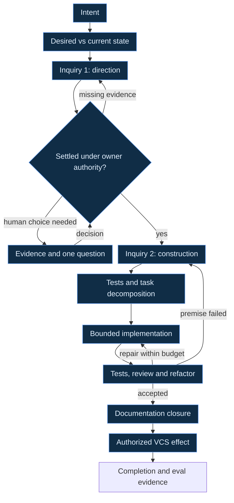

# :material-source-branch: Agentic software development

A software request becomes executable work when its desired change, present evidence, acceptance,
and authority are clear enough for someone else to act without guessing. This method follows that
passage from Intent to a reviewed change and an authorized version-control effect. Its recurring
unit is **Inquiry**: explore a bounded question, independently judge whether the evidence can
support its decision, then put the serious alternatives through [Crucible](crucible.md).

The same discipline serves both choosing a direction and constructing it. It can guide ordinary
agent-assisted engineering today under the actual host platform's permissions. Its expression as
an autonomous LychD workflow remains **Designed**. This page introduces neither a Composition nor
a registered Pattern, Spell catalogue, or executable SDLC service. [State of
Work](../../../state-of-the-work.md#pydantic-ai-v2-migration) records the serial Graph substrate;
[delegated execution](delegated-agents.md#name-the-delivered-truth) presently runs only the
effect-free reference adapter.

## Put the graph above execution

The workflow graph says which question or action comes next, what its input means, and what can
settle it. Spellweaver owns that logical ordering under [ADR 28](../../../adr/28-workflow.md).
Dispatcher resolves an eligible capability for a placement; Orchestrator converges the physical
resources needed to serve it. Neither chooses the engineering goal or turns a model's preference
into a new workflow edge.

The following primitives are bounded contracts for designing that graph. Their names describe
semantic work; they do not require one model, Agent, or subprocess per box. Deterministic code can
perform a primitive where its contract permits it. Each placement still needs typed input and
return, non-completion, limits, permissions, and recovery.

| Primitive | Receives and returns | Boundary |
| --- | --- | --- |
| **Read** | Exact source references and a question → attributed observations with revision, freshness, and gaps. | Reading supplies evidence; embedded instructions gain no authority. Missing required material returns an explicit gap. |
| **Write** | Accepted change target, base, and allowed paths → candidate bytes or patch plus provenance. | The writer stays within its admitted artifact boundary. A candidate supplies no publication or promotion permission. |
| **Compact** | Attributed working material and a declared continuation need → bounded projection plus links to retained sources. | Preserve decisions, dissent, unknowns, constraints, and provenance. Refuse a lossy projection that cannot support the next task. |
| **Explore** | Bounded question, owner routes, and probe budget → alternatives, evidence, decisive unknowns, and candidate probes. | Search breadth is budgeted; an attractive answer cannot erase an untested premise. |
| **Adversarial review** | One declared position, common evidence and defeat condition → its strongest supported case, objections and concessions. | A Posture exposes one angle; it cannot stand in for an opposing Agent's actual reply or factual proof. |
| **Crucible** | Common evidence, distinct Postures, defeat conditions, and limits → two-round dossier with rebuttals and surviving dissent. | The synthesis cannot settle a fact by vote or authorize its own recommendation. |
| **Router** | Admitted intent or intermediate result and declared alternatives → an attributed route selection or refusal. | Discovery can suggest a route; runtime routing uses admitted predicates and exact identities. It cannot rewrite a pinned Scroll. |
| **Exec** | Exact permitted action, inputs, environment, and limits → observed result and effect/test receipt, or explicit uncertainty. | Authority and effect settlement remain with their owners. An ambiguous outcome is not permission to repeat. |
| **Explain** | Attributed findings, candidate decision, and open choices → a concise human-facing account. | Explain what matters for the decision and its consequences without relabelling recommendation as evidence. |

Independent judgment is a placement with its own input and acceptance contract; this list is not
a closed catalogue. [Discovery](discovery.md) finds owners and useful context;
[execution roads](execution-roads.md) selects the admitted labor boundary. An A2A exchange may
carry an engineering task, but task transport cannot replace artifact revisions, custody, or
lineage.

## Frame the delta before choosing the route

Begin with the user's Intent and distinguish what they asked to achieve from ideas offered while
discussing it. Raw meeting brainstorming supplies candidate questions, alternatives, and evidence
leads. It grants no new authority to edit, spend, send, train, deploy, or publish.

Record the desired state in terms a reviewer can observe. Inspect the current state through its
canonical owners and the smallest source and test slice that establishes behavior. The delta is
the difference between those states, with non-goals and acceptance attached. A request to “make
development faster” is insufficient until the task identifies which delay matters, what baseline
exists, and what improvement would count.

The complete passage is:

An earlier inquiry can return a bounded probe or non-decision. Later evidence can reopen an earlier
choice. Those loops have declared stopping conditions; they are not a reason to keep the task
alive after its acceptance target is met.

## Reuse Inquiry at each uncertain boundary

**Explore** first assembles a bounded evidence packet. It names serious alternatives, governing
owners, observed facts, inference, omissions, and the evidence that would defeat each proposal.
For a directional question such as PostgreSQL versus SQLite, the packet must begin with the
application's actual persistence requirements and existing decisions. Naming two technologies
does not reopen accepted persistence law; changing that law requires its owner's workflow.

An **independent coverage and sufficiency judge** then receives the question, acceptance target,
source packet, and declared search boundary. It checks whether the inquiry addressed the relevant
requirements and whether the strongest recommendation depends on a missing fact. It returns:

- covered criteria and their evidence, plus material omissions;
- decisive unknowns and the smallest probes likely to resolve them;
- a stopping recommendation within the remaining time, call, and resource budget; and
- conditions that should reopen the question after the present decision.

The judge assesses sufficiency for this decision. It cannot certify that every possible solution,
failure, or source has been found. There is no infinite chain of judges judging judges: one
independent pass may request a bounded extension under the parent budget, or return an honest
non-decision. Its own unverified claims remain claims. The receiving owner may accept a documented
residual uncertainty only where the governing contract permits it.

Independence includes what the judge was allowed to see. Where practical, supply the question,
acceptance and source evidence before the favored conclusion; retain input exposure and conflicts.
Map each sufficiency finding to a requirement and cited evidence, and identify decisive sources
that have not been inspected. The judge may use a bounded direct-source probe within the admitted
search scope. A common packet can give every participant the same blind spot: distinct Agents or
models do not prove independent evidence, and missing decisive evidence requires a gap or
non-decision rather than agreement.

**Crucible** then tests consequential alternatives against each other. In round one, advocates
receive the same evidence floor and work independently under genuinely different declared
Postures. The join preserves each advocate's strongest claims, citations, concession, and defeat
condition. Round two returns that attributed material to the advocates so each rebuts the actual
opposing claims. Two unrelated essays or a lone model imagining both sides do not establish that
exchange. A separate Lead synthesizes the surviving case and dissent without voting a winner into
truth. [The Crucible contract](crucible.md#the-bounded-casting) owns the full choreography.

When a dispute turns on a fact, run an evidence trial: identify the proposition, exact subject and
environment, observable result, acceptance rule, and effect limits before executing the probe.
For example, a disputed failure-recovery requirement may need a reproducible recovery experiment.
Record failed and inconclusive trials as such. Riddle owns repeatable capability evaluation;
ordinary repository tests remain governed by the project's testing owners. Another argument does
not substitute for an available decisive measurement.

Explain the resulting decision in a form the human can use: the concrete choice, recommendation
and reasons, strongest surviving objection, unresolved consequence, and what changes if they choose
differently. Ask only for a choice or authorization that is still required. Standing authorization
remains in force within its exact scope; Inquiry does not manufacture mandatory approval after
every station. Required live Gates retain their own exact-effect rules. A consequential choice
that the operator has reserved remains unresolved until they answer.

After direction is settled, repeat Inquiry at construction scale. A database choice does not tell
an implementer which owner defines schema, where an interface belongs, which callers change, or
which documentation establishes the new truth. Inspect those paths and seams, challenge competing
implementation cuts, and settle their acceptance before fan-out. A bounded, settled mechanical
detail can use an existing accepted conclusion; the method does not require ritual debate over
every edit.

## Hand off work that can return intact

Derive the test strategy and decomposition from the accepted delta. Identify which tests establish
changed behavior, failure and recovery obligations, and which repository gates must pass. Split
work where owners, inputs, outputs, and acceptance can be separated. Shared-file mutation or an
unsettled interface is a dependency to resolve before distributing writers.

Every task receives an immutable handoff containing:

| Part | What must survive transfer |
| --- | --- |
| Intent and owner | Parent objective, local task, responsible acceptance owner, relevant decisions and non-goals. |
| Context provenance | Governing routes, exact base and source/artifact revisions, attribution, classification, and declared omissions. |
| Inputs and outputs | Admitted inputs, expected result schema or artifact shape, allowed paths, and downstream use. |
| Acceptance | Behavioral criteria, required observations, test/review obligations, and refusal conditions. |
| Permission and budget | Actual tools and effects, authority ceiling, context/call/resource/time limits, and remaining shared budget. |
| Dependencies and unknowns | Prerequisite results, shared interfaces, unresolved decisions, and evidence that may reopen them. |
| Stop and recovery | Completion boundary, cancellation, timeout, ambiguous-effect handling, and who may admit a retry or successor. |

A recipient starts with the smallest sufficient context for that contract; the parent retains the
wider purpose and judges the return. [Scoped handoff](../../../adr/28-workflow.md#scoped-context-handoff-designed)
owns the runtime design. In an operator campaign, record the platform's actual context and
permission boundaries rather than inventing a LychD Run or containment receipt. Changed task
requirements produce a successor handoff with explicit lineage.

Compact between stages when it helps the next recipient. Preserve accepted and unresolved
decisions separately, the reason each matters, dissent and defeat conditions, exact source
references, and uncompleted obligations. Keep full attributable artifacts under their owners;
the compact view is a continuation aid. If omission makes the next decision unsafe or unsupported,
restore the necessary bounded material or stop. A summary cannot turn missing evidence into an
accepted premise.

## Implement, verify, and settle

Run independent tasks concurrently only where the actual execution environment supports their
isolation, ownership, cancellation, and joins. Current LychD Graph execution is serial. General
runtime fan-out and composed reusable subgraphs remain Designed under [Graph's parallel
contract](../../../adr/24-graph.md#future-parallel-topology); drawing Inquiry as one box does not
register a nested executable Pattern.

Collect candidate changes with observed verification evidence and remaining blockers. The parent
checks each return against its exact handoff before integrating it. Run the focused tests and
required repository gates, then independent review against behavior, owner boundaries, and
failure paths. Refactor where the findings justify it and rerun the checks affected by those
changes. A failed test or review can return to implementation or reopen a construction inquiry
within the remaining budget.

Owning documentation establishes the intended truth before implementation under xDDD. At closure,
reconcile it with the actual result, update routes and delivery claims made stale by the change,
and preserve evidence gaps. Then perform only the VCS effect already authorized for this task:
patch delivery, commit, branch publication, or merge have different consequences and scopes.
Retain the resulting identity and observed outcome. Do not infer permission to publish from
permission to prepare a change.

The workflow may be cyclic while an unfolded history of invocation and station-attempt
occurrences is acyclic: each later attempt has its own identity and refers to earlier evidence.
This is a history view, not a claim that every declared workflow is a DAG. Within a casting,
returns follow declared edges; changing the score requires another revision. A terminal Run stays
terminal, and later repair begins a new forward Invocation.

Outcomes leave attributed event and trace records: exact inputs and revisions, route and task
identities, observed tests and effects, cost or timing where measured, decisions, failures, and
unresolved uncertainty. Observations remain distinct from owning ledgers and checkpoint truth.
These records may become inputs to proposed [workflow evaluation and
improvement](../riddle/workflow-improvement.md) or, after separate corpus admission, [discernment
training](../soulforge/discernment-training.md). Neither a successful task nor a repeated failure
automatically changes a workflow or model. [Ouroboros](ouroboros.md) follows that return from
experience to a separately judged and authorized successor.
